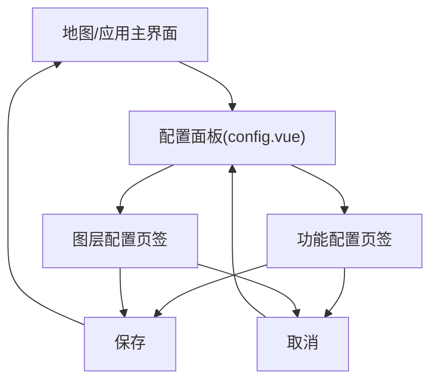

## 1. Product Overview
在 `config.vue` 中提供“功能配置 / 图层配置”面板，用于按层级（分组/大类/细类）管理显示开关与顺序。
该面板通过“保存/取消”将配置变更提交或回滚，确保地图功能与图层展示可控且可复现。

## 2. Core Features

### 2.1 Feature Module
本次需求仅涉及一个可被主界面打开的配置面板，包含两个页签：
1. **功能配置面板**：分组名编辑、分组/类目排序、按大类/细类控制功能显示开关。
2. **图层配置面板**：分组名编辑、分组/类目排序、按大类/细类控制图层显示开关。

### 2.3 Page Details
| Page Name | Module Name | Feature description |
|-----------|-------------|---------------------|
| 功能配置面板 | 面板框架 | 显示面板标题、关闭按钮；提供“保存/取消”按钮并展示未保存状态（如按钮可用性/提示点）。 |
| 功能配置面板 | 页签切换 | 在“功能配置/图层配置”之间切换；切换时保留当前未保存编辑内容（不自动保存）。 |
| 功能配置面板 | 分组列表 | 展示分组（group）；支持编辑分组名；支持调整分组顺序；分组可展开/收起以查看大类/细类。 |
| 功能配置面板 | 大类/细类层级 | 在分组下展示大类（category）与细类（subCategory）；支持调整同级顺序；支持展开/收起。 |
| 功能配置面板 | 显示开关 | 提供分组/大类/细类三级“显示开关”；变更上层开关时联动下层（批量开/关）；下层变更时回算上层状态（全开/全关/部分开）。 |
| 功能配置面板 | 保存 | 点击保存：对外触发保存事件，提交完整配置结构（含分组名、顺序、开关状态）；保存成功后清除“未保存”状态。 |
| 功能配置面板 | 取消 | 点击取消：丢弃本次编辑，恢复到面板打开时的配置快照；对外触发取消事件。 |
| 图层配置面板 | 分组列表 | 与“功能配置”一致：分组名编辑、顺序调整、展开/收起。 |
| 图层配置面板 | 大类/细类层级 | 与“功能配置”一致：大类/细类顺序调整、展开/收起。 |
| 图层配置面板 | 显示开关 | 与“功能配置”一致：分组/大类/细类三级开关联动与回算。 |
| 图层配置面板 | 保存/取消 | 与“功能配置”一致：保存提交完整配置；取消回滚至快照。 |

## 3. Core Process
### 用户流程（同一用户在面板内操作）
1) 用户打开 `config.vue` 配置面板，系统加载当前配置并生成“编辑快照”。
2) 用户在“功能配置”中：
- 编辑分组名；
- 调整分组/大类/细类顺序；
- 打开/关闭分组/大类/细类的显示开关（联动下层并回算上层状态）。
3) 用户切换到“图层配置”页签，重复上述编辑与开关操作。
4) 用户点击：
- **保存**：提交本次“功能配置 + 图层配置”的完整结构；提交成功后面板进入“已保存”状态。
- **取消**：放弃本次修改，恢复为打开面板时的快照配置。

