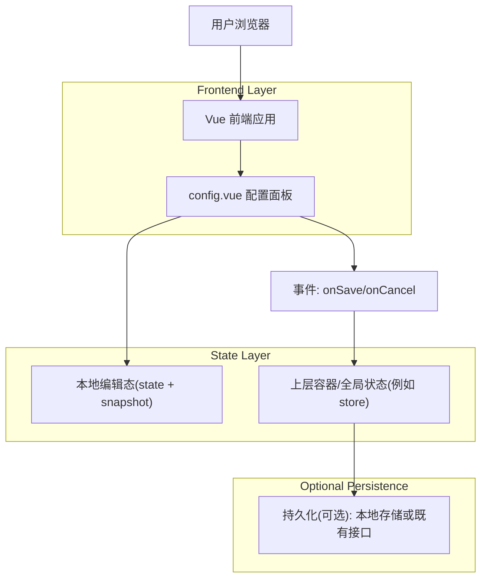
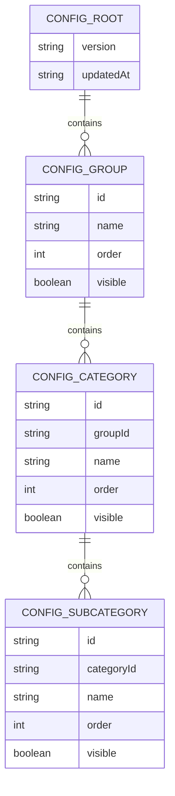

## 1.Architecture design
本需求不引入独立后端：配置在前端面板内编辑，通过事件回传给上层（或状态管理），由上层决定持久化方式（例如写入本地存储/调用既有接口）。



## 2.Technology Description
- Frontend: Vue@3 + TypeScript + 单文件组件（SFC）
- Backend: None（由上层应用决定是否调用既有后端接口）

## 3.Route definitions
| Route | Purpose |
|-------|---------|
| （宿主页面路由） | `config.vue` 作为宿主页面内的配置面板组件，不新增独立路由（由主界面打开/关闭）。 |

## 6.Data model(if applicable)
### 6.1 Data model definition
面板需要同时承载两套树结构：`featureConfig`（功能）与 `layerConfig`（图层）。两者结构一致，仅语义不同。

建议使用“逻辑外键”（以 `id` 字段关联）并显式保存排序字段，避免依赖数据库约束。



### 6.2 Data Definition Language
本需求不强制落库，以下给出前端 TypeScript 数据结构（作为保存事件的 payload 与持久化 JSON 结构）。

```ts
export type TriState = "on" | "off" | "partial";

export interface ConfigSubCategory {
  id: string;
  name: string;
  order: number;
  visible: boolean;
}

export interface ConfigCategory {
  id: string;
  name: string;
  order: number;
  visible: boolean;
  // UI 计算态（不建议持久化）
  visibleState?: TriState;
  subCategories: ConfigSubCategory[];
}

export interface ConfigGroup {
  id: string;
  name: string;
  order: number;
  visible: boolean;
  visibleState?: TriState;
  categories: ConfigCategory[];
}

export interface PanelConfigPayload {
  version: string;
  updatedAt: string; // ISO string
  featureConfig: ConfigGroup[];
  layerConfig: ConfigGroup[];
}

export interface PanelSnapshot {
  // 打开面板时的深拷贝快照，用于 Cancel 回滚
  initial: PanelConfigPayload;
  // 当前编辑态
  draft: PanelConfigPayload;
  // dirty 标记：draft 与 initial 是否有差异
  isDirty: boolean;
}
```

#### 联动与回算规则（关键逻辑约束）
- 变更 **Group.visible**：
  - 将该 group 下所有 category/subCategory 的 `visible` 置为同值。
  - `visibleState` 置为 `on/off`。
- 变更 **Category.visible**：
  - 将该 category 下所有 subCategory 的 `visible` 置为同值。
  - 向上回算 group 的 `visibleState`：
    - 全部 category 全开 => `on`；全部全关 => `off`；否则 `partial`。
- 变更 **SubCategory.visible**：
  - 回算其 category 的 `visibleState`（on/off/partial）。
  - 再回算 group 的 `visibleState`。

#### 顺序字段约束
- 排序以 `order` 为唯一排序依据（升序）；拖拽/上下移动后，必须对同级节点重新编号（0..n-1 或 1..n）。

#### 保存/取消事件（组件对外契约）
- `onSave(payload: PanelConfigPayload)`：
  - 触发时机：用户点击“保存”。
  - 行为：向上层提交完整结构（两套配置一起提交，避免部分提交导致不一致）。
  - 成功后的建议：上层返回成功后，面板将 `initial = deepClone(draft)`，`isDirty=false`。
- `onCancel()`：
  - 触发时机：用户点击“取消”。
  - 行为：面板将 `draft = deepClone(initial)`，`isDirty=false`，并通知上层取消发生。
