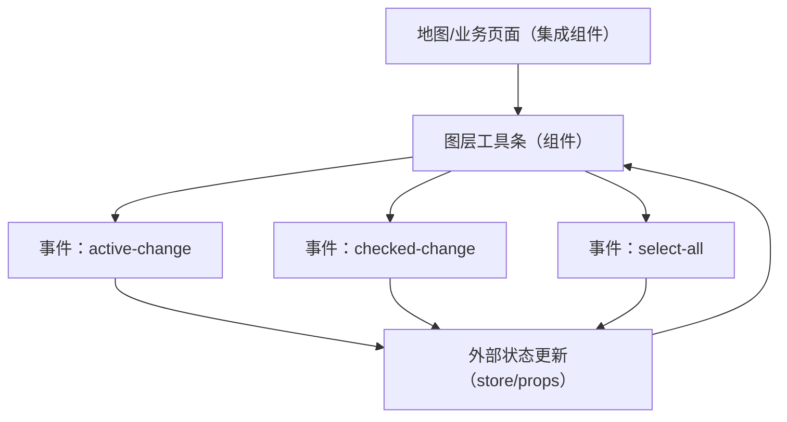

## 1. Product Overview
为 `layers.vue` 图层工具条组件定义清晰的交互与数据/事件契约。
该组件提供 8 个图层按钮、激活态与勾选徽标、全选能力，并向外输出标准化事件。

## 2. Core Features

### 2.1 Feature Module
本组件需求由以下页面/模块构成：
1. **图层工具条（组件）**：8 个图层按钮、激活态、勾选徽标、全选、数据结构与事件输出。

### 2.2 Page Details
| Page Name | Module Name | Feature description |
|---|---|---|
| 图层工具条（组件） | 图层按钮区（8个） | 渲染 8 个图层按钮；每个按钮支持点击激活、勾选显示徽标；支持禁用态（若传入）。|
| 图层工具条（组件） | 激活态（Active） | 高亮显示当前激活图层；点击任一图层按钮切换激活图层；再次点击已激活按钮时保持激活（不取消），仅触发一次或不触发由实现约定。|
| 图层工具条（组件） | 勾选徽标（Checked Badge） | 在按钮角标/徽标位置展示勾选状态；支持单个图层勾选/取消（由交互入口定义：可点击按钮主体或徽标区域）。|
| 图层工具条（组件） | 全选（Select All） | 提供“全选/全不选”控制；根据当前是否“全部已勾选”展示对应状态；操作后批量更新 8 个图层的勾选态并输出事件。|
| 图层工具条（组件） | 状态受控/非受控 | 支持外部通过 props 传入当前 activeId 与 checkedIds（或在 layers 数据内带 checked），组件内部仅负责渲染与事件派发；若未传入则可内部维护默认状态（可选）。|
| 图层工具条（组件） | 事件输出（Events） | 对外输出：激活变化、勾选变化、全选变化；事件 payload 必须包含变化前后关键信息（见“核心流程”）。|

## 3. Core Process
### 用户操作流（组件使用方视角）
1) 使用方传入 8 个图层数据（含 id/name/icon 等）与初始状态（active/checked）。
2) 用户点击某个图层按钮：该图层进入激活态；组件向外派发“激活变化”事件（包含 activeId 与对应图层信息）。
3) 用户勾选/取消某个图层：该图层徽标显示/隐藏；组件向外派发“勾选变化”事件（包含 checkedIds 与变更项）。
4) 用户点击“全选”：若当前未全选则勾选全部；若当前已全选则取消全部；组件向外派发“全选变化”事件（包含 checkedIds 与是否全选）。

