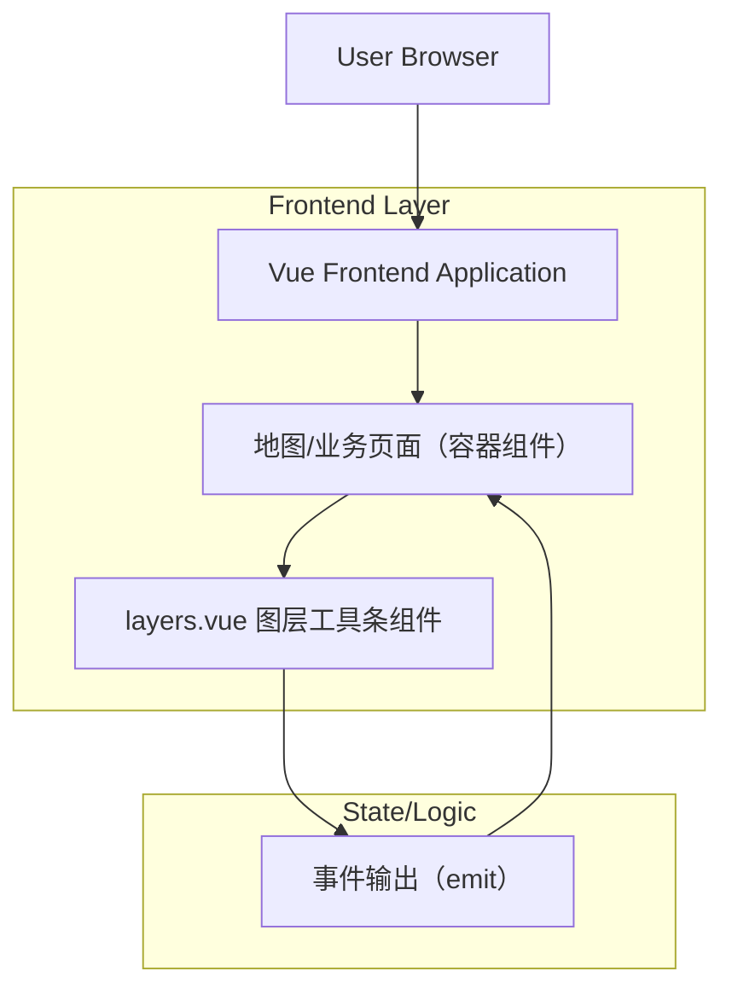

## 1.Architecture design


## 2.Technology Description
- Frontend: Vue（组件：layers.vue） + TypeScript（推荐，用于约束数据/事件类型） + Vite（或现有构建工具）
- Backend: None

## 3.Route definitions
| Route | Purpose |
|---|---|
| /map（示例） | 承载地图与图层工具条的业务页面；负责接收组件事件并更新业务状态 |

## 4.API definitions (If it includes backend services)
本需求不包含后端 API；组件对外以“事件 + 类型定义”作为契约。

### 4.1 Shared TypeScript Types（建议）
```ts
export type LayerId = string;

export interface LayerToolbarItem {
  id: LayerId;
  name: string;
  icon?: string; // icon key / url / className（由项目约定）
  disabled?: boolean;
  checked?: boolean; // 若采用在 items 内承载勾选态
}

export interface ActiveChangePayload {
  activeId: LayerId;
  activeItem: LayerToolbarItem;
  previousActiveId?: LayerId;
}

export interface CheckedChangePayload {
  checkedIds: LayerId[];
  changedId: LayerId;
  checked: boolean;
}

export interface SelectAllPayload {
  checkedIds: LayerId[]; // 全选后为 8 个 id；全不选后为空数组
  isAllSelected: boolean;
}
```

## 5.Server architecture diagram (If it includes backend services)
N/A

## 6.Data model(if applicable)
N/A