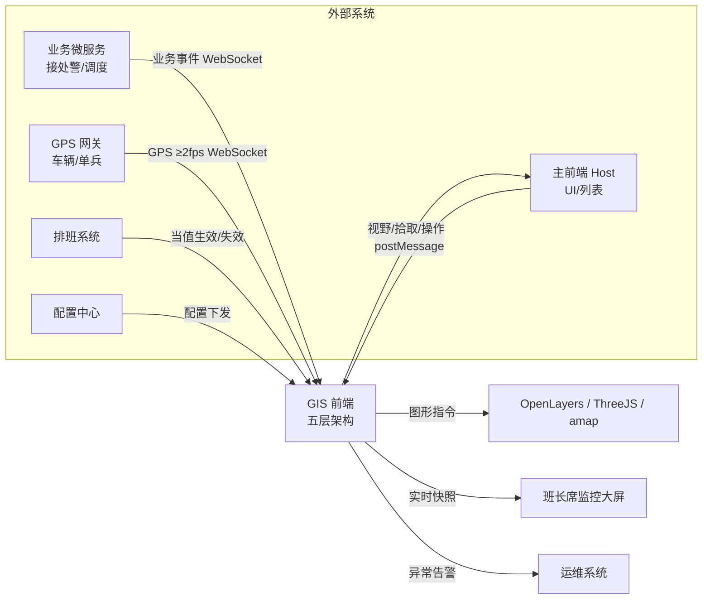
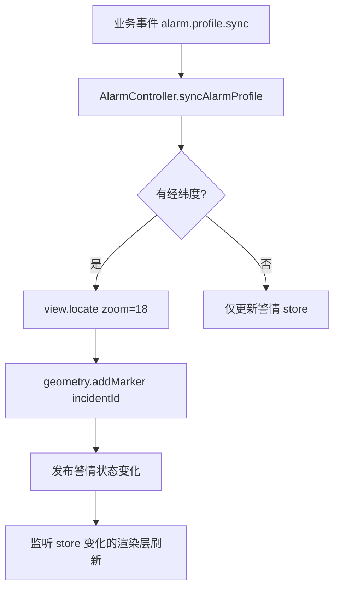
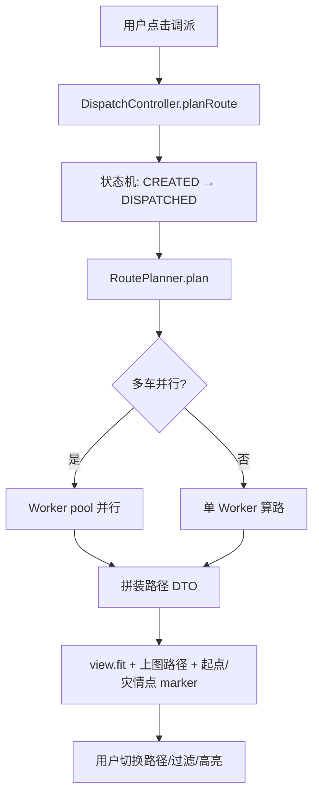
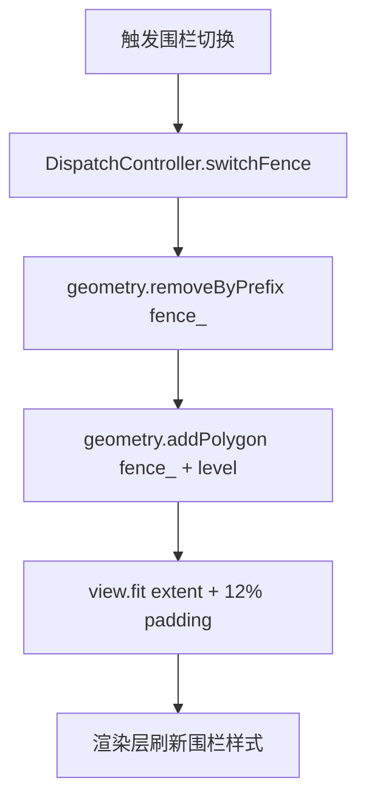
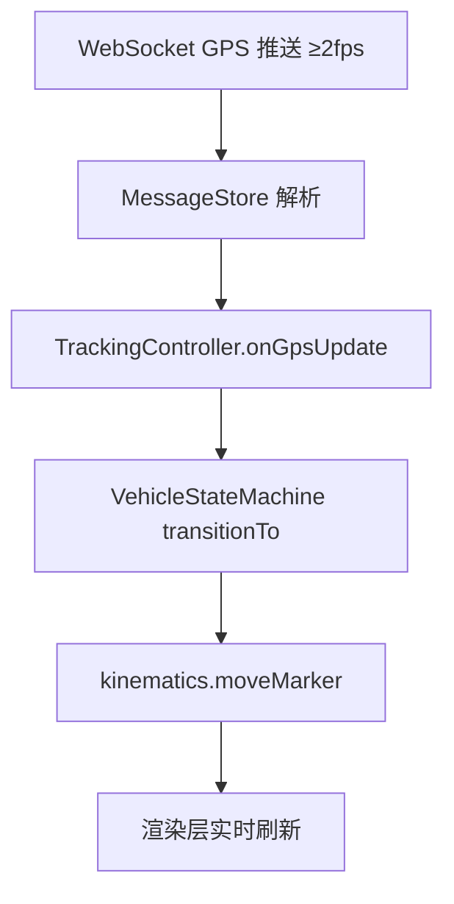
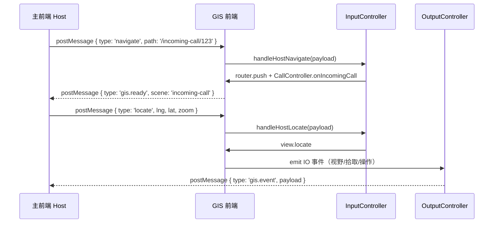
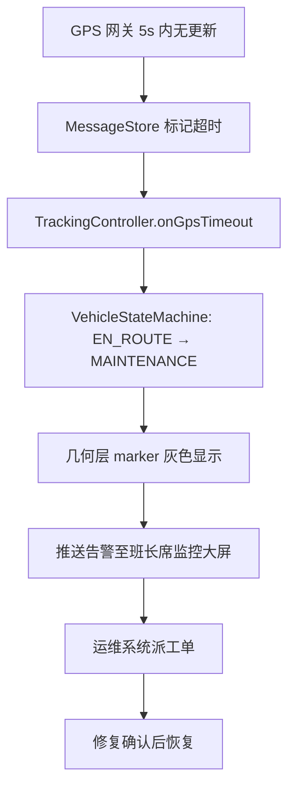
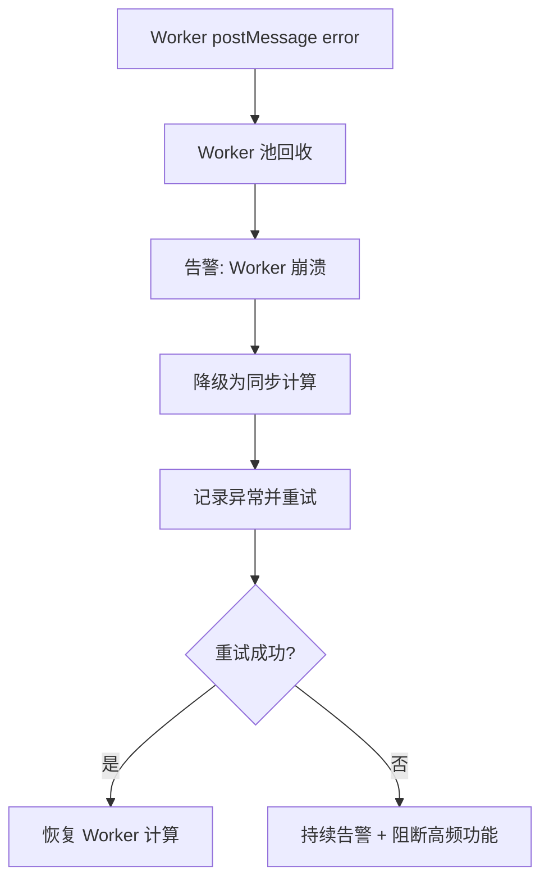
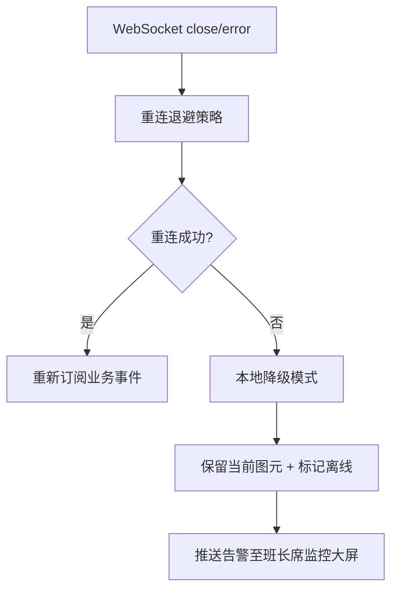

### 03-业务流程图

> 版本: v1.0
> 日期: 2026-07-16
> 范围: GIS 前端工程

---

## 1. 整体业务流程图



## 2. 五个核心场景流程

### 2.1 值守（Duty）

```mermaid
sequenceDiagram
    participant U as 用户
    participant R as 路由
    participant DC as DutyController
    participant GC as GenericController
    participant OL as OpenLayers

    U->>R: 进入 / 或 /duty
    R->>DC: enterScene()
    DC->>GC: loadLayers(辖区/消防/道路)
    GC->>OL: addLayers + view.locate(center, zoom=15)
    DC->>GC: renderAlarmDistribution(警情快照)
    GC->>OL: addHeatmap / addCluster
    Note over DC,OL: 稳态 ≥30fps; 缩放/平移 ≤100ms
```

**关键节点**：
- 默认中心点为辖区几何中心，默认 zoom = 15。
- 警情分布按热度聚合，hover 显示警情计数。
- 业务 ID 前缀 `incident_`；缩放后自动重聚合。

### 2.2 来电弹屏（Incoming Call）

```mermaid
sequenceDiagram
    participant B as 业务微服务
    participant M as MessageStore
    participant CC as CallController
    participant GC as GenericController
    participant OL as OpenLayers
    participant O as 弹屏组件

    B->>M: call.incoming { id, lng, lat, radius=500, address }
    M->>CC: onIncomingCall(data)
    CC->>GC: view.locate({ lngLat, zoom: 18, duration: 800 })
    CC->>GC: geometry.addCircle({ id: 'call_' + id, center, radius, style: 'incoming' })
    CC->>GC: geometry.addMarker({ id: 'call_' + id, iconType: 'call' })
    CC->>O: show Overlay
    O-->>U: 显示弹屏 UI

    Note over B,O: 端到端 ≤500ms; 500m 圈 fit 留边 12%

    B->>M: call.location.remove
    M->>CC: onCallRemove(data)
    CC->>GC: geometry.remove('call_' + id)
    CC->>O: hide Overlay
```

**关键节点**：
- 弹屏优先级最高，立即抢占值守场景视野。
- 来电点以红色脉动图标显示，500m 圈高亮显示。
- 来电结束 200ms 内清除弹屏与图元。

### 2.3 问询研判（Inquiry）

```mermaid
sequenceDiagram
    participant U as 用户
    participant DC as DispatchController
    participant SC as SpatialController
    participant WFS as GeoServer WFS
    participant GC as GenericController
    participant OL as OpenLayers

    U->>DC: startInquiry({ incidentId, lng, lat })
    DC->>SC: computeMicroFence(lng, lat, buffer=50m)
    SC-->>DC: { extent, aoiIds }
    DC->>GC: view.fit({ extent, paddingRatio: 0.12 })
    DC->>GC: geometry.addPolygon({ id: 'microfence_' + incidentId, style: 'inquiry' })
    DC->>GC: geometry.highlight({ ids: aoiIds, style: 'inquiryFocus' })
    DC->>SC: queryAoiByFence(extent)
    SC->>WFS: WFS query
    WFS-->>SC: AOI list
    SC-->>DC: AOI list
    DC->>SC: queryEntranceExit(extent)
    SC-->>DC: 出入口 list
    Note over DC,OL: 微围栏 fit ≤300ms; AOI 查询 ≤200ms
```

**关键节点**：
- 微围栏高亮（黄色描边、淡黄填充）。
- 命中 AOI 高亮显示，hover 显示建筑名称、楼层、风险等级。
- 出入口、消防栓以小图标显示。

### 2.4 图上调派（Dispatch）

```mermaid
sequenceDiagram
    participant U as 用户
    participant DC as DispatchController
    participant SM as IncidentStateMachine
    participant RP as RoutePlanner
    participant WK as RouteWorker
    participant GC as GenericController
    participant OL as OpenLayers

    U->>DC: planRoute({ incidentId, vehicles, startStation })
    DC->>SM: transitionTo('DISPATCHED', incidentId)
    DC->>RP: plan(start, end, vehicleList)
    RP->>WK: 并行算路（≤5 辆）
    WK-->>RP: 路径结果（Transferable）
    RP-->>DC: 路径结果
    DC->>GC: geometry.addRoute({ id, path, style: 'dispatch' })
    DC->>GC: geometry.addMarker({ id: 'vehicle_' + carId, iconType: 'fire' })
    DC->>GC: geometry.addMarker({ id: 'incident_' + incidentId, iconType: 'endpoint' })
    DC->>GC: view.fit({ extent, paddingRatio: 0.12 })
    Note over DC,OL: 单车算路 ≤1s; 多车并行 ≤2s; 路径切换 ≤100ms

    U->>DC: toggleRoute({ routeId, visible })
    U->>DC: etaFilter({ etaMax })
    U->>DC: highlightResource({ resourceType })
```

**关键节点**：
- 警情状态机 CREATED → DISPATCHED。
- 多车路径以不同颜色绘制，路径包含方向箭头。
- 推荐路径加粗高亮（`recommended = true`）。
- 调派围栏四级联动：辖区 → 责任区 → 微型围栏 → 灾情点。

### 2.5 跟踪到场（Tracking）

```mermaid
sequenceDiagram
    participant B as GPS 网关
    participant M as MessageStore
    participant TC as TrackingController
    participant VSM as VehicleStateMachine
    participant WK as RouteWorker
    participant GC as GenericController
    participant OL as OpenLayers

    B->>M: tracking.vehicle.gps.update (≥2fps)
    M->>TC: onGpsUpdate({ carId, lng, lat, bearing })
    TC->>VSM: transitionTo('EN_ROUTE'/'ON_SCENE', carId)
    TC->>GC: kinematics.moveMarker({ id: 'vehicle_' + carId, lngLat, rotate: bearing })
    TC->>GC: view.follow({ id: 'vehicle_' + carId, duration: 600 })
    Note over TC,OL: GPS 端到端 ≤500ms; 跟踪 ≥30fps

    B->>M: tracking.vehicle.route.realtime
    M->>TC: onRouteRealtime({ carId, points })
    TC->>WK: throttle(points, maxPoints=200)
    WK-->>TC: 抽稀结果（Transferable）
    TC->>GC: geometry.updatePolyline({ id: 'track_' + carId, points })
    Note over WK,GC: 抽稀 ≤100ms/批
```

**关键节点**：
- 车辆 marker 跟随 GPS 实时移动，方向角与车头一致。
- 跟踪模式下视野自动 follow 当前车辆（不锁死，允许用户拖动解除）。
- 微观视图（zoom ≥ 19）显示车辆细节（车号、状态、ETA）。
- 实时路径以渐变色绘制（已通过部分深色，未通过部分浅色）。

## 3. 子流程

### 3.1 警情接入



### 3.2 调派协商



### 3.3 围栏切换



### 3.4 GPS 接入



## 4. 跨端流程（Host → GIS 协作）



## 5. 异常流

### 5.1 GPS 失联



### 5.2 Worker 崩溃



### 5.3 WebSocket 断连



---

#### 断言清单

1、5 个核心场景流程是端到端 AC 的实现指南，任何一档不达标禁止宣称完成。

2、跨端流程（Host ↔ GIS）必须经 `InputController` / `OutputController`，不得在渲染层直接监听 postMessage。

3、异常流不阻断主流程：GPS 失联、Worker 崩溃、WebSocket 断连均触发告警，但保留当前图元并允许用户继续操作。

4、围栏切换必须按业务前缀（`fence_`）清理旧图元，再上图新围栏。

5、跟踪场景下视野 follow 当前车辆不锁死；用户拖动后保留用户选择，直至下次显式切换。
