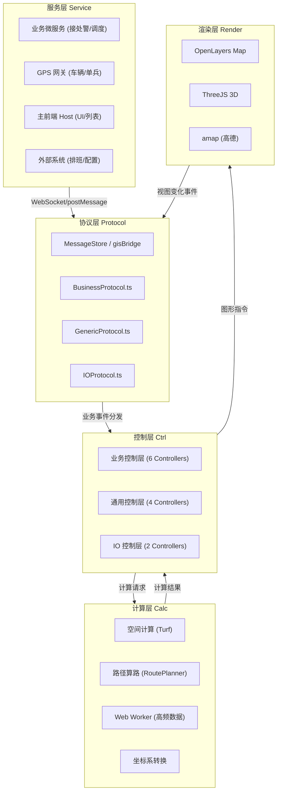

### 05-五层架构领域模型设计

> 版本: v1.0
> 日期: 2026-07-16
> 范围: GIS 前端工程
> 基线: `mds/minmax_output/GIS前端数据交互与架构全景设计(整合版).md`

---

## 1. 五层架构全局视图



## 2. 五层职责表

| 层级 | 目录 | 输入 | 输出 | 不允许做 |
| --- | --- | --- | --- | --- |
| **服务层** | 后端 / 外部 | 真实业务事件 | 业务数据 | 直接调用地图引擎 |
| **协议层** | `src/controller/core/protocol/` | 业务数据 | 标准化信封 | 业务解析/计算/渲染 |
| **计算层** | `src/composables/`、`src/hooks/` | 空间参数 | 几何/数值结果 | 持有 DOM/Map 引用 |
| **业务控制层** | `src/controller/core/business/` | 协议事件 | 通用控制层 DTO | 直接调用 OL/ThreeJS、持有业务状态以外的视图状态 |
| **通用控制层** | `src/controller/core/generic/` | 通用控制层 DTO | 图形指令 | 业务规则、读业务 store |
| **IO 控制层** | `src/controller/core/io/` | 视图事件 / 结果 | IO 协议 / 视图回写 | 业务流转 |
| **渲染层** | `src/components/`、`src/baseComponent/`、`src/views/` | 图形指令 | 视觉呈现 + 事件 | 业务逻辑、空间计算 |

## 3. 业务控制层领域模型

业务控制层包含 6 个 Controller，每个 Controller 是一个限界上下文（Bounded Context）。

### 3.1 AlarmController（警情上下文）

**职责**：警情业务事件的处理、警情状态机维护、警情上图与清除。

**关键属性**：

| 字段 | 类型 | 必填 | 业务定义 | 来源 |
| --- | --- | --- | --- | --- |
| `genericController` | `GenericController` | ✅ | 通用控制层引用 | 依赖注入 |
| `incidentStateMachine` | `AlarmStateMachine` | ✅ | 警情状态机 | 内部持有 |
| `alarmStore` | `Pinia Store` | ✅ | 警情 store | 依赖注入 |

**关键方法**：

| 方法 | 入参 | 出参 | 业务规则 |
| --- | --- | --- | --- |
| `syncAlarmProfile` | `AlarmProfileSyncData` | void | 警情同步：先定位（zoom=18）再上图 marker |
| `removeAlarmProfile` | `AlarmIncidentId` | void | 警情清除：移除 marker + 更新 store |
| `batchSyncAlarmProfile` | `AlarmProfileSyncData[]` | void | 批量警情同步 |
| `transitionIncidentState` | `AlarmStateTransition` | void | 状态机转移：CRUD + 事件广播 |

### 3.2 CallController（来电上下文）

**职责**：来电弹屏、来电清除、来电转接。

**关键方法**：

| 方法 | 入参 | 出参 | 业务规则 |
| --- | --- | --- | --- |
| `onIncomingCall` | `CallIncomingData` | void | 来电：locate + 500m 圈 + 弹屏 |
| `onCallRemove` | `CallId` | void | 来电结束：移除图元 + 隐藏弹屏 |
| `onCallTransfer` | `CallTransferData` | void | 来电转接：路由跳转 |

### 3.3 DispatchController（调派上下文）

**职责**：调派协商、路径规划、围栏切换、ETA 过滤、资源高亮。

**关键方法**：

| 方法 | 入参 | 出参 | 业务规则 |
| --- | --- | --- | --- |
| `planRoute` | `DispatchRoutePlanData` | void | 调派：状态机 + 算路 + 上图 + 视野 fit |
| `toggleRoute` | `DispatchRouteToggleData` | void | 路径切换：按 routeId 切换可见性 |
| `etaFilter` | `DispatchEtaFilterData` | void | ETA 过滤：远端站点半透明 |
| `highlightResource` | `DispatchResourceHighlightData` | void | 资源高亮：消防/救援/社会联动 |
| `switchFence` | `DispatchFenceSwitchData` | void | 围栏切换：按业务前缀清理 + 上图新围栏 |
| `startInquiry` | `InquiryStartData` | void | 问询：微围栏 + AOI 查询 |
| `cancelDispatch` | `DispatchPlanId` | void | 取消调派：状态机 DRAFT/CONFIRMED/ACTIVE → CANCELED |

### 3.4 TrackingController（跟踪上下文）

**职责**：车辆 GPS 跟踪、车辆状态机、实时路径、视野 follow。

**关键方法**：

| 方法 | 入参 | 出参 | 业务规则 |
| --- | --- | --- | --- |
| `onGpsUpdate` | `TrackingGpsUpdateData` | void | GPS 更新：状态机 + marker 移动 + follow |
| `onRouteRealtime` | `TrackingRouteRealtimeData` | void | 实时路径：Worker 抽稀 + polyline 更新 |
| `enableFollow` | `VehicleId` | void | 启动视野 follow |
| `disableFollow` | void | void | 解除视野 follow |
| `zoomInMicro` | `VehicleId` | void | 进入微观视图（zoom ≥ 19） |

### 3.5 DutyController（值守上下文）

**职责**：值守场景加载、辖区图层加载、警情分布渲染。

**关键方法**：

| 方法 | 入参 | 出参 | 业务规则 |
| --- | --- | --- | --- |
| `enterScene` | `DutySceneConfig` | void | 进入值守：默认中心 + zoom=15 + 加载基础图层 |
| `loadLayers` | `LayerConfig[]` | void | 批量加载图层 |
| `renderAlarmDistribution` | `AlarmSnapshot` | void | 警情分布：热力图或聚合点 |
| `exitScene` | void | void | 退出值守：清理临时图元 + store reset |

### 3.6 ConfigController（配置上下文）

**职责**：图层配置、围栏配置、ETA_MAX、Padding 比例。

**关键方法**：

| 方法 | 入参 | 出参 | 业务规则 |
| --- | --- | --- | --- |
| `loadLayerConfig` | `LayerConfigQuery` | `LayerConfig[]` | 加载图层配置 |
| `loadFenceConfig` | `FenceConfigQuery` | `FenceConfig[]` | 加载围栏配置 |
| `updatePaddingRatio` | `number` | void | 更新 Auto-Fit Padding 比例（0.10~0.15） |
| `updateEtaMax` | `number` | void | 更新 ETA_MAX |

## 4. 通用控制层领域模型

通用控制层包含 4 个 Controller，每个 Controller 负责一类图形指令。

### 4.1 GeometryController（几何上下文）

**职责**：marker、polyline、polygon、circle 等几何要素的添加、更新、移除。

**关键方法**：

| 方法 | 入参 | 出参 | 业务规则 |
| --- | --- | --- | --- |
| `addMarker` | `AddMarkerDTO` | void | 业务前缀 ID；按 iconType 渲染 |
| `updateMarker` | `UpdateMarkerDTO` | void | 按 ID 更新位置/样式/动画 |
| `removeMarker` | `MarkerId` | void | 按 ID 移除 |
| `addPolyline` | `AddPolylineDTO` | void | 业务前缀 ID |
| `updatePolyline` | `UpdatePolylineDTO` | void | 按 ID 更新顶点/样式 |
| `removePolyline` | `PolylineId` | void | 按 ID 移除 |
| `addPolygon` | `AddPolygonDTO` | void | 业务前缀 ID |
| `addCircle` | `AddCircleDTO` | void | 业务前缀 ID + 半径 |
| `highlight` | `HighlightDTO` | void | 高亮（业务前缀 IDs + style） |
| `removeByPrefix` | `string` | void | 按业务前缀清理（场景切换） |

### 4.2 KinematicController（运动学上下文）

**职责**：marker 的移动、旋转、动画。

**关键方法**：

| 方法 | 入参 | 出参 | 业务规则 |
| --- | --- | --- | --- |
| `moveMarker` | `MoveMarkerDTO` | void | 移动 marker（含旋转角度） |
| `animateMarker` | `AnimateMarkerDTO` | void | 动画（breathe、pulse、fly） |
| `batchMoveMarkers` | `MoveMarkerDTO[]` | void | 批量移动（高频） |

### 4.3 SpatialController（空间上下文）

**职责**：空间查询、围栏计算、抽稀、距离计算。

**关键方法**：

| 方法 | 入参 | 出参 | 业务规则 |
| --- | --- | --- | --- |
| `queryAoiByFence` | `BBox` | `AOI[]` | WFS 查询兴趣面 |
| `queryEntranceExit` | `BBox` | `EntranceExit[]` | WFS 查询出入口 |
| `queryFireWater` | `BBox` | `FireWater[]` | WFS 查询消防栓 |
| `computeMicroFence` | `LngLat`, `Buffer` | `BBox` | 计算微围栏 |
| `throttlePoints` | `LngLat[]`, `maxPoints` | `LngLat[]` | 抽稀 |
| `computeBBox` | `LngLat[]` | `BBox` | 计算包围盒 |
| `distance` | `LngLat`, `LngLat` | `number` | 距离计算 |

### 4.4 ViewController（视野上下文）

**职责**：视野定位、视野 fit、视野 follow、缩放等级控制。

**关键方法**：

| 方法 | 入参 | 出参 | 业务规则 |
| --- | --- | --- | --- |
| `locate` | `LocateDTO` | void | 单点定位（zoom 可选） |
| `fit` | `FitBoundsDTO` | void | 视野 fit（含 paddingRatio 强制 ≥ 0.10） |
| `follow` | `FollowDTO` | void | 视野 follow（持续跟踪） |
| `unfollow` | void | void | 解除 follow |
| `setZoom` | `number` | void | 设置缩放等级 |
| `getCurrentView` | void | `ViewState` | 读取当前视野状态 |

## 5. IO 控制层领域模型

### 5.1 InputController

**职责**：将视图事件转换为 IO 协议事件。

| 方法 | 入参 | 出参 | 业务规则 |
| --- | --- | --- | --- |
| `handleMapMove` | `MapMoveEvent` | void | 地图平移 → IO 协议 |
| `handleMapZoom` | `MapZoomEvent` | void | 地图缩放 → IO 协议 |
| `handleFeaturePick` | `FeaturePickEvent` | void | 要素拾取 → IO 协议 |
| `handleHostNavigate` | `HostNavigateMessage` | void | 主前端跳转 → 路由跳转 |
| `handleHostLocate` | `HostLocateMessage` | void | 主前端定位 → view.locate |

### 5.2 OutputController

**职责**：将通用控制层结果回写到视图或外部系统。

| 方法 | 入参 | 出参 | 业务规则 |
| --- | --- | --- | --- |
| `emitViewState` | `ViewState` | void | 视野状态 → 主前端 |
| `emitFeaturePick` | `FeaturePickEvent` | void | 拾取结果 → 主前端 |
| `emitUserAction` | `UserActionEvent` | void | 用户操作 → 主前端 |
| `emitAlert` | `AlertEvent` | void | 异常告警 → 班长席 |

## 6. 协议层领域模型

### 6.1 统一信封 `MessageEnvelope<T>`

```typescript
interface MessageEnvelope<T> {
  eventId: string;        // 事件唯一 ID
  occurredAt: number;     // 事件发生时间戳（毫秒）
  scene: SceneType;       // 事件所属场景
  payload: T;             // 业务负载
  coordSys?: 'WGS84' | 'GCJ-02' | 'BD-09';  // 坐标系标记
  source: 'system' | 'user' | 'host';       // 数据来源
  tenantId?: string;      // 租户 ID
}
```

### 6.2 业务协议 `BusinessProtocol`

详见 `docs/source/07-协议事件清单.md` 与 `docs/source/协议层DTO Schema.tsd`。

### 6.3 通用协议 `GenericProtocol`

按图形指令分类：`LocateDTO`、`FitBoundsDTO`、`AddMarkerDTO`、`UpdateMarkerDTO`、`RemoveMarkerDTO`、`AddPolylineDTO`、`UpdatePolylineDTO`、`AddPolygonDTO`、`AddCircleDTO`、`MoveMarkerDTO`、`HighlightDTO`、`FollowDTO`。

### 6.4 IO 协议 `IOProtocol`

`MapMoveEvent`、`MapZoomEvent`、`FeaturePickEvent`、`HostNavigateMessage`、`HostLocateMessage`、`UserActionEvent`、`AlertEvent`。

## 7. 计算层领域模型

### 7.1 composable

详见 `skills/20260717-培训材料-肖志威/gis-dev-workflow/references/component-usage.md`。

### 7.2 Web Worker

| Worker | 输入 | 输出 | 传输方式 |
| --- | --- | --- | --- |
| RouteMetricsWorker | 起点 / 终点 / 车辆列表 | 路径列表 | Transferable |
| ThrottleWorker | 点数组 / maxPoints | 抽稀结果 | Transferable |
| TransformWorker | 坐标 / 坐标系 | 转换结果 | Transferable |

### 7.3 坐标系转换

详见 `skills/20260717-培训材料-肖志威/gis-dev-workflow/references/gis-coord-system.md`。

## 8. 资源图层 ID 清单

| 业务类别 | 图层 ID | 类型 | 数据源 | 业务前缀 |
| --- | --- | --- | --- | --- |
| 兴趣面 | `gis:env_build_aoi` | Polygon | GeoServer WFS | `aoi_` |
| 出入口 | `gis:env_entrance_exit` | Point | GeoServer WFS | `entrance_` |
| 消防栓 | `gis:env_fire_water` | Point | GeoServer WFS | `water_` |
| 道路 | `gis:env_greatchina_road` | LineString | GeoServer WFS | `road_` |
| 车辆 | `gis:fire_vehicle` | Point（动态） | GPS 网关 WebSocket | `vehicle_` |
| 警情 | `gis:incident_alarm` | Point + 圆 | 警情总线 | `incident_` |
| 来电 | `gis:incoming_call` | Point + 弹屏 | 来电总线 | `call_` |
| 调派路径 | `gis:dispatch_route` | LineString | 路径算路 | `route_` |
| 跟踪轨迹 | `gis:tracking_track` | LineString | GPS 抽稀 | `track_` |
| 围栏 | `gis:fence_*` | Polygon | 配置中心 | `fence_` |
| 警情分布 | `gis:incident_distribution` | Heatmap | 警情快照 | `cluster_` |
| 模型评估 | `gis:model_assess` | 3D | ThreeJS | `model_` |

## 9. 严禁事项清单

| 编号 | 严禁事项 | 后果 | 正确做法 |
| --- | --- | --- | --- |
| 1 | 业务控制层直接调用 `ol/Map`、`ol/Feature`、`three/Scene` | 跨层破坏、无法测试 | 仅通过 `genericController` 调用 |
| 2 | 通用控制层读取 `useDispatchStore`、`useAlarmStore` 等业务 store | 通用层被污染 | 仅读 `useMapStore`、`useLayersStore` |
| 3 | 渲染层组件直接修改 `useLayersStore` 的图元集合 | 跨层破坏 | 通过 controller |
| 4 | 计算层持有 `Map` 或 `Scene` 引用 | 计算层被污染 | 仅持有 store / composable |
| 5 | 协议层在解析时直接调用控制层方法 | 耦合 | 通过事件总线或回调注入 |
| 6 | 任何图元 ID 缺失业务前缀 | 难以回收 | 必须加前缀 |
| 7 | Auto-Fit 不带 Padding | 贴边 | 默认 0.12 |
| 8 | 跨层调用（如通用控制层调业务控制层） | 循环依赖 | 单向依赖 |
| 9 | 业务控制层和通用控制层共用同一个 DTO 类型 | 后续拆分困难 | DTO 分文件 |
| 10 | 渲染层进行 ≥10ms 的同步计算 | 帧率抖动 | 计算层 + Worker |

---

#### 断言清单

1、五层架构基线是 GIS 前端的核心；任何实现不得跨层调用、绕开 store 渲染、计算层持有 DOM/Map 引用。

2、6 个业务控制层 + 4 个通用控制层 + 2 个 IO 控制层 = 12 个 Controller，是控制层的完整集合。

3、3 个业务状态机（警情/车辆/调派方案）由业务控制层持有，业务流转可见可控。

4、10 个核心资源图层 ID 是图层注册的唯一依据；新增图层必须先在第 8 节清单增补。

5、10 条严禁事项是代码审查的硬基线；任一违反禁止合入。
