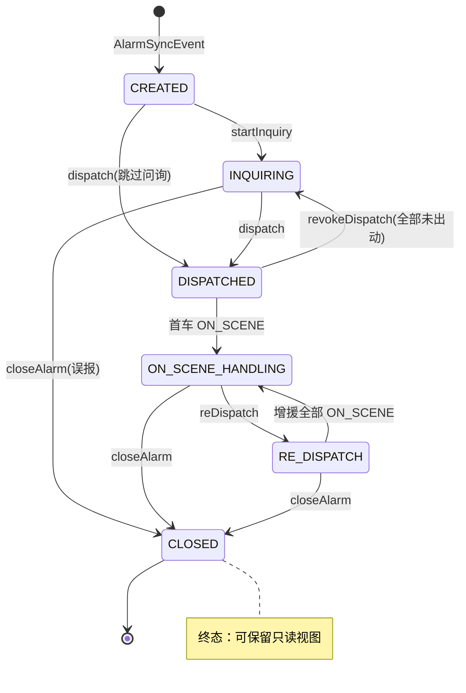
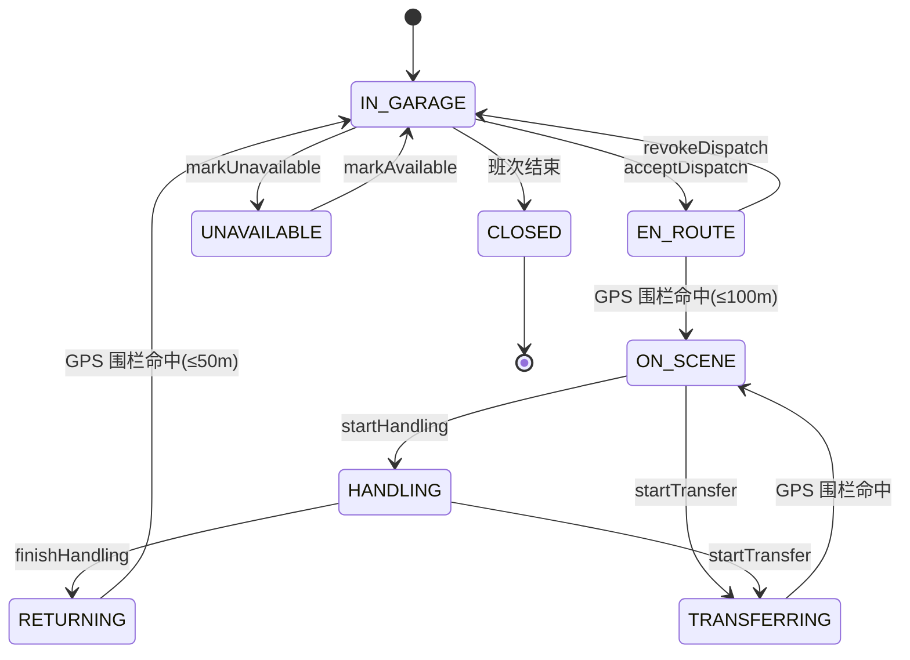
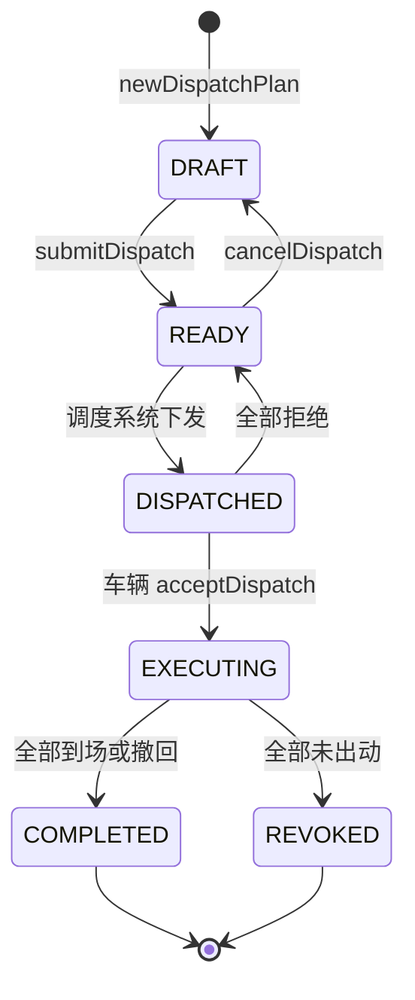

### 08-业务状态机定义

> 版本: v1.0  
> 日期: 2026-07-24  
> 范围: GIS 前端运行时 — 警情 / 车辆 / 调派计划 三大核心状态机

---

## 0. 概述

GIS 前端存在 **3 个核心业务状态机**，分别对应：警情生命周期、车辆运行生命周期、调派计划生命周期。

| 状态机 | 控制器位置 | 触发源 | 持久化位置 | 关键等级 |
| ------ | ---------- | ------ | ---------- | -------- |
| 警情状态机 | 业务控制层 `AlarmCtrl` | 接处警/警情订阅 | Pinia 3.x Store | P0 |
| 车辆状态机 | 业务控制层 `TrackingCtrl` | 车辆 GPS 订阅 | Pinia 3.x Store + Web Worker | P0 |
| 调派计划状态机 | 业务控制层 `DispatchCtrl` | 调派/到场/反馈 | Pinia 3.x Store | P0 |

**强制规约**：

1. 任何状态变更必须经由 **业务控制层**（`AlarmCtrl` / `DispatchCtrl` / `TrackingCtrl`）执行，不允许渲染层直接修改状态。
2. 状态变更必须通过 **协议层**（`MessageEnvelope<T>`）发布事件，由订阅方按业务规则响应。
3. 状态机的每一次迁移必须写入 `OperationLog`（关键节点操作记录），并打点上报 `GIS_OPERATION` 通道。
4. 不允许出现"跨级跳转"或"逆向跳转"——必须按本文件定义的有向边进行迁移，否则视为非法迁移并阻断。

---

## 1. 警情状态机（Alarm State Machine）

### 1.1 状态枚举

| 状态 | 英文代码 | 业务定义 | 进入条件 | 退出条件 |
| ---- | -------- | -------- | -------- | -------- |
| 已创建 | `CREATED` | 警情订阅通道推送原始事件，已落库但未进入研判流程 | `AlarmSyncEvent` 到达 | 接警员点击"问询"或"派警" |
| 问询中 | `INQUIRING` | 接警员正在电话问询事发地点、灾情类型、伤亡情况 | 接警员触发 `startInquiry` 指令 | 接警员提交"派警"或"归档" |
| 已派警 | `DISPATCHED` | 警情已派警（关联 1~N 辆车辆），等待车辆出动 | `DispatchPlan` 进入 `DISPATCHED` 状态并绑定警情 | 任意一辆绑定车辆 `ON_SCENE` |
| 处置中 | `ON_SCENE_HANDLING` | 首车已到场，正在处置灾情 | 绑定车辆首车状态进入 `ON_SCENE` | 接警员发起"结案"或"转调派" |
| 转调派 | `RE_DISPATCH` | 处置中需要二次增援 | 接警员触发 `reDispatch` 指令 | 增援车辆进入 `ON_SCENE` |
| 已归档 | `CLOSED` | 警情已结案 | 接警员提交"结案"指令 | 终态 |

### 1.2 警情状态机迁移表

| 当前状态 | 触发动作 | 下一状态 | 触发指令 | 守护条件 |
| -------- | -------- | -------- | -------- | -------- |
| `CREATED` | 接警员启动问询 | `INQUIRING` | `startInquiry` | 警情存在 + 座席当值 |
| `CREATED` | 直接派警（跳过问询） | `DISPATCHED` | `dispatch` | 警情存在 + 可调派车辆 ≥ 1 |
| `INQUIRING` | 提交派警 | `DISPATCHED` | `dispatch` | `DispatchPlan` 至少绑定 1 辆车辆 |
| `INQUIRING` | 误报归档 | `CLOSED` | `closeAlarm` | 接警员填写归档原因 |
| `DISPATCHED` | 首车到场 | `ON_SCENE_HANDLING` | 自动（车辆状态） | 绑定车辆中至少 1 辆 `ON_SCENE` |
| `DISPATCHED` | 撤回派警（无车出动） | `INQUIRING` | `revokeDispatch` | 绑定车辆全部未离开车库 |
| `ON_SCENE_HANDLING` | 二次增援 | `RE_DISPATCH` | `reDispatch` | 增援车辆已选中 |
| `ON_SCENE_HANDLING` | 结案 | `CLOSED` | `closeAlarm` | 接警员填写结案描述 |
| `RE_DISPATCH` | 增援车辆到场 | `ON_SCENE_HANDLING` | 自动（车辆状态） | 所有绑定车辆均 `ON_SCENE` 或 `CLOSED` |
| `RE_DISPATCH` | 结案 | `CLOSED` | `closeAlarm` | 接警员填写结案描述 |

### 1.3 Mermaid 状态机图

---

## 2. 车辆状态机（Vehicle State Machine）

### 2.1 状态枚举

| 状态 | 英文代码 | 业务定义 | 进入条件 | 退出条件 |
| ---- | -------- | -------- | -------- | -------- |
| 车库待命 | `IN_GARAGE` | 车辆在车库，未出警 | 系统初始化 / 完成处置返回 | 接警员调派 |
| 出动中 | `EN_ROUTE` | 车辆已接收派警指令，正在前往现场 | `acceptDispatch` 指令 | GPS 进入现场 100m 围栏 |
| 到场 | `ON_SCENE` | 车辆已进入现场围栏（≤100m） | GPS 距离 ≤ 100m | 接警员发起"处置完成"或"转场" |
| 转场中 | `TRANSFERRING` | 一处处置完成前往下一处 | `startTransfer` 指令 | 抵达新现场围栏 |
| 处置中 | `HANDLING` | 车辆正在处置（不挪车） | 处置动作上报 | 处置完成 / 返回车库 |
| 返回中 | `RETURNING` | 车辆完成处置后返回车库 | `returnToGarage` 指令 | 进入车库围栏 |
| 不可用 | `UNAVAILABLE` | 车辆维修、加油、临时停用 | 系统标记或人工标记 | 维修完成 |
| 已归档 | `CLOSED` | 班次结束归档 | 班次结束 | 终态 |

### 2.2 车辆状态机迁移表

| 当前状态 | 触发动作 | 下一状态 | 触发指令 / 事件 | 守护条件 |
| -------- | -------- | -------- | --------------- | -------- |
| `IN_GARAGE` | 接受派警 | `EN_ROUTE` | `acceptDispatch` | 警情 `DISPATCHED` |
| `IN_GARAGE` | 标记不可用 | `UNAVAILABLE` | `markUnavailable` | 接警员权限 |
| `UNAVAILABLE` | 恢复可用 | `IN_GARAGE` | `markAvailable` | 维修完成 |
| `EN_ROUTE` | 进入现场 100m 围栏 | `ON_SCENE` | GPS 围栏命中 | 距现场 ≤ 100m |
| `EN_ROUTE` | 接警员撤销 | `IN_GARAGE` | `revokeDispatch` | 车辆未到达现场 |
| `ON_SCENE` | 开始处置 | `HANDLING` | `startHandling` | 现场有效 |
| `ON_SCENE` | 转场 | `TRANSFERRING` | `startTransfer` | 新现场已指定 |
| `HANDLING` | 处置完成 | `RETURNING` | `finishHandling` | 接警员确认 |
| `HANDLING` | 转场 | `TRANSFERRING` | `startTransfer` | 新现场已指定 |
| `TRANSFERRING` | 进入新现场 | `ON_SCENE` | GPS 围栏命中 | 距新现场 ≤ 100m |
| `RETURNING` | 抵达车库 | `IN_GARAGE` | GPS 围栏命中 | 距车库 ≤ 50m |

### 2.3 Mermaid 状态机图

---

## 3. 调派计划状态机（DispatchPlan State Machine）

### 3.1 状态枚举

| 状态 | 英文代码 | 业务定义 | 进入条件 | 退出条件 |
| ---- | -------- | -------- | -------- | -------- |
| 草稿 | `DRAFT` | 接警员正在拼装调派方案（选车/选路线） | `newDispatchPlan` 指令 | 接警员"提交派警" |
| 待派警 | `READY` | 调派方案已确认，等待下发 | 接警员确认 | 调度系统下发 |
| 已派警 | `DISPATCHED` | 调派指令已下发至车辆端 | 调度系统回执 | 任一车辆 `acceptDispatch` |
| 执行中 | `EXECUTING` | 至少一辆车辆已出动 | 车辆 `acceptDispatch` | 所有车辆到达或撤回 |
| 已撤回 | `REVOKED` | 接警员主动撤回（车辆未到达现场） | 接警员撤回 | 终态 |
| 已完成 | `COMPLETED` | 所有车辆完成处置 | 所有车辆 `RETURNING` 或 `IN_GARAGE` | 终态 |

### 3.2 调派计划状态机迁移表

| 当前状态 | 触发动作 | 下一状态 | 触发指令 | 守护条件 |
| -------- | -------- | -------- | -------- | -------- |
| `DRAFT` | 提交派警 | `READY` | `submitDispatch` | 至少 1 辆车 + 1 个有效路线 |
| `READY` | 调度系统下发 | `DISPATCHED` | 调度回执 | 调度回执 OK |
| `READY` | 接警员取消 | `DRAFT` | `cancelDispatch` | 调度未下发 |
| `DISPATCHED` | 车辆接受 | `EXECUTING` | `acceptDispatch` | 至少 1 辆车接受 |
| `DISPATCHED` | 全部车辆拒绝 | `READY` | 调度反馈 | 失败回执 |
| `EXECUTING` | 全部到达或撤回 | `COMPLETED` | 调度反馈 | 所有车辆 `ON_SCENE` 或 `REVOKED` |
| `EXECUTING` | 全部车辆未出动 | `REVOKED` | 接警员 `revokeDispatch` | 所有车辆 `IN_GARAGE` |
| `COMPLETED` | 终态 | 终态 | — | 不可再迁移 |

### 3.3 Mermaid 状态机图

---

## 4. 跨状态机联动规则

GIS 前端的 3 个状态机并非独立，而是通过"绑定关系"产生联动：

| 联动 | 源状态机 | 触发事件 | 目标状态机响应 |
| ---- | -------- | -------- | -------------- |
| 车辆 `ON_SCENE` | 车辆状态机 | `VehicleStateChanged` | 警情 `DISPATCHED → ON_SCENE_HANDLING` |
| 车辆 `RETURNING` | 车辆状态机 | `VehicleStateChanged` | 警情 `ON_SCENE_HANDLING` 候选结案 |
| 调派 `REVOKED` | 调派计划状态机 | `DispatchPlanChanged` | 警情 `DISPATCHED → INQUIRING` |
| 调派 `COMPLETED` | 调派计划状态机 | `DispatchPlanChanged` | 警情候选 `CLOSED` |
| 警情 `CLOSED` | 警情状态机 | `AlarmStateChanged` | 调派计划 `COMPLETED`，车辆 → `RETURNING` |

**联动实现**：由 **业务控制层** `DispatchCtrl` / `AlarmCtrl` 订阅 `MessageEnvelope<T>` 事件，按上表规则触发目标状态机的迁移指令；**禁止**渲染层直接跨状态机联动。

---

## 5. 非法迁移与守卫

| 非法迁移 | 触发场景 | 系统响应 |
| -------- | -------- | -------- |
| `CLOSED → *` | 终态后再次派警/转移 | 阻断并打点 `ILLEGAL_TRANSITION` |
| `CREATED → CLOSED` | 未派警直接归档 | 需走 `INQUIRING → CLOSED` 或 `DISPATCHED → CLOSED` |
| `IN_GARAGE → ON_SCENE` | 未出动直接到场 | 阻断（必须经 `EN_ROUTE`） |
| `EN_ROUTE → RETURNING` | 未到场直接返回 | 阻断（必须经 `ON_SCENE`） |
| `DRAFT → DISPATCHED` | 未确认直接派警 | 阻断（必须经 `READY`） |
| `DISPATCHED → COMPLETED` | 未执行直接完成 | 阻断（必须经 `EXECUTING`） |

所有非法迁移会触发 `IllegalStateTransition` 异常，详见 [12-异常处理流程](./12-异常处理流程.md)。

---

## 6. 状态持久化与 Web Worker 协作

- 状态机快照使用 **Pinia 3.x** Store 持久化，订阅发布模式。
- 车辆状态机的高频更新（GPS ≥ 2fps）由 **Web Worker** 计算后通过 `Transferable Objects` 回主线程，主线程再触发状态变更。
- 所有状态变更的事件必须携带 `alarmId` / `vehicleId` / `dispatchPlanId` 业务 ID 前缀，确保 ID 隔离。

---

#### 断言清单

1. GIS 前端有 3 个核心业务状态机（警情/车辆/调派计划），由业务控制层（`AlarmCtrl` / `TrackingCtrl` / `DispatchCtrl`）统一管控，不允许渲染层直接修改。
2. 每个状态机的迁移都有明确的触发指令、守护条件和非法迁移守卫，跨级跳转会被阻断并打点。
3. 状态机之间通过"绑定关系"联动（车辆 `ON_SCENE` → 警情 `ON_SCENE_HANDLING`），由业务控制层订阅 `MessageEnvelope<T>` 实现。
4. 终态（`CLOSED`）不可再次迁移，违反将触发 `IllegalStateTransition` 异常。
5. 车辆状态机高频更新（GPS ≥ 2fps）走 Web Worker + Transferable Objects，主线程按节流频率（≥ 30fps）触发状态变更。
