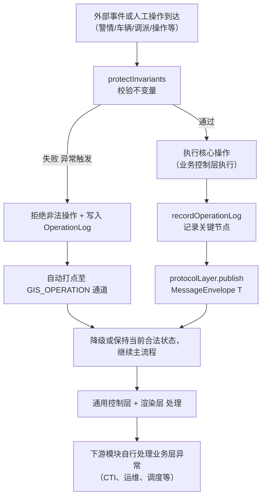

### 12-异常处理流程

> 版本: v1.0  
> 日期: 2026-07-24  
> 范围: GIS 前端运行时异常处理流程

---

## 1. 异常处理原则

GIS 前端全程运行异常监听机制，重点针对 **坐标系污染、状态机非法迁移、算路失败、GPS 丢失、焦点冲突、ID 缺失前缀** 等核心运行时问题。

**核心原则**（与 03 业务流程图、05 五层架构、08 业务状态机、09 业务逻辑设计、11 核心判断逻辑对齐）：

- 本模块**仅负责 GIS 前端运行时异常处理**，重点保障**渲染一致性、视野控制、状态机一致性、算路准确性**。
- 所有异常处理通过 `protectInvariants()` 触发，拒绝非法操作并写入 `OperationLog`（保留 ≥ 2 年，不可删除/修改）。
- 异常**不中断主流程**，优先保障渲染连续性和接警员操作流畅，仅记录关键时间节点并通过 `MessageEnvelope<T>` 通知相关业务域。
- 异常处理严格遵循 **降级策略**（直线段代替路径、聚合渲染代替单车、保留最后位置代替 GPS 丢失）。
- 所有异常（无论严重与否）均自动打点至 `GIS_OPERATION` 通道，运维 / 值班长可实时查看详情。

---

## 2. 异常类型定义与触发条件

| 异常类型 | 定义 | 触发条件（protectInvariants 校验） | 处理方式 | 业务目标 |
| -------- | ---- | --------------------------------- | -------- | -------- |
| 坐标系污染 | 协议层 / 服务层收到非 WGS84 坐标 | 坐标系校验失败 | 阻断渲染并打点 `COORD_VIOLATION` | 强制坐标系一致性 |
| 非法状态迁移 | 违反 08 状态机迁移表的有向边 | 状态机迁移校验失败 | 阻断并打点 `ILLEGAL_TRANSITION` | 状态机一致性 |
| 算路失败 | 算路服务超时或返回错误 | 算路耗时 > 1s 或返回错误 | 降级为直线段并打点 `ROUTE_FALLBACK` | 调派可用性 |
| GPS 丢失 | 车辆 GPS 信号丢失 > 30s | GPS 心跳超时 | 标记 `GPS_LOST` 并保留最后位置 | 跟踪连续性 |
| 焦点冲突 | 同帧多个业务域争夺焦点 | 焦点互斥校验失败 | 按优先级裁决并打点 `FOCUS_CONFLICT` | 视野控制权清晰 |
| ID 缺失前缀 | 图元 ID 未加业务前缀 | ID 格式校验失败 | 阻断发布并打点 `ID_PREFIX_MISSING` | ID 隔离 |
| Auto-Fit Padding 缺失 | 视野自适应未保留 10%~15% 留边 | Padding 校验失败 | 自动修正并打点 `PADDING_AUTO_FIX` | 视野美观 |
| 视野越界 | 试图定位到非法坐标（如 0,0） | 坐标合法性校验失败 | 阻断并打点 `VIEW_OUT_OF_BOUNDS` | 渲染安全 |
| 围栏越界 | 试图在中心范围外绘制 | 围栏范围校验失败 | 阻断并打点 `FENCE_OUT_OF_RANGE` | 资源安全 |
| Web Worker 异常 | Worker 崩溃或通信失败 | Worker 心跳超时 | 降级为同步计算并打点 `WORKER_DEGRADED` | 跟踪可用性 |
| 跟踪车辆超限 | 同时跟踪车辆 > 50 辆 | 车辆数校验失败 | 聚合渲染并打点 `TRACKING_OVER_LIMIT` | 渲染性能 |
| 同时来电超限 | 同时弹屏来电 > 3 路 | 来电数校验失败 | 进入排队并打点 `CALL_QUEUE_OVERFLOW` | 弹屏体验 |
| 协议反序列化失败 | 协议层反序列化异常 | schema 校验失败 | 丢弃消息并打点 `PROTO_DESERIALIZE_FAIL` | 协议健壮性 |
| 资源回收失败 | 关闭/离场后图元未清空 | 资源释放校验失败 | 强制清理并打点 `RESOURCE_LEAK` | 内存安全 |

**通用规则**：

- 无论异常严重与否，均自动打点至 `GIS_OPERATION` 通道，运维 / 值班长可实时查看。
- 所有异常处理均记录操作人、原因、时间节点，纳入 `OperationLog`。
- 异常处理不阻断主流程，优先保障渲染连续性和接警员操作流畅。
- 异常恢复后自动触发状态机校验、协议重发，并刷新班长席监控视图（如有）。

---

## 3. 异常处理总流程图



---

## 4. 具体异常处理伴随流程

### 4.1 坐标系污染

```
协议层 / 服务层收到事件
    │
    ▼
反序列化时坐标系校验
    │
    ├── 通过 → 继续主流程
    │
    └── 失败（非 WGS84）
        │
        ▼
    阻断渲染 + 打点 COORD_VIOLATION
        │
        ▼
    写入 OperationLog（事件 ID、来源、原始坐标系）
        │
        ▼
    推送告警至运维通道
```

### 4.2 非法状态迁移

```
业务控制层触发状态机迁移
    │
    ▼
stateMachine.transit(fromState, event, toState)
    │
    ├── 在 08 迁移表内 → 执行迁移
    │
    └── 不在迁移表内（非法迁移）
        │
        ▼
    阻断迁移 + 打点 ILLEGAL_TRANSITION
        │
        ▼
    写入 OperationLog（alarmId/vehicleId/planId、fromState、event、attemptToState）
        │
        ▼
    推送告警至值班长监控通道
```

### 4.3 算路失败

```
DispatchCtrl.submitRoute(planId, vehicleIds)
    │
    ▼
调用算路服务（route-planner）
    │
    ├── 成功（≤ 1s）→ 渲染路径
    │
    └── 失败（超时/错误）
        │
        ▼
    降级为直线段（vehicle.position → target.position）
        │
        ▼
    打点 ROUTE_FALLBACK
        │
        ▼
    写入 OperationLog
        │
        ▼
    提示接警员"算路失败，已使用直线段"
```

### 4.4 GPS 丢失

```
车辆 GPS 推送（≥ 2fps）
    │
    ▼
Web Worker 接收并计算
    │
    ├── 正常 → 主线程按 30fps 渲染
    │
    └── GPS 心跳超时 > 30s
        │
        ▼
    标记 vehicle.GPS_LOST = true
        │
        ▼
    保留最后位置 + 灰色虚线渲染
        │
        ▼
    打点 VEHICLE_GPS_LOST
        │
        ▼
    写入 OperationLog + 推送告警
```

### 4.5 焦点冲突

```
多个业务域同时触发视野指令
    │
    ▼
ViewCtrl 接收
    │
    ├── 同帧内：按优先级裁决（调派 > 跟踪 > 问询 > 来电 > 值守）
    │
    └── 跨帧：先到先得
        │
        ▼
    被丢弃的业务域打点 FOCUS_CONFLICT
        │
        ▼
    写入 OperationLog
```

### 4.6 资源回收失败

```
业务控制层调用 release(id)
    │
    ▼
GeometryCtrl 回收图元
    │
    ├── 成功 → 继续
    │
    └── 失败（图元不存在/已回收）
        │
        ▼
    强制清理（全量扫描 + 按 ID 前缀过滤）
        │
        ▼
    打点 RESOURCE_LEAK
        │
        ▼
    写入 OperationLog
```

### 4.7 Web Worker 异常

```
Web Worker 计算 GPS 数据
    │
    ▼
主线程接收 Transferable Objects
    │
    ├── 正常 → 继续渲染
    │
    └── Worker 崩溃/通信失败
        │
        ▼
    降级为同步计算（主线程直接处理）
        │
        ▼
    打点 WORKER_DEGRADED
        │
        ▼
    写入 OperationLog
        │
        ▼
    提示接警员"跟踪性能已降级"
```

### 4.8 跟踪车辆超限

```
TrackingCtrl 订阅车辆数 > 50
    │
    ▼
进入聚合渲染模式
    │
    ├── 单车跟踪 → 聚合热力图
    │
    ▼
    打点 TRACKING_OVER_LIMIT
    │
    ▼
    提示接警员"车辆过多，已切换聚合视图"
```

### 4.9 同时来电超限

```
CallCtrl 接收来电
    │
    ├── 数量 ≤ 3 → 正常弹屏
    │
    └── 数量 > 3
        │
        ▼
    进入排队 + 播报等待提示音
        │
        ▼
    打点 CALL_QUEUE_OVERFLOW
        │
        ▼
    写入 OperationLog
```

---

## 5. 异常恢复策略

| 异常类型 | 恢复策略 |
| -------- | -------- |
| 坐标系污染 | 重新协议同步，丢弃污染数据 |
| 非法状态迁移 | 人工介入，恢复正确状态 |
| 算路失败 | 网络恢复后重试算路，替换直线段 |
| GPS 丢失 | GPS 恢复后自动取消 `GPS_LOST` 标记 |
| 焦点冲突 | 当前指令完成后，按优先级切换 |
| ID 缺失前缀 | 开发修复，重新发布 |
| Auto-Fit Padding 缺失 | 自动修正 |
| 视野越界 | 重新执行 `fitToCenter` |
| 围栏越界 | 重新执行 `fitToValidRange` |
| Web Worker 异常 | 自动重启 Worker |
| 跟踪车辆超限 | 车辆减少后自动恢复单车跟踪 |
| 同时来电超限 | 来电减少后自动弹屏排队 |
| 协议反序列化失败 | 推送 schema 升级告警 |
| 资源回收失败 | 强制清理后下次正常 |

---

## 6. 异常监控与告警

### 6.1 告警通道

| 通道 | 用途 | 接收方 |
| ---- | ---- | ------ |
| `GIS_OPERATION` | 全部异常打点 | 运维、值班长 |
| `GIS_PERFORMANCE` | 性能类异常（帧率、延迟） | 性能监控 |
| `GIS_PROTOCOL` | 协议层异常（反序列化、坐标系） | 后端 + 运维 |
| `GIS_STATE_MACHINE` | 状态机非法迁移 | 业务监控 |
| `GIS_RESOURCE` | 资源回收异常 | 性能监控 |

### 6.2 告警级别

| 级别 | 触发条件 | 通知方式 |
| ---- | -------- | -------- |
| P0 严重 | 坐标系污染 / 协议反序列化失败 / 资源回收失败 | 立即推送值班长 + 短信 |
| P1 高 | 非法状态迁移 / 算路失败 / 焦点冲突 | 推送值班长 + 邮件 |
| P2 中 | GPS 丢失 / Web Worker 异常 / 视野越界 | 写入 `OperationLog` |
| P3 低 | Auto-Fit 缺失 / 跟踪超限 / 来电超限 | 写入 `OperationLog` |

---

#### 断言清单

1. 异常处理通过 `protectInvariants()` 触发，拒绝非法操作并写入 `OperationLog`，违反率必须为 0%。
2. 异常不中断主流程，优先保障渲染连续性和接警员操作流畅，仅记录关键时间节点。
3. 14 种异常类型均定义了降级策略：算路失败 → 直线段、GPS 丢失 → 保留最后位置、跟踪超限 → 聚合渲染。
4. 异常按 P0/P1/P2/P3 四级告警，分别推送值班长 / 邮件 / 写入日志 / 写入日志。
5. 异常恢复策略明确：网络恢复后重试算路、GPS 恢复后自动取消标记、Worker 崩溃后自动重启。
