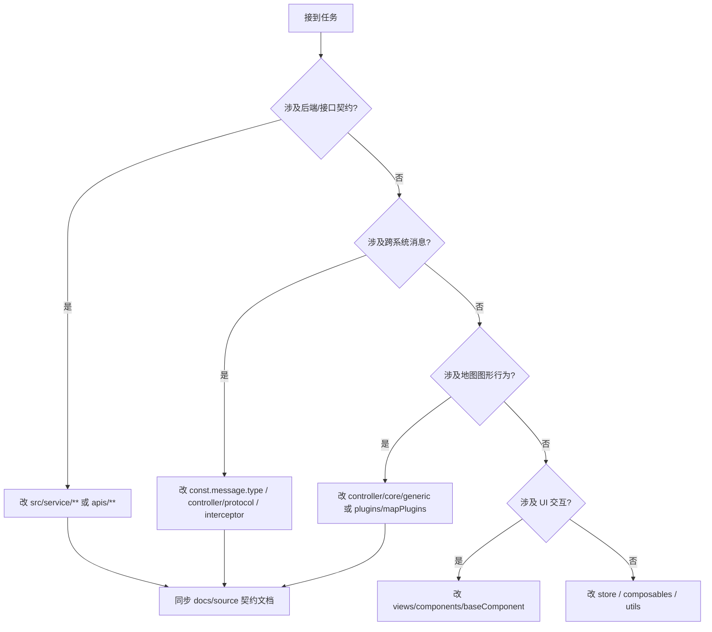

# AI 工作 SOP（ids-gis-web 专用）

> **核心规则**：本文件是 AI 在本仓库工作的**强制第一入口**。每次任务必须先读本文件，再读 `README.md`，然后按需进入各域文档。
> **事实来源**：本目录所有技术事实均从 `src/**`、`package.json`、`vite.config.ts`、`docs/source/**` 实测提取。事实与代码冲突时，**以代码为准**，并回写修正本目录。

---

## 一、工作启动流程（每次必做）

### 第 1 步：加载规范（强制）

```
读 herness/00-SOP.md          ← 你在这里（工作规范 + 质量门禁）
读 herness/README.md          ← 当前迭代状态 + 目录导航
```

### 第 2 步：定位任务域（按下方路由表）

本项目是**纯前端 GIS 工程**，没有后端代码。以下 5 类任务对应 5 条路径：

| 任务类型 | 走哪条路径 | 关键产出 | 必读文档 |
|---------|-----------|---------|---------|
| 需求/功能设计 | [01-产品设计/_流程规范.md](01-产品设计/_流程规范.md) | 需求分析、PRD | 05-共享上下文/核心概念术语.md |
| 编码/重构/修 Bug | [02-技术设计/_流程规范.md](02-技术设计/_流程规范.md) | 技术方案 + 代码 + 单元测试 | 05-共享上下文/设计规范速查.md |
| 测试/验收 | [03-测试/_流程规范.md](03-测试/_流程规范.md) | 测试策略、用例、报告 | 03-测试/_流程规范.md |
| 迭代/周计划 | [04-迭代管理/_index.md](04-迭代管理/_index.md) | 产物计划、产物汇总 | 04-迭代管理/_index.md |
| 代码审查 | [06-PR审查/_流程规范.md](06-PR审查/_流程规范.md) | 审查意见、问题闭环 | 06-PR审查/_流程规范.md |

### 第 3 步：读共享上下文（建立项目认知）

```
1. 05-共享上下文/项目结构速查.md      → 知道代码在哪、哪一层
2. 05-共享上下文/技术栈速查.md        → 知道用什么写的、怎么跑
3. 05-共享上下文/核心概念术语.md      → 知道业务在说什么
4. 05-共享上下文/设计规范速查.md      → 【编码前硬门禁】知道怎么写才对
5. 05-共享上下文/当前状态摘要.md      → 知道项目现在到哪了
6. 05-共享上下文/消息协议速查.md      → 涉及 WS/postMessage 时必读
```

### 第 4 步：执行 & 留痕

按对应流程执行，完成后在 [八、工作日志](#八工作日志) 追加记录；新增设计文档同步更新对应 `_index.md`。

---

## 二、核心行为规则

1. **先读后做**：不读 SOP 与 `05-共享上下文/设计规范速查.md` 就直接写代码 = 违规。
2. **先设计后编码**：任何编码任务前，必须先产出或确认技术方案（可简版，但必须有"涉及文件清单 + 关键流程"）。
3. **不臆造代码**：写文档、注释、PR 说明时引用代码必须给**真实路径与真实符号名**，禁止凭想象编造文件或行号。
4. **分层不越界**：架构强约束，见下方「二·分层铁律」，越层即违规。
5. **文档与代码同步**：实现与方案有偏差，必须回写 `02-技术设计/**`；禁止方案与代码长期背离。
6. **协议变更有流程**：改 `src/const/const.message.type.ts` 的事件键 / `src/controller/core/protocol/**` 的 DTO，必须同步 `docs/source/07-协议事件清单.md` 与 `docs/source/协议层DTO Schema.tsd`。
7. **自动生成文件禁改**：见 `05-共享上下文/设计规范速查.md`「自动生成文件」。
8. **PR 必须审查**：每个 MR 追加 AI 审查请求，问题闭环后才合入。
9. **验证后再宣称完成**：声称"完成/修复"前必须跑过 `pnpm lint` 或给出未验证的原因（`verification-before-completion`）。

---

## 三、分层铁律（越层即违规）

本项目采用**控制层分层架构**，见 `src/controller/**`。核心规则：

```
视图/组件  src/views/**、src/components/**
    ↓ 只读 store、只调 controller 公开方法，禁止直接碰 OL/ThreeJS 实例
状态层    src/store/**（Pinia）
    ↓ 业务状态、消息中枢（useMessageStore 是唯一消息总线）
控制器层  src/controller/**
    core/generic/    通用图形控制：view/geometry/spatial/kinematic —— 只执行图形指令，无业务语义
    core/business/   业务控制：alarm/call/dispatch/tracking/duty/config/addressRobot —— 只组装通用控制 DTO
    core/io/         输入输出控制：input/output
    core/protocol/   协议 DTO 定义：Generic/Business/IO 三份 interface 文件
    map/index.ts     地图系统对外发布订阅门面
    three/index.ts   三维系统对外发布订阅门面
    ↓
渲染底座  src/plugins/mapPlugins/**（MapCore + 插件）
    ↓
引擎      OpenLayers 10 / Three 0.169 / Cesium
```

| 规则 | 说明 |
|------|------|
| 通用控制层零业务 | `core/generic/**` 不得出现 alarm/call/dispatch 等业务词与业务状态 |
| 业务控制层不碰引擎 | `core/business/**` 不得 `import 'ol/...'` 或 `import 'three'` |
| DTO 唯一来源 | 控制器方法入参必须是 `core/protocol/**` 里的 interface，禁止用 `any` 承接跨层数据 |
| 跨系统通信唯一出口 | 所有 WS / postMessage 收发必须走 `useMessageStore().publish/subscribe`，禁止裸 `WebSocket`、禁止裸 `window.addEventListener('message')` |
| 新增控制器必须登记 | 新增 `XxxController` 必须同时在所属 `index.ts` 导出，并在 `05-共享上下文/项目结构速查.md` 补录 |

---

## 四、质量门禁

```
产品设计 ──→ 编码 ──→ 测试 ──→ MR
   │           │         │         │
   ▼           ▼         ▼         ▼
需求明确    方案+lint   用例通过   AI 审查通过
```

| 阶段 | 门禁条件（不满足不得进入下一阶段） |
|------|------|
| → 编码 | 技术方案已产出（涉及文件清单 + 关键流程 + 分层落点）；分层铁律确认无越层 |
| 编码中 | 每处改动能说清它落在 `store / controller / plugin / view` 哪一层、为什么 |
| 编码后 | `pnpm lint` **无新增**报错（基线约 193 个，见上） |
| → 测试 | 新增/变更逻辑有对应用例；`pnpm lint` 无新增报错 |
| → MR | 技术方案已回写；`docs/source/**` 若被影响已同步；MR 描述含变更概述与关联文档 |
| MR → 合入 | AI 审查通过；未修复问题已在 MR 评论说明原因 |

---

## 五、常用命令

```bash
pnpm dev                # 本地开发（mode=dev.local，端口 8888）
pnpm dev:local          # 同上（显式）
pnpm build              # 构建应用（dist/）
pnpm build:lib          # 库模式构建（dist-lib/，入口 src/lib/index.ts）
pnpm lint               # 类型检查：vue-tsc --noEmit（这是类型门禁，不是 ESLint）
pnpm mock:server        # 启动本地 mock 服务（node server/index.js）
pnpm mock:server:restart# 重启本地 mock
```

> ⚠️ **本项目无单元测试框架**（无 vitest/jest 依赖与 `test` 脚本）。`tests/**` 下是历史遗留的 `.test.ts` 脚本，需自备 runner 执行。
>
> ⚠️ **类型门禁基线不干净**：`pnpm lint` 当前约 **193 个既有报错**，绝大多数为 `TS6133`（未用变量/导入，源于 `noUnusedLocals`/`noUnusedParameters`），另有 **6 个 `TS2339/TS2551`** 是消息事件键缺失（真实缺陷）。
>
> **判定规则**：不要用"全局零报错"作为通过标准。应对比**改动前后**的报错数与文件范围，只对自己引入的新错误负责。详见 [05-共享上下文/当前状态摘要.md](05-共享上下文/当前状态摘要.md)。

---

## 六、任务路由决策



---

## 七、关联文件

| 文件 | 作用 |
|------|------|
| `README.md` | 目录导航 + 当前迭代状态 |
| `01-产品设计/_流程规范.md` | 需求设计工作流 |
| `02-技术设计/_流程规范.md` | 编码工作流 + 技术方案模板 |
| `03-测试/_流程规范.md` | 测试工作流 |
| `04-迭代管理/_index.md` | 迭代总览 |
| `05-共享上下文/*` | 技术栈/结构/术语/规范/协议速查 |
| `06-PR审查/_流程规范.md` | MR 审查工作流 |
| `examples/*` | 各阶段产物示例 |

---

## 八、工作日志

> **留痕规则**：每次完成工作后追加一条。格式 `| 时间 | 工作内容 | 变更文件 | 关联迭代 |`

| 时间 | 工作内容 | 变更文件 | 关联迭代 |
|------|---------|---------|---------|
| 2026-10-09 | 建立 herness 工作台（基于 herness-template 落地，注入本项目真实事实） | `herness/**` | — |