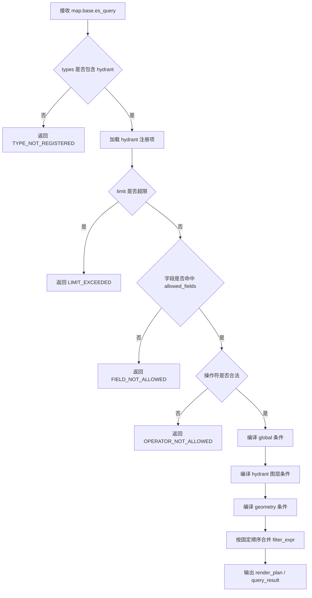
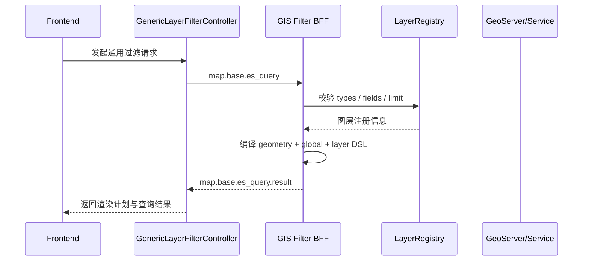
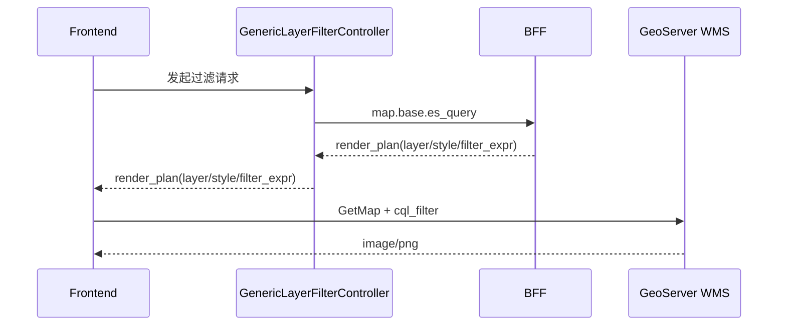
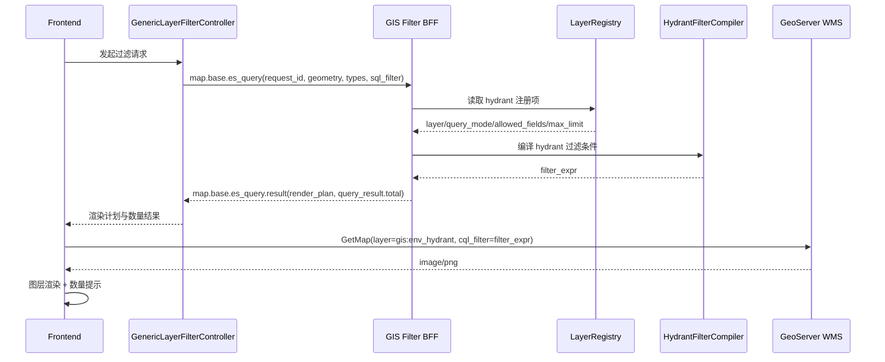
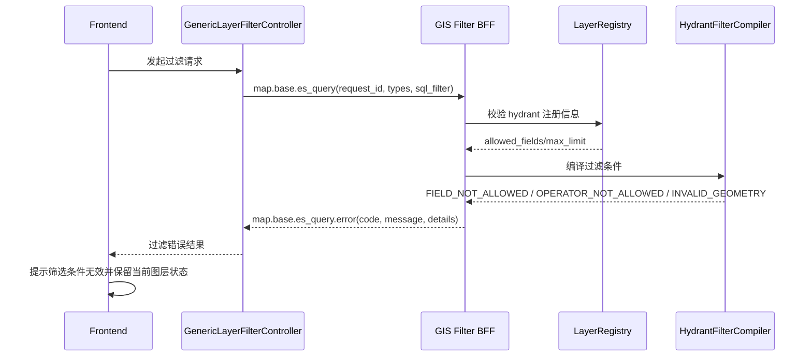

# GIS地图模块 — 通用资源图层过滤方案设计文档（消防栓示例版）

> 版本：v1.0
> 日期：2026-07-28
> 状态：评审版
> 协议标识：`map.base.es_query`
> 所属前端控制器：`GenericLayerFilterController`
> 适用范围：资源类图层统一过滤方案，本文档先按消防栓示例落地

---

## 〇、设计目标

本文档在 [GIS_EnvHydrant消防栓设计文档.md](file:///d:/work/telewave/ids/ids-gis-web/mds/7.27/GIS_EnvHydrant%E6%B6%88%E9%98%B2%E6%A0%93%E8%AE%BE%E8%AE%A1%E6%96%87%E6%A1%A3.md) 的资源类控制能力基础上，抽象出一套资源图层通用过滤方案。**本版先按消防栓示例落地**，用于统一：

- 资源类图层的范围过滤
- 资源类图层的属性过滤
- 多图层并发查询
- WMS 上图过滤
- WFS/表单展示的未来扩展查询

本方案的目标不是替代具体资源专题文档，而是以消防栓为首个实例，沉淀一套后续可复制到其他资源图层的协议与执行框架。

---

## 一、定位与边界

### 1.1 方案定位

`map.base.es_query` 是 GIS 前端协议层的**通用空间检索/资源过滤协议**。其职责是：

- 接收前端提交的几何范围与资源类型
- 接收结构化属性过滤条件
- 将过滤条件路由到对应资源图层
- 编译为 GeoServer `CQL_FILTER`、WFS 查询条件或领域服务查询参数
- 输出统一的图层过滤结果和渲染计划

> **本版范围**：虽然协议设计面向资源类通用复用，但本版只落地 `hydrant -> gis:env_hydrant` 这一条链路，其余资源类型暂不展开实施细节。

> **命名说明**：协议名沿用现有 `map.base.es_query`，这里的 `es_query` 表示“元素/资源检索协议”，**不等于必须走 Elasticsearch**。实际可落到 GeoServer、PostGIS、WFS 或领域服务。

### 1.2 分层归属

```text
┌──────────────────────────────────────────────────────────────┐
│ 面板层（GIS Frontend）                                         │
│ - 直连地图资源接入层（GeoServer）                               │
│ - 通过前端 core `GenericLayerFilterController` 发起 map.base.es_query │
│ - 向 BFF 请求控制配置、过滤结果、交互编排结果                   │
│ - 展示过滤结果、列表结果、命中数量                             │
└───────────────────────┬──────────────────────┘
                        │
      ┌─────────────────▼──────────────────┐
      │ 地图资源接入层（GeoServer）          │
      │ - WMS 图层发布                     │
      │ - WFS 要素查询                     │
      │ - CQL_FILTER 执行                 │
      └────────────────────────────────────┘

                        │
      ┌─────────────────▼──────────────────┐
      │ BFF（GIS 专用后端服务）             │
      │ - 控制配置输出                     │
      │ - 过滤结果返回                     │
      │ - 交互编排结果返回                 │
      │ - 字段白名单与过滤表达式编译       │
      └─────────────────┬──────────────────┘
                        │
                        │ 领域字段 / 业务规则
      ┌─────────────────▼──────────────────┐
      │ 领域适配层（DDD/业务服务）          │
      │ - 状态字段、业务字段、事件流        │
      │ - 非 GeoServer 字段查询             │
      │ - 业务规则补充                      │
      └────────────────────────────────────┘
```

> **分层口径**：面板层属于前端范畴，内部包含 GeoServer 直连调用、前端 core `GenericLayerFilterController`，以及向 BFF 发起控制配置、过滤结果、交互编排结果请求的前端编排逻辑。`GenericLayerFilterController` 不等同于 BFF；BFF 是 GIS 专用后端服务，向下依赖领域适配层完成业务字段与规则补充。

### 1.3 设计边界

| 边界项 | 本方案负责 | 本方案不负责 |
|------|-----------|-------------|
| 资源过滤 | 统一协议、过滤 DSL、过滤编译 | 具体资源样式设计 |
| 图层查询 | WMS/WFS 过滤参数编译 | GeoServer 样式文件内容 |
| 业务字段 | 通过字段字典注册接入 | 领域状态机本身 |
| 多图层并查 | 支持 | 不做跨图层 Join |
| 前端展示 | 返回统一结构 | 不直接渲染 UI |

---

## 二、协议设计

### 2.1 协议输入

#### 2.1.1 标准事件

```json
{
  "eventType": "map.base.es_query",
  "data": {
    "types": ["hydrant"],
    "limit": 50,
    "request_id": "REQ-20260728-001",
    "geometry": {
      "type": "Circle",
      "center": [120.10, 30.20],
      "radius": 1000
    },
    "sql_filter": {
      "layer": {
        "hydrant": {
          "logic": "AND",
          "conditions": [
            { "field": "is_enabled", "operator": "EQ", "value": true },
            { "field": "org_id", "operator": "IN", "value": ["ORG001", "ORG002"] },
            {
              "field": "keyword",
              "operator": "TEXT_ANY",
              "fields": ["water_name", "address"],
              "value": "延安路"
            }
          ]
        }
      }
    }
  }
}
```

#### 2.1.2 范围过滤输入对象

`CENTER_RADIUS`

```json
{
  "types": ["hydrant"],
  "limit": 50,
  "geometry": {
    "type": "Circle",
    "center": [120.10, 30.20],
    "radius": 1000
  }
}
```

`FENCE`

```json
{
  "types": ["hydrant"],
  "limit": 50,
  "geometry": {
    "type": "Polygon",
    "coordinates": [
      [
        [120.10, 30.20],
        [120.20, 30.20],
        [120.20, 30.30],
        [120.10, 30.30],
        [120.10, 30.20]
      ]
    ]
  }
}
```

`BBOX`

```json
{
  "types": ["hydrant"],
  "limit": 50,
  "geometry": {
    "type": "BBox",
    "bbox": [120.10, 30.20, 120.20, 30.30]
  }
}
```

`MIXED`

```json
{
  "types": ["hydrant"],
  "limit": 50,
  "geometry": {
    "type": "Polygon",
    "coordinates": [
      [
        [120.10, 30.20],
        [120.20, 30.20],
        [120.20, 30.30],
        [120.10, 30.30],
        [120.10, 30.20]
      ]
    ]
  },
  "scope_ext": {
    "mode": "MIXED",
    "radius": 1000
  }
}
```

> **范围过滤口径**：通用资源过滤按 `CENTER_RADIUS`、`FENCE`、`BBOX`、`MIXED` 四种模式统一收口；消防栓问询阶段本版默认采用 `CENTER_RADIUS`，即以警情事件中心点经纬度为中心、半径 `1000m` 划定候选范围。

#### 2.1.3 TypeScript 定义

```ts
type GeometryInput =
  | {
      type: "Circle";
      center: [number, number];
      radius: number;
    }
  | {
      type: "Polygon";
      coordinates: number[][][];
    }
  | {
      type: "BBox";
      bbox: [number, number, number, number];
    };

type ScopeMode = "CENTER_RADIUS" | "FENCE" | "BBOX" | "MIXED";

interface ScopeExtInput {
  mode: ScopeMode;
  radius?: number;
}

type FilterOperator =
  | "EQ"
  | "NE"
  | "IN"
  | "NOT_IN"
  | "GT"
  | "GTE"
  | "LT"
  | "LTE"
  | "BETWEEN"
  | "LIKE"
  | "STARTS_WITH"
  | "TEXT_ANY"
  | "IS_NULL"
  | "IS_NOT_NULL";

interface FilterCondition {
  field: string;
  operator: FilterOperator;
  value?: string | number | boolean | Array<string | number | boolean>;
  fields?: string[];
}

interface LayerFilterGroup {
  logic: "AND" | "OR";
  conditions: FilterCondition[];
}

interface GenericEsQueryEvent {
  eventType: "map.base.es_query";
  data: {
    types: string[];
    limit?: number;
    request_id?: string;
    geometry?: GeometryInput;
    scope_ext?: ScopeExtInput;
    sql_filter?: {
      global?: LayerFilterGroup;
      layer?: Record<string, LayerFilterGroup>;
    };
  };
}
```

### 2.2 `sql_filter` 的真实含义

虽然字段名叫 `sql_filter`，但其内容**不是原始 SQL 字符串**，而是**结构化过滤 DSL**。原因如下：

- 前端不能直接传原始 SQL，避免注入风险
- 不同资源图层底层执行引擎不同，不一定都是 SQL
- 同一份 DSL 需要同时支持：
  - GeoServer `CQL_FILTER`
  - WFS 查询条件
  - PostGIS/数据库查询条件
  - 领域服务查询参数

因此，`sql_filter` 的定位应为：

- **协议字段名保留**
- **语义上是结构化过滤树**
- **由 BFF 负责编译到具体执行语法**

### 2.3 输出结构

```json
{
  "eventType": "map.base.es_query.result",
  "data": {
    "request_id": "REQ-20260728-001",
    "render_plan": [
      {
        "type": "hydrant",
        "layer": "gis:env_hydrant",
        "style": "hydrant_style",
        "visible": true,
        "query_mode": "WMS",
        "filter_expr": "is_enabled=true AND org_id IN ('ORG001','ORG002') AND (water_name ILIKE '%延安路%' OR address ILIKE '%延安路%')"
      }
    ],
    "query_result": [
      {
        "type": "hydrant",
        "total": 32,
        "limit": 50,
        "items": []
      }
    ]
  }
}
```

### 2.4 输出字段说明

| 字段 | 含义 | 用途 |
|------|------|------|
| `render_plan` | 图层渲染计划 | 前端直连 WMS/WFS |
| `query_mode` | 查询模式 | `WMS` / `WFS` / `SERVICE` |
| `filter_expr` | 编译后的过滤表达式 | WMS `cql_filter` 或 WFS 参数 |
| `query_result` | 查询结果集 | 预留给表单、列表、详情面板 |

> **现行实现口径**：GIS 主链路仍以 **WMS 上图** 为主，因此 `query_result.items` 在多数场景下可为空；未来若表单展示走 WFS，则复用同一协议返回要素结果。

---

## 三、资源图层注册模型

### 3.1 统一注册表

资源图层在接入 `map.base.es_query` 前，必须先注册到图层字典中。**本版先注册消防栓图层**，其余资源后续按同一模板扩展。

| `type` | 图层 | 主执行模式 | 几何字段 | 可过滤字段示例 | 本版状态 |
|------|------|-----------|---------|---------------|---------|
| `hydrant` | `gis:env_hydrant` | `WMS` | `geom` | `is_enabled` / `org_id` / `water_name` / `address` | 本版落地 |
| `vehicle` | `gis:view_res_vehicle` | `SERVICE` + `WFS` | `geom` | `is_enabled` / `org_id` / `car_name` / `status` | 后续扩展 |
| `building` | `gis:view_env_building` | `WMS` | `geom` | `building_name` / `building_type` | 后续扩展 |
| `entrance_exit` | `gis:env_entrance_exit` | `WMS` | `geom` | `aoi_id` / `org_id` | 后续扩展 |
| `enterprise` | `gis:view_env_enterprises` | `WMS` | `geom` | `enterprise_name` / `risk_level` | 后续扩展 |

### 3.2 注册项约束

每个资源类型至少注册以下元信息：

```ts
interface LayerRegistryItem {
  type: string;
  layer: string;
  style?: string;
  query_mode: "WMS" | "WFS" | "SERVICE";
  geometry_field: string;
  allowed_fields: string[];
  default_limit: number;
  max_limit: number;
}
```

### 3.3 关键约束

- `types` 中的值必须能在注册表中找到
- `field` 必须落在 `allowed_fields` 白名单内
- `limit` 不得超过 `max_limit`
- 未注册资源类型直接拒绝执行

---

## 四、通用过滤模型

### 4.1 过滤维度

| 过滤维度 | 输入位置 | 作用 |
|------|---------|------|
| 几何范围 | `geometry` | 限定空间范围 |
| 全局过滤 | `sql_filter.global` | 所有图层共用条件 |
| 图层过滤 | `sql_filter.layer.{type}` | 单资源类型专有条件 |
| 数量限制 | `limit` | 限制要素返回数量 |

### 4.2 通用字段能力映射（消防栓优先）

基于消防水源专题，可以先抽象出资源类通用过滤能力；本版以消防栓字段作为第一组标准字段：

| 通用能力 | 典型字段 | 操作符 |
|------|---------|-------|
| 启用过滤 | `is_enabled` | `EQ` |
| 机构过滤 | `org_id` | `EQ` / `IN` / `NOT_IN` |
| 文本过滤 | `water_name` / `address` / `car_name` | `LIKE` / `STARTS_WITH` / `TEXT_ANY` |
| 状态过滤 | `status` | `EQ` / `IN` |
| 时间过滤 | `create_time` / `launched_time` | `BETWEEN` / `GTE` / `LTE` |

### 4.2.1 第二层字段集过滤

第二层不再做泛字段分类，而是按图层名内聚定义开放字段集。对于 `gis:env_hydrant`，当前只开放与该图层强关联的业务过滤字段。

| 图层名 | 开放字段 | 过滤含义 |
|------|---------|---------|
| `gis:env_hydrant` | `is_enabled` | 可用状态过滤 |
| `gis:env_hydrant` | `org_id` | 所属机构过滤 |
| `gis:env_hydrant` | `water_name` / `address` | 名称与地址文本过滤 |

核心约束：

- 第二层字段集过滤只在范围过滤结果集内执行
- 开放字段与图层名强绑定，不做跨图层复用拼装
- 文本检索统一收口为 `TEXT_ANY(water_name,address)`

### 4.2.2 治理层

治理层也按图层名收口，核心只保留允许规则与拒绝规则。

| 图层名 | 允许字段 | 允许操作符 | 基线规则 |
|------|---------|-----------|---------|
| `gis:env_hydrant` | `is_enabled` / `org_id` / `water_name` / `address` | `EQ` / `IN` / `TEXT_ANY` | 无 |

拒绝原则：

- 未注册图层或未开放字段，直接拒绝
- 字段与操作符不匹配，直接拒绝
- 空数组机构过滤、非法范围对象，直接拒绝
- 不开放原始 SQL / 原始 CQL / 无边界自定义查询

### 4.3 过滤编译优先级

统一编译顺序如下：

1. 资源类型合法性校验
2. 字段白名单校验
3. 全局过滤编译
4. 图层专属过滤编译
5. 几何范围编译
6. 合并为图层级最终表达式

合并规则：

```text
final_filter = global_filter
             AND layer_filter[type]
             AND geometry_filter
```

### 4.4 典型编译规则

| DSL 条件 | 编译结果 |
|------|---------|
| `{ field: "is_enabled", operator: "EQ", value: true }` | `is_enabled=true` |
| `{ field: "org_id", operator: "IN", value: ["ORG001","ORG002"] }` | `org_id IN ('ORG001','ORG002')` |
| `{ field: "keyword", operator: "TEXT_ANY", fields: ["water_name","address"], value: "延安路" }` | `(water_name ILIKE '%延安路%' OR address ILIKE '%延安路%')` |
| `geometry.type = "Polygon"` | `WITHIN(geom, POLYGON((...)))` |
| `geometry.type = "BBox"` | `BBOX(geom, minx, miny, maxx, maxy)` |

---

## 五、执行模式

### 5.1 WMS 渲染模式

适用于当前主链路的资源图层上图场景。

```text
前端 -> BFF: map.base.es_query
BFF -> BFF: 编译结构化过滤 DSL
BFF -> 前端: render_plan(layer/style/filter_expr)
前端 -> GeoServer WMS: 直连请求 + cql_filter
GeoServer -> 前端: 返回渲染结果
```

适用特点：

- 当前主链路
- 适合大规模上图
- 不要求返回完整属性集

### 5.2 WFS/要素返回模式

适用于未来的表单、列表、详情面板。消防栓场景当前仅作为预留能力，不作为现行主链路。

```text
前端 -> BFF: map.base.es_query
BFF -> GeoServer WFS/领域服务: 执行过滤
BFF -> 前端: query_result(items[])
```

适用特点：

- 未来扩展链路
- 适合返回要素字段
- 用于表格、列表、结果面板

### 5.3 SERVICE 模式

适用于像车辆这类不完全依赖 GeoServer 的动态资源。本版不展开实施。

```text
前端 -> BFF: map.base.es_query
BFF -> 领域适配层: 调用车辆/调派服务
BFF -> 前端: render_plan + query_result
```

---

## 六、与消防水源专题的映射关系

### 6.1 消防水源映射

| 通用协议 | 消防水源专题字段 |
|------|----------------|
| `type = hydrant` | `gis:env_hydrant` |
| `is_enabled` | `res_water.is_enabled` |
| `org_id` | `res_water.org_id` |
| `TEXT_ANY(water_name,address)` | `res_water.water_name` + `res_water.address` |

### 6.2 消防水源示例

```json
{
  "eventType": "map.base.es_query",
  "data": {
    "geometry": {
      "type": "Polygon",
      "coordinates": [[[120.10, 30.20], [120.20, 30.20], [120.20, 30.30], [120.10, 30.30], [120.10, 30.20]]]
    },
    "types": ["hydrant"],
    "limit": 50,
    "sql_filter": {
      "layer": {
        "hydrant": {
          "logic": "AND",
          "conditions": [
            { "field": "is_enabled", "operator": "EQ", "value": true },
            { "field": "org_id", "operator": "IN", "value": ["ORG001"] },
            {
              "field": "keyword",
              "operator": "TEXT_ANY",
              "fields": ["water_name", "address"],
              "value": "延安路"
            }
          ]
        }
      }
    }
  }
}
```

编译结果：

```sql
is_enabled=true
AND org_id IN ('ORG001')
AND (water_name ILIKE '%延安路%' OR address ILIKE '%延安路%')
AND WITHIN(geom, POLYGON((...)))
```

### 6.3 消防栓请求/响应实例

#### 6.3.1 场景 A：值守阶段全量展示

适用场景：

- `S1` 值守模式
- 前端只需要获取消防栓图层渲染计划
- 不启用 `is_enabled` / `org_id` / 文本过滤

请求示例：

```json
{
  "eventType": "map.base.es_query",
  "data": {
    "request_id": "REQ-HYD-S1-001",
    "types": ["hydrant"],
    "limit": 50
  }
}
```

响应示例：

```json
{
  "eventType": "map.base.es_query.result",
  "data": {
    "request_id": "REQ-HYD-S1-001",
    "render_plan": [
      {
        "type": "hydrant",
        "layer": "gis:env_hydrant",
        "style": "hydrant_style",
        "visible": true,
        "query_mode": "WMS"
      }
    ],
    "query_result": [
      {
        "type": "hydrant",
        "total": 0,
        "limit": 50,
        "items": []
      }
    ]
  }
}
```

说明：

- 不带 `sql_filter`
- 不带 `geometry`
- 前端按 `render_plan` 直连 WMS，全量展示当前视口内数据源

#### 6.3.2 场景 B：问询阶段受控过滤

适用场景：

- `S3` 接警问询阶段
- `map.base.es_query` 的 `geometry.center` 取自警情事件 `longitude`/`latitude`
- `geometry.type` 为 `Circle`，`radius` 固定为 `1000`（单位：米），以警情位置为中心划定半径 `1000m` 圆形候选范围
- 叠加启用过滤、机构过滤、名称/地址模糊检索

请求示例：

```json
{
  "eventType": "map.base.es_query",
  "data": {
    "request_id": "REQ-HYD-S3-001",
    "geometry": {
      "type": "Circle",
      "center": [120.10, 30.20],
      "radius": 1000
    },
    "types": ["hydrant"],
    "limit": 50,
    "sql_filter": {
      "layer": {
        "hydrant": {
          "logic": "AND",
          "conditions": [
            { "field": "is_enabled", "operator": "EQ", "value": true },
            { "field": "org_id", "operator": "IN", "value": ["ORG001", "ORG002"] },
            {
              "field": "keyword",
              "operator": "TEXT_ANY",
              "fields": ["water_name", "address"],
              "value": "延安路"
            }
          ]
        }
      }
    }
  }
}
```

响应示例：

```json
{
  "eventType": "map.base.es_query.result",
  "data": {
    "request_id": "REQ-HYD-S3-001",
    "render_plan": [
      {
        "type": "hydrant",
        "layer": "gis:env_hydrant",
        "style": "hydrant_style",
        "visible": true,
        "query_mode": "WMS",
        "filter_expr": "is_enabled=true AND org_id IN ('ORG001','ORG002') AND (water_name ILIKE '%延安路%' OR address ILIKE '%延安路%') AND DWITHIN(geom, POINT(120.10 30.20), 1000, meters)"
      }
    ],
    "query_result": [
      {
        "type": "hydrant",
        "total": 18,
        "limit": 50,
        "items": []
      }
    ]
  }
}
```

说明：

- `filter_expr` 供前端拼接 WMS `cql_filter`
- `query_result.total` 用于列表计数、角标统计、面板提示
- `items` 仍为空，保留给未来 WFS/表单展示

### 6.4 消防栓 DTO 建议

#### 6.4.1 Java DTO

```java
public class MapBaseEsQueryRequest {
    private String eventType;
    private QueryData data;

    public static class QueryData {
        private String requestId;
        private GeometryInput geometry;
        private List<String> types;
        private Integer limit;
        private SqlFilter sqlFilter;
    }

    public static class GeometryInput {
        private String type;
        private List<List<List<BigDecimal>>> coordinates;
        private List<BigDecimal> center;
        private BigDecimal radius;
        private List<BigDecimal> bbox;
    }

    public static class SqlFilter {
        private FilterGroup global;
        private Map<String, FilterGroup> layer;
    }

    public static class FilterGroup {
        private String logic;
        private List<FilterCondition> conditions;
    }

    public static class FilterCondition {
        private String field;
        private String operator;
        private Object value;
        private List<String> fields;
    }
}
```

```java
@JsonNaming(PropertyNamingStrategies.SnakeCaseStrategy.class)
public class MapBaseEsQueryResponse {
    private String eventType;
    private ResultData data;

    @JsonNaming(PropertyNamingStrategies.SnakeCaseStrategy.class)
    public static class ResultData {
        private String requestId;
        private List<RenderPlanItem> renderPlan;
        private List<QueryResultItem> queryResult;
    }

    @JsonNaming(PropertyNamingStrategies.SnakeCaseStrategy.class)
    public static class RenderPlanItem {
        private String type;
        private String layer;
        private String style;
        private Boolean visible;
        private String queryMode;
        private String filterExpr;
    }

    @JsonNaming(PropertyNamingStrategies.SnakeCaseStrategy.class)
    public static class QueryResultItem {
        private String type;
        private Integer total;
        private Integer limit;
        private List<HydrantQueryItem> items;
    }

    @JsonNaming(PropertyNamingStrategies.SnakeCaseStrategy.class)
    public static class HydrantQueryItem {
        private String waterId;
        private String waterName;
        private String watertypeId;
        private String address;
        private String orgId;
        private Boolean isEnabled;
        private BigDecimal longitude;
        private BigDecimal latitude;
    }
}
```

实现建议：

- Java DTO 可统一使用 `SnakeCaseStrategy`，保持对象字段命名与协议字段 `request_id`、`query_mode`、`filter_expr` 自动对齐
- 若当前主链路只返回 `render_plan`，`query_result.items` 可先为空集合；进入 WFS/表单展示链路时，再按 `HydrantQueryItem` 返回属性字段
- `HydrantQueryItem` 的字段范围应与 `public.res_water` 的现行展示口径保持一致，避免引入未落地的派生字段

#### 6.4.2 TypeScript 类型

```ts
interface HydrantEsQueryRequest {
  eventType: "map.base.es_query";
  data: {
    request_id?: string;
    geometry?: {
      type: "Polygon" | "Circle" | "BBox";
      coordinates?: number[][][];
      center?: [number, number];
      radius?: number;
      bbox?: [number, number, number, number];
    };
    types: ["hydrant"];
    limit?: number;
    sql_filter?: {
      global?: {
        logic: "AND" | "OR";
        conditions: Array<{
          field: string;
          operator: "EQ" | "IN" | "TEXT_ANY";
          value?: string | number | boolean | Array<string | number | boolean>;
          fields?: string[];
        }>;
      };
      layer?: {
        hydrant?: {
          logic: "AND" | "OR";
          conditions: Array<{
            field: string;
            operator: "EQ" | "IN" | "TEXT_ANY";
            value?: string | number | boolean | Array<string | number | boolean>;
            fields?: string[];
          }>;
        };
      };
    };
  };
}
```

```ts
interface HydrantQueryItem {
  water_id: string;
  water_name: string;
  watertype_id: string;
  address?: string;
  org_id?: string;
  is_enabled: boolean;
  longitude?: number;
  latitude?: number;
}

interface HydrantEsQueryResponse {
  eventType: "map.base.es_query.result";
  data: {
    request_id?: string;
    render_plan: Array<{
      type: "hydrant";
      layer: "gis:env_hydrant";
      style?: string;
      visible: boolean;
      query_mode: "WMS" | "WFS";
      filter_expr?: string;
    }>;
    query_result: Array<{
      type: "hydrant";
      total: number;
      limit: number;
      items: HydrantQueryItem[];
    }>;
  };
}
```

#### 6.4.3 消防栓字段白名单建议

| 字段 | 用途 | 是否允许过滤 |
|------|------|-------------|
| `is_enabled` | 启用过滤 | 是 |
| `org_id` | 机构过滤 | 是 |
| `water_name` | 文本过滤主字段 | 是 |
| `address` | 文本过滤兼容字段 | 是 |
| `watertype_id` | 类型过滤扩展 | 否，本版暂不开放 |
| `intake_form` | 类型字典字段 | 否，本版暂不开放 |

补充说明：

- 白名单面向过滤输入字段，不等于前端展示字段全集
- `longitude`、`latitude`、`geom` 属于位置展示字段，本版不作为前端直传过滤字段开放
- 文本检索统一收口到 `TEXT_ANY(water_name,address)`，不建议前端分别拼接两个独立模糊条件

### 6.5 消防栓过滤编译规则

#### 6.5.1 编译决策流程



#### 6.5.2 字段编译明细

| 输入位置 | 条件示例 | 编译前提 | `CQL_FILTER` 输出 |
|------|---------|---------|------------------|
| `sql_filter.layer.hydrant` | `{ "field": "is_enabled", "operator": "EQ", "value": true }` | `value` 必须是布尔值 | `is_enabled=true` |
| `sql_filter.layer.hydrant` | `{ "field": "org_id", "operator": "EQ", "value": "ORG001" }` | 单机构过滤 | `org_id = 'ORG001'` |
| `sql_filter.layer.hydrant` | `{ "field": "org_id", "operator": "IN", "value": ["ORG001","ORG002"] }` | 数组不能为空 | `org_id IN ('ORG001','ORG002')` |
| `sql_filter.layer.hydrant` | `{ "field": "keyword", "operator": "TEXT_ANY", "fields": ["water_name","address"], "value": "延安路" }` | `fields` 固定为 `water_name,address` | `(water_name ILIKE '%延安路%' OR address ILIKE '%延安路%')` |

补充口径：

- `keyword` 属于协议层虚拟字段，不直接映射数据库列，必须借助 `fields` 展开为多字段文本匹配
- `TEXT_ANY` 在消防栓场景固定展开为 `water_name` 与 `address` 的 `OR` 关系，不允许前端在本版自定义第三个文本字段
- `watertype_id`、`intake_form` 虽然属于真实字段，但本版未开放过滤，不参与编译

#### 6.5.3 空间范围编译规则

| `geometry.type` | 输入结构 | 编译规则 | 输出示例 |
|------|----------|---------|---------|
| `Polygon` | `coordinates` | 按多边形几何直接编译 | `WITHIN(geom, POLYGON((...)))` |
| `BBox` | `bbox: [minx,miny,maxx,maxy]` | 按矩形范围编译 | `BBOX(geom, minx, miny, maxx, maxy)` |
| `Circle` | `center + radius` | 统一转换为距离过滤表达式 | `DWITHIN(geom, POINT(longitude latitude), 1000, meters)` |

补充口径：

- `geometry` 缺失时，不报错，表示只做属性过滤或返回全量渲染计划
- `Polygon` 坐标必须闭合；若首尾点不一致，BFF 应在校验阶段直接返回参数错误
- `Circle` 的半径单位统一为米；前端不得混传千米、公里等单位标识

#### 6.5.4 最终表达式合并顺序

消防栓场景统一采用以下顺序合并：

```text
final_filter =
    global_filter
AND hydrant_layer_filter
AND geometry_filter
```

合并示例：

```sql
is_enabled=true
AND org_id IN ('ORG001','ORG002')
AND (water_name ILIKE '%延安路%' OR address ILIKE '%延安路%')
AND WITHIN(geom, POLYGON((...)))
```

排序原则：

- 先全局条件，再图层条件，最后空间条件
- 同一层条件内部按布尔字段、枚举字段、文本字段、空间字段的顺序输出
- 前端不应依赖条件顺序做业务判断，但日志与排障口径应保持固定顺序，便于比对

#### 6.5.5 直接拒绝编译的输入

| 场景 | 拒绝原因 | 处理策略 |
|------|---------|---------|
| `types` 不含已注册资源 | 资源类型未注册 | 返回错误，不进入编译流程 |
| `field` 不在白名单内 | 非法字段输入 | 返回错误，不透传到底层 |
| `operator` 与字段能力不匹配 | 例如 `is_enabled + IN` | 返回错误，不做容错猜测 |
| `TEXT_ANY` 缺少 `value` | 文本检索条件不完整 | 返回错误 |
| `IN` 对应空数组 | 条件无语义 | 返回错误 |
| `limit` 超过 `max_limit` | 超过治理阈值 | 返回错误 |

---

## 七、安全与治理约束

### 7.1 字段白名单

任何图层只允许过滤注册表中声明的字段，不接受前端任意字段直传。

### 7.2 原始表达式禁入

- 不接受前端直接透传 `SQL`
- 不接受前端直接透传 `CQL`
- 不接受前端直接透传图层未注册字段

### 7.3 查询限流

| 约束项 | 建议值 |
|------|------|
| 默认 `limit` | `50` |
| 最大 `limit` | `200` |
| `types` 数量上限 | `10` |
| 单次 `layer` 条件组上限 | `20` |

### 7.4 兼容策略

| 兼容项 | 策略 |
|------|------|
| 无 `geometry` | 允许，仅做属性过滤 |
| 无 `sql_filter` | 允许，仅做范围过滤或全量查询 |
| 无 `types` | 不允许，直接返回参数错误 |
| 图层不支持某字段 | 过滤编译失败并回传错误 |

### 7.5 标准错误码

| 错误码 | 含义 | 触发条件 |
|------|------|---------|
| `TYPE_NOT_REGISTERED` | 资源类型未注册 | `types` 中包含未接入注册表的资源 |
| `FIELD_NOT_ALLOWED` | 字段未开放过滤 | `field` 不在图层白名单 |
| `OPERATOR_NOT_ALLOWED` | 操作符不支持 | 字段能力与操作符不匹配 |
| `INVALID_FILTER_VALUE` | 过滤值非法 | 布尔、数组、文本值格式不合法 |
| `INVALID_GEOMETRY` | 空间参数非法 | `Polygon` 未闭合、`BBox` 长度错误、`Circle` 半径非法 |
| `LIMIT_EXCEEDED` | 查询数量超限 | `limit` 超过图层治理阈值 |

### 7.6 错误响应结构

```json
{
  "eventType": "map.base.es_query.error",
  "data": {
    "request_id": "REQ-HYD-S3-001",
    "code": "FIELD_NOT_ALLOWED",
    "message": "field watertype_id is not allowed for hydrant",
    "details": {
      "type": "hydrant",
      "field": "watertype_id",
      "operator": "EQ"
    }
  }
}
```

字段说明：

- `request_id`：回传原请求标识，便于前端将错误与当前检索动作关联
- `code`：稳定错误码，供前端做提示分流和联调排查
- `message`：面向开发排查的错误说明，保持英文或中英混合均可，但同一项目应统一
- `details`：补充问题定位信息，不承载最终用户展示文案

### 7.7 典型错误示例

#### 7.7.1 非白名单字段

```json
{
  "eventType": "map.base.es_query",
  "data": {
    "request_id": "REQ-HYD-ERR-001",
    "types": ["hydrant"],
    "limit": 50,
    "sql_filter": {
      "layer": {
        "hydrant": {
          "logic": "AND",
          "conditions": [
            { "field": "watertype_id", "operator": "EQ", "value": "WT001" }
          ]
        }
      }
    }
  }
}
```

```json
{
  "eventType": "map.base.es_query.error",
  "data": {
    "request_id": "REQ-HYD-ERR-001",
    "code": "FIELD_NOT_ALLOWED",
    "message": "field watertype_id is not allowed for hydrant",
    "details": {
      "type": "hydrant",
      "field": "watertype_id",
      "operator": "EQ"
    }
  }
}
```

#### 7.7.2 操作符不匹配

```json
{
  "eventType": "map.base.es_query",
  "data": {
    "request_id": "REQ-HYD-ERR-002",
    "types": ["hydrant"],
    "limit": 50,
    "sql_filter": {
      "layer": {
        "hydrant": {
          "logic": "AND",
          "conditions": [
            { "field": "is_enabled", "operator": "IN", "value": [true, false] }
          ]
        }
      }
    }
  }
}
```

```json
{
  "eventType": "map.base.es_query.error",
  "data": {
    "request_id": "REQ-HYD-ERR-002",
    "code": "OPERATOR_NOT_ALLOWED",
    "message": "operator IN is not allowed for field is_enabled",
    "details": {
      "type": "hydrant",
      "field": "is_enabled",
      "operator": "IN"
    }
  }
}
```

---

## 八、协议时序

### 8.1 通用过滤时序



### 8.2 现行 WMS 主链路时序



### 8.3 消防栓联调时序

#### 8.3.1 成功链路



关键说明：

- `render_plan` 由 BFF 返回，地图数据仍由前端直连 GeoServer 获取
- `query_result.total` 可用于角标、列表总数或过滤命中提示
- 当前主链路下 `query_result.items` 允许为空，不影响 WMS 渲染

#### 8.3.2 失败链路



失败处理口径：

- BFF 返回错误时，前端不应继续拼接错误的 `cql_filter`
- 前端应保留上一次成功渲染结果，避免因一次非法过滤导致地图图层整体清空
- `request_id` 必须原样回传，便于一次筛选动作的链路追踪

---

## 九、落地建议

### 9.1 本版落地范围

- 先以 `hydrant` 作为首个资源类型接入注册表
- 协议层统一采用 `map.base.es_query`
- `sql_filter` 按结构化 DSL 落地，不接受原始 SQL
- 当前主链路先输出消防栓图层的 `render_plan`
- 现行渲染先对接 `gis:env_hydrant` 的 WMS 过滤链路

### 9.2 模块落地拆分

| 模块 | 职责 | 本版实现要求 |
|------|------|-------------|
| `GenericLayerFilterController` | 前端 core：组织协议、调用 BFF、消费结果 | 必须落地 |
| `LayerFilterBffService` | 专用后端服务：校验参数、编译过滤、返回渲染计划 | 必须落地 |
| `LayerRegistry` | 管理 `type -> layer/query_mode/allowed_fields/max_limit` 映射 | 必须落地 |
| `HydrantFilterCompiler` | 将消防栓 DSL 编译为 `filter_expr` | 必须落地 |
| `GeometryCompiler` | 编译 `Polygon` / `BBox` / `Circle` 空间条件 | 必须落地 |
| `ErrorMapper` | 将校验异常归一为标准错误码与响应结构 | 必须落地 |
| `QueryResultAssembler` | 组装 `query_result.total/items` | 可先落地 `total`，`items` 预留 |

模块关系建议：

```text
Frontend
   -> GenericLayerFilterController
      -> LayerFilterBffService
         -> LayerRegistry
         -> HydrantFilterCompiler
            -> GeometryCompiler
         -> ErrorMapper
         -> QueryResultAssembler
```

推荐接口骨架：

```ts
interface LayerRegistryItem {
  type: "hydrant";
  layer: "gis:env_hydrant";
  query_mode: "WMS" | "WFS" | "SERVICE";
  geometry_field: "geom";
  allowed_fields: Array<"is_enabled" | "org_id" | "water_name" | "address">;
  default_limit: number;
  max_limit: number;
}

interface FilterCompileResult {
  filter_expr?: string;
  total?: number;
}

interface HydrantFilterCompiler {
  compile(request: HydrantEsQueryRequest, registry: LayerRegistryItem): FilterCompileResult;
}
```

### 9.3 开发任务清单

| 任务项 | 说明 | 产出 |
|------|------|------|
| 注册消防栓图层 | 在注册表中维护 `hydrant -> gis:env_hydrant` | 注册项配置 |
| 实现字段白名单 | 固定 `is_enabled` / `org_id` / `water_name` / `address` | 白名单常量 |
| 实现 DSL 编译器 | 支持 `EQ` / `IN` / `TEXT_ANY` / `Polygon` / `BBox` / `Circle` | 编译器代码 |
| 实现错误映射 | 输出 `map.base.es_query.error` | 异常处理器 |
| 实现结果组装 | 输出 `render_plan` 与 `query_result.total` | 返回 DTO |
| 接入 GeoServer 联调 | 前端按 `render_plan` 拼接 WMS `cql_filter` | 联调记录 |

### 9.4 联调验收口径

| 验收项 | 验收标准 |
|------|---------|
| 值守全量展示 | 不传 `sql_filter` 时，前端可收到消防栓 `render_plan` 并成功渲染 |
| 启用过滤 | `is_enabled=true` 时，`filter_expr` 正确输出布尔过滤条件 |
| 机构过滤 | `org_id IN` 时，`filter_expr` 正确输出机构集合条件 |
| 名称/地址检索 | `TEXT_ANY` 正确展开为 `water_name OR address` |
| 空间过滤 | `Polygon` / `BBox` / `Circle` 都能被正确编译 |
| 错误回传 | 非法字段、非法操作符、非法几何参数时，返回标准错误码 |
| 前端容错 | 收到错误响应后，前端不清空当前已渲染图层 |

### 9.5 后续扩展

- 为 WFS/表单展示补齐 `query_result.items`
- 为 `vehicle`、`building`、`entrance_exit` 等资源建立字段白名单
- 为 `TEXT_ANY`、`IN`、`BETWEEN` 建立统一编译器
- 将消防栓专题的过滤器实现模板化，复用到其他资源图层

### 9.6 一句话结论

**`map.base.es_query` 应先以消防栓资源为首个落地实例，验证结构化 `sql_filter` DSL 与 WMS 过滤链路，再按相同模板扩展到其他资源图层。**
