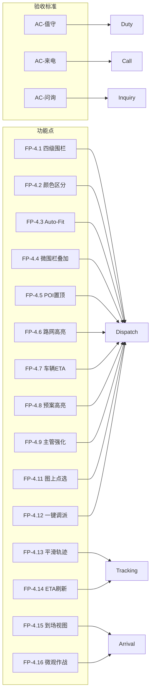
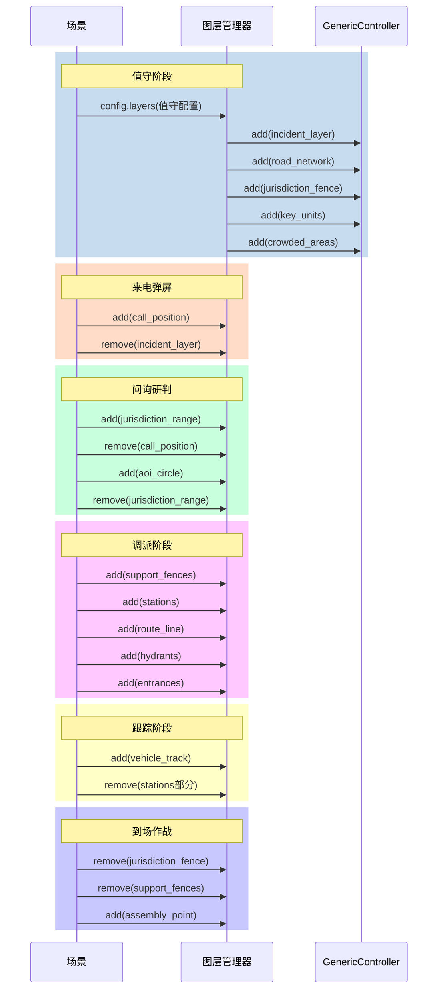
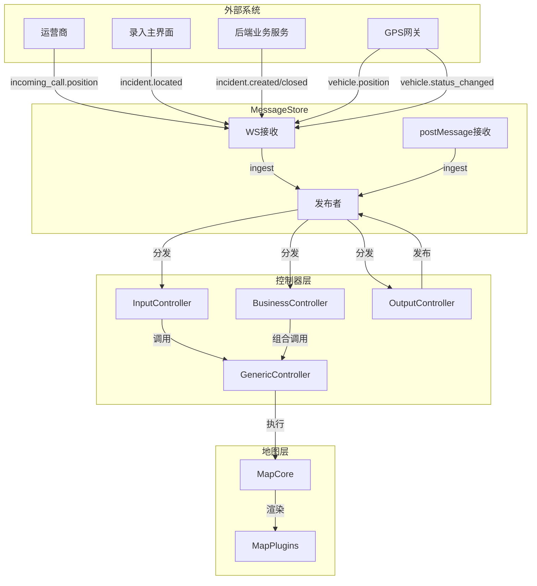
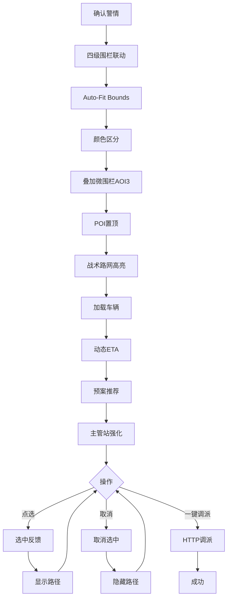

# GIS 完整业务流程图

> **版本**：1.1 | **日期**：2026-07-10
> **核心参考**：`GIS功能缝合.md`用户故事

---

## 一、全局业务生命周期流程

```mermaid
flowchart TD
    %% 系统初始化
    Start([系统启动]) --> Config[加载配置]
    Config --> MapReady[地图就绪]

    %% 值守阶段
    MapReady --> DutyLogin[接警员登录]
    DutyLogin --> DutyLoad[加载值守图层]
    DutyLoad --> Duty1[未结案警情]
    DutyLoad --> Duty2[主管队站辖区]
    DutyLoad --> Duty3[实时路况]
    DutyLoad --> Duty4[重点救援对象]
    Duty1 --> DutyStandby{值守监控}
    Duty2 --> DutyStandby
    Duty3 --> DutyStandby
    Duty4 --> DutyStandby

    %% 来电弹屏
    DutyStandby -->|119来电| CallIn[来电弹屏]
    CallIn --> CallLocate[WS接收粗定位]
    CallLocate --> CallDraw[绘制500m定位圈]
    CallDraw --> CallLabel[标注定位类型]
    CallLabel --> CallScreen[占用屏幕25-35%]
    CallScreen --> CallUser{继续?}
    CallUser -->|挂断| CallEnd[清除定位圈]
    CallUser -->|继续| InquiryEnter[进入问询]

    %% 问询研判
    InquiryEnter --> InquiryShow[显示粗定位圈+管辖范围圈]
    InquiryShow --> InquiryZone{跨越多管辖?}
    InquiryZone -->|是| InquiryMulti[展示所有相关辖区]
    InquiryZone -->|否| InquirySingle[高亮主辖区]
    InquiryMulti --> InquiryConfirm{精确定位?}
    InquirySingle --> InquiryConfirm
    InquiryConfirm -->|确认| InquiryHide[隐藏前两圈]
    InquiryConfirm -->|继续问询| InquiryLoop
    InquiryHide --> InquiryAoi[聚焦微围栏AOI3]
    InquiryAoi --> InquiryBuilding{建筑展示?}
    InquiryBuilding -->|单体| InquirySingleB[单体建筑]
    InquiryBuilding -->|附近| InquiryNearbyB[附近建筑]
    InquiryBuilding -->|AOI| InquiryAoiB[AOI内建筑]
    InquirySingleB --> InquiryDispatch[确认警情]
    InquiryNearbyB --> InquiryDispatch
    InquiryAoiB --> InquiryDispatch
    InquiryLoop -.-> InquiryShow

    %% 调派阶段
    InquiryDispatch --> DispatchFence[四级围栏联动]
    DispatchFence --> DispatchFit[Auto-Fit+10-15%留边]
    DispatchFit --> DispatchColor[主管围栏强色+支撑弱色]
    DispatchColor --> DispatchAoi[叠加微围栏AOI3]
    DispatchAoi --> DispatchPoi[POI置顶:出入口/栓]
    DispatchPoi --> DispatchRoad[战术路网高亮+路况着色]
    DispatchRoad --> DispatchVehicle[加载车辆+分类图标]
    DispatchVehicle --> DispatchEta[显示动态ETA]
    DispatchEta --> DispatchRecommend[预案推荐高亮]
    DispatchRecommend --> DispatchMain[主管站车辆强化]
    DispatchMain --> DispatchSelect{图上点选?}
    DispatchSelect -->|点选车辆| DispatchClick[选中视觉反馈]
    DispatchClick --> DispatchRoute[显示路径]
    DispatchSelect -->|取消| DispatchCancel[取消选中]
    DispatchCancel -.-> DispatchMain
    DispatchSelect -->|一键调派| DispatchExecute[HTTP调派下发]
    DispatchExecute --> DispatchSuccess[调派成功]

    %% 跟踪阶段
    DispatchSuccess --> TrackingStart[车辆出动]
    TrackingStart --> TrackingGps[订阅车辆GPS]
    TrackingGps --> GPSLoop{实时位置}
    GPSLoop -->|每500ms| TrackingSmooth[平滑轨迹跟踪]
    TrackingSmooth --> TrackingAppend[追加轨迹尾迹]
    TrackingAppend -.-> GPSLoop
    GPSLoop -->|每30s| TrackingEta[ETA重算刷新]
    TrackingEta -.-> GPSLoop

    %% 到场作战
    GPSLoop -->|首车到场| ArrivalStatus[WS vehicle.status_changed]
    ArrivalStatus --> ArrivalScene[场景切换on_scene]
    ArrivalScene --> ArrivalZoom[Zoom-in微围栏AOI3]
    ArrivalZoom --> ArrivalHide[隐藏远端围栏+车辆]
    ArrivalHide --> ArrivalMicro[加载微观要素]
    ArrivalMicro --> ArrivalFence[微围栏边界]
    ArrivalMicro --> ArrivalAssembly[集结点]
    ArrivalMicro --> ArrivalHydrant[消防栓]
    ArrivalMicro --> ArrivalEntrance[进出通道]
    ArrivalEntrance --> ArrivalEnd[到场作战完成]

    %% 场景回退
    CallEnd -.->|返回| DutyStandby
    ArrivalEnd -.->|返回| DutyStandby

    %% 样式
    style DutyStandby fill:#e1f5ff,stroke:#01579b
    style CallIn fill:#fff3e0,stroke:#e65100
    style InquiryEnter fill:#e8f5e9,stroke:#2e7d32
    style InquiryDispatch fill:#f3e5f5,stroke:#7b1fa2
    style DispatchSuccess fill:#fce4ec,stroke:#c2185b
    style TrackingStart fill:#fff8e1,stroke:#ff8f00
    style ArrivalEnd fill:#e3f2fd,stroke:#1565c0
```

---

## 二、验收标准映射图

---

## 三、图层加载时序

---

## 四、消息流转总图

---

## 五、调派功能流程

---

**版本记录**：
- 1.0 (2026-07-10) 初始版本
- 1.1 (2026-07-10) 按用户故事优化，标注验收标准
