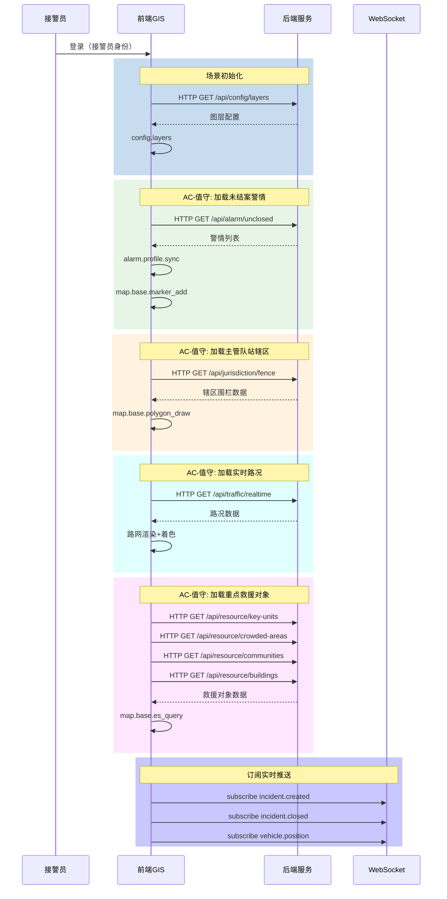
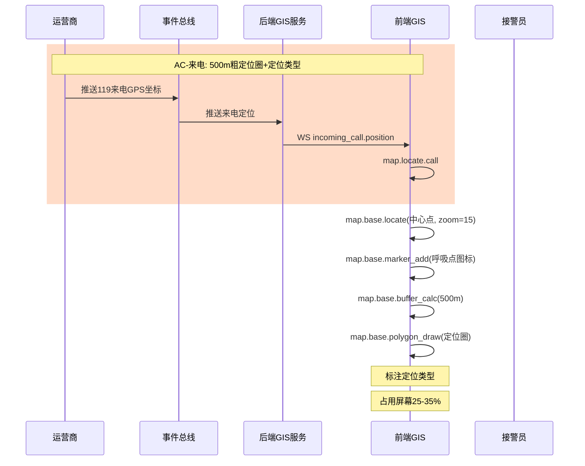
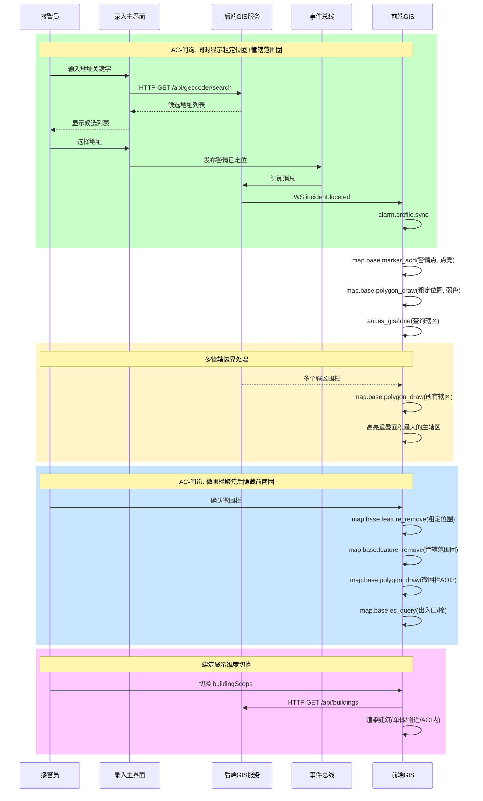
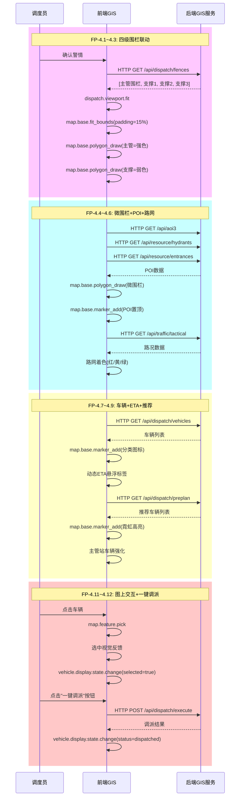
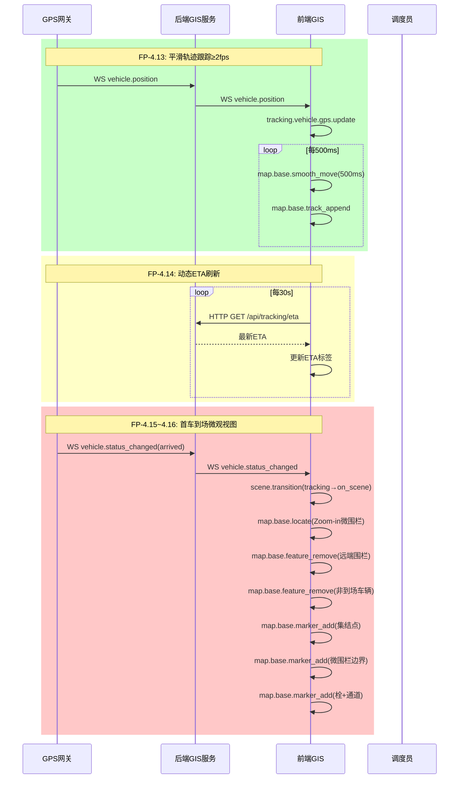

# 前后端交互故事文档

> **版本**：1.0 | **日期**：2026-07-10  
> **核心参考**：`GIS功能缝合.md`用户故事、`GIS控制.md`协议

---

## 文档目的

本文档以用户故事为驱动，将每个用户操作关联到：
1. 前端输入协议（eventType）
2. 后端接口（HTTP API / WebSocket）
3. 前端输出协议（eventType）
4. 验收标准（AC / FP编号）

---

## 一、值守阶段

### 1.1 故事：值守模式 GIS 图层展示与警情资源可视化

**角色**：消防接处警中心的值班接警员（值守模式）

**我希望**：当我以接警员身份登录，该坐席进入值守模式，展示整个城市地图【用围栏定位】

**我希望**：系统在值守模式，同时加载未结案警情、主管队站及辖区、实时路况以及重点救援对象（重点单位、人员密集场所、小区围栏、建筑）等图层，可以选择单独关闭各图层。

**以便于**：我快速掌控当下警情分布、作战力量分布、路况，可以进一步做细致查询，提升下一次接警决策速度和准确性。

### 1.2 交互时序



### 1.3 协议关联表

| 用户操作 | 前端输入协议 | 后端HTTP接口 | 后端WS推送 | 前端输出协议 | 验收标准 |
|----------|-------------|-------------|-----------|-------------|----------|
| 登录 | `config.layers` | GET /api/config/layers | - | - | AC-值守 |
| 查看未结案警情 | `alarm.profile.sync` | GET /api/alarm/unclosed | `incident.created` | `map.view.changed` | AC-值守 |
| 查看辖区围栏 | `map.base.polygon_draw` | GET /api/jurisdiction/fence | - | - | AC-值守 |
| 查看实时路况 | `map.base.es_query` | GET /api/traffic/realtime | `traffic.updated` | `map.layer.visible.change` | AC-值守 |
| 关闭图层 | `layer.set.visible` | - | - | `map.layer.visible.change` | AC-值守 |

---

## 二、来电弹屏阶段

### 2.1 故事：来电弹屏 GIS 警情图层展示

**角色**：消防接处警中心的接警员

**我希望**：在值守阶段，\(文字\)主屏有来电弹屏时，地图GIS屏上按**已获取的基站定位为中心**，绘制半径500m的圈进行展示，并合理占用屏幕空间

**我希望**：直接在一键粗定位的圈里清晰展示定位类型：基站粗定位/固话装机位置/精确地址

**以便于**：我在接听电话的第一时间快速、直观地看到报警人大致位置范围和信息来源，减少视线移动和判断负担，提升接警效率和准确性。

### 2.2 交互时序



### 2.3 协议关联表

| 用户操作 | 前端输入协议 | 后端HTTP接口 | 后端WS推送 | 前端输出协议 | 验收标准 |
|----------|-------------|-------------|-----------|-------------|----------|
| 来电接收 | `map.locate.call` | - | `incoming_call.position` | - | AC-来电 |
| 定位展示 | `map.base.locate` | - | - | - | AC-来电 |
| 绘制定位圈 | `map.base.polygon_draw` | - | - | - | AC-来电 |
| 来电挂断 | `map.locate.call.remove` | - | - | `map.view.changed` | AC-来电 |

### 2.4 数据结构

```typescript
// map.locate.call - 来电初略定位
interface LocateCallData {
  id: string;                    // 来电ID
  longitude: number;               // 经度
  latitude: number;                // 纬度
  radius: number;                  // 固定500m
  positionType: 'cell_tower' | 'landline' | 'precise';  // 定位类型
  address?: string;                // 定位地址
}
```

---

## 三、问询研判阶段

### 3.1 故事：问询记录研判 GIS 图层智能高亮与态势展示

**角色**：消防接处警中心的接警员在电话接通后

**我希望**：电话粗定位圈和警情所在的"主管队站管辖范围圈"同时展示，以便我在问询阶段就能提前预判首战出动的核心力量归属。【管辖范围圈的边界线需与粗定位圈在色彩和视觉层级上有明显区分。如果粗定位圈跨越了多个中队/大队的管辖边界，系统需同时展示相关的所有管辖范围，并可选高亮重叠面积最大的主辖区。】

**我希望**：在通过与报警人沟通、准确定位并生成具体的"微围栏圈"（如特定小区、厂区或重点单位边界）后，系统隐藏粗定位圈和管辖范围圈，以便地图界面保持清爽，让我能 100% 聚焦于核心灾情区域的研判。

**我希望**：在聚焦微围栏圈后，能够灵活控制建筑的展示维度（可选：仅展示目标单建筑、展示附近建筑、或展示AOI里的建筑），以便我快速评估人员密集度、火势蔓延风险及周边可用通道。

### 3.2 交互时序



### 3.3 协议关联表

| 用户操作 | 前端输入协议 | 后端HTTP接口 | 后端WS推送 | 前端输出协议 | 验收标准 |
|----------|-------------|-------------|-----------|-------------|----------|
| 地址解析 | `aoi.es_gisZone` | GET /api/geocoder/search | - | - | AC-问询 |
| 警情定位 | `alarm.profile.sync` | - | `incident.located` | `map.view.changed` | AC-问询 |
| 绘制管辖圈 | `aoi.es_gisZone` | GET /api/jurisdiction/fence | - | - | AC-问询 |
| 多辖区处理 | `map.base.polygon_draw` | GET /api/jurisdiction/fence | - | - | AC-问询 |
| 微围栏聚焦 | `aoi.es_query` | GET /api/aoi3 | - | - | AC-问询 |
| 建筑维度 | `map.view.load` | GET /api/buildings | - | - | AC-问询 |

### 3.4 数据结构

```typescript
// alarm.profile.sync - 警情画像同步
interface AlarmProfileSyncData {
  incidentId?: string;
  longitude?: number;
  latitude?: number;
  disaster_type?: string;
  buildingId?: string;
  buildingScope?: 'single' | 'nearby' | 'aoi';  // 建筑展示维度
}

// aoi.es_gisZone - 辖区队站围栏查询
interface AoiEsGisZoneData {
  zoneId: string;
  isPrimary?: boolean;  // 是否主管队站
}
```

---

## 四、调派阶段

### 4.1 故事：力量编队与辖区全景可视（围栏自适应）

**角色**：消防接处警中心调度员

**我希望**：问询确定警情类型和救援对象（建筑or构建）后，图上完整展示主管队站围栏及最近三个队站围栏,颜色区分突出主管队站及车辆，将4个围栏完整显示，适当留边。

**验收标准**：
- **FP-4.1** 四级围栏自动联动加载
- **FP-4.2** 围栏颜色差异化突出
- **FP-4.3** 地图视野自动适配（Auto-Fit + 10-15%留边）

### 4.2 故事：现场微观要素与路网高亮

**我希望**：展示灾害建筑所在微围栏（AOI3）及出入口、围栏内的消防栓。

**我希望**：能突出主路及相应支路路网。

**验收标准**：
- **FP-4.4** 灾害点微围栏（AOI3）精细化叠加
- **FP-4.5** 出入口与消防栓POI置顶渲染
- **FP-4.6** 战术路网高亮与路况可视

### 4.3 故事：待调派资源状态与预案车辆智能推荐

**我希望**：各个队站可用车辆上图展示车辆类型及eta，突出主管队站车辆。

**我希望**：加载预案调派车辆，突出颜色（研判/预案推荐的车辆）。

**验收标准**：
- **FP-4.7** 车辆分类图标与动态ETA悬浮
- **FP-4.8** 预案/研判推荐车辆高亮
- **FP-4.9** 主管队站车辆视觉强化

### 4.4 故事：图上交互式编队与一键下发指令

**我希望**：可以在图上，点击车辆调派和取消调派。

**我希望**：可以在图上按一键调派按钮，下发选中车辆的调派单到相应队站。

**验收标准**：
- **FP-4.11** 图上点选交互式调派/取消
- **FP-4.12** 一键调派与指令下发

### 4.5 交互时序



### 4.6 协议关联表

| 用户操作 | 前端输入协议 | 后端HTTP接口 | 后端WS推送 | 前端输出协议 | 验收标准 |
|----------|-------------|-------------|-----------|-------------|----------|
| 四级围栏 | `dispatch.viewport.fit` | GET /api/dispatch/fences | - | - | FP-4.1 |
| 围栏样式 | `map.base.polygon_draw` | - | - | - | FP-4.2 |
| Auto-Fit | `map.base.fit_bounds` | - | - | - | FP-4.3 |
| 微围栏 | `dispatch.viewport.fit` | GET /api/aoi3 | - | - | FP-4.4 |
| POI置顶 | `map.base.marker_add` | GET /api/resource/hydrants,entrances | - | - | FP-4.5 |
| 路网高亮 | `dispatch.route.plan` | GET /api/traffic/tactical | `traffic.updated` | - | FP-4.6 |
| 车辆+ETA | `dispatch.station.eta.filter` | GET /api/dispatch/vehicles | - | - | FP-4.7 |
| 预案推荐 | `map.base.marker_add` | GET /api/dispatch/preplan | - | - | FP-4.8 |
| 主管强化 | `map.base.marker_add` | - | - | - | FP-4.9 |
| 点选车辆 | `map.feature.pick` | - | - | `vehicle.display.state.change` | FP-4.11 |
| 一键调派 | `dispatch.route.toggle` | POST /api/dispatch/execute | - | `vehicle.display.state.change` | FP-4.12 |

---

## 五、跟踪阶段

### 5.1 故事：途中动态跟踪与到场作战阶段转换

**角色**：消防接处警中心调度员

**我希望**：能实时跟踪车辆及eta。

**我希望**：首车到场后展示微围栏、集结点、消防栓、出入口。

**验收标准**：
- **FP-4.13** 实时平滑轨迹跟踪（≥2秒/次）
- **FP-4.14** 动态ETA实时刷新
- **FP-4.15** 首车到场自动触发微观视图
- **FP-4.16** 微观作战视图要素重塑

### 5.2 交互时序



### 5.3 协议关联表

| 用户操作 | 前端输入协议 | 后端HTTP接口 | 后端WS推送 | 前端输出协议 | 验收标准 |
|----------|-------------|-------------|-----------|-------------|----------|
| 轨迹跟踪 | `tracking.vehicle.gps.update` | - | `vehicle.position` | `map.view.changed` | FP-4.13 |
| 平滑动画 | `map.base.smooth_move` | - | - | - | FP-4.13 |
| ETA刷新 | `tracking.vehicle.route.realtime` | GET /api/tracking/eta | - | - | FP-4.14 |
| 首车到场 | `scene.transition` | - | `vehicle.status_changed` | - | FP-4.15 |
| 微观视图 | `map.base.locate` | - | - | - | FP-4.16 |
| 战场要素 | `map.base.marker_add` | GET /api/resource/assembly,etc | - | - | FP-4.16 |

---

## 六、附录

### 6.1 协议前缀说明

| 前缀 | 类型 | 说明 |
|------|------|------|
| `map.base.*` | 通用控制 | 地图原子能力 |
| `config.*` | 配置控制 | 系统配置 |
| `alarm.*` | 警情控制 | 警情相关 |
| `layer.*` | 视图控制 | 图层与视图 |
| `aoi.*` | 问询控制 | AOI/围栏相关 |
| `dispatch.*` | 调派控制 | 调度相关 |
| `tracking.*` | 跟踪控制 | 跟踪相关 |
| `scene.*` | 场景控制 | 场景切换 |

### 6.2 HTTP API 清单

| 接口 | 方法 | 用途 | 验收标准 |
|-----|------|------|----------|
| /api/config/layers | GET | 图层配置 | AC-值守 |
| /api/alarm/unclosed | GET | 未结案警情 | AC-值守 |
| /api/jurisdiction/fence | GET | 辖区围栏 | AC-问询 |
| /api/traffic/realtime | GET | 实时路况 | AC-值守 |
| /api/traffic/tactical | GET | 战术路网 | FP-4.6 |
| /api/geocoder/search | GET | 地址解析 | AC-问询 |
| /api/aoi3 | GET | 微围栏 | FP-4.4 |
| /api/resource/* | GET | 资源POI | FP-4.5 |
| /api/dispatch/fences | GET | 四级围栏 | FP-4.1 |
| /api/dispatch/vehicles | GET | 可用车辆 | FP-4.7 |
| /api/dispatch/preplan | GET | 预案推荐 | FP-4.8 |
| /api/dispatch/execute | POST | 调派下发 | FP-4.12 |
| /api/tracking/eta | GET | ETA重算 | FP-4.14 |

### 6.3 WebSocket 推送清单

| 推送类型 | 数据 | 触发源 | 消费方 | 验收标准 |
|----------|------|--------|--------|----------|
| `incoming_call.position` | 粗定位坐标+类型 | 运营商 | `map.locate.call` | AC-来电 |
| `incident.located` | 警情已定位 | 录入主界面 | `alarm.profile.sync` | AC-问询 |
| `vehicle.position` | 车辆GPS | GPS网关 | `tracking.vehicle.gps.update` | FP-4.13 |
| `vehicle.status_changed` | 车辆状态 | GPS网关 | `scene.transition` | FP-4.15 |
| `traffic.updated` | 路况更新 | 交通系统 | 路网着色 | FP-4.6 |

### 6.4 验收标准索引

| 编号 | 说明 | 关联协议 |
|------|------|----------|
| AC-值守 | 城市地图+多图层+可单独关闭 | `config.layers`, `alarm.profile.sync` |
| AC-来电 | 500m粗定位圈+定位类型 | `map.locate.call` |
| AC-问询 | 粗定位圈+管辖圈+微围栏聚焦 | `aoi.es_gisZone`, `alarm.profile.sync` |
| FP-4.1 | 四级围栏联动 | `dispatch.viewport.fit` |
| FP-4.2 | 围栏颜色差异化 | `map.base.polygon_draw` |
| FP-4.3 | Auto-Fit+10-15%留边 | `map.base.fit_bounds` |
| FP-4.4 | 微围栏(AOI3)叠加 | `dispatch.viewport.fit` |
| FP-4.5 | 出入口/栓POI置顶 | `map.base.marker_add` |
| FP-4.6 | 战术路网高亮+路况着色 | `dispatch.route.plan` |
| FP-4.7 | 车辆分类+ETA | `dispatch.station.eta.filter` |
| FP-4.8 | 预案推荐霓虹高亮 | `map.base.marker_add` |
| FP-4.9 | 主管站车辆强化 | `map.base.marker_add` |
| FP-4.11 | 图上点选调派 | `map.feature.pick` |
| FP-4.12 | 一键调派下发 | `dispatch.route.toggle` |
| FP-4.13 | 平滑轨迹≥2fps | `tracking.vehicle.gps.update` |
| FP-4.14 | 动态ETA刷新 | `tracking.vehicle.route.realtime` |
| FP-4.15 | 首车到场微观视图 | `scene.transition` |
| FP-4.16 | 微观作战视图 | `map.base.locate` |

---

**版本记录**：1.0 (2026-07-10) 初始版本
