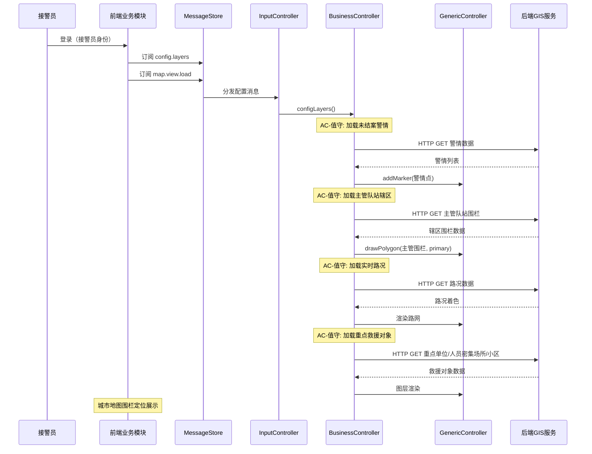
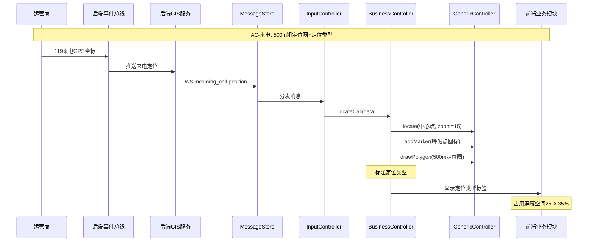
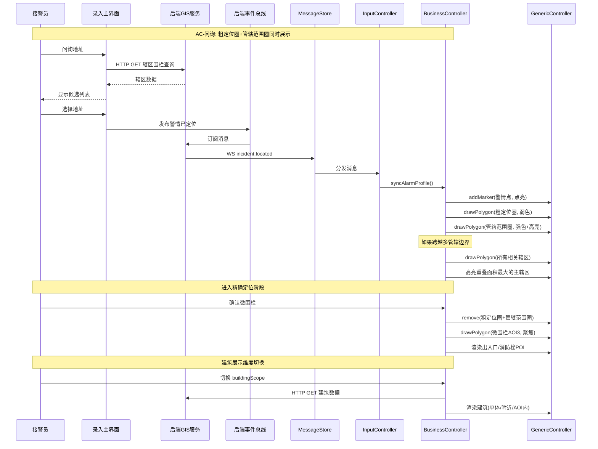
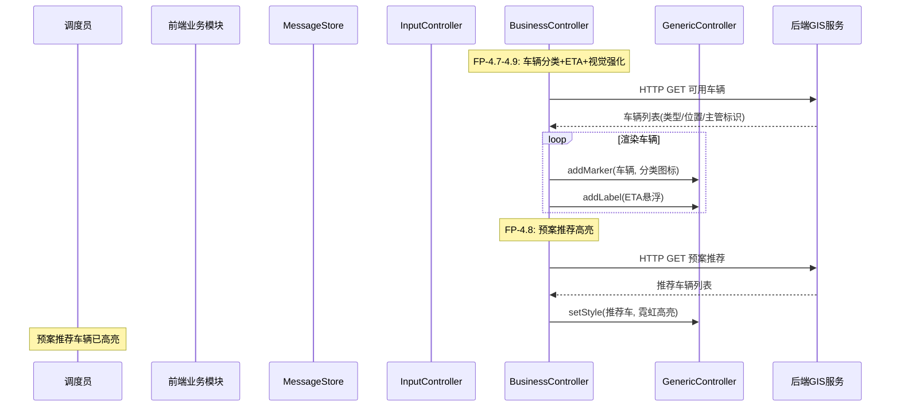
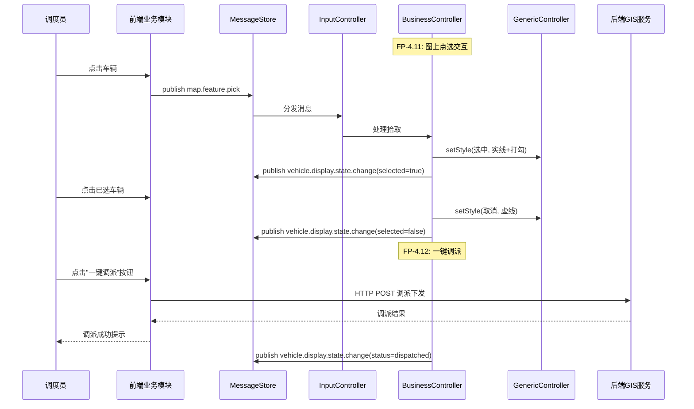
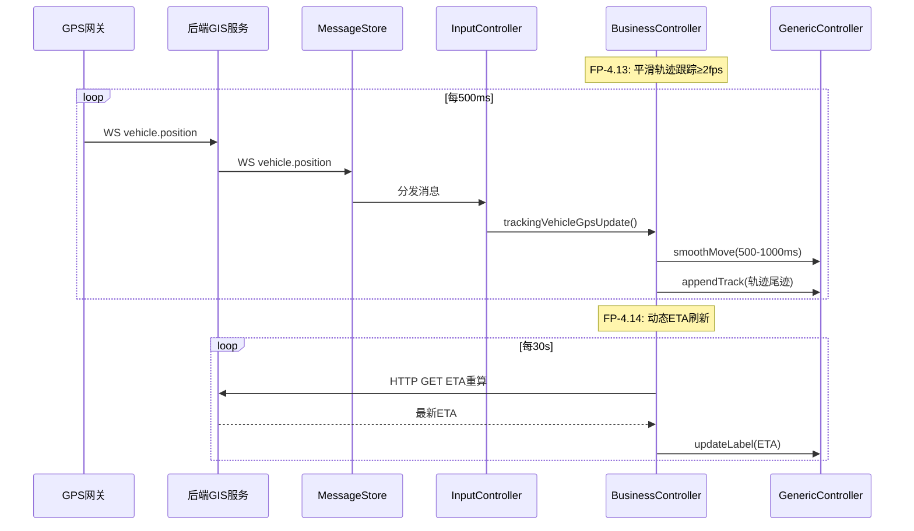
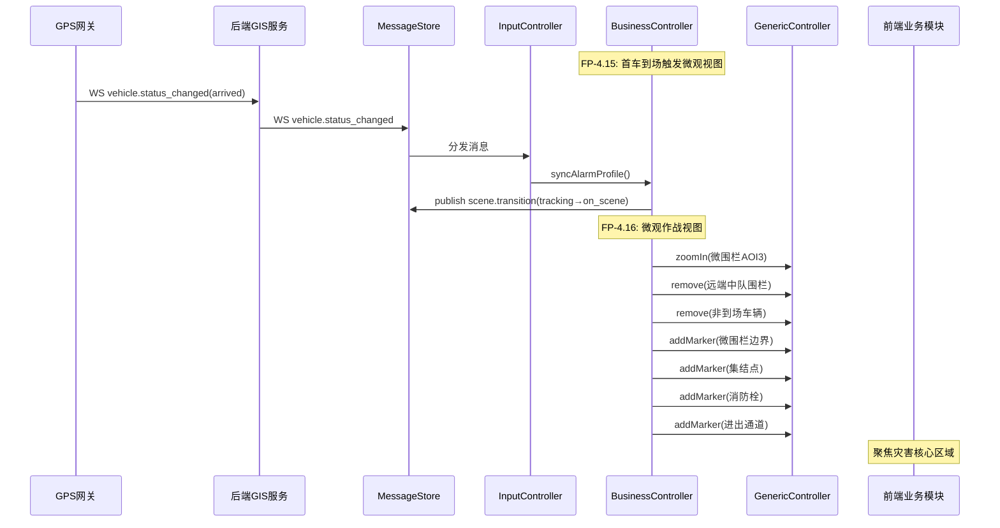

# 前端后端交互时序图

> **版本**：1.1 | **日期**：2026-07-10
> **核心参考**：`GIS功能缝合.md`用户故事

---

## 一、交互模型概述

### 1.1 通信方式

| 方式 | 用途 | 特点 |
|------|------|------|
| HTTP API | 初始化数据、主动查询 | 请求-响应模式 |
| WebSocket | 实时推送、状态变更 | 推送模式 |

### 1.2 参与者

| 参与者 | 说明 |
|--------|------|
| 前端业务模块 | 接警端、调度端、值守端 |
| MessageStore | 前端消息中枢 |
| InputController | 输入控制层 |
| BusinessController | 业务控制层 |
| GenericController | 通用控制层 |
| 后端 GIS 服务 | HTTP API + WebSocket |
| 后端事件总线 | 消息中间件 |

---

## 二、场景时序图（按用户故事）

### 2.1 值守阶段

### 2.2 来电弹屏

### 2.3 问询研判

### 2.4 调派初始化（四级围栏联动）

```mermaid
sequenceDiagram
    participant User as 调度员
    participant UI as 前端业务模块
    participant MS as MessageStore
    participant IC as InputController
    participant BC as BusinessController
    participant GC as GenericController
    participant GIS as 后端GIS服务

    Note over BC: FP-4.1-4.3: 四级围栏联动+Auto-Fit
    User->>UI: 确认警情
    UI->>MS: publish alarm.profile.sync
    MS->>IC: 分发消息
    IC->>BC: syncAlarmProfile()
    
    BC->>GIS: HTTP GET 四级围栏数据
    GIS-->>BC: [主管围栏, 支撑1, 支撑2, 支撑3]
    
    BC->>GC: fitBounds(所有围栏, padding=15%)
    
    loop 绘制围栏
        BC->>GC: drawPolygon(主管围栏, primary强色)
        BC->>GC: drawPolygon(支撑围栏, secondary弱色)
    end
    
    Note over BC: FP-4.4: 微围栏精细叠加
    BC->>GC: drawPolygon(微围栏AOI3)
    
    Note over BC: FP-4.5: 出入口/栓POI置顶
    BC->>GIS: HTTP GET 出入口/栓
    BC->>GC: addMarker(POI置顶)
    
    Note over BC: FP-4.6: 战术路网高亮
    BC->>GIS: HTTP GET 路况数据
    BC->>GC: 渲染路网(红/黄/绿着色)
```

### 2.5 调派-车辆与ETA

### 2.6 调派-图上交互

### 2.7 跟踪-实时轨迹

### 2.8 到场-微观视图

---

## 三、WebSocket 推送清单

| 推送类型 | 数据 | 触发条件 | 消费方 | 验收标准 |
|----------|------|---------|--------|----------|
| `incoming_call.position` | 粗定位坐标+类型 | 运营商推送 | `map.locate.call` | AC-来电 |
| `incident.located` | 警情已定位 | 录入确认 | `alarm.profile.sync` | AC-问询 |
| `vehicle.position` | 车辆GPS | 每500ms | `tracking.vehicle.gps.update` | FP-4.13 |
| `vehicle.status_changed` | 车辆状态 | 状态变更 | `scene.transition` | FP-4.15 |
| `incident.created` | 新警情 | 警情产生 | UI组件 | AC-值守 |
| `incident.closed` | 警情关闭 | 警情关闭 | UI组件 | AC-值守 |

---

## 四、HTTP API 清单

| API | 方法 | 用途 | 验收标准 |
|-----|------|------|----------|
| 警情查询 | GET | 加载未结案警情 | AC-值守 |
| 管辖围栏 | GET | 四级围栏数据 | FP-4.1-4.3 |
| 微围栏 | GET | AOI3数据 | FP-4.4 |
| 出入口/栓 | GET | POI数据 | FP-4.5 |
| 路况数据 | GET | 路网着色 | FP-4.6 |
| 可用车辆 | GET | 车辆列表 | FP-4.7-4.9 |
| 预案推荐 | GET | 推荐编队 | FP-4.8 |
| 路径规划 | POST | 路线计算 | FP-4.6 |
| 调派下发 | POST | 执行调派 | FP-4.12 |
| ETA重算 | GET | 路径重算 | FP-4.14 |

---

**版本记录**：
- 1.0 (2026-07-10) 初始版本
- 1.1 (2026-07-10) 按用户故事优化，标注验收标准
