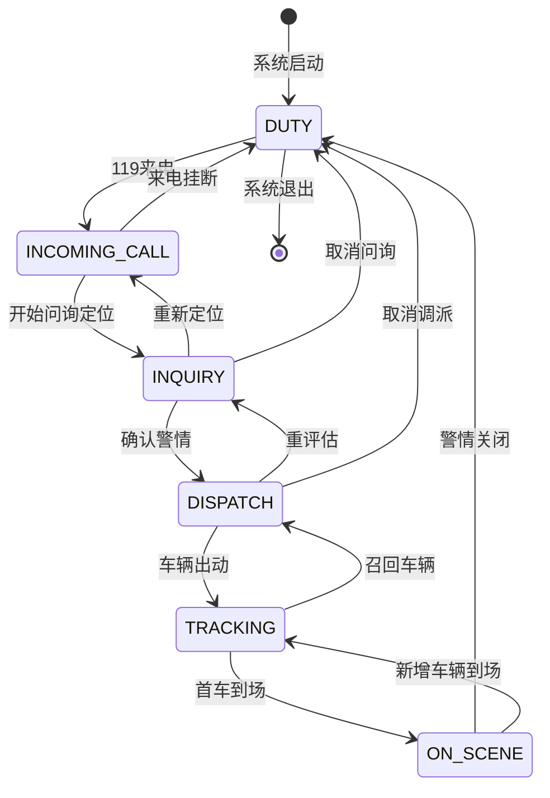

# 场景状态机定义

> **版本**：1.0 | **日期**：2026-07-10

***

## 一、场景枚举定义

```typescript
/** 场景枚举 */
export enum SceneType {
  /** 值守总览 */
  DUTY = 'duty',

  /** 来电弹屏 */
  INCOMING_CALL = 'incoming_call',

  /** 问询研判 */
  INQUIRY = 'inquiry',

  /** 图上调派 */
  DISPATCH = 'dispatch',

  /** 途中跟踪 */
  TRACKING = 'tracking',

  /** 到场作战 */
  ON_SCENE = 'on_scene'
}
```

***

## 二、场景定义表

| 场景 | 枚举值             | 触发条件  | 退出条件 | 核心图层            |
| -- | --------------- | ----- | ---- | --------------- |
| 值守 | `duty`          | 登录进入  | 来电进入 | 未结案警情、辖区围栏、资源分布 |
| 来电 | `incoming_call` | 119来电 | 定位完成 | 粗定位圈            |
| 问询 | `inquiry`       | 通话定位  | 确认警情 | 粗定位圈→微围栏        |
| 调派 | `dispatch`      | 确认警情  | 车辆出动 | 围栏、车辆、路径        |
| 跟踪 | `tracking`      | 车辆出动  | 首车到场 | 轨迹、实时ETA        |
| 到场 | `on_scene`      | 首车到场  | 警情关闭 | 微观要素            |

***

## 三、状态流转图



***

## 四、场景切换矩阵

| 从\到                | duty | incoming\_call | inquiry | dispatch | tracking | on\_scene |
| ------------------ | ---- | -------------- | ------- | -------- | -------- | --------- |
| **duty**           | -    | 来电             | -       | -        | -        | -         |
| **incoming\_call** | 挂断   | -              | 定位      | -        | -        | -         |
| **inquiry**        | 取消   | 重新定位           | -       | 确认       | -        | -         |
| **dispatch**       | 取消   | -              | 重评估     | -        | 出动       | -         |
| **tracking**       | 召回   | -              | -       | 取消       | -        | 到场        |
| **on\_scene**      | 关闭   | -              | -       | -        | 新增       | -         |

***

## 五、场景切换行为定义

### 5.1 duty → incoming\_call

**触发**：119 来电

**前置条件**：无

**切换动作**：

1. 发布 `SceneTransition(duty → incoming_call)`
2. 隐藏值守图层（警情、资源）
3. 显示来电图层（粗定位圈）
4. 不改变视口位置

**返回动作**：

1. 发布 `SceneTransition(incoming_call → duty)`
2. 卸载来电图层
3. 恢复值守图层
4. 适配城市全景视口

### 5.2 incoming\_call → inquiry

**触发**：开始问询定位

**前置条件**：已有来电定位数据

**切换动作**：

1. 发布 `SceneTransition(incoming_call → inquiry)`
2. 保持粗定位圈
3. 查询并加载管辖围栏
4. 可选：查询周边资源预览

**返回动作**：

1. 发布 `SceneTransition(inquiry → incoming_call)`
2. 卸载管辖围栏
3. 恢复来电弹屏状态

### 5.3 inquiry → dispatch

**触发**：确认警情

**前置条件**：已有警情定位数据

**切换动作**：

1. 发布 `SceneTransition(inquiry → dispatch)`
2. 隐藏粗定位圈
3. 查询并加载四级围栏（主管站+3支撑站）
4. 适配围栏视口
5. 加载车辆标记
6. 可选：加载路径规划

**返回动作**：

1. 发布 `SceneTransition(dispatch → inquiry)`
2. 卸载四级围栏
3. 卸载车辆标记
4. 恢复问询图层

### 5.4 dispatch → tracking

**触发**：车辆出动

**前置条件**：已完成调派

**切换动作**：

1. 发布 `SceneTransition(dispatch → tracking)`
2. 开始订阅车辆 GPS
3. 加载轨迹图层
4. 开启平滑移动动画
5. 启动 ETA 定时刷新

**返回动作**：

1. 发布 `SceneTransition(tracking → dispatch)`
2. 停止 GPS 订阅
3. 停止动画
4. 恢复调派视图

### 5.5 tracking → on\_scene

**触发**：首车到场

**前置条件**：收到 `vehicle.status_changed(arrived)`

**切换动作**：

1. 发布 `SceneTransition(tracking → on_scene)`
2. 停止到场车辆的 GPS 订阅
3. 移除远端中队围栏
4. 卸载非到场车辆
5. 加载微观要素（AOI3、集结点、消火栓、出入口）

**返回动作**：

1. 发布 `SceneTransition(on_scene → tracking)`
2. 卸载微观要素
3. 恢复跟踪视图

***

## 六、图层生命周期管理

### 6.1 图层分类

| 图层类型 | 示例         | 生命周期     |
| ---- | ---------- | -------- |
| 底图层  | 矢量底图、影像底图  | 常驻       |
| 值守层  | 未结案警情、辖区围栏 | 值守场景     |
| 来电层  | 粗定位圈       | 来电场景     |
| 围栏层  | 管辖围栏、微围栏   | 来电、问询、调派 |
| 车辆层  | 车辆标记       | 调派、跟踪    |
| 路径层  | route线     | 调派、跟踪    |
| 轨迹层  | 历史轨迹       | 跟踪       |
| 微观层  | BIM、建筑白模   | 到场       |

### 6.2 场景图层映射

| 场景                 | 启用图层           | 禁用图层                |
| ------------------ | -------------- | ------------------- |
| **duty**           | 底图、值守层         | 来电层、围栏层、车辆层、路径层     |
| **incoming\_call** | 底图、来电层         | 值守层、车辆层、路径层         |
| **inquiry**        | 底图、围栏层         | 值守层、车辆层、路径层         |
| **dispatch**       | 底图、围栏层、车辆层、路径层 | 来电层、轨迹层、微观层         |
| **tracking**       | 底图、车辆层、路径层、轨迹层 | 来电层、围栏层（部分）         |
| **on\_scene**      | 底图、微观层         | 围栏层（部分）、车辆层（部分）、路径层 |

***

## 七、事件订阅规则

### 7.1 场景切换事件

```typescript
interface SceneTransitionEvent {
  from: SceneType;
  to: SceneType;
  reason?: string;
  timestamp: number;
}
```

### 7.2 订阅拓扑

| 事件                       | SceneManager | CallController | DispatchController | TrackingController |
| ------------------------ | ------------ | -------------- | ------------------ | ------------------ |
| `SceneTransition`        | 消费           | 消费             | 消费                 | 消费                 |
| `vehicle.status_changed` | 消费           | -              | -                  | 消费                 |
| `incoming_call.position` | -            | 消费             | -                  | -                  |
| `alarm.profile.sync`     | 消费           | -              | 消费                 | 消费                 |

***

## 八、状态持久化

### 8.1 场景状态

```typescript
interface SceneState {
  current: SceneType;
  previous: SceneType;
  history: SceneType[];
  context: {
    incidentId?: string;
    callId?: string;
    vehicleIds?: string[];
  };
}
```

### 8.2 状态恢复

当系统异常重启时，根据 `context` 中的上下文信息恢复到最后一次场景状态。

***

**版本记录**：1.0 (2026-07-10) 初始版本
