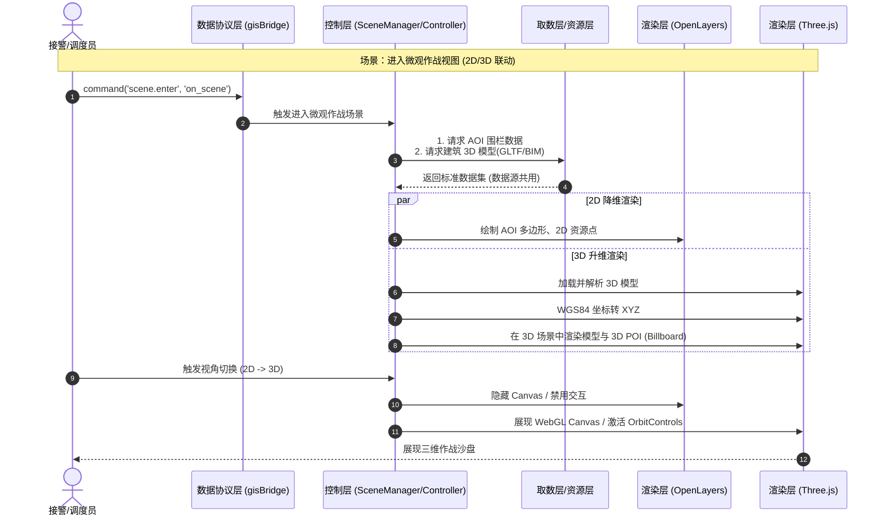

# GIS 三维模型 (Three.js/BIM) 架构设计方案

**版本**：v1.0  
**定位**：基于现有 GIS 前端分层架构，扩展 Three.js 三维渲染能力，实现二维与三维（2.5D/3D）场景的无缝切换与数据复用。

---

## 一、 设计目标与核心理念

随着消防接处警业务向“微观作战”延伸，单体建筑的内部结构（BIM）、重点单位的 3D 白膜展示成为刚需。三维架构设计遵循以下原则：

1. **数据源共用**：三维场景使用与二维场景完全一致的业务数据（警情、车辆、消火栓、出入口等），仅在渲染层做降维/升维转换。
2. **协议复用**：复用现有的数据协议层（`gisBridge`），主前端的指令（如 `alarm.location.update`）可同时驱动 2D 和 3D 视图更新。
3. **引擎解耦**：将 Three.js 封装在 `@gis/basic` 中，与 OpenLayers 形成对等的渲染实现，通过控制器（Controller）统一调度。

---

## 二、 架构分层扩展 (适配三维)

在现有的五大核心分类模型基础上，扩展三维能力：

### 1. 基础类扩展 (`@gis/basic`)
新增 `threejs-adapter`，作为与 `openlayers-adapter` 对等的渲染底座。
- **ThreeJS 核心封装**：管理 WebGLRenderer、Scene、Camera、Lighting 的生命周期。
- **2D/3D 坐标转换引擎**：实现地理坐标（WGS84）与 Three.js 世界坐标（XYZ）的精准映射。
- **视图切换器**：负责在同一个 DOM 容器中平滑切换 2D (OpenLayers) 和 3D (Three.js) 视图。

### 2. 资源类扩展 (`@gis/resource`)
在原有 GeoServer 和高德服务基础上，增加三维模型资源管理：
- **模型加载器**：支持 GLTF/GLB、OBJ、FBX 以及 BIM 专用的 IFC 数据格式加载。
- **城市白膜服务**：对接后端三维瓦片（3D Tiles）服务，加载大范围城市建筑白膜。
- **材质与纹理库**：统一管理高亮发光、半透明扫描、火焰粒子等特效材质。

### 3. 工具与计算层扩展 (`@gis/tools`)
- **三维空间计算**：实现 3D 射线拾取（Raycaster）、模型碰撞检测、楼层剖面计算。
- **三维交互工具**：扩展 3D 视角的旋转（OrbitControls）、漫游飞行（FlyControls）以及楼层展开/合并交互。

---

## 三、 三维业务场景实现 (基于现有业务类)

三维渲染主要服务于“问询研判”与“到场作战”的微观视图阶段：

### 场景一：单体建筑微观剖析（BIM）
- **触发时机**：问询阶段精确定位到特定重点单位，或首车到场切换为 `on_scene` 场景。
- **展现形式**：
  - 自动从 2D 顶视图平滑过渡到 2.5D/3D 鸟瞰图。
  - 加载目标建筑的精细 3D 模型或 BIM 模型。
  - **数据复用**：将原二维的警情点、被困人员位置，转换为 3D 坐标，悬浮在着火楼层对应位置。

### 场景二：城市大范围白膜辅助
- **触发时机**：无精细 BIM 数据时，基于地址坐标与外部输入的楼层数。
- **展现形式**：
  - 加载城市级基础白膜。
  - 根据输入的楼层数，在目标坐标“长出”对应高度的 3D 白膜块，并对其进行红色高亮警示。
  - **数据复用**：周边的微站、消火栓等资源以 3D POI（如立体气泡或 Billboard）的形式悬浮于地表。

---

## 四、 核心协作流程与时序图

以下流程展示了主前端下发指令后，控制层如何同时调度二维与三维渲染引擎：

---

## 五、 三维扩展的核心技术挑战与解决策略

1. **坐标系对齐难题**：
   - **策略**：在 `@gis/basic` 建立统一的“地理坐标中心系”。以当前 AOI 中心点为 Three.js 的 `(0,0,0)` 坐标原点，所有外部传入的经纬度均先计算相对该原点的偏移量（米），再转换为 3D 坐标，避免 WebGL 浮点数精度丢失问题。
2. **性能与内存管理**：
   - **策略**：3D 模型非常消耗显存。必须在 SceneManager 中实现严格的生命周期管理。退出 `on_scene` 场景时，强制调用 Three.js 的 `geometry.dispose()` 和 `material.dispose()`，并清除纹理缓存。
3. **2D/3D 事件同步**：
   - **策略**：无论是 2D 的 Map Click 还是 3D 的 Raycaster 拾取，均由各自的适配器捕获后，统一转化为带有业务 ID 的领域事件（如 `domain.resource.clicked`），交由 `gisBridge` 抛出，确保主前端感知的一致性。