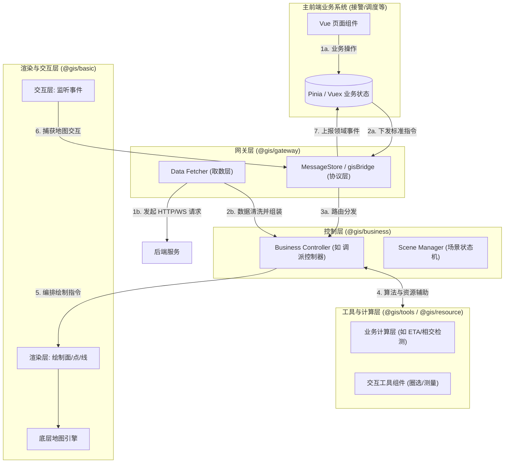
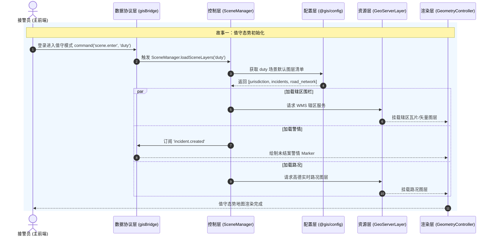
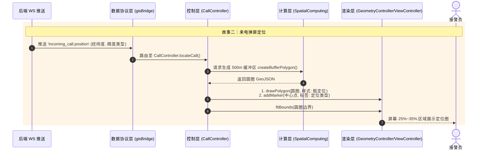
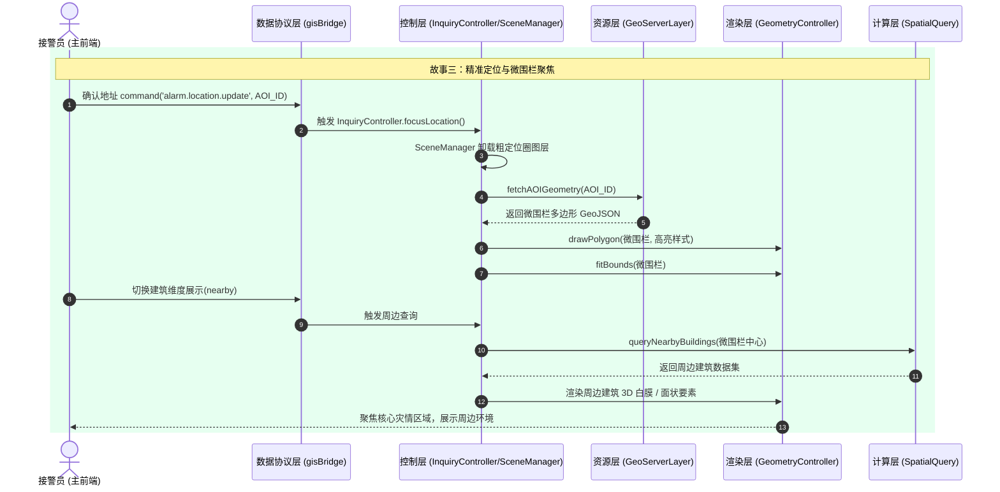
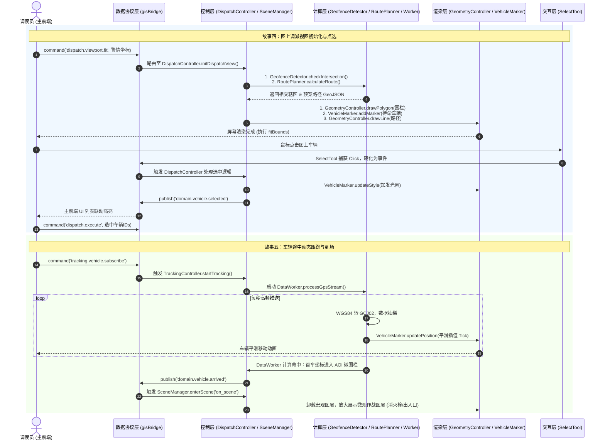

# GIS 前端分层架构与复用设计方案 (面向 Monorepo)

**版本**：v1.0  
**定位**：指导多项目环境下的 GIS 前端工程化、模块化拆分及代码复用规范。  
**核心思想**：基于现有架构（DDD + 协议驱动）进行深度解耦，支持类似 Monorepo 的包管理与功能复用机制。

---

## 一、 逻辑架构五层设计

为实现系统的高内聚低耦合，确保各层级关注点分离，GIS 整体逻辑在深度上划分为以下五层：

### 1. 渲染层 (Render Layer)
**职责**：负责最终的可视化呈现与底层地图引擎的生命周期管理。
- **引擎挂载**：OpenLayers 的 `Map`、`View` 实例化，ThreeJS / BIM 场景初始化。
- **图元绘制**：点（Marker）、线（Route）、面（Polygon/Circle）、热力图、白膜等基础几何体与样式的实际渲染逻辑。
- **图层管理**：瓦片层（Tile）、矢量层（Vector）的挂载与卸载。
- **约束**：绝对无状态，没有任何业务逻辑，只认标准的数据格式（如 GeoJSON）。

### 2. 交互层 (Interaction Layer)
**职责**：负责捕获用户在地图上的原生操作，转化为标准事件抛出。
- **基础交互**：地图平移（Pan）、缩放（Zoom）、旋转（Rotate）。
- **工具交互**：距离测量、面积测量、鼠标悬浮高亮（Hover）、要素点击（Click）。
- **空间拾取**：拉框查询、多边形圈选、坐标拾取。
- **约束**：只负责将 DOM/Canvas 事件转化为带有地理坐标的标准空间事件。

### 3. 控制层 (Control Layer)
**职责**：核心指挥中枢，承上启下，组合底层能力实现具体场景。
- **状态同步**：监听数据协议层下发的指令（Command），驱动渲染层更新。
- **流程编排**：现有的 `GenericController` 与 `BusinessController`，调度各模块协同工作。
- **生命周期**：管理场景状态机（SceneManager），控制特定业务节点下的图层组启用与禁用。

### 4. 取数层 (Data Fetching Layer) 【可选演进方案】
**职责**：如果业务不再完全依赖“数据协议层”的主前端下发，而是允许 GIS 侧自主发起数据请求，则引入此层作为 GIS 内部的统一数据泵。
- **数据采集**：负责直接通过 HTTP/WebSocket 向后端或第三方发起原始数据请求（如定时拉取未结案警情、轮询车辆状态）。
- **数据清洗**：对原始 API 数据进行脱敏、字段映射与格式清洗，转化为 GIS 渲染所需的标准结构（如转换为统一的 Feature 集合）。
- **状态缓存**：在 GIS 内部维护一套轻量的状态缓存树，避免频繁的冗余请求。
- **定位**：它是控制层的上游数据源。引入取数层后，数据流向由原来的“主前端推”转变为“GIS 侧主动拉”。

### 5. 数据协议层 (Protocol Layer)
**职责**：系统的通信总线与接口契约，实现主前端与 GIS 核心的解耦。
- **通信中枢**：`MessageStore` 统一事件总线（Event Bus）或 `gisBridge`。
- **契约定义**：统一下发指令（如 `scene.enter`、`alarm.location.update`）与上行领域事件（如 `domain.vehicle.selected`）的 TS 类型。
- **数据适配**：处理主前端业务模型（如 AlarmAggregate）向 GIS 渲染所需数据格式的映射转换。

### 6. （业务）计算层 (Compute Layer)
**职责**：独立于渲染之外的纯数据、空间逻辑、复杂算法以及大规模数据的采集与清洗。
为了应对日益复杂的 GIS 业务计算场景，本层进一步细分为以下子模块：
- **空间计算引擎 (Spatial Computing)**：处理纯几何与拓扑计算。如几何相交检测（判断定位圈是否跨管辖围栏）、缓冲区生成与聚合（Buffer）、重叠面积计算、空间聚类分析。
- **业务推算引擎 (Business Inference)**：结合业务规则的动态推演。如车辆 ETA 动态重算、路径规划导航算法、基于路况的通行时间预估、首车到场时间判定。
- **数据采集与清洗 (Data Collection & Pipeline)**：负责高频异构数据的摄入与标准化。包括 GPS/北斗高频轨迹流的接入、坐标系转换纠偏（WGS84 ↔ GCJ02）、海量点位数据的抽稀与平滑插值（Tick）、以及大批量业务数据的内存态构建。
- **约束**：本层代码必须是纯函数或通过独立 Web Worker 运行，严禁直接操作任何地图 DOM/Canvas 实例，以确保计算密集型任务不阻塞主线程渲染。

---

## 二、 Monorepo 模块分类设计（横向复用）

为了在接警、调度、值守、移动等多端项目中实现最大化功能复用，我们将组件和代码按照职责横向切分为 **5 大类 Package**，对应 Monorepo 中的独立工作区：

### 1. 基础类 (`@gis/basic`)
**定位**：底座支撑，与具体业务无关，提供最原生的 GIS 环境。
- **内容包**：
  - `openlayers-adapter`：OpenLayers 引擎初始化与适配器。
  - `threejs-adapter`：ThreeJS 或 BIM 白膜加载引擎。
  - `gis-container`：通用地图 DOM 挂载组件与 Resize 监听。
- **复用场景**：任何需要加载地图的页面（即使是后台配置页）都可以直接引入。

### 2. 资源类 (`@gis/resource`)
**定位**：多平台地图底图管理、空间数据源、外部服务对接与图层服务的配置管理。
- **内容包**：
  - `map-providers`：多平台底图资源管理（高德、超图、天地图、ArcGIS等底图瓦片的无缝切换与统一调度）。
  - `geoserver-layers`：辖区、重点单位、消防栓等 WMS/WFS 视图资源图层加载。
  - `amap-service`：高德开放平台服务（如地址解析：正/逆地理编码）。
  - `third-party-api`：天气预报图层、实时路况拥堵图层等第三方数据源。
- **复用场景**：多平台底图切换需求，以及多个项目均需要加载城市基础要素与路况的场景。

### 3. 配置类 (`@gis/config`)
**定位**：统一管理系统的常量、默认状态、视觉规范以及 UI 控件的可见性与布局配置。
- **内容包**：
  - `map-defaults`：默认城市中心点（Center）、初始缩放级别（Zoom）、坐标系定义（WGS84）。
  - `theme-style`：通用图元样式表（如：主管围栏的红色高亮规范、各类消防车图标 URL）。
  - `layer-strategies`：不同场景（值守/调派）下默认需开启的图层清单。
  - `ui-layout-config`：工具栏（Toolbar）、各类面板（如：图层控制面板、图上选车面板、动态 ETA 面板、测量结果面板）的显示/隐藏规则、停靠位置及默认状态配置。
- **复用场景**：确保多端项目的视觉风格、操作习惯以及 UI 布局 100% 统一，支持根据不同端（如大屏端、移动端）加载不同的 UI 配置策略。

### 4. 工具类 (`@gis/tools`)
**定位**：独立的可插拔交互控件与操作面板。
- **内容包**：
  - `draw-tools`：绘图工具集（标绘点、画线、画面）。
  - `measure-tools`：测距、测面工具。
  - `select-tools`：框选、圆形圈选、点选工具及删除操作。
  - `view-tools`：缩放控件（ZoomIn/Out）、指南针、回到中心点按钮。
- **复用场景**：研判阶段的圈选查询、现场作战的标绘工具箱。

### 5. 业务类 (`@gis/business`)
**定位**：基于前 4 类能力，组合出贴合“消防接处警”特定流程的领域组件。
- **内容包**：
  - `duty-overview`：值守业务（全局警情聚合上图、辖区态势监控）。
  - `call-locate`：来电业务（500m 粗定位圈渲染、定位类型标注）。
  - `dispatch-workflow`：调派业务（四级围栏联动 Auto-Fit、待命车辆展示、预案推荐霓虹高亮、图上一键调派交互）。
  - `tracking-monitor`：跟踪业务（车辆出动轨迹平滑动画、动态 ETA 刷新、首车到场微观视图切换）。
- **复用场景**：接警端直接引入 `call-locate`，调度端引入 `dispatch-workflow`，实现积木式组装。

---

## 三、 架构协作与数据流转

以下为五层架构与五大分类在实际运行中的协作时序：

---

## 五、 故事画像驱动的层级与类的调用关系 (ER & Flow)

为了更直观地理解上述五层架构和五大分类在实际业务中的流转，我们将系统核心的四个用户故事画像进行梳理，列出其层级调用关系（ER）与执行流程图中涉及的具体类、工具和事件。

### 1. 故事画像一：值守态势与警情监控

**场景描述**：接警员登录进入值守模式，加载城市基础图层、辖区围栏及未结案警情。

**层级与类的调用关系 (ER Mapping)**：

| 发起方 (Caller) | 目标方 (Callee) | 归属层级与包 | 调用的具体工具/方法/事件 |
| :--- | :--- | :--- | :--- |
| `DutyOverviewMap` (私有) | `gisBridge` | 协议层 `@gis/protocol` | 触发 `scene.enter({ scene: 'duty' })` |
| `gisBridge` | `SceneManager` | 控制层 `@gis/business` | 执行 `loadSceneLayers('duty')` |
| `SceneManager` | `GeoServerLayer` | 资源类 `@gis/resource` | 调用 `addWMSLayer('jurisdiction_fence')` |
| `SceneManager` | `IncidentMarker` | 业务类 `@gis/business` | 订阅后端 `incident.created`，调用 `addMarker()` |
| `DutyOverviewMap` | `MapToolbar` | 工具类 `@gis/tools` | 挂载图层控制面板 `toggleLayerVisible()` |

---

### 2. 故事画像二：来电弹屏粗定位

**场景描述**：119 来电时，地图基于基站或固话位置，绘制 500m 粗定位圈。

**层级与类的调用关系 (ER Mapping)**：

| 发起方 (Caller) | 目标方 (Callee) | 归属层级与包 | 调用的具体工具/方法/事件 |
| :--- | :--- | :--- | :--- |
| `EventBus / WS` | `gisBridge` | 协议层 `@gis/protocol` | 接收后端推送 `incoming_call.position` |
| `gisBridge` | `CallController` | 控制层 `@gis/business` | 触发 `locateCall(payload)` |
| `CallController` | `SpatialComputing`| 计算层 `@gis/tools` | 调用纯函数 `createBufferPolygon(center, 500)` |
| `CallController` | `GeometryController`| 渲染层 `@gis/basic` | 调用 `drawPolygon(bufferGeo)` 与 `addMarker()` |
| `CallController` | `ViewController` | 渲染层 `@gis/basic` | 调用 `fitBounds(bufferGeo, { padding })` |

---

### 3. 故事画像三：问询研判与微围栏聚焦

**场景描述**：地址确认后，隐藏粗定位圈，加载高精度微围栏（AOI3），并支持展示周边建筑维度。

**层级与类的调用关系 (ER Mapping)**：

| 发起方 (Caller) | 目标方 (Callee) | 归属层级与包 | 调用的具体工具/方法/事件 |
| :--- | :--- | :--- | :--- |
| `InquiryLocationPanel`| `gisBridge` | 协议层 `@gis/protocol` | 触发 `alarm.location.update` |
| `gisBridge` | `InquiryController` | 控制层 `@gis/business` | 执行 `focusLocation(payload)` |
| `InquiryController` | `SceneManager` | 控制层 `@gis/business` | 执行 `removeLayer('call_position')` |
| `InquiryController` | `GeoServerLayer` | 资源类 `@gis/resource` | 根据 AOI ID 请求 `fetchAOIGeometry()` |
| `InquiryController` | `GeometryController`| 渲染层 `@gis/basic` | 调用 `drawPolygon(aoiGeo, style: highlight)` |
| `InquiryLocationPanel`| `SpatialQuery` | 计算层 `@gis/tools` | 发起 `queryNearbyBuildings(aoiCenter)` |

---

### 4. 故事画像四：图上调派与交互

**场景描述**：四级管辖围栏自适应，预计算路径，推荐车辆高亮，支持图上直接点选车辆并一键下发调派指令。

**层级与类的调用关系 (ER Mapping)**：

| 发起方 (Caller) | 目标方 (Callee) | 归属层级与包 | 调用的具体工具/方法/事件 |
| :--- | :--- | :--- | :--- |
| `DispatchResourceMap` | `gisBridge` | 协议层 `@gis/protocol` | 下发指令 `dispatch.viewport.fit` |
| `gisBridge` | `DispatchController`| 控制层 `@gis/business` | 编排调派初始化逻辑 `initDispatchView()` |
| `DispatchController`| `GeofenceDetector`| 计算层 `@gis/tools` | 计算 `checkIntersection(alarmPoint, fences)` |
| `DispatchController`| `RoutePlanner` | 计算层 `@gis/tools` | 调用 `calculateRoute(station, alarmPoint)` |
| `DispatchController`| `ThemeStyle` | 配置类 `@gis/config` | 获取 `getVehicleStyle(type)` |
| `DispatchController`| `VehicleMarker` | 渲染层 `@gis/business` | 调用 `addMarker(vehicleData, style)` |
| `SelectTool` | `gisBridge` | 交互层 `@gis/tools` | 用户点击车辆，抛出 `domain.vehicle.selected` |

---

### 5. 故事画像五：车辆实时跟踪与到场切换

**场景描述**：车辆出动后，接收高频 GPS 数据并在地图上进行平滑跟踪插值；首车到场后，自动切换至微观作战视图。

**层级与类的调用关系 (ER Mapping)**：

| 发起方 (Caller) | 目标方 (Callee) | 归属层级与包 | 调用的具体工具/方法/事件 |
| :--- | :--- | :--- | :--- |
| `VehicleTrackingView` | `gisBridge` | 协议层 `@gis/protocol` | 触发指令开启跟踪 `tracking.vehicle.subscribe` |
| `gisBridge` | `TrackingController`| 控制层 `@gis/business` | 执行 `startTracking()` |
| `TrackingController`| `DataWorker` | 计算层 `@gis/business` | 开启 Worker 监听 GPS 流 `processGpsStream()` |
| `DataWorker` | `VehicleMarker` | 渲染层 `@gis/business` | 调用 `updatePosition(coords)` 触发插值平滑动画 |
| `DataWorker` | `SceneManager` | 控制层 `@gis/business` | 到场距离计算命中，抛出 `domain.vehicle.arrived` |
| `gisBridge` | `SceneManager` | 控制层 `@gis/business` | 接收到场事件，触发 `scene.enter('on_scene')` |
| `SceneManager` | `GeometryController`| 渲染层 `@gis/basic` | 卸载远端围栏图层，放大展示消火栓、出入口等微观元素 |

### 6. 核心场景（调派与跟踪）流程图

以下流程图详细展示了从主前端确认警情开始，贯穿五层架构的具体工具和方法调用。这里分为两个独立的阶段流转：

---

## 六、 架构复用优势与落地建议

1. **彻底解耦，按需加载**：通过 Monorepo 拆分，移动端项目（MDT）只需引入 `@gis/basic` 和轻量级的 `@gis/business/tracking`，极大减少打包体积。
2. **规范沉淀**：`@gis/config` 和 `@gis/resource` 成为资产库，新开辟一个后台管理系统时，直接复用地图底座与图层配置，杜绝重复开发。
3. **团队分工**：GIS 专家专注于维护 `@gis/basic`（渲染层）和计算层；业务前端只需关心 `@gis/business` 和数据协议层的对接。
4. **渐进式重构**：当前项目中现有的 `GenericController` 可直接划入 `@gis/basic` 范畴；`BusinessController` 可按业务域直接拆分为 `@gis/business` 下的子包。
