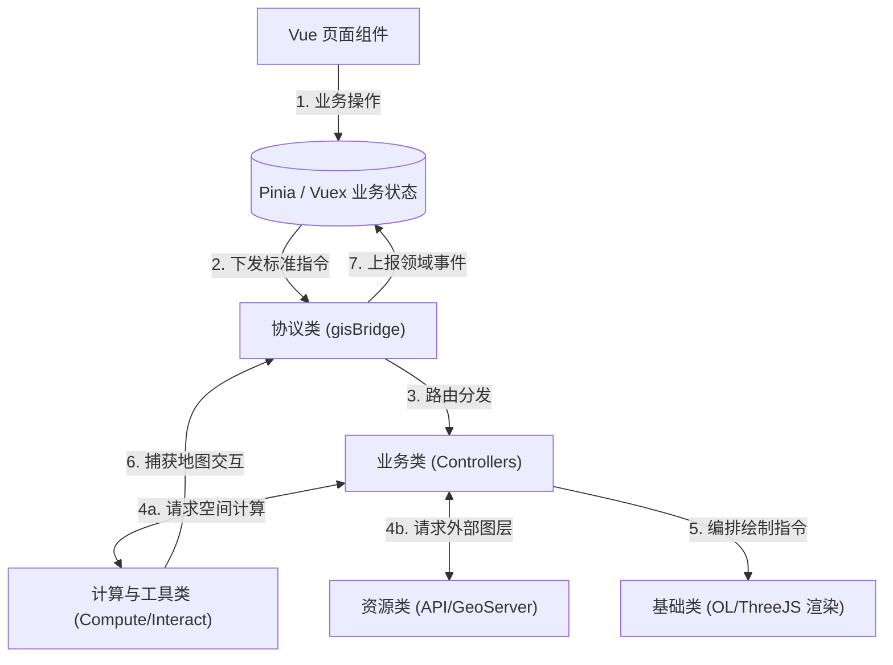

# GIS 前端分层架构设计方案 (常规单体项目版)

**版本**：v1.0  
**定位**：指导单一项目环境下的 GIS 前端模块化架构设计，旨在实现高内聚低耦合的“插拔式”架构，而不引入 Monorepo 的包管理复杂度。
**核心思想**：基于现有架构（DDD + 协议驱动），通过标准的目录结构与职责划分，实现模块解耦与代码的目录级复用。

---

## 一、 逻辑架构分层设计

为实现系统的高内聚低耦合，GIS 整体逻辑在深度上划分为以下六层：

### 1. 渲染层 (Render Layer)
**职责**：负责最终的可视化呈现与底层地图引擎的生命周期管理。
- **引擎挂载**：OpenLayers 实例、ThreeJS 场景的初始化。
- **图元绘制**：点（Marker）、线（Route）、面（Polygon）等基础几何体与样式的实际渲染。
- **约束**：绝对无状态，不包含业务逻辑，只接收标准的数据格式（如 GeoJSON）进行绘制。

### 2. 交互层 (Interaction Layer)
**职责**：负责捕获地图原生操作，转化为标准事件。
- **工具交互**：距离测量、面积测量、鼠标悬浮、要素点击。
- **约束**：只负责将 DOM/Canvas 事件转化为带有地理坐标的标准空间事件抛出。

### 3. 计算层 (Compute Layer)
**职责**：独立于渲染的纯数据、空间逻辑或复杂算法。
- **空间计算**：几何相交检测、缓冲区生成（Buffer）、重叠面积计算。
- **数据推算**：车辆 ETA 重算、轨迹平滑插值（Tick）、路径规划算法。
- **数据采集与清洗**：通过 HTTP/WS 主动拉取数据，并进行坐标系转换与脱敏清洗。
- **约束**：纯函数或通过 Web Worker 运行，严禁操作地图 DOM/Canvas 实例。

### 4. 控制层 (Control Layer)
**职责**：核心指挥中枢，承上启下，组合底层能力实现具体场景。
- **流程编排**：现有的 `GenericController` 与 `BusinessController`，调度渲染层与计算层协同工作。
- **生命周期**：管理场景状态机（SceneManager），控制业务节点如图层启用/禁用。

### 5. 数据协议层 (Protocol Layer)
**职责**：通信总线与接口契约，实现主前端与 GIS 核心的解耦。
- **通信中枢**：`MessageStore` 或 `gisBridge` 统一事件总线。
- **契约定义**：统一下发指令（Command）与上行领域事件（Event）的 TS 类型。

### 6. 主前端层 (Main Frontend)
**职责**：Vue 页面组件与 Pinia/Vuex 业务状态管理，下发操作指令给数据协议层。

---

## 二、 目录结构设计 (模块化分类)

在单体项目中，通过清晰的目录结构（按域划分）来替代 Monorepo 的包管理，实现高可维护性：

```text
src/gis/
├── basic/            # 1. 基础类：引擎底座
│   ├── openlayers/   # OL 引擎初始化与适配器
│   ├── threejs/      # 3D 引擎适配器
│   └── container/    # 地图 DOM 挂载组件
├── resource/         # 2. 资源类：数据源管理
│   ├── providers/    # 多平台底图管理 (高德/天地图等)
│   ├── geoserver/    # WMS/WFS 辖区、重点单位图层
│   └── third-party/  # 高德 API、天气预报等第三方服务
├── config/           # 3. 配置类：常量与视觉规范
│   ├── defaults.ts   # 默认中心点、缩放级别、坐标系
│   ├── styles/       # 图元主题样式表 (如消防车图标、围栏颜色)
│   ├── strategies/   # 各场景默认图层加载策略
│   └── layout/       # 工具栏、面板的 UI 布局配置
├── tools/            # 4. 工具与计算类：可插拔能力
│   ├── compute/      # 纯空间算法与推算 (相交、Buffer、ETA)
│   ├── interact/     # 绘图、测量、圈选等交互控件
│   └── worker/       # 高频轨迹数据清洗 Worker
├── business/         # 5. 业务类：流程编排与控制器
│   ├── controllers/  # 调派、值守、来电、跟踪控制器
│   └── scenes/       # 场景状态机管理
└── protocol/         # 6. 协议类：通信契约
    ├── bridge.ts     # gisBridge 消息总线
    └── types.ts      # Command 与 Event 类型定义
```

---

## 三、 架构协作与数据流转

以下为各目录模块在实际运行中的协作时序：



---

## 四、 简化版架构的优势

1. **降低工程复杂度**：无需配置 Lerna、pnpm workspaces 或 Turbo，避免了复杂的依赖提升和包发布流程，适合快速迭代的业务团队。
2. **极低的认知心智负担**：新人只需理解 `src/gis/` 下的 6 个目录指责，即可快速上手开发。
3. **目录级复用**：如果未来需要开辟新项目（如单独的大屏项目），可以直接将整个 `src/gis/` 目录 Copy，或抽取为一个通用的 Git Submodule。
4. **渐进式演进**：该目录结构严格遵循了高内聚的原则，如果未来业务庞大到确实需要 Monorepo，可以直接将这 6 个文件夹平滑迁移为独立 Package，无需修改核心逻辑。