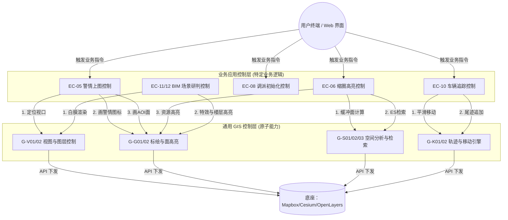
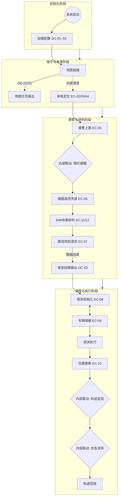
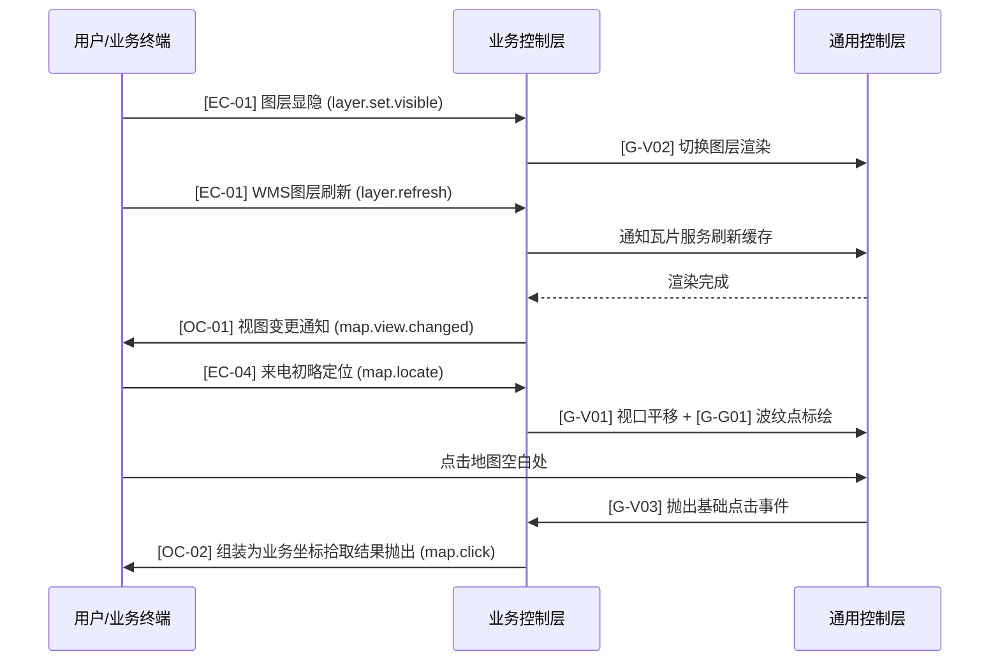
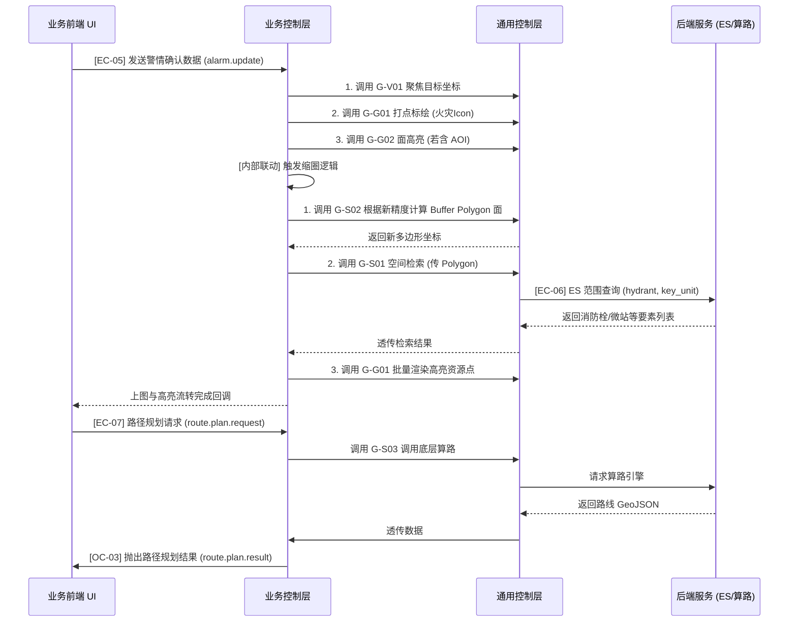
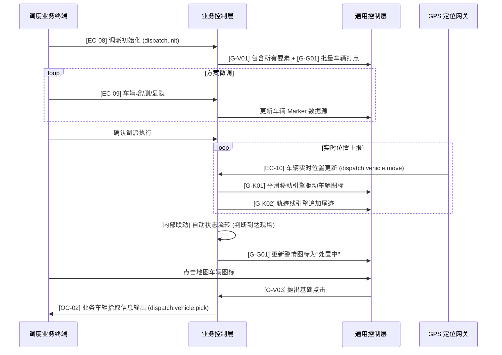

# 消防接处警 GIS 控制架构设计文档（分层+全量实例版）

**版本**：6.0（分层架构与全量图表实例融合版）  
**更新日期**：2026-06-24  
**适用范围**：消防接处警 GIS 系统（前端地图组件、业务逻辑编排层、后端空间服务）

---

## 1. 架构设计：二维分层控制模式 (Layered Control Pattern)

系统采用 **“通用控制层 (Generic Base Layer)”** 与 **“业务控制层 (Business Logic Layer)”** 的分层架构，实现基础地图能力与消防业务逻辑的彻底解耦。

### 1.1 分层理念
- **通用控制层 (Generic Controls)**：地图的**原子化能力**。只关心纯粹的 GIS 操作（标绘、高亮、空间计算、动画）。作为基础地图 SDK 提供给上层。
- **业务控制层 (Business Controls)**：地图的**领域能力**。由具体的消防业务模块定义，通过**组合、编排**底层的通用控制来实现业务目标。

---

## 2. 通用控制层 (Generic Base Controls)

通用控制层是 GIS 系统的基座，它暴露一组无状态的、高内聚的基础接口，供业务层随时拼装调用。

### 2.1 基础交互与视图库 (G-View)

#### [G-V01] 视口平移缩放
- **接口实现**: `map.base.locate`
- **数据实例**: 
  ```json
  {
    "lngLat": [121.4737, 31.2304],
    "zoom": 15,
    "duration": 500
  }
  ```

#### [G-V02] 图层动态显隐
- **接口实现**: `map.base.layer_toggle`
- **数据实例**: 
  ```json
  {
    "layerId": "fire_hydrant",
    "visible": true
  }
  ```

#### [G-V03] 坐标与要素拾取 (输出)
- **接口实现**: `map.base.click`
- **数据实例**: 
  ```json
  {
    "lngLat": [121.47, 31.23],
    "pixel": { "x": 100, "y": 200 },
    "featureId": "f_01"
  }
  ```

#### [G-V04] 2.5D 白膜渲染
- **接口实现**: `map.base.3d_overlay`
- **数据实例**: 
  ```json
  {
    "center": [121.47, 31.23],
    "highlightFloor": 5,
    "totalFloors": 12
  }
  ```

#### [G-V05] 面边界定位 (自适应视口)
- **接口实现**: `map.base.fit_bounds`
- **数据实例**: 
  ```json
  {
    "geometry": { "type": "Polygon", "coordinates": [[[121.46,31.22], [121.48,31.22], [121.48,31.24], [121.46,31.24], [121.46,31.22]]] },
    "padding": [50, 50, 50, 50],
    "duration": 800
  }
  ```

### 2.2 几何与要素标绘库 (G-Geometry)

#### [G-G01] 单点标绘引擎
- **接口实现**: `map.base.marker_add`
- **数据实例**: 
  ```json
  {
    "id": "m_01",
    "lngLat": [121.47, 31.23],
    "iconUrl": "/icons/fire.png",
    "animate": "breathe"
  }
  ```

#### [G-G02] 多边形面高亮
- **接口实现**: `map.base.polygon_draw`
- **数据实例**: 
  ```json
  {
    "id": "p_01",
    "geometry": { "type": "Polygon", "coordinates": [...] },
    "fillColor": "#ff0000"
  }
  ```

#### [G-G03] 要素批量移除
- **接口实现**: `map.base.feature_remove`
- **数据实例**: 
  ```json
  {
    "featureIds": ["m_01", "p_01"],
    "layerId": "temp_layer"
  }
  ```

### 2.3 空间分析与检索库 (G-Spatial)

#### [G-S01] 多边形空间检索
- **接口实现**: `map.base.es_query`
- **数据实例**: 
  ```json
  {
    "geometry": { "type": "Polygon" },
    "types": ["hydrant"],
    "limit": 50
  }
  ```

#### [G-S02] 动态缓冲缩圈 (内部)
- **接口实现**: `map.base.buffer_calc`
- **数据实例**: 
  ```json
  {
    "input": {
      "center": [121.47, 31.23],
      "radius": 200
    },
    "output": "Polygon Geometry"
  }
  ```

#### [G-S03] 路径规划算路
- **接口实现**: `map.base.route_calc`
- **数据实例**: 
  ```json
  {
    "start": [121.46, 31.22],
    "end": [121.47, 31.23],
    "strategy": "fastest"
  }
  ```

### 2.4 轨迹与动画引擎库 (G-Kinematic)

#### [G-K01] 平滑移动引擎
- **接口实现**: `map.base.smooth_move`
- **数据实例**: 
  ```json
  {
    "featureId": "v_01",
    "targetLngLat": [121.462, 31.222],
    "duration": 2000
  }
  ```

#### [G-K02] 轨迹线追加
- **接口实现**: `map.base.track_append`
- **数据实例**: 
  ```json
  {
    "lineId": "t_01",
    "newLngLat": [121.462, 31.222]
  }
  ```

#### [G-K03] 轨迹回放播放器
- **接口实现**: `map.base.track_play`
- **数据实例**: 
  ```json
  {
    "points": [
      [121.46, 31.22],
      [121.462, 31.222]
    ],
    "playSpeed": 2
  }
  ```

---

## 3. 业务应用控制层 (Business Application Controls)

业务层通过组合调用上述的 `G-xx` 接口来实现真实的消防业务，并对外暴露带有业务语义的 EventKey。

### 3.1 内部配置（系统级）
系统启动时加载的基础配置，驱动底层渲染参数。
- **[GC-01] 资源图层配置**: `{ "layers": [ { "id": "road_network", "visible": true } ] }`
- **[GC-02] 基础参数配置**: `{ "defaultCenter": [121.4737, 31.2304], "defaultZoom": 14 }`
- **[GC-03] 清除策略配置**: `{ "clearOnCaseClose": true, "keepHistoryCount": 3 }`

### 3.2 当前警情事件画像数据 (Alarm Event Profile)

本模块独立于具体的业务阶段，其数据对象包含了警情从发生到结束的完整生命周期故事画像。系统中其他大部分的业务控制器，均通过监听采集该画像数据（JSON）中特定字段的变更，来自动触发对应的底层控制逻辑。

- **接口实现**: `alarm.profile.sync` (全局状态数据同步/监听)
- **业务语义**: 维护当前处理警情的全局唯一事实来源（Single Source of Truth），包含基础信息、生命周期状态、关联空间资源、调度方案等全量上下文。
- **数据实例**: 
  ```json
  {
    "eventId": "INC20260624001", // 事件ID (incidentId)
    "baseInfo": {
      "disaster_address": "深圳", // 灾害地址
      "longitude": 114.057868, // 经度
      "latitude": 22.543099, // 纬度
      "disaster_type": "FIRE", // 灾害类型
      "disaster_type_lv2": "", // 灾害细类
      "disaster_des": "123\n", // 灾害描述
      "is_trapped": "FALSE", // 是否有人员被困
      "trapped_position": "", // 被困人员位置
      "trapped_num": 0, // 被困人员数量
      "is_casualty": "FALSE" // 是否有人员伤亡
    },
    "lifecycleStatus": "dispatching", // 状态变更触发对应的阶段流转控制
    "spatialContext": {
      "aoiList": [...], // 监听变更时触发 [EC-05] 警情精确上图及 AOI 面高亮
      "bufferRadius": 500 // 半径衰减时触发 [EC-06] 缩圈高亮周边资源控制
    },
    "dispatchPlan": {
      "vehicles": ["V001", "V002"], // 列表变更触发 [EC-09] 车辆状态微调控制
      "routes": [...] // 监听到规划路径下发触发 [EC-07] 路线渲染
    }
  }
  ```

### 3.3 值守与来电阶段 (Standby & Call)

#### [EC-01] 图层显隐与 WMS 刷新
- **接口实现**: `layer.set.visible` / `layer.refresh`
- **底层组合**: 直接透传调用 `G-V02`
- **数据实例**: `{ "layerId": "fire_hydrant", "visible": true }` / `{ "layerId": "wms_district", "timestamp": 1719216000000 }`

#### [EC-02] 辖区基础 POI 定位控制
- **接口实现**: `poi.query`
- **底层组合**: `G-S01` (检索) + `G-G01` (标绘)
- **数据实例**: 
  ```json
  {
    "lngLat": [121.4740, 31.2310],
    "radius": 800,
    "poiTypes": ["chemical", "hospital"],
    "limit": 30,
    "showIcon": true
  }
  ```

#### [EC-03] 围栏集合 AOI 定位控制
- **接口实现**: `aoi.highlight`
- **底层组合**: `G-V01` (定位) + `G-G02` (面高亮)
- **数据实例**: 
  ```json
  {
    "alarmId": "INC20260624001",
    "aoiList": [ { "id": "aoi_001", "geometry": { "type": "Polygon", "coordinates": [...] } } ],
    "fitBounds": true,
    "strokeColor": "#FF0000"
  }
  ```

#### [EC-04] 来电初略定位
- **接口实现**: `map.locate`
- **底层组合**: `G-V01` (定位) + `G-G01` (呼吸点)
- **数据实例**: `{ "lngLat": [121.4737, 31.2304], "zoom": 14, "radius": 500 }`

### 3.4 接警与研判阶段 (Alarm & Analysis)

#### [EC-05] 警情精确上图控制
- **业务语义**：接警员明确起火点和所在小区后，精准落图并高亮整个小区。
- **接口实现**: `alarm.update`
- **底层组合**: `G-V01` (视口平移) + `G-G01` (渲染火灾图标) + `G-G02` (框显小区AOI面)
- **数据实例**: 
  ```json
  {
    "alarmId": "INC20260624001",
    "lngLat": [121.4740, 31.2310],
    "address": "东方路123号",
    "aoiList": [...],
    "fitBounds": true
  }
  ```

#### [EC-06] 缩圈高亮周边资源控制
- **业务语义**：随着定位精确度提高，地图内部自动缩圈，并高亮周边的消防栓。
- **接口实现**: `resource.query` (可内部触发也可外部请求)
- **底层组合**: `G-S02` (计算缓冲面) + `G-S01` (ES多边形检索) + `G-G01` (点标绘)
- **数据实例**: 
  ```json
  {
    "queryId": "q_001",
    "geometry": { "type": "Polygon", "coordinates": [...] },
    "resourceTypes": ["hydrant", "key_unit"],
    "size": 50
  }
  ```

#### [EC-07] 处警路径规划控制
- **接口实现**: `route.plan.request`
- **底层组合**: `G-S03` (算路) + `G-G02` (线标绘)
- **数据实例**: 
  ```json
  {
    "requestId": "route_req_001",
    "start": { "id": "station_01", "lngLat": [121.4600, 31.2200] },
    "end": { "lngLat": [121.4740, 31.2310] },
    "strategy": "fastest"
  }
  ```

### 3.5 调度与执行阶段 (Dispatch & Execute)

#### [EC-08] 调派方案初始化控制
- **接口实现**: `dispatch.init`
- **底层组合**: `G-V01` (视口包含所有元素) + 多次 `G-G01` (渲染车辆图标)
- **数据实例**: 
  ```json
  {
    "requestId": "init_001",
    "alarmInfo": { "id": "INC20260624001", "lonlat": [121.4740, 31.2310] },
    "standbyVehicles": [
      { "id": "V001", "plateNo": "沪A12345", "lonlat": [121.4600, 31.2200], "carType": "water_tank" }
    ]
  }
  ```

#### [EC-09] 车辆状态微调控制 (增/删/显隐)
- **接口实现**: `dispatch.vehicle.add` / `dispatch.vehicle.remove` / `dispatch.vehicle.plan.toggle`
- **底层组合**: 调用 `G-G01` (标绘) 或 `G-G03` (移除) 或 `G-V02` (显隐)
- **数据实例**: `{ "requestId": "req_02", "vehicle": { "id": "V003", "lonlat": [121.465, 31.215] } }`

#### [EC-10] 车辆实时位置更新与轨迹追加
- **接口实现**: `dispatch.vehicle.move`
- **底层组合**: `G-K01` (平滑移动图标) + `G-K02` (追加行驶轨迹线)
- **数据实例**: 
  ```json
  {
    "vehicleId": "V001",
    "lonlat": [121.4620, 31.2220],
    "timestamp": 1719216005000,
    "speed": 45,
    "direction": 120
  }
  ```

### 3.6 2.5D BIM 微区域场景控制 (BIM Micro-Area Controls)

该模块面向灾害现场的精细化空间研判，通过加载 GeoServer 空间数据和 BIM 建筑底座，实现灾情可视化管控。本模块通常在接警后，进入灾害现场级研判时被触发。

#### [EC-11] BIM 场景初始化与白模加载
- **接口实现**: `bim.scene.init`
- **业务语义**: 接收警情数据，通过 GeoServer 拉取并渲染指定范围内的建筑白模、道路、出入口等矢量底座。
- **数据实例**: 
  ```json
  {
    "incidentId": "INC20260624001",
    "buildingId": "B_9982",
    "centerLngLat": [121.4740, 31.2310],
    "layers": ["building_white_model", "entrances", "roads"]
  }
  ```

#### [EC-12] 灾情业务参数动态更新 (楼层/人员/烟雾)
- **接口实现**: `bim.disaster.update`
- **业务语义**: 实时修改起火楼层、被困人数、烟雾蔓延情况，并驱动 BIM 场景刷新对应楼层的高亮与烟雾特效。
- **数据实例**: 
  ```json
  {
    "incidentId": "INC20260624001",
    "fireFloors": [3, 4],
    "trappedCount": 5,
    "smokeStatus": {
      "direction": "north",
      "density": "high",
      "spreadFloors": [4, 5, 6]
    }
  }
  ```

#### [EC-13] BIM 场景人机交互控制
- **接口实现**: `bim.view.interact` (前端纯本地交互，不经过后端，但可向外抛出事件)
- **业务语义**: 支持通过平移、缩放、围绕建筑中心点旋转多角度查看，以及指南针复位操作。
- **数据实例**: 
  ```json
  {
    "actionType": "rotate", // translate | zoom | rotate | compass_reset
    "currentPitch": 60,
    "currentBearing": 45
  }
  ```

### 3.7 业务输出控制 (Output Controls)

#### [OC-01] 视图变更通知
- **接口实现**: `map.view.changed`
- **数据实例**: 
  ```json
  {
    "center": [121.4737, 31.2304],
    "zoom": 15,
    "bounds": {
      "north": 31.25,
      "south": 31.20,
      "east": 121.50,
      "west": 121.45
    }
  }
  ```

#### [OC-02] 业务拾取通知
- **接口实现**: `map.click` / `dispatch.vehicle.pick`
- **数据实例**: 
  ```json
  {
    "pickId": "pick_001",
    "vehicle": {
      "id": "V005",
      "plateNo": "沪D99887"
    }
  }
  ```

#### [OC-03] 规划结果抛出
- **接口实现**: `route.plan.result`
- **数据实例**: 
  ```json
  {
    "requestId": "req_01",
    "path": [
      [121.4600, 31.2200],
      [121.4740, 31.2310]
    ],
    "distance": 5200,
    "duration": 480
  }
  ```

---

## 4. 全量业务流程图与分层时序图

### 4.1 业务控制到通用控制的调用链路模型



### 4.2 全局业务生命周期流转图



### 4.3 值守与来电阶段时序图



### 4.4 接警与研判阶段分层时序图（含 ES 检索高亮）



### 4.5 处警调度与调派执行分层时序图



---

## 附录：核心数据模型规范 (JSON Schema Definitions)

所有控制的数据实例均基于以下基础模型进行组装：

```json
{
  "definitions": {
    "LngLat": {
      "type": "array",
      "description": "经纬度坐标 [经度, 纬度]",
      "items": { "type": "number" },
      "minItems": 2,
      "maxItems": 2
    },
    "GeometryPolygon": {
      "type": "object",
      "description": "GeoJSON 面要素",
      "properties": {
        "type": { "enum": ["Polygon"] },
        "coordinates": { 
          "type": "array", 
          "items": { "type": "array", "items": { "type": "array", "items": { "type": "number" } } } 
        }
      }
    },
    "Vehicle": {
      "type": "object",
      "description": "车辆基础对象",
      "properties": {
        "id": { "type": "string" },
        "plateNo": { "type": "string" },
        "lonlat": { "$ref": "#/definitions/LngLat" },
        "carType": { "type": "string" },
        "status": { "type": "string", "enum": ["available", "dispatched", "responding", "on_scene"] }
      }
    },
    "AlarmInfo": {
      "type": "object",
      "description": "警情基础对象",
      "properties": {
        "eventId": { "type": "string" },
        "disaster_address": { "type": "string", "description": "灾害地址" },
        "longitude": { "type": "number", "description": "经度" },
        "latitude": { "type": "number", "description": "纬度" },
        "disaster_type": { "type": "string", "description": "灾害类型" },
        "disaster_type_lv2": { "type": "string", "description": "灾害细类" },
        "disaster_des": { "type": "string", "description": "灾害描述" },
        "is_trapped": { "type": "string", "description": "是否有人员被困" },
        "trapped_position": { "type": "string", "description": "被困人员位置" },
        "trapped_num": { "type": "number", "description": "被困人员数量" },
        "is_casualty": { "type": "string", "description": "是否有人员伤亡" }
      }
    }
  }
}
```