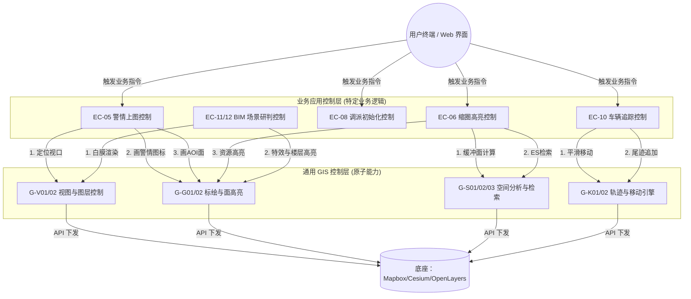
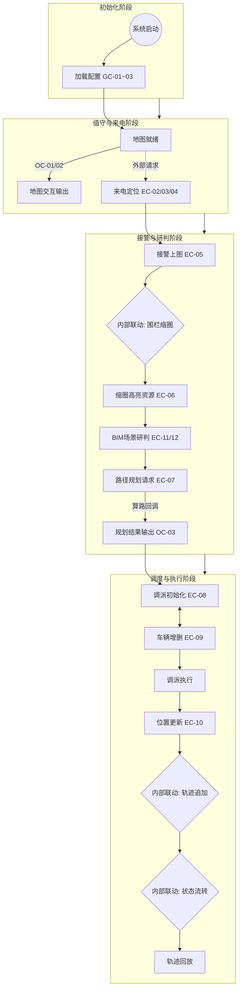
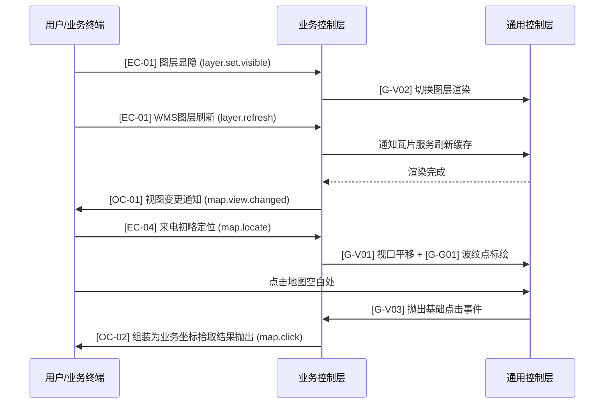
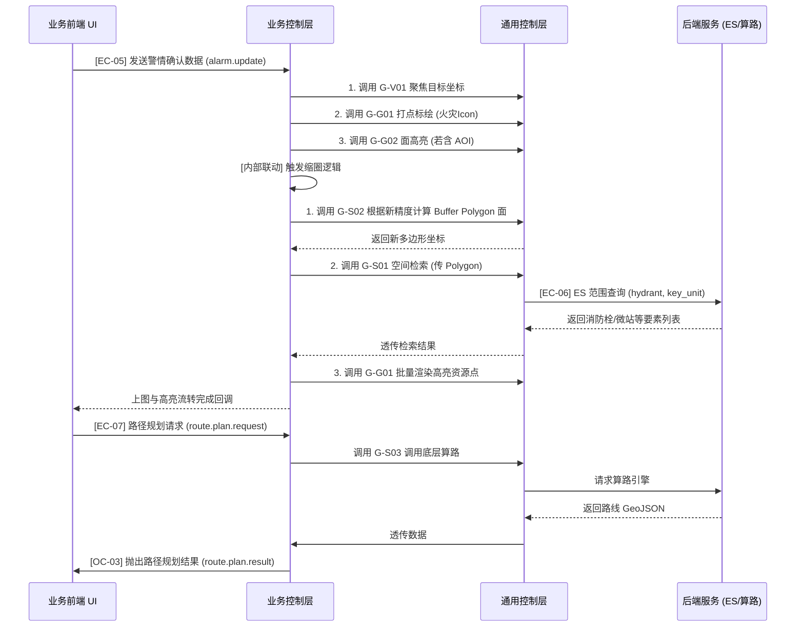
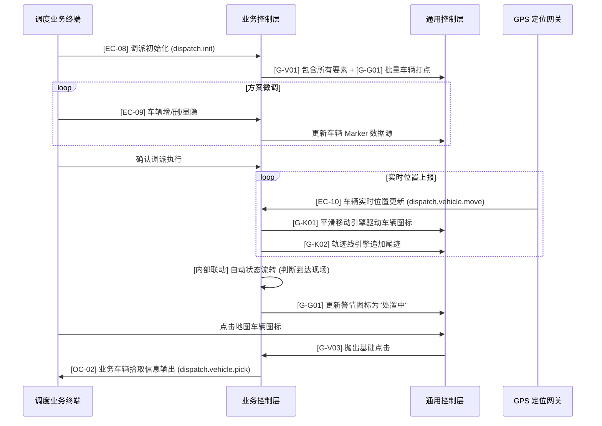

# 消防接处警 GIS 控制架构设计文档（分层+全量实例版）

版本：6.0（分层架构与全量图表实例融合版）  
更新日期：2026-06-24  
适用范围：消防接处警 GIS 系统（前端地图组件、业务逻辑编排层、后端空间服务）


---

## 1. 架构设计：二维分层控制模式 (Layered Control Pattern)

系统采用 “通用控制层 (Generic Base Layer)” 与 “业务控制层 (Business Logic Layer)” 的分层架构，实现基础地图能力与消防业务逻辑的彻底解耦。

### 1.1 分层理念
- 通用控制层 (Generic Controls)：地图的原子化能力。只关心纯粹的 GIS 操作（标绘、高亮、空间计算、动画）。作为基础地图 SDK 提供给上层。
- 业务控制层 (Business Controls)：地图的领域能力。由具体的消防业务模块定义，通过组合、编排底层的通用控制来实现业务目标。


---

## 2. 通用控制层 (Generic Base Controls)

通用控制层是 GIS 系统的基座，它暴露一组无状态的、高内聚的基础接口，供业务层随时拼装调用。

数据结构包含eventType的可供外部调用控制

### 2.1 基础交互与视图库 (G-View)（原则上仅供gis内部使用）

[G-V01] 视口平移缩放
- 接口实现: `map.base.locate`
- 数据实例: 
```json
{
  "eventType": "map.base.locate",
  "data": {
    "lngLat": [121.4737, 31.2304],
    "zoom": 15,
    "duration": 500
  }
}
```

[G-V02] 图层动态显隐
- 接口实现: `map.base.layer_toggle`
- 数据实例: 
```json
{
  "eventType": "map.base.layer_toggle",
  "data": {
    "layerId": "fire_hydrant",
    "visible": true
  }
}
```

[G-V03] 坐标与要素拾取 (输出)
- 接口实现: `map.base.click`
- 数据实例: 
```json
{
  "eventType": "map.base.click",
  "data": {
    "lngLat": [121.47, 31.23],
    "pixel": { "x": 100, "y": 200 },
    "featureId": "f_01"
  }
}
```

[G-V04] 2.5D 白膜渲染
- 接口实现: `map.base.3d_overlay`
- 数据实例: 
```json
{
  "eventType": "map.base.3d_overlay",
  "data": {
    "center": [121.47, 31.23],
    "highlightFloor": 5,
    "totalFloors": 12
  }
}
```

[G-V05] 面边界定位 (自适应视口)
- 接口实现: `map.base.fit_bounds`
- 数据实例: 
```json
{
  "eventType": "map.base.fit_bounds",
  "data": {
    "geometry": { "type": "Polygon", "coordinates": [[[121.46,31.22], [121.48,31.22], [121.48,31.24], [121.46,31.24], [121.46,31.22]]] },
    "padding": [50, 50, 50, 50],
    "duration": 800
  }
}
```

[G-V06]  POI 定位控制
- 接口实现: `map.base.poiLoaction`
- 底层组合: `G-S01` (检索)
- 数据实例: 
```json
{
  "eventType": "map.base.poiLoaction",
  "data": {
    "longitude": 121.4737,
    "latitude": 31.2304,
    "zoom": 15
  }
}
```
### 2.2 几何与要素标绘库 (G-Geometry)

[G-G01] 单点标绘引擎
- 接口实现: `map.base.marker_add`
- 数据实例: 
```json
{
  "eventType": "map.base.marker_add",
  "data": {
    "id": "m_01",
    "lngLat": [121.47, 31.23],
    "iconUrl": "/icons/fire.png",
    "animate": "breathe"
  }
}
```

[G-G02] 多边形面高亮
- 接口实现: `map.base.polygon_draw`
- 数据实例: 
```json
{
  "eventType": "map.base.polygon_draw",
  "data": {
    "id": "p_01",
    "geometry": { "type": "Polygon", "coordinates": [...] },
    "fillColor": "#ff0000"
  }
}
```

【✔】[G-G03] 要素批量移除
- 接口实现: `map.base.feature_remove`
- 数据实例: 【必传：featureIds】
```json
{
  "eventType": "map.base.feature_remove",
  "data": {
    "featureIds": [],
    "layerIds": ["temp_layer"] // 可选（预留图层区域高亮）
  }
}
```

### 2.3 空间分析与检索库 (G-Spatial)

[G-S01] 多边形空间检索
- 接口实现: `map.base.es_query`
- 数据实例: 
```json
{
  "eventType": "map.base.es_query",
  "data": {
    "geometry": { "type": "Polygon" },
    "types": ["hydrant"],
    "limit": 50
  }
}
```

[G-S02] 动态缓冲缩圈 (内部)
- 接口实现: `map.base.buffer_calc`
- 数据实例: 
```json
{
  "eventType": "map.base.buffer_calc",
  "data": {
    "input": {
      "center": [121.47, 31.23],
      "radius": 200
    },
    "output": "Polygon Geometry"
  }
}
```

[G-S03] 路径规划算路
- 接口实现: `map.base.route_calc`
- 数据实例: 
```json
{
  "eventType": "map.base.route_calc",
  "data": {
    "start": [121.46, 31.22],
    "end": [121.47, 31.23],
    "strategy": "fastest"
  }
}
```

### 2.4 轨迹与动画引擎库 (G-Kinematic)

[G-K01] 平滑移动引擎
- 接口实现: `map.base.smooth_move`
- 数据实例: 
```json
{
  "eventType": "map.base.smooth_move",
  "data": {
    "featureId": "v_01",
    "targetLngLat": [121.462, 31.222],
    "duration": 2000
  }
}
```

[G-K02] 轨迹线追加
- 接口实现: `map.base.track_append`
- 数据实例: 
```json
{
  "eventType": "map.base.track_append",
  "data": {
    "lineId": "t_01",
    "newLngLat": [121.462, 31.222]
  }
}
```

[G-K03] 轨迹回放播放器
- 接口实现: `map.base.track_play`
- 数据实例: 
```json
{
  "eventType": "map.base.track_play",
  "data": {
    "points": [
      [121.46, 31.22],
      [121.462, 31.222]
    ],
    "playSpeed": 2
  }
}
```


---

## 3. 业务应用控制层 (Business Application Controls)

业务层通过组合调用上述的 G-xx 接口来实现真实的消防业务，并对外暴露带有业务语义的 EventType。

### 3.1 内部配置（系统级）（内部配置表读取）
系统启动时加载的基础配置，驱动底层渲染参数。
- **[GC-01] 资源图层配置**: 
```json
{
  "eventType": "config.layers",
  "data": {
    "layers": [ { "id": "road_network", "visible": true } ]
  }
}
```
- **[GC-02] 基础参数配置**: 
```json
{
  "eventType": "config.base",
  "data": {
    "defaultCenter": [121.4737, 31.2304],
    "defaultZoom": 14
  }
}
```
- **[GC-03] 清除策略配置**: 
```json
{
  "eventType": "config.clear_strategy",
  "data": {
    "clearOnCaseClose": true,
    "keepHistoryCount": 3
  }
}
```

### 3.2 当前警情事件GIS画像数据 (Alarm Event Profile)

本模块独立于具体的业务阶段，其数据对象包含了警情从发生到结束的完整生命周期故事画像。系统中其他大部分的业务控制器，均通过监听采集该画像数据（JSON）中特定字段的变更，来自动触发对应的底层控制逻辑。

- 接口实现: `alarm.profile.sync` (全局状态数据同步/监听)
- 业务语义: 维护当前处理警情的全局唯一事实来源（Single Source of Truth），包含基础信息、生命周期状态、关联空间资源、调度方案等全量上下文。
- 数据实例: 
```json
{
  "eventType": "alarm.profile.sync",
  "data": {
    "incidentId": "", // 警情事件ID (incidentId)
    "disaster_address": "深圳", // 灾害地址
    "longitude": 114.057868, // 经度
    "latitude": 22.543099, // 纬度
    "disaster_type": "FIRE", // 灾害类型
    "disaster_type_lv2": "", // 灾害细类
    "incidentState": "CREATED",
    "incidentStateName": "立案",
    "disaster_des": "123\n", // 灾害描述
    "is_trapped": "FALSE", // 是否有人员被困
    "trapped_position": "", // 被困人员位置
    "trapped_num": 0, // 被困人员数量
    "is_casualty": "FALSE", // 是否有人员伤亡    
    //  -----------------模型加载需要用到的数据
    "buildingId": "" // 建筑物ID  
  }
}
```
涉及的模块调用：
1、接警上图、微区域渲染，相似警研判、调派上图、跟踪更新
#### 3.2.1 调派、跟踪模块警情画像同步数据定义 

本段用于补充当前警情事件画像数据（Alarm Event Profile）在调派、跟踪模块中的落地字段。GIS 侧通过监听 alarm.profile.sync，获取警情基础信息、状态和灾害要素，作为调派方案初始化、车辆显隐微调、车辆实时跟踪和轨迹追加的统一上下文。

- 接口实现:alarm.profile.sync 
- 业务语义:同步当前警情画像的全局事实数据，供 GIS 调派初始化、车辆显隐微调、车辆实时跟踪和轨迹追加使用。 
- 底层组合: 监听画像数据变更 + G-G01（警情点标绘/状态图标）+ G-V01（视口定位）
- 数据实例: 
```json
{ 
 "eventType": "alarm.profile.sync", 
 "data": { 
 "incidentId": "INC20260624001", // 警情事件ID (incidentId) 
 "disaster_address": "深圳", // 灾害地址 
 "longitude": 114.057868, // 经度 
 "latitude": 22.543099, // 纬度 
 "disaster_type": "FIRE", // 灾害类型 
 "disaster_type_lv2": "", // 灾害细类 
 "incidentState": "CREATED", // 警情状态编码 
 "incidentStateName": "立案", // 警情状态名称 
 "disaster_des": "123\n", // 灾害描述 
 "is_trapped": "FALSE", // 是否有人员被困 
 "trapped_position": "", // 被困人员位置 
 "trapped_num": 0, // 被困人员数量 
 "is_casualty": "FALSE" // 是否有人员伤亡 
 } 
}
```
### 3.3 值守阶段 

[EC-01] 基础图层资源显隐和配置 （当前仅内部使用）（值守）
- 接口实现: `layer.set.visible`
- 底层组合: 直接透传调用 `G-V02`
- 数据实例:
```json
{
  "eventType": "layer.set.visible",
  "data": {
    "layerId": "fire_hydrant",
    "visible": true
  }
}
```

【✔】[EC-02] 围栏集合 AOI 定位控制（值守）
- 接口实现:  3.8 [IC-01] 初始化视图变更通知
- 底层组合: `G-V05` (面定位)
- 数据实例:  （数据源待定）
```json
{
  "eventType": "map.view.load",
  "data": {
    "points": [], // 围栏面数据
    "code": "" // or 兼容模式 行政区划编码（查询高德围栏）
  }
}
```
### 3.4 来电阶段 
【✔】[EC-03] 来电初略定位（来电）
- 接口实现: `map.locate.call`
- 底层组合: `G-V01` (定位) + `G-G01` (呼吸点)
- 数据实例:  【必传】
```json
{
  "eventType": "map.locate.call",
  "data": {
  "id": "",
    "longitude": 121.4737,
    "latitude": 31.2304,
    "radius": 500,
    "address": "",  // 基站定位地址
    "Carrier_Loc": "" // 运营商定位
    // iconType: "", // 暂不区分图标类型 
  }
}
```
【✔】[EC-04] 来电挂断（来电）
- 接口实现: `map.locate.call.remove`
- 底层组合: `G-G03` (移除)
- 关联实现：G-G03（直接复制json）

### 3.4.1 接警与研判阶段 (Alarm & Analysis)
【✔】[WC-01] 围栏集合 AOI 定位控制（问询）
- 接口实现: `aoi.fit_bounds`
- 底层组合: `G-V05` (面定位)
- 关联实现：EC-03
- 数据实例: 
```json
{
  "eventType": "map.view.load",
  "data": {
    "points": [], // 围栏面数据
    "padding": [50, 50, 50, 50] // 可选内边距大小
  }
}
```

【✔】[WC-02] 围栏集合 AOI 定位高亮资源（问询）（如需高亮具体的资源需要提供高亮目标图层）
- 接口实现: `aoi.es_query`
- 底层组合: `G-S01` (多边形空间检索数据)
- 关联实现：
- 数据实例: 【需要提供高亮对象图层】
```json
{
  "eventType": "aoi.es_query",
  "data": {
   "points": [], // 围栏面数据
   "layerNames": [""] // geoserver视图图层名称集合（gis:id）
  }
}
```


【✔】[WC-03] 根据辖区队站围栏ID反查围栏集合数据（问询、立案）（围栏定位-围栏辖区高亮-辖区队站高亮）
- 接口实现: `aoi.es_gisZone`
- 底层组合: `WC-01` (围栏定位) + `WC-02` (围栏内高亮辖区队站资源) + [G-S01] 多边形空间检索（面高亮）
- 数据实例: 【必传：zoneId】
```json
{
  "eventType": "aoi.es_gisZone",
  "data": {
    "zoneId": "14d1a77d1bbc47788478dc06c55b354c",  // 辖区面ID
    "zoneCode": "2",
    "zoneName": "白石洲政府专职消防队", // 辖区所属队站
    "parentZoneId": "b46f546857ef497196dc5b994db3c3b5" //上级辖区面ID
  }
}
```
【✔】[EC-05-1] 问询控制 （未立案前产生的警情前置数据资源）
- 接口实现: `alarm.profile.sync`
- 底层组合:  产生位置：`G-V01` (视口平移) + 产生警情：`G-G01` (渲染火灾图标) + 产生研判描述信息：供BIM模型交互使用 `BC-12`
- 前端数据源采集合并:  3.2 警情画像数据 alarmStore
- 数据实例:  【问询数据因通话描述随机产生前置数据，无必填数据能力限制，以下是可能产生的数据字段结构】
```json
{ 
 "eventType": "alarm.profile.sync", 
 "data": { 
 "disaster_address": "深圳", // 灾害地址 
 "longitude": 114.057868, // 经度 
 "latitude": 22.543099, // 纬度 

 "disaster_type_lv2": "", // 灾害细类 
 "incidentState": "CREATED", // 警情状态编码 
 "incidentStateName": "立案", // 警情状态名称 
 "disaster_des": "123\n", // 灾害描述 
 "is_trapped": "FALSE", // 是否有人员被困 
 "trapped_position": "", // 被困人员位置 
 "trapped_num": 0, // 被困人员数量 
 "is_casualty": "FALSE", // 是否有人员伤亡
 "buildingId ": "", // 建筑ID
 } 
}
```
【✔】[EC-05-2] 警情精确上图控制 （已经立案产生警情的位置和类型--数据）
- 业务语义：接警员明确起火点和所在小区后，精准落图。
- 接口实现: `alarm.profile.sync`
- 底层组合: `G-V01` (视口平移) + `G-G01` (渲染火灾图标)
- 前端数据源采集合并:  3.2 警情画像数据 alarmStore
- 数据实例:  【必传：incidentId longitude latitude disaster_type】
```json
{ 
 "eventType": "alarm.profile.sync", 
 "data": { 
 "incidentId": "INC20260624001", // 警情事件ID (incidentId) 
 "disaster_address": "深圳", // 灾害地址 
 "longitude": 114.057868, // 经度 
 "latitude": 22.543099, // 纬度 
 "disaster_type": "FIRE", // 灾害类型 
 "disasterTypeLabel": "", // 灾害类型名称
 
//--------------------- 详情展示

 "disaster_type_lv2": "", // 灾害细类 
 "incidentState": "CREATED", // 警情状态编码 
 "incidentStateName": "立案", // 警情状态名称 
 "disaster_des": "123\n", // 灾害描述 
 "is_trapped": "FALSE", // 是否有人员被困 
 "trapped_position": "", // 被困人员位置 
 "trapped_num": 0, // 被困人员数量 
 "is_casualty": "FALSE", // 是否有人员伤亡
  "buildingId ": "", // 建筑ID 
 } 
}
```

【✔】[EC-05-4] 警情立案-画像变更状态接口
- 业务语义：接警员修改警情事件画像数据变更后推送数据更新视图展示。
- 接口实现: `alarm.profile.sync`
- 底层组合:  位置变更时触发：`G-V01` (视口平移) + 类型变更时触发： `G-G01` (渲染火灾图标)
- 前端数据源采集合并:  3.2 警情画像数据 alarmStore
- 数据实例:  【存在不确定变更的数据是哪些哪类字段，预计场景有：位置变更、灾害类型变更、 其他描述变更】
```json
{ 
 "eventType": "alarm.profile.sync", 
 "data": { 
 "incidentId": "INC20260624001", // 警情事件ID (incidentId) 
 "disaster_address": "深圳", // 灾害地址 
 "longitude": 114.057868, // 经度 
 "latitude": 22.543099, // 纬度 
 "disaster_type": "FIRE", // 灾害类型 
 "disasterTypeLabel": "", // 灾害类型名称
 
//--------------------- 详情展示和表单展示（交互）

 "disaster_type_lv2": "", // 灾害细类 
 "incidentState": "CREATED", // 警情状态编码 
 "incidentStateName": "立案", // 警情状态名称 
 "disaster_des": "123\n", // 灾害描述 
 "is_trapped": "FALSE", // 是否有人员被困 
 "trapped_position": "", // 被困人员位置 
 "trapped_num": 0, // 被困人员数量 
 "is_casualty": "FALSE" // 是否有人员伤亡 
 } 
}
```

### 3.5 调派阶段（Dispatch）
调派阶段包含“初始化”和“交互”两个子场景。初始化不是单一组合控制项，而是调派阶段下的一组独立 GIS 控制能力集合；各控制能力可以由外部系统或内部业务状态分别触发，执行时可能存在先后顺序或时间差。交互子场景用于承接调派人员在消防站、车辆和路径上的操作，并与上游调派系统保持状态同步。
#### 3.5.1 调派初始化子场景
初始化子场景包含警情上图、视口（围栏）定位、围栏检索（资源高亮）和路径规划等控制能力。各控制项互相独立对外，不定义为组合控制。

【✔】[DC-01] 警情上图控制
- 接口实现：`alarm.profile.sync`
- 业务语义：根据当前警情事件完成警情上图，包含警情点标绘、视口定位和警情详情数据挂载。
- 复用/关联：复用 [EC-05-2]警情精确上图控制
- 数据实例： 复用 [EC-05-2]的JSON实例

【✔】[DC-02] 根据辖区队站围栏ID反查围栏集合数据（调派）（围栏定位-围栏辖区高亮-辖区队站高亮）
- 接口实现: `aoi.es_gisZone`
- 底层组合: `WC-01` (围栏定位) + `WC-02` (围栏内高亮辖区队站资源) + [G-S01] 多边形空间检索（面高亮）
- 数据实例: 【必传：zoneId】
```json
{
  "eventType": "aoi.es_gisZone",
  "data": {
    "zoneId": "14d1a77d1bbc47788478dc06c55b354c",  // 辖区面ID
    "zoneCode": "2",
    "zoneName": "白石洲政府专职消防队", // 辖区所属队站
    "parentZoneId": "b46f546857ef497196dc5b994db3c3b5" //上级辖区面ID
  }
}
```

[DC-02] 视口（围栏）定位控制
- 接口实现：dispatch.viewport.fit
- 复用/关联：复用 GIS 通用视口定位能力；关联 Juris_Zone、Coord_Sys。
- 底层组合：G-V01（视口定位） + G-V02（图层显隐）
- 数据实例：
```json
{
  "eventType": "dispatch.viewport.fit",
  "data": {
    "incidentId": "", // 警情事件ID (incidentId)
    "fitType": "JURIS_ZONE", // 视口定位类型：警情点、辖区围栏、对象集合
    "zone_id": "zone_001", // 辖区标识
    "zone_name": "某某消防站辖区", // 辖区名称
    "center": {
      "longitude": 114.057868, // 中心点经度
      "latitude": 22.543099, // 中心点纬度
      "coord_sys": "GD" // 坐标系类型，高德坐标系（GCJ-02）
    },
    "includeAlarmPoint": true, // 是否包含警情点
    "includeStations": true, // 是否包含消防站
    "includeVehicles": true, // 是否包含车辆
    "includeRoutes": true // 是否包含路线
  }
}
```

[DC-03] 围栏检索与资源高亮控制
- 接口实现：dispatch.resource.query.highlight
- 业务语义：根据警情点、消防站辖区或指定围栏范围检索周边资源，并高亮展示消防水源、重点单位、消防站等资源。
- 复用/关联：复用 [EC-06] 缩圈高亮周边资源控制；关联 Juris_Zone、Resource_Match_Item。
- 底层组合：G-S02（计算缓冲面） + G-S01（ES 多边形检索） + G-G01（点标绘） + G-V02（图层显隐）
- 数据实例：
```json
{
  "eventType": "dispatch.resource.query.highlight",
  "data": {
    "incidentId": "", // 警情事件ID (incidentId)
    "queryType": "BUFFER", // 检索类型：缓冲区、辖区围栏
    "center": {
      "longitude": 114.057868, // 经度
      "latitude": 22.543099, // 纬度
      "coord_sys": "GD" // 坐标系类型，高德坐标系（GCJ-02）
    },
    "radius": 3000, // 检索半径，单位米
    "resourceTypes": [
      "hydrant",
      "key_unit",
      "fire_station"
    ],
    "highlight": true, // 是否高亮
    "visible": true // 是否显示
  }
}
```
【✔】[DC-04] 路径规划控制
- 接口实现：dispatch.route.plan
- 业务语义：计算消防站或车辆到当前警情灾害地址的路径规划结果，展示 route 线、ETA 和路线距离。
- 复用/关联：复用 [EC-07] 处警路径规划控制 和 G-S03；
- 底层组合：G-S03（路径规划算路） + G-V02（图层显隐）
- 数据实例：
```json
{
  "eventType": "dispatch.route.plan",
  "data": {
    "incidentId": "", // 警情事件ID (incidentId)
    "dispatchPlanId": "", // 调派方案ID
    "routeSource": "AMAP", // 路线来源：高德
    "start": {
      "station_id": "station_001", // 消防站ID
      "stationName": "某某消防站", // 消防站名称
      "longitude": 114.0601, // 起点经度
      "latitude": 22.5451, // 起点纬度
      "coord_sys": "GD" // 坐标系类型，高德坐标系（GCJ-02）
    },
    "end": {
      "disaster_address": "深圳", // 灾害地址
      "longitude": 114.057868, // 终点经度
      "latitude": 22.543099, // 终点纬度
      "coord_sys": "GD" // 坐标系类型，高德坐标系（GCJ-02）
    },
    "routeId": "route_001", // 路线ID
    "eta": 360, // 预计到达时间，单位秒
    "distance": 5200, // 路线距离，单位米
    "recommended": true, // 是否推荐路线
    "routeVisible": true // route线是否显示
  }
}
```
[EC-05] 消防站 ETA 过滤控制
- 接口实现：dispatch.station.eta.filter
- 复用/关联：复用路径规划结果中的 ETA 字段；关联 Available_Dispatch_Plan、Fire_Vehicle。
- 底层组合：G-V02（图层显隐） + 消防站弹窗列表刷新
- 数据实例：
```json
{
  "eventType": "dispatch.station.eta.filter",
  "data": {
    "incidentId": "", // 警情事件ID (incidentId)
    "dispatchPlanId": "", // 调派方案ID
    "etaMax": 600, // ETA过滤上限，单位秒
    "stationList": [
      {
        "station_id": "station_001", // 消防站ID
        "stationName": "某某消防站", // 消防站名称
        "eta": 360, // 预计到达时间，单位秒
        "matched": true, // 是否符合过滤条件
        "visible": true // 是否显示
      }
    ]
  }
}
```
[EC-06] 路径显隐控制
- 接口实现：dispatch.route.toggle
- 复用/关联：复用 [EC-04] 路径规划控制 的路径规划结果；关联调派方案和车辆资源项。
- 底层组合：G-V02（图层显隐） + G-S03（路径规划算路）
- 数据实例：
```json
{
  "eventType": "dispatch.route.toggle",
  "data": {
    "incidentId": "", // 警情事件ID (incidentId)
    "dispatchPlanId": "", // 调派方案ID
    "station_id": "station_001", // 消防站ID
    "stationName": "某某消防站", // 消防站名称
    "toggleMode": "PART", // 显隐模式：ALL 全部，PART 部分
    "routeList": [
      {
        "routeId": "route_001", // 路线ID
        "car_id": "car_001", // 车辆ID
        "plate_number": "粤A12345", // 车牌号码
        "eta": 360, // 预计到达时间，单位秒
        "distance": 5200, // 路线距离，单位米
        "routeVisible": true // route线是否显示
      }
    ]
  }
}
```
### 3.6 跟踪阶段（Tracking）
#### 3.6.1 跟踪初始化子场景
跟踪初始化子场景以调派确认为触发条件，包含车辆历史轨迹展示、车辆实时 GPS 上图和车辆 ETA 与实时路径规划等控制能力。各控制项互相独立对外，不定义为组合控制；执行时可按车辆数据、轨迹数据和路径规 划结果的到达顺序分别触发。
[EC-07] 车辆历史轨迹展示控制
- 接口实现：tracking.vehicle.trail.history
- 复用/关联：复用 Fire_Vehicle（车辆）、Spatial_Position（空间位置）；关联 Alarm_Incident（警情事件）。
- 底层组合：G-K02（轨迹线追加） + G-V02（图层显隐）
- 数据实例：
```json
{
  "eventType": "tracking.vehicle.trail.history",
  "data": {
    "incidentId": "", // 警情事件ID (incidentId)
    "car_id": "car_001", // 车辆ID
    "plate_number": "粤A12345", // 车牌号码
    "trailVisible": true, // 历史轨迹是否显示
    "trailStyle": {
      "color": "gray", // 历史轨迹颜色
      "width": 4 // 历史轨迹线宽
    },
    "points": [
      {
        "longitude": 114.0601, // 经度
        "latitude": 22.5451, // 纬度
        "coord_sys": "GD", // 坐标系类型，高德坐标系（GCJ-02）
        "timestamp": 1719216000000 // 位置上报时间
      },
      {
        "longitude": 114.0615, // 经度
        "latitude": 22.5462, // 纬度
        "coord_sys": "GD", // 坐标系类型，高德坐标系（GCJ-02）
        "timestamp": 1719216060000 // 位置上报时间
      }
    ]
  }
}
```
[EC-08] 车辆实时 GPS 上图控制
- 接口实现：tracking.vehicle.gps.update
- 复用/关联：复用 Fire_Vehicle（车辆）、Vehicle_Status（车辆状态）、Spatial_Position（空间位置）、Coord_Sys（坐标系类型）。
- 底层组合：G-K01（平滑移动图标） + G-K02（轨迹线追加） + G-G01（点标绘）
- 数据实例：
```json
{
  "eventType": "tracking.vehicle.gps.update",
  "data": {
    "incidentId": "", // 警情事件ID (incidentId)
    "car_id": "car_001", // 车辆ID
    "plate_number": "粤A12345", // 车牌号码
    "vehicleStatus": "DISPATCHED", // 车辆状态
    "longitude": 114.0620, // 经度
    "latitude": 22.5460, // 纬度
    "coord_sys": "GD", // 坐标系类型，高德坐标系（GCJ-02）
    "timestamp": 1719216005000, // 位置上报时间
    "speed": 45, // 速度，单位km/h
    "direction": 120, // 方向角
    "appendTrail": true // 是否追加到当前警情车辆轨迹
  }
}
```
[EC-09] 车辆 ETA 与实时路径规划控制
- 接口实现：tracking.vehicle.route.realtime
- 业务语义：根据车辆实时位置和当前警情灾害地址，计算车辆预计到达时间和实时路径规划，展示车辆当前位置到灾害地址的 route 线。
- 复用/关联：复用 [EC-04] 路径规划控制 和 G-S03；关联 Fire_Vehicle、Spatial_Position、Alarm_Addr。
- 底层组合：G-S03（路径规划算路） + G-V02（图层显隐）
- 数据实例：
```json
{
  "eventType": "tracking.vehicle.route.realtime",
  "data": {
    "incidentId": "", // 警情事件ID (incidentId)
    "car_id": "car_001", // 车辆ID
    "plate_number": "粤A12345", // 车牌号码
    "routeSource": "AMAP", // 路线来源：高德
    "start": {
      "longitude": 114.0620, // 车辆当前位置经度
      "latitude": 22.5460, // 车辆当前位置纬度
      "coord_sys": "GD" // 坐标系类型，高德坐标系（GCJ-02）
    },
    "end": {
      "disaster_address": "深圳", // 灾害地址
      "longitude": 114.057868, // 灾害地址经度
      "latitude": 22.543099, // 灾害地址纬度
      "coord_sys": "GD" // 坐标系类型，高德坐标系（GCJ-02）
    },
    "eta": 300, // 预计到达时间，单位秒
    "distance": 4100, // 路线距离，单位米
    "routeVisible": true // 实时路径规划线是否显示
  }
}
```
### 3.7 2.5D BIM 场景控制 (BIM Micro-Area Controls)

该模块面向灾害现场的精细化空间研判，通过加载 GeoServer 空间数据和 BIM 建筑底座，实现灾情可视化管控。本模块通常在接警后，进入灾害现场级研判时被触发。

【✔】[BC-1] BIM 场景资源加载
- 接口实现: `bim.init.resource`
- 业务语义:  基础资源通过 GeoServer ，拉取并渲染指定范围内的资源数据【建筑白模、道路、出入口等矢量底座】
- 业务规则:  根据视图图层ID和有效范围查询数据库资源
- 数据实例:  继承[WC-02]使用JSON

【✔】[BC-2] BIM 场景初始化与白模的警情加载
- 接口实现: `alarm.profile.sync`
- 业务语义: 接收警情数据汇聚到前端警情画像alarmStore中存储，其他资源通过 GeoServer ，拉取并渲染指定范围内的建筑白模、道路、出入口等矢量底座。
- 业务规则: 经纬度、灾害建筑ID至少一个为必填字段，缺失则无法初始化BIM场景
- 复用/关联：复用 [EC-05-2]警情精确上图控制
- 数据实例： 复用 [EC-05-2]的功能，JSON实例取3.2警情画像

【⚠️】[BC-3] 灾情业务参数动态更新回传 (楼层/人员/烟雾)（暂时不做）
- 接口实现: `bim.disaster.update`
- 业务语义: 实时修改起火楼层、被困人数、烟雾蔓延情况，并驱动 BIM 场景刷新对应楼层的高亮与烟雾特效。
- 数据实例: 
```json
{
  "eventType": "alarm.profile.sync",
  "data": {
    "incidentId": "", // 警情事件ID (incidentId)
  //--------------------------------
    "disaster_fireFloor": "10", // 起火楼层
    "disaster_smoke": "有烟雾", // 烟雾情况  
    "is_trapped": "FALSE", // 是否有人员被困
    "trapped_position": "", // 被困人员位置
    "trapped_num": 0, // 被困人员数量
    "is_casualty": "FALSE" // 是否有人员伤亡
  }
}
```

【⚠️】[BC-4] BIM 场景车辆调派（当前内部使用）
- 接口实现: `bim.view.route`
- 业务语义: 在微区域场景，展示车辆的行驶路径动画效果。
- 数据实例: 
```json
{
    "eventType": "bim.view.route",
      "data": {
      "navPathPlanData": { "fullPath":[], "tmcs":[] } // 高德路径规划线路数据
    }
}
```

【⚠️】[BC-14] BIM 场景人机交互控制（ai控制 预留被控）
- 接口实现: `bim.view.interact`
- 业务语义: 支持通过平移、缩放、围绕建筑中心点旋转多角度查看，以及指南针复位操作。
- 数据实例: 

```json
{
    "eventType": "bim.view.interact",
     "data": {
          "actionType": "rotate", // translate | zoom | rotate | compass_reset
          "currentPitch": 60,
          "currentBearing": 45
      }
}
```

### 3.9 非业务输出控制 (Output Controls)

【✔】[OC-01] 视图变更通知
- 接口实现: `map.view.changed`
- 业务语义：对外暴露当前地图的基础状态数据
- 数据实例: 
```json
{
  "eventType": "map.view.changed",
  "data": {
    "center": [121.4737, 31.2304], // 中心点
    "zoom": 15, // 缩放层级
    "bounds": {
      "north": 31.25,
      "south": 31.20,
      "east": 121.50,
      "west": 121.45
    } // 视口四角经纬度
  }
}
```

[OC-02] 业务拾取通知
- 接口实现：map.feature.pick
- 业务语义：用户在地图上点击或拾取警情点、消防站、车辆、周边资源、路径线等对象时，对外抛出业务对象拾取结果。
- 底层组合：G-V03（对象拾取）
- 数据实例：
```json
{
  "eventType": "map.feature.pick",
  "data": {
    "incidentId": "", // 警情事件ID (incidentId)
    "featureType": "vehicle", // 拾取对象类型：警情、消防站、车辆、资源、路径
    "featureId": "car_001", // 拾取对象ID
    "displayName": "粤A12345", // 展示名称
    "longitude": 114.0601, // 经度
    "latitude": 22.5451, // 纬度
    "coord_sys": "GD" // 坐标系类型，高德坐标系（GCJ-02）
  }
}
```

[OC-03] 规划结果抛出
- 接口实现：route.plan.result
- 业务语义：路径规划完成后，对外抛出 route 线、ETA、距离、推荐标识等规划结果。调派阶段和跟踪阶段均可复用。
- 底层组合：G-S03（路径规划算路）
- 数据实例：
```json
{
  "eventType": "route.plan.result",
  "data": {
    "incidentId": "", // 警情事件ID (incidentId)
    "routeId": "route_001", // 路线ID
    "routeSource": "AMAP", // 路线来源：高德
    "eta": 360, // 预计到达时间，单位秒
    "distance": 5200, // 路线距离，单位米
    "recommended": true, // 是否推荐路线
    "routeVisible": true // route线是否显示
  }
}
```

[OC-04] 图层显隐状态通知
- 接口实现：map.layer.visible.change
- 业务语义：警情图层、车辆图层、资源图层、路径图层、轨迹图层显隐状态变化时，对外抛出图层状态。
- 底层组合：G-V02（图层显隐）
- 数据实例：
```json
{
  "eventType": "map.layer.visible.change",
  "data": {
    "incidentId": "", // 警情事件ID (incidentId)
    "layers": [
      {
        "layerType": "alarm", // 图层类型：警情图层
        "visible": true // 是否显示
      },
      {
        "layerType": "vehicle", // 图层类型：车辆图层
        "visible": true // 是否显示
      },
      {
        "layerType": "route", // 图层类型：路径图层
        "visible": true // 是否显示
      },
      {
        "layerType": "trail", // 图层类型：轨迹图层
        "visible": false // 是否显示
      }
    ]
  }
}
```
[OC-05] 车辆显隐与选中状态通知
- 接口实现：vehicle.display.state.change
- 业务语义：车辆被选中、取消选中、显示、隐藏或高亮状态变化时，对外抛出车辆状态变化结果。调派阶段车辆选中/取消、消防站弹窗车辆列表联动可以复用该控制。
- 底层组合：G-G01（点标绘） + G-G03（移除标绘） + G-V02（图层显隐）
- 数据实例：
```json
{
  "eventType": "vehicle.display.state.change",
  "data": {
    "incidentId": "", // 警情事件ID (incidentId)
    "dispatchPlanId": "", // 调派方案ID
    "station_id": "station_001", // 消防站ID
    "vehicle": {
      "car_id": "car_001", // 车辆ID
      "plate_number": "粤A12345", // 车牌号码
      "vehicleStatus": "DISPATCHED", // 车辆状态
      "longitude": 114.0601, // 经度
      "latitude": 22.5451, // 纬度
      "coord_sys": "GD", // 坐标系类型，高德坐标系（GCJ-02）
      "selected": true, // 是否选中
      "highlight": true, // 是否高亮
      "visible": true // 是否显示
    }
  }
}
```
[OC-06] 路径线显隐状态通知
- 接口实现：route.visible.change
- 业务语义：route 线因车辆选中、取消、消防站 ETA 过滤、all 恢复显示等操作发生显隐变化时，对外抛出路径线状态。
- 底层组合：G-V02（图层显隐） + G-S03（路径规划算路）
- 数据实例：
```json
{
  "eventType": "route.visible.change",
  "data": {
    "incidentId": "", // 警情事件ID (incidentId)
    "dispatchPlanId": "", // 调派方案ID
    "station_id": "station_001", // 消防站ID
    "toggleMode": "PART", // 显隐模式：ALL 全部，PART 部分
    "routeList": [
      {
        "routeId": "route_001", // 路线ID
        "car_id": "car_001", // 车辆ID
        "plate_number": "粤A12345", // 车牌号码
        "eta": 360, // 预计到达时间，单位秒
        "distance": 5200, // 路线距离，单位米
        "routeVisible": true // route线是否显示
      }
    ]
  }
}
```
### 3.8  非业务输入控制 (Input Controls)

【✔】[IC-01] 初始化视图变更通知
- 接口实现: `map.view.load`
- 数据实例: 
```json
{
  "eventType": "map.view.load",
  "data": {
    "longitude": 121.4737,
    "latitude": 31.2304,
    "zoom": 15,
    "points": [], // 围栏数据
    "code": "", // 行政区划编码（查询高德围栏）
    "padding": [50,50,50,50] // 视口内边距 可选
  }
}
```

【✔】[IC-02] WMS 图层刷新通知
- 接口实现: `layer.refresh`
- 数据实例:  【必传 layerNames】
```json
{
  "eventType": "layer.refresh",
  "data": {
    "layerNames": [""], // geoserver视图图层名称集合（gis:id）
    "timestamp": 2344234123 
  }
}
```
-触发条件：位置（经纬度）变更
当前应用场景：【未结案】警情位置变更触发；车辆GPS位置变更触发；车辆历史轨迹变更触发（以上场景全部公共广播推送）

【✔】[IC-03] 场景阶段故事通知
- 接口实现: `scene.stage.sync`
- 数据实例: 
```json
{
  "eventType": "map.view.stageconfig",
  "data": {
    "seat_id": "", // 座席编号
    "stage": 1 // GIS屏当前阶段, 1值守,2来电,3接处警
  }
}
```

【✔】[IC-04] 针对目标基础图层资源显隐和配置（定制化）
- 接口实现: `scene.stage.sync`
- 底层组合: 直接透传调用 `G-V02`
- 数据实例:
```json
{
  "eventType": "layer.set.visible",
  "data": {
    "layerId": "fire_hydrant",
    "visible": true
  }
}
```
```json
{
  "eventType": "map.view.stageconfig",
  "data": {
    "layerNames": [{ "layerId": "",  "visible": true }] // 图层id（视图图层名称）集合
  }
}
```


---

## 4. 全量业务流程图与分层时序图

### 4.1 业务控制到通用控制的调用链路模型



### 4.2 全局业务生命周期流转图



### 4.3 值守与来电阶段时序图



### 4.4 接警与研判阶段分层时序图（含 ES 检索高亮）



### 4.5 处警调度与调派执行分层时序图




---

## 附录：核心数据模型规范 (JSON Schema Definitions)

所有控制的数据实例均基于以下基础模型进行组装：

```json
{
  "definitions": {
    "LngLat": {
      "type": "array",
      "description": "经纬度坐标 [经度, 纬度]",
      "items": { "type": "number" },
      "minItems": 2,
      "maxItems": 2
    },
    "GeometryPolygon": {
      "type": "object",
      "description": "GeoJSON 面要素",
      "properties": {
        "type": { "enum": ["Polygon"] },
        "coordinates": { 
          "type": "array", 
          "items": { "type": "array", "items": { "type": "array", "items": { "type": "number" } } } 
        }
      }
    },
    "Vehicle": {
      "type": "object",
      "description": "车辆基础对象",
      "properties": {
        "id": { "type": "string" },
        "plateNo": { "type": "string" },
        "lonlat": { "$ref": "#/definitions/LngLat" },
        "carType": { "type": "string" },
        "status": { "type": "string", "enum": ["available", "dispatched", "responding", "on_scene"] }
      }
    },
    "AlarmInfo": {
      "type": "object",
      "description": "警情基础对象",
      "properties": {
        "eventId": { "type": "string" },
        "disaster_address": { "type": "string", "description": "灾害地址" },
        "longitude": { "type": "number", "description": "经度" },
        "latitude": { "type": "number", "description": "纬度" },
        "disaster_type": { "type": "string", "description": "灾害类型" },
        "disaster_type_lv2": { "type": "string", "description": "灾害细类" },
        "disaster_des": { "type": "string", "description": "灾害描述" },
        "is_trapped": { "type": "string", "description": "是否有人员被困" },
        "trapped_position": { "type": "string", "description": "被困人员位置" },
        "trapped_num": { "type": "number", "description": "被困人员数量" },
        "is_casualty": { "type": "string", "description": "是否有人员伤亡" }
      }
    }
  }
}
```
