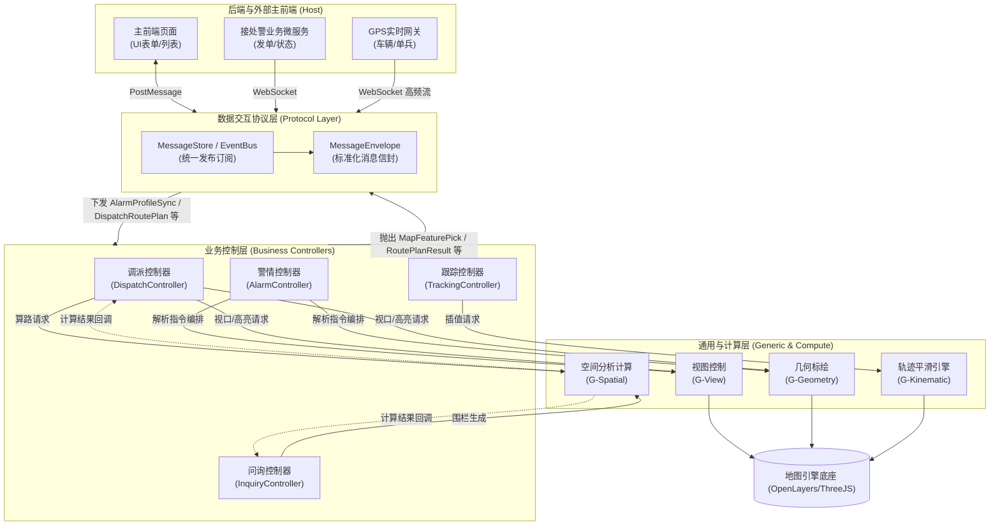
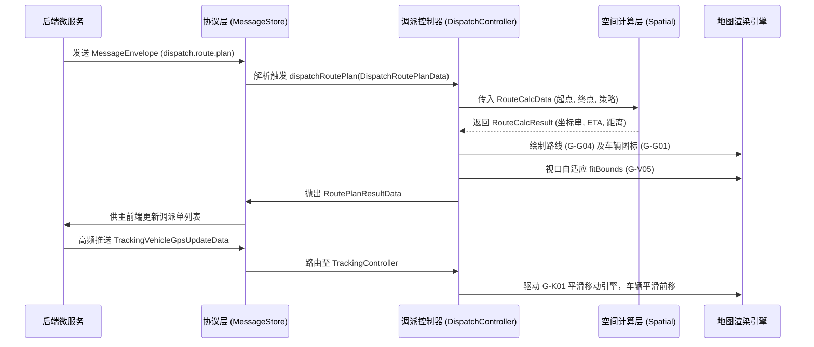

# GIS 数据交互协议结构与流向设计

**版本**：1.0
**日期**：2026-07-14
**适用范围**：消防接处警 GIS 系统前端架构、前后端交互协议、业务控制与计算层流转

---

## 1. 架构流转总览

系统的数据交互基于 **协议驱动 (Protocol-Driven)** 模式，形成严格的上下行数据闭环。整体数据流转贯穿四大核心层级：
1. **外部/后端层**：提供业务事件驱动和高频数据（如 GPS）。
2. **协议层 (Protocol Layer)**：通过 `EventBus` 和 `gisBridge` 规范化所有进出 GIS 系统的消息（标准信封 `MessageEnvelope`）。
3. **控制层 (Control Layer)**：解析协议数据，分为业务控制层（组装业务画像）和通用控制层（地图指令编排）。
4. **计算层 (Compute Layer)**：承接高密度计算（空间检索、路线规划、插值平滑等），并将计算结果返回控制层。

---

## 2. 协议层输入与输出结构 (Protocol ↔ Backend / Host)

### 2.1 统一信封契约 (MessageEnvelope)
前后端交互强制采用 `MessageEnvelope<T>` 结构，确保链路可追踪。

```typescript
type MessageEnvelope<T = any> = {
  id: string;                 // 请求事件ID，用于追踪与应答
  ts: number;                 // 时间戳
  system: 'host' | 'map' | 'dispatch'; // 消息来源系统
  eventKey: string;           // 事件路由键
  data: T;                    // 核心业务数据载荷 (Payload)
  targetSystem?: string;      // 目标系统 (可选)
  meta?: Record<string, any>; // 附加元数据 (可选)
}
```

### 2.2 协议层与后端的交互通道 (I/O)

| 方向 | 交互类型 | `eventKey` | `data` 载荷结构 | 说明 |
|------|---------|------------|-----------------|------|
| **双向** | 握手与心跳 | `hello` / `heartbeat` | `{ from, version }` / `'ping'\|'pong'` | 建立 WS 或 PostMessage 通道 |
| **GIS → 后端** | 状态同步 | `map.ready` | `{ ok: true }` | 通知主系统地图已就绪 |
| **GIS → 后端** | 拾取与交互 | `map.click` | `{ lngLat, pixel, featureId }` | 空间点击反查业务数据 |
| **GIS → 后端** | 规划结果上报 | `route.plan.result` | `RoutePlanResultData` | 将前端算路结果抛给调度侧 |
| **后端 → GIS** | 业务指令流 | `alarm.update` | `AlarmProfileSyncData` | 后端微服务推送最新警情画像 |
| **后端 → GIS** | 空间查询请求 | `route.plan.request`| `{ startLngLat, endLngLat }` | 请求 GIS 侧触发路径规划 |
| **后端 → GIS** | 高频数据流 | `dispatch.vehicle.move` | `TrackingVehicleGpsUpdateData`| 车辆 GPS 实时位置下发 |

---

## 3. 控制层与协议层的输入输出 (Control ↔ Protocol)

业务控制层通过监听协议层下发的强类型 `Interface`，执行对应的地图组合指令。处理完成后，再将业务结果上报给协议层。

### 3.1 下行业务流输入结构 (Input to Control)

| 核心协议对象 | 字段结构概要 | 业务用途 |
|-------------|-------------|----------|
| **`AlarmProfileSyncData`** | `incidentId`, `longitude`, `latitude`, `disaster_type`, `incidentState`... | 警情画像同步，贯穿值守、来电、调派、跟踪阶段，触发上图和状态流转。 |
| **`LocateCallData`** | `id`, `longitude`, `latitude`, `radius`, `Carrier_Loc` | 来电粗定位，触发基站 500m 粗定位圈标绘。 |
| **`DispatchViewportFitData`** | `incidentId`, `center`, `includeStations`, `includeVehicles` | 调派视口自适应，计算四级围栏和资源的最佳缩放比。 |
| **`DispatchRoutePlanData`** | `incidentId`, `start(station_id, lon, lat)`, `end`, `routeId` | 触发算路请求引擎，并在图上绘制路径线和 ETA 标签。 |
| **`DispatchRouteToggleData`** | `incidentId`, `routeList: [{ routeId, routeVisible, car_id }]` | 批量控制调派车辆与推荐路径的显隐。 |
| **`MapViewLoadData`** | `points`, `code`, `padding`, `duration` | 初始化多边形集合或行政区划定位。 |

### 3.2 上行状态流输出结构 (Output to Protocol)

| 核心协议对象 | 字段结构概要 | 业务用途 |
|-------------|-------------|----------|
| **`MapViewChangedData`** | `center`, `zoom`, `bounds(north, south, east, west)` | 视口平移/缩放后，输出当前视野范围供主屏联动。 |
| **`MapFeaturePickData`** | `incidentId`, `featureType`, `featureId`, `displayName` | 用户在图上点选车辆、警情、消防站后，输出拾取实体。 |
| **`RoutePlanResultData`** | `incidentId`, `routeId`, `eta`, `distance`, `recommended` | 路径规划与距离估算完成后的结果反馈。 |
| **`MapLayerVisibleChangeData`**| `incidentId`, `layers: [{ layerType, visible }]` | 图层树状态变更通知。 |

---

## 4. 计算层与控制层的输入输出 (Compute ↔ Control)

计算层提供无业务状态的纯算法支持。控制层传入空间参数，计算层输出拓扑与算路结果。

### 4.1 计算层核心 I/O 结构

| 能力模块 | 输入参数结构 (Input) | 输出结果结构 (Output) | 说明 |
|----------|----------------------|-----------------------|------|
| **空间检索 (G-S01)** | `EsQueryData`: <br>`{ geometry: Polygon/Circle, types, limit }` | 要素列表 `Feature[]` | 基于多边形围栏，查询区域内的水源、重点单位。 |
| **缓冲聚合 (G-S02)** | `BufferCalcData`: <br>`{ input: { center, radius } }` | 多边形 `Geometry` | 来电/微围栏场景，根据中心点与半径生成扩边多边形。 |
| **路径算路 (G-S03)** | `RouteCalcData`: <br>`{ start, end, strategy }` | `RouteCalcResult`: <br>`{ coordinates, distanceMeters, durationSeconds }` | 高德/路网算路，输出轨迹点集及 ETA 时长。 |
| **平滑插值 (G-K01)** | `SmoothMoveData`: <br>`{ featureId, targetLngLat, duration }` | 内部动画逐帧 Tick | 车辆高频跟踪，实现经纬度线性/样条插值动画。 |

---

## 5. 全局数据交互流向可视化 (Mermaid)

### 5.1 全局系统架构与数据流转关系图



### 5.2 调派与跟踪业务流向微观图 (Dispatch & Tracking Data Flow)



---

## 6. 输入输出字段对象全量字典 (I/O Dictionary)

| 分类 | 协议/数据对象 | 核心字段描述 | 业务流向 |
|---|---|---|---|
| **协议包装** | `MessageEnvelope<T>` | `id`(追踪ID), `system`(来源), `eventKey`(事件键), `data`(载荷) | Global ↔ Protocol |
| **警情画像** | `AlarmProfileSyncData` | `incidentId`, `longitude`, `latitude`, `disaster_type`, `incidentStateName`, `buildingId` | Backend → Protocol → BusinessCtrl |
| **弹屏定位** | `LocateCallData` | `id`, `longitude`, `latitude`, `radius`, `Carrier_Loc` | Backend → Protocol → InquiryCtrl |
| **调派视口** | `DispatchViewportFitData` | `incidentId`, `center`, `includeAlarmPoint`, `includeStations` | Backend → Protocol → DispatchCtrl |
| **算路入参** | `DispatchRoutePlanData` | `incidentId`, `start(station_id, lon, lat)`, `end`, `recommended` | Protocol → DispatchCtrl → Spatial |
| **算路出参** | `RoutePlanResultData` | `incidentId`, `routeId`, `eta`, `distance`, `recommended` | Spatial → DispatchCtrl → Protocol |
| **车辆过滤** | `DispatchStationEtaFilterData` | `incidentId`, `etaMax`, `stationList(station_id, eta, matched)` | Backend → Protocol → DispatchCtrl |
| **拾取反馈** | `MapFeaturePickData` | `incidentId`, `featureType`, `featureId`, `displayName`, `lon/lat` | GenericCtrl → BusinessCtrl → Protocol |
| **空间计算** | `EsQueryData` | `geometry(type, center, radius, coordinates)`, `types`, `limit` | BusinessCtrl → Spatial |
| **平滑插值** | `SmoothMoveData` | `featureId`, `targetLngLat`, `duration` | TrackingCtrl → KinematicEngine |
| **地图基础** | `MarkerAddData` | `id`, `lngLat`, `iconType`, `iconUrl` | BusinessCtrl → GenericCtrl |

---

**设计总结**：
本设计确立了 **数据单向流动与层级隔离**。外部系统只能与协议层对话，协议层提供标准信封；业务控制层只能通过监听协议来编排流程；复杂的数学与空间推演全部下沉到计算层。通过 `Interface` 契约定义，彻底解耦了 Vue 组件状态、业务逻辑与底层 OpenLayers/ThreeJS 引擎。
