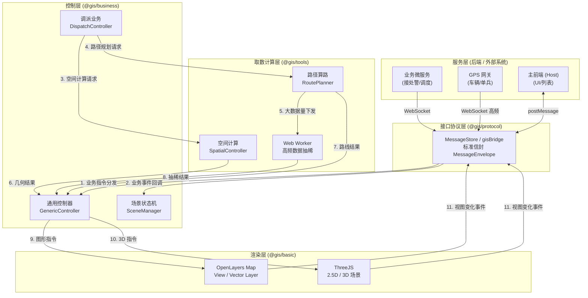
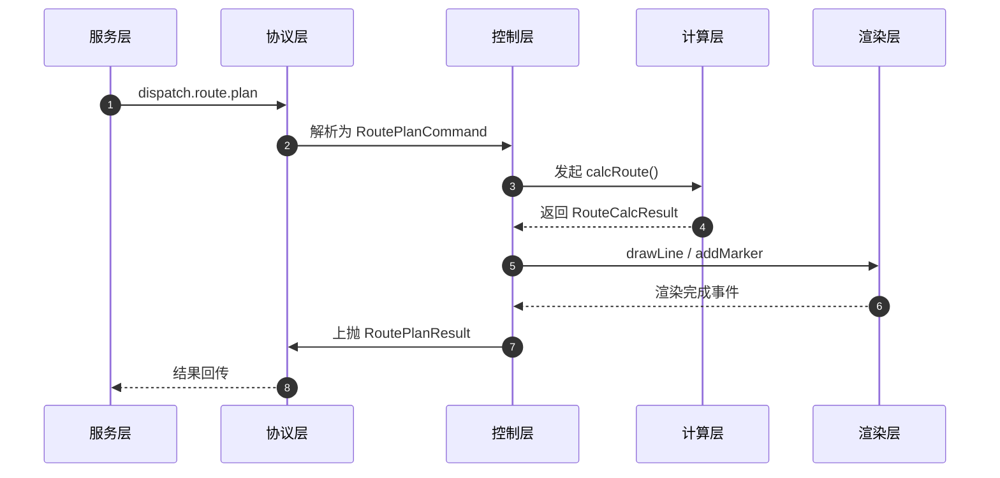
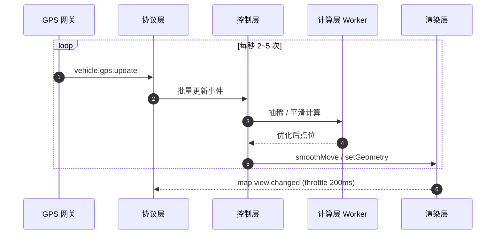

# 03-综合数据流转关系图

**版本**：v2.0
**日期**：2026-07-14
**职责**：提供"全局一张大图"，展现服务层、接口协议层、取数计算层、控制层、渲染层之间的协同与数据流。

---

## 1. 五层架构全局流转图

---

## 2. 分层职责契约表

| 层级 | 输入 | 输出 | 不允许做 |
|------|------|------|----------|
| **服务层** | 真实业务事件 | 业务数据 | 直接调用地图引擎 |
| **协议层** | 业务数据 | 标准化信封 | 业务解析/计算/渲染 |
| **计算层** | 空间参数 | 几何/数值结果 | 持有 DOM/Map 引用 |
| **控制层** | 协议事件 + 计算结果 | 图形指令 | 重复计算/直接渲染 |
| **渲染层** | 图形指令 | 视觉呈现 + 事件 | 业务逻辑 |

---

## 3. 推模式 vs 拉模式 协同

### 3.1 推模式（默认）
- 后端主动推送 → 协议层 → 控制层 → 渲染层。
- 适用于：警情状态变更、调度指令下达、车辆 GPS 实时位置。

### 3.2 拉模式（按需）
- 协议层收到 `pull.request` → 计算层（取数层）发起 HTTP → 清洗数据 → 控制层。
- 适用于：初次进入场景拉取警情列表、刷新辖区围栏数据。

### 3.3 模式选择矩阵

| 业务 | 模式 | 触发频次 | 链路 |
|------|------|----------|------|
| 警情画像同步 | 推 | 低频（事件驱动） | 1→2→4→5 |
| 车辆 GPS | 推 | 高频（≥ 2fps） | 1→2→4→5 |
| 路径规划 | 推 | 一次性 | 1→2→4→3→4→5 |
| 警情列表拉取 | 拉 | 一次性 | 2→3→4→5 |
| 辖区刷新 | 拉 | 定时（5min） | 2→3→4→5 |

---

## 4. 数据流向的"单向性"约束

为了避免循环依赖与状态混乱，所有跨层数据流动必须遵循 **自上而下** 与 **自下而上事件回传** 两条独立通道：

- **自上而下（Command）**：Service → Protocol → Control → Render
- **自下而上（Event）**：Render → Control → Protocol → Service

严禁出现：Render → Service 直连、Control ↔ Render 双向绑定等情况。

---

## 5. 关键协同时序

### 5.1 调派算路与渲染协同

### 5.2 高频车辆 GPS 协同

---

## 6. 性能与降级耦合点

| 瓶颈 | 检测方式 | 自动降级策略 |
|------|----------|--------------|
| 渲染帧率 < 30fps | RAF 监控 | 暂停轨迹尾迹、平滑插值退化为直接 setGeometry |
| 计算 Worker 超时 | 超时定时器 | 切换主线程同步简化算法 |
| 协议队列积压 | 队列长度监控 | 丢弃过期 GPS，仅保留最新 |
| 地图实例数 > 5 | 实例计数 | 复用已有实例，拒绝新建 |
