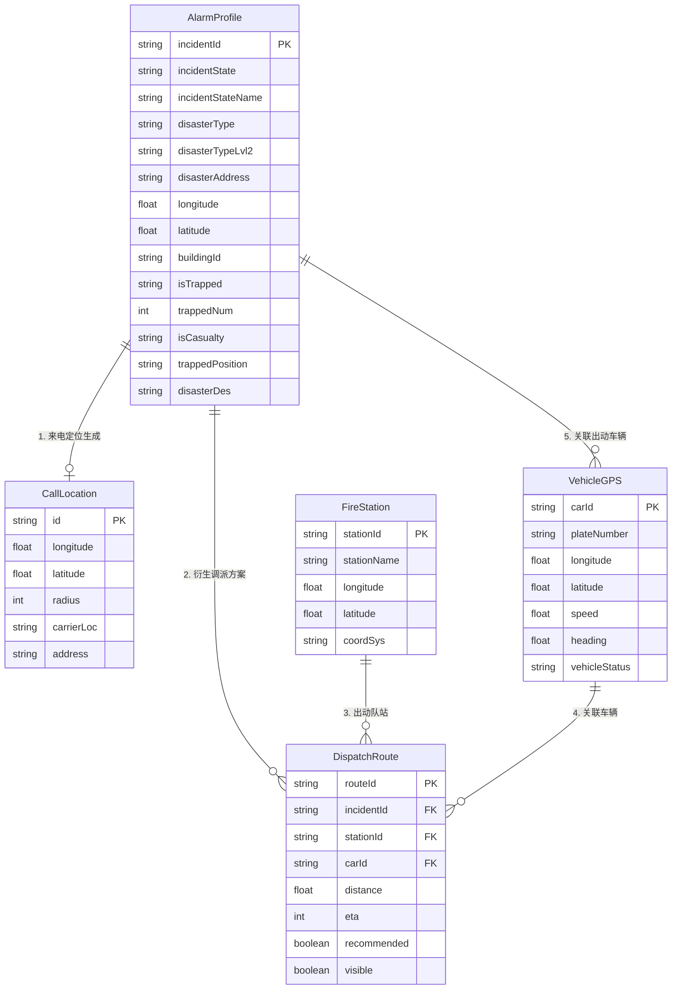
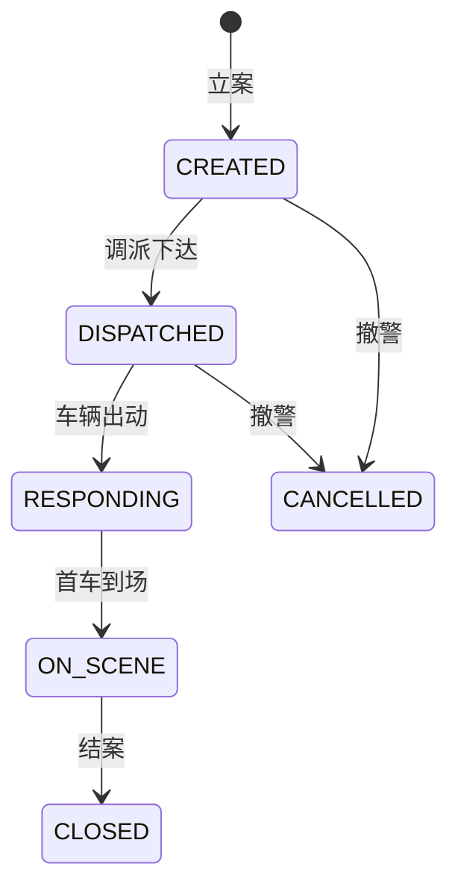
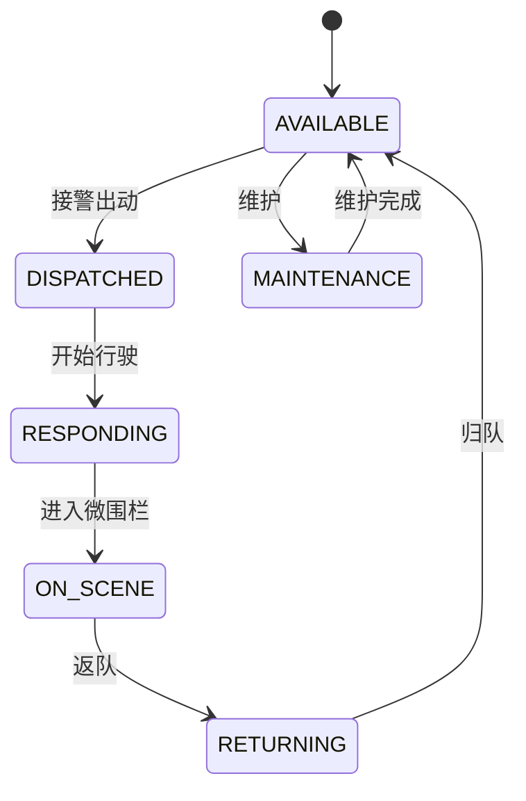

# 04-各阶段业务 ER 关系与字段字典

**版本**：v2.0
**日期**：2026-07-14
**职责**：梳理 GIS 侧业务实体（Entity）的关系与字段，作为 TypeScript 类型字典与数据库 DTO 设计的参考。

---

## 1. 业务实体 ER 关系图

---

## 2. 实体关系说明

| 关系 | 描述 | 业务场景 |
|------|------|----------|
| AlarmProfile → CallLocation (1:0..1) | 警情可能由来电定位发起 | 来电弹屏 → 立案 |
| AlarmProfile → DispatchRoute (1:N) | 一个警情可有多套调派方案 | 主管站 + 3 支撑站 |
| FireStation → DispatchRoute (1:N) | 队站可被分配多个调派任务 | 多警情并发 |
| VehicleGPS → DispatchRoute (1:N) | 一辆车可有多段历史路线 | 复盘 |
| AlarmProfile → VehicleGPS (1:N) | 一警情对应多台出动车 | 跟踪阶段 |

---

## 3. 字段字典（TypeScript 风格）

### 3.1 AlarmProfile

| 字段 | 类型 | 必填 | 说明 |
|------|------|------|------|
| `incidentId` | `string` | ✅ | 警情事件唯一 ID |
| `incidentState` | `IncidentState` | ✅ | 见状态机 |
| `incidentStateName` | `string` | - | 状态中文名 |
| `disasterType` | `DisasterType` | ✅ | 灾害类型枚举 |
| `disasterTypeLvl2` | `string` | - | 细类 |
| `disasterAddress` | `string` | - | 灾害地址 |
| `longitude` | `number` | - | WGS84 经度 |
| `latitude` | `number` | - | WGS84 纬度 |
| `buildingId` | `string` | - | 关联建筑 ID |
| `isTrapped` | `'TRUE' \| 'FALSE'` | - | 是否有被困人员 |
| `trappedNum` | `number` | - | 被困人数 |
| `isCasualty` | `'TRUE' \| 'FALSE'` | - | 是否有伤亡 |
| `trappedPosition` | `string` | - | 被困位置描述 |
| `disasterDes` | `string` | - | 灾害描述 |

### 3.2 CallLocation

| 字段 | 类型 | 必填 | 说明 |
|------|------|------|------|
| `id` | `string` | ✅ | 定位 ID |
| `longitude` | `number` | ✅ | 基站经度 |
| `latitude` | `number` | ✅ | 基站纬度 |
| `radius` | `number` | ✅ | 定位精度（米） |
| `carrierLoc` | `string` | - | 运营商信息 |
| `address` | `string` | - | 反查地址 |

### 3.3 DispatchRoute

| 字段 | 类型 | 必填 | 说明 |
|------|------|------|------|
| `routeId` | `string` | ✅ | 路线 ID |
| `incidentId` | `string` | ✅ | 警情 ID |
| `stationId` | `string` | ✅ | 出发队站 |
| `carId` | `string` | - | 关联车辆 |
| `distance` | `number` | - | 距离（米） |
| `eta` | `number` | - | 预计时长（秒） |
| `recommended` | `boolean` | - | 是否推荐 |
| `visible` | `boolean` | - | 是否显示 |

### 3.4 VehicleGPS

| 字段 | 类型 | 必填 | 说明 |
|------|------|------|------|
| `carId` | `string` | ✅ | 车辆 ID |
| `plateNumber` | `string` | - | 车牌 |
| `longitude` | `number` | ✅ | WGS84 |
| `latitude` | `number` | ✅ | WGS84 |
| `speed` | `number` | - | km/h |
| `heading` | `number` | - | 0~360 方位角 |
| `vehicleStatus` | `VehicleStatus` | - | 见状态机 |

---

## 4. 状态机

### 4.1 IncidentState（警情状态）

### 4.2 VehicleStatus（车辆状态）

---

## 5. 坐标字段统一规范

- 所有 `longitude`/`latitude` 默认 **WGS84 / EPSG:4326**。
- 涉及高德底图时，在渲染层做 WGS84 → GCJ02 转换（详见 `06-坐标系统与转换规范.md`）。
- 数据库存储推荐 `DECIMAL(10,7)` 精度（保留到毫米级，避免浮点漂移）。

---

## 6. ID 命名规范

| 实体 | ID 前缀 | 示例 |
|------|---------|------|
| 警情 | `INC` | `INC20260714001` |
| 来电 | `CALL` | `CALL_98765` |
| 队站 | `ST` | `ST_001` |
| 车辆 | `CAR` | `CAR_粤B12345` |
| 路线 | `ROUTE` | `ROUTE_ST001_TO_INC001` |
| 图元 marker | `marker_<businessId>` | `marker_INC20260714001` |
| 图元 polygon | `polygon_<businessId>` | `polygon_zone_xxx` |
| 图元 line | `line_<businessId>` | `line_route_xxx` |
