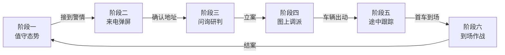
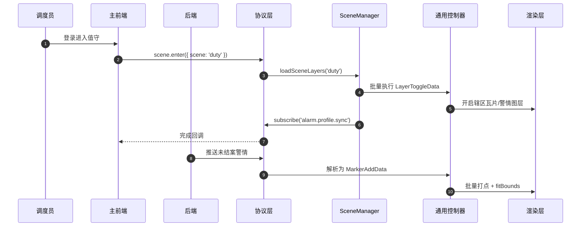
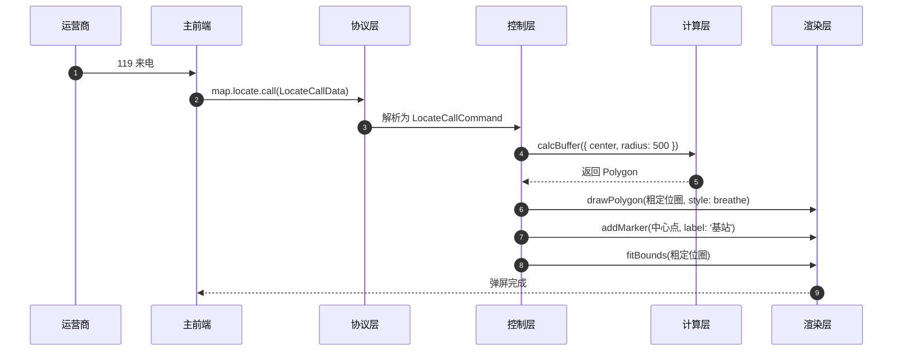
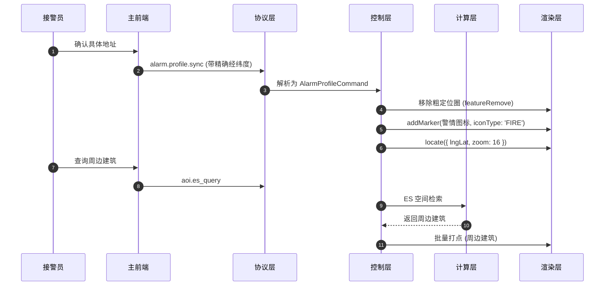
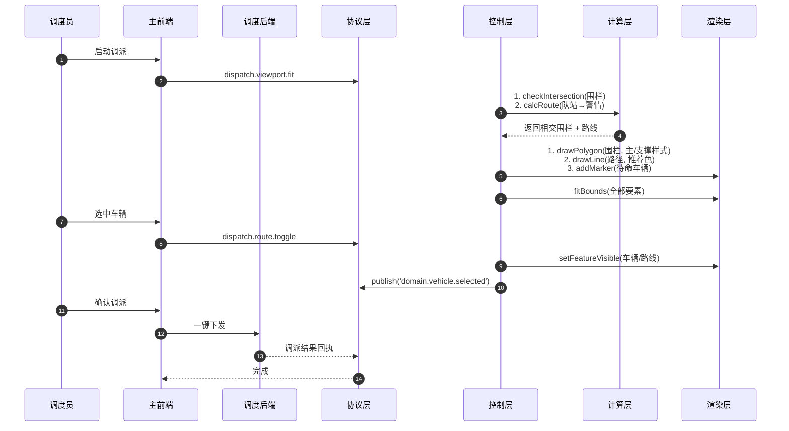
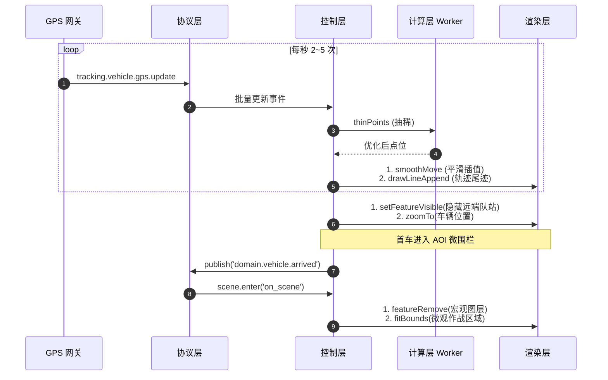
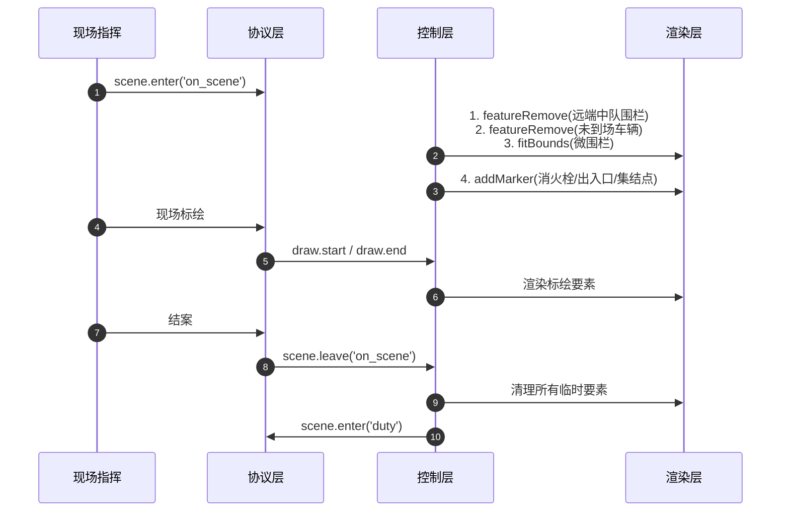

# 05-核心场景端到端流程与渲染实现

**版本**：v2.0
**日期**：2026-07-14
**职责**：从"主前端 → 后端 → GIS 协议层 → 控制层 → 计算层 → 渲染层"完整链路，展示核心业务场景（值守、来电、问询、调派、跟踪）的端到端流程与 OpenLayers 渲染映射。

---

## 1. 全场景流程总览

---

## 2. 阶段一：值守态势初始化

**OpenLayers 渲染映射**：
- 辖区瓦片 → `new TileLayer({ source: new XYZ({...}) })`
- 警情点 → `VectorLayer` + `Point Feature` + `Style(Image)`
- 视口自适应 → `view.fit(extent, { padding: [50,50,50,50], duration: 800 })`

---

## 3. 阶段二：来电弹屏

**OpenLayers 渲染映射**：
- 粗定位圈 → `Polygon Feature` + `Stroke({ color: 'red', lineDash: [10,5] })`
- 中心点 → `Point` + 自定义 `Icon`
- 呼吸动画 → `setStyle` 定时器 + `Fill({ color: 'rgba(255,0,0,0.2)' })`

---

## 4. 阶段三：问询研判与立案

**OpenLayers 渲染映射**：
- 移除要素 → `source.removeFeature(feature)`
- 添加新要素 → `source.addFeature(new Feature({ geometry, style }))`
- 视口定位 → `view.animate({ center, zoom, duration: 800 })`

---

## 5. 阶段四：图上调派

**OpenLayers 渲染映射**：
- 主管围栏 → `Stroke({ color: 'red', width: 3 })`
- 支撑围栏 → `Stroke({ color: 'orange', lineDash: [5,5] })`
- 推荐路径 → `Stroke({ color: 'green', width: 4 })`
- 普通路径 → `Stroke({ color: 'gray', width: 2 })`
- 选中车辆 → `Icon` + `Stroke({ color: 'gold', width: 3 })` 外发光

---

## 6. 阶段五：途中跟踪

**OpenLayers 渲染映射**：
- 平滑移动 → `view.animate({ center: fromLonLat(coords), duration })` + `setGeometry`
- 轨迹尾迹 → `LineString Feature` + `Stroke({ color: 'blue' })`，持续 `appendCoordinate`
- 微围栏 → `Polygon` + `Fill({ color: 'rgba(0,255,0,0.2)' })`

---

## 7. 阶段六：到场作战

---

## 8. 性能优化关键点

| 场景 | 性能瓶颈 | 优化措施 |
|------|----------|----------|
| 阶段三 ES 检索 | 大量周边要素 | 渲染层聚合（cluster）+ LOD |
| 阶段四 多车渲染 | 50+ 车辆 | 视口裁剪 + Canvas 渲染降级 |
| 阶段五 高频 GPS | 10+ 车每秒 | Worker 抽稀 + 节流到 2fps |
| 阶段五 轨迹尾迹 | 长时间累积 | 保留最近 1000 个点 + 抽稀 |

---

## 9. 错误降级矩阵

| 错误 | 表现 | 自动降级 |
|------|------|----------|
| 路径规划失败 | 无路线渲染 | 不显示路径，提示手动选车 |
| GPS 失联 | 车辆图标停止 | 灰显 + 沿最后方向线性外推 |
| 围栏加载失败 | 无围栏渲染 | 降级为圆心半径显示 |
| WMS 瓦片失败 | 黑屏/灰块 | 显示占位符 + 1/3/5s 重试 |
| Web Worker 崩溃 | 计算阻塞 | 重建 Worker + 主线程同步接管 |
