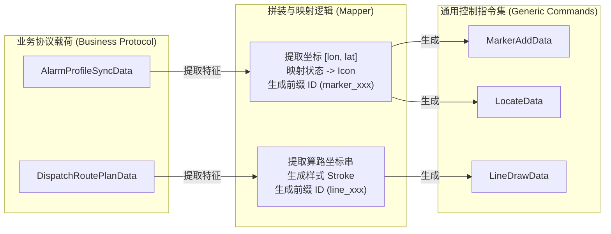

# 08-业务协议到通用控制指令的拼装映射与数据流转

**版本**：v2.0
**日期**：2026-07-14
**职责**：深度剖析**业务控制层**（解析协议）如何拼装、转化并调用**通用控制层**（基础组件），以及在转化过程中 JSON 数据集合（DTO）的映射与流转。

---

## 1. 业务协议到通用指令的“降维”拼装模型

系统中的数据流转本质上是一个**降维解码**的过程：
- **输入（Input）**：携带浓厚业务语义的宏观 JSON 对象（如 `AlarmProfileSyncData`，包含火灾类型、建筑ID等）。
- **处理（Process）**：业务控制器提取关键坐标、状态，结合业务规则（如“火灾”对应特定 Icon），拼装为纯图形指令。
- **输出（Output）**：高度扁平化的通用几何/视口 JSON 集合（如 `MarkerAddData`，仅包含 `id`, `lngLat`, `iconType`）。

---

## 2. 核心场景的数据拼装与流转字典

以下列出各核心场景下，业务控制器如何接收协议对象，并拼装出多个通用控制指令对象的映射细节。

### 2.1 警情精确上图场景 (Alarm Profile Sync)

**触发事件**：`alarm.profile.sync`
**业务控制器**：`AlarmController`

| 输入业务对象【协议层】 | 提取与映射逻辑【计算层/业务控制层】 | 输出通用控制指令集 (拼装结果)【通用控制层】 |
|-------------|----------------|-------------------------------|
| **`AlarmProfileSyncData`** - `incidentId: string` - `longitude: number` - `latitude: number` - `disaster_type: string` - `incidentState: string` | 1. 组合 `[longitude, latitude]` 为 `lngLat` 数组。 2. 根据 `disaster_type` 映射对应的 `StyleKey` (如 'FIRE' -> `FIRE_ICON`)。 3. 提取 `incidentId` 作为通用要素的主键 ID。 | **指令 1：打点标绘 (`G-G01`)** `MarkerAddData`:  `{ id: incidentId, lngLat: [lon, lat], iconType: 'FIRE_ICON' }`  **指令 2：视口平移 (`G-V01`)** `LocateData`:  `{ lngLat: [lon, lat], zoom: 16, duration: 800 }` |

### 2.2 来电粗定位场景 (Incoming Call)

**触发事件**：`map.locate.call`
**业务控制器**：`CallController`

| 输入业务对象【协议层】 | 提取与映射逻辑【计算层/业务控制层】 | 输出通用控制指令集 (拼装结果)【通用控制层】 |
|-------------|----------------|-------------------------------|
| **`LocateCallData`** - `id: string` - `longitude: number` - `latitude: number` - `radius: number` - `Carrier_Loc: string` | 1. 将 `[lon, lat]` 与 `radius` 送入计算层生成 Buffer 面。 2. 接收返回的 `Polygon Geometry`。 3. 组装红色的透明填充色与虚线边框。 4. 提取 `Carrier_Loc` 组装为中心点的文字标签。 | **指令 1：画粗定位圈 (`G-G02`)** `PolygonDrawData`:  `{ id: 'circle_'+id, geometry: Polygon, fillColor: 'rgba(255,0,0,0.2)' }`  **指令 2：打中心点 (`G-G01`)** `MarkerAddData`:  `{ id: 'center_'+id, lngLat: [lon, lat], iconParams: { text: Carrier_Loc } }`  **指令 3：视口自适应 (`G-V05`)** `FitBoundsData`:  `{ geometry: Polygon, padding: [50,50,50,50] }` |

### 2.3 调派算路与路线展示场景 (Dispatch Route Plan)

**触发事件**：`dispatch.route.plan`
**业务控制器**：`DispatchController`

| 输入业务对象【协议层】 | 提取与映射逻辑【计算层/业务控制层】 | 输出通用控制指令集 (拼装结果)【通用控制层】 |
|-------------|----------------|-------------------------------|
| **`DispatchRoutePlanData`** - `incidentId: string` - `routeId: string` - `start: { station_id, lon, lat }` - `end: { lon, lat }` - `recommended: boolean` | 1. 将 `start` 和 `end` 坐标送入路网计算层。 2. 获得算路结果的坐标串 `coordinates`。 3. 根据 `recommended` 状态决定路线颜色（推荐=绿色，普通=灰色）。 4. 提取起终点坐标拼装队站和警情点。 | **指令 1：画路径线 (`G-G04`)** `LineDrawData`:  `{ id: routeId, coordinates: [[lon,lat]...], strokeColor: '#00FF00' }`  **指令 2：打队站点 (`G-G01`)** `MarkerAddData`:  `{ id: start.station_id, lngLat: [start.lon, start.lat], iconType: 'STATION_ICON' }`  **指令 3：抛出算路结果事件** `RoutePlanResultData`:  `{ routeId, eta, distance, recommended }` |

### 2.4 车辆实时跟踪场景 (Vehicle Tracking)

**触发事件**：`tracking.vehicle.gps.update`
**业务控制器**：`TrackingController`

| 输入业务对象【协议层】 | 提取与映射逻辑【计算层/业务控制层】 | 输出通用控制指令集 (拼装结果)【通用控制层】 |
|-------------|----------------|-------------------------------|
| **`TrackingVehicleGpsUpdateData`** - `carId: string` - `longitude: number` - `latitude: number` | 1. 组装目标坐标 `[lon, lat]`。 2. 从业务缓存中获取车辆当前在地图上的实际坐标。 3. 计算两点之间的差值并设定动画持续时间 `duration`。 4. 缓存历史坐标用于追加尾迹。 | **指令 1：平滑移动引擎 (`G-K01`)** `SmoothMoveData`:  `{ featureId: 'marker_'+carId, targetLngLat: [lon, lat], duration: 1000 }`  **指令 2：追加尾迹 (`G-K02`)** `TrackAppendData`:  `{ lineId: 'trail_'+carId, newLngLat: [lon, lat] }` |

---

## 3. 通用控制层输入集合全量字典 (Generic Control Input DTOs)

为了补全 `04-三层综合交互与可视化` 中遗漏的通用层（渲染前最后一步）输入集合对象，特列出如下字典。这些对象是**业务控制层输出的结果**，同时也是**通用控制层（地图引擎执行绘制）接收的唯一标准输入契约**。

### 3.1 视图控制类输入集合 (`ViewController`)

| 对象名 | 字段结构 | 说明 |
|--------|----------|------|
| **`LocateData`** | `lngLat`: `[number, number]` `zoom`: `number` `duration?`: `number` | 单点中心定位与缩放。 |
| **`FitBoundsData`** | `geometry`: `GeoJSON.Polygon` / `LineString` `padding?`: `number[]` `duration?`: `number` | 根据传入的几何图形，自动计算 BBox 并留出边距进行缩放适配。 |
| **`LayerToggleData`** | `layerId`: `string` `visible`: `boolean` | 切换指定底图或 WMS 图层的显示状态。 |

### 3.2 几何标绘类输入集合 (`GeometryController`)

| 对象名 | 字段结构 | 说明 |
|--------|----------|------|
| **`MarkerAddData`** | `id`: `string` `lngLat`: `[number, number]` `iconType?`: `StyleKey` `iconUrl?`: `string` `iconParams?`: `Record<string, any>` | 添加一个点状要素。支持传入业务映射的枚举 `iconType` 或是绝对路径 `iconUrl`。 |
| **`PolygonDrawData`** | `id`: `string` `geometry`: `GeoJSON.Polygon` `fillColor?`: `string` `strokeColor?`: `string` | 绘制面状要素（如辖区围栏、粗定位圈）。 |
| **`LineDrawData`** | `id`: `string` `coordinates`: `[number, number][]` `strokeColor?`: `string` `width?`: `number` | 绘制线状要素（如车辆路线、历史轨迹）。 |
| **`FeatureRemoveData`** | `featureIds`: `string[]` | 批量移除指定的要素，支持按前缀匹配清除。 |
| **`FeatureVisibleData`**| `featureId`: `string` `visible`: `boolean` | 单一要素的显隐切换，隐藏时会在内部缓存其原始样式。 |

### 3.3 动画与运动类输入集合 (`KinematicController`)

| 对象名 | 字段结构 | 说明 |
|--------|----------|------|
| **`SmoothMoveData`** | `featureId`: `string` `targetLngLat`: `[number, number]` `duration`: `number` | 触发指定点要素的 requestAnimationFrame 平滑插值移动。 |
| **`TrackAppendData`** | `lineId`: `string` `newLngLat`: `[number, number]` | 往现有的线状要素末尾追加一个坐标点，用于画尾迹。 |

---

## 4. 业务 ID 到通用 ID 的隔离机制

在拼装映射过程中，**必须**解决的一个核心问题是：同一警情（或车辆）在地图上可能对应多个不同类型的图形（例如一个警情同时有图标、有红圈、有文字）。

**解决方案：前缀分组隔离**
业务控制器在生成通用指令时，强制在原始业务 ID 前附加几何类型前缀。
- 警情点 (`INC001`) -> `MarkerAddData.id = 'marker_INC001'`
- 定位圈 (`INC001`) -> `PolygonDrawData.id = 'polygon_INC001'`
- 连线 (`INC001`) -> `LineDrawData.id = 'line_INC001'`

这使得底层的 `FeatureRemoveData` 在接收到业务要求“清空该警情所有图元”时，可以通过前缀匹配实现精准批量回收。
