# GIS 前端数据交互与架构全景设计 (整合版)

**版本**：v2.0
**日期**：2026-07-14
**适用对象**：消防接处警 GIS 前端架构师、核心开发、SRE/DevOps
**说明**：本文档整合了 `mds/minmax_output` 目录下的所有子文档，提供了 GIS 前端数据交互与流转的完整设计视角。

## 目录
- [第一部分：架构总览与核心场景流转](#第一部分架构总览与核心场景流转)
  - [1. 综合数据流转关系图](#1-综合数据流转关系图)
  - [2. 核心场景端到端流程与渲染实现](#2-核心场景端到端流程与渲染实现)
  - [3. 业务协议到通用控制指令的拼装映射与数据流转](#3-业务协议到通用控制指令的拼装映射与数据流转)
- [第二部分：业务实体与数据契约](#第二部分业务实体与数据契约)
  - [4. 各阶段业务 ER 关系与字段字典](#4-各阶段业务-er-关系与字段字典)
  - [5. 协议层与后端 I/O 契约](#5-协议层与后端-io-契约)
  - [6. 计算层与控制层 I/O 契约](#6-计算层与控制层-io-契约)
- [第三部分：规范与指标 (非核心描述)](#第三部分规范与指标-非核心描述)
  - [7. 坐标系统与转换规范](#7-坐标系统与转换规范)
  - [8. SLA 性能指标与验收标准矩阵](#8-sla-性能指标与验收标准矩阵)

---

# 第一部分：架构总览与核心场景流转

## 1. 综合数据流转关系图

**职责**：提供"全局一张大图"，展现服务层、接口协议层、取数计算层、控制层、渲染层之间的协同与数据流。

### 1.1 五层架构全局流转图

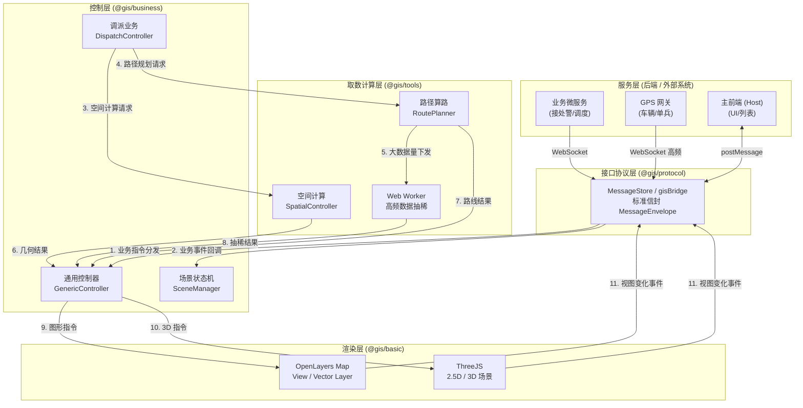

### 1.2 分层职责契约表

| 层级 | 输入 | 输出 | 不允许做 |
|------|------|------|----------|
| **服务层** | 真实业务事件 | 业务数据 | 直接调用地图引擎 |
| **协议层** | 业务数据 | 标准化信封 | 业务解析/计算/渲染 |
| **计算层** | 空间参数 | 几何/数值结果 | 持有 DOM/Map 引用 |
| **控制层** | 协议事件 + 计算结果 | 图形指令 | 重复计算/直接渲染 |
| **渲染层** | 图形指令 | 视觉呈现 + 事件 | 业务逻辑 |

### 1.3 推模式 vs 拉模式 协同

#### 1.3.1 推模式（默认）
- 后端主动推送 → 协议层 → 控制层 → 渲染层。
- 适用于：警情状态变更、调度指令下达、车辆 GPS 实时位置。

#### 1.3.2 拉模式（按需）
- 协议层收到 `pull.request` → 计算层（取数层）发起 HTTP → 清洗数据 → 控制层。
- 适用于：初次进入场景拉取警情列表、刷新辖区围栏数据。

#### 1.3.3 模式选择矩阵

| 业务 | 模式 | 触发频次 | 链路 |
|------|------|----------|------|
| 警情画像同步 | 推 | 低频（事件驱动） | 1→2→4→5 |
| 车辆 GPS | 推 | 高频（≥ 2fps） | 1→2→4→5 |
| 路径规划 | 推 | 一次性 | 1→2→4→3→4→5 |
| 警情列表拉取 | 拉 | 一次性 | 2→3→4→5 |
| 辖区刷新 | 拉 | 定时（5min） | 2→3→4→5 |

### 1.4 数据流向的"单向性"约束

为了避免循环依赖与状态混乱，所有跨层数据流动必须遵循 **自上而下** 与 **自下而上事件回传** 两条独立通道：

- **自上而下（Command）**：Service → Protocol → Control → Render
- **自下而上（Event）**：Render → Control → Protocol → Service

严禁出现：Render → Service 直连、Control ↔ Render 双向绑定等情况。

### 1.5 关键协同时序

#### 1.5.1 调派算路与渲染协同

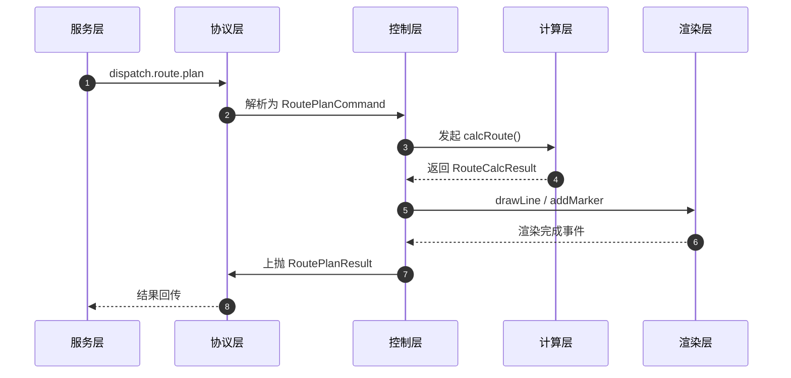

#### 1.5.2 高频车辆 GPS 协同

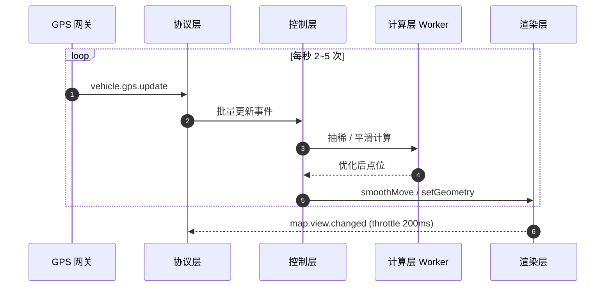

### 1.6 性能与降级耦合点

| 瓶颈 | 检测方式 | 自动降级策略 |
|------|----------|--------------|
| 渲染帧率 < 30fps | RAF 监控 | 暂停轨迹尾迹、平滑插值退化为直接 setGeometry |
| 计算 Worker 超时 | 超时定时器 | 切换主线程同步简化算法 |
| 协议队列积压 | 队列长度监控 | 丢弃过期 GPS，仅保留最新 |
| 地图实例数 > 5 | 实例计数 | 复用已有实例，拒绝新建 |

---

## 2. 核心场景端到端流程与渲染实现

**职责**：从"主前端 → 后端 → GIS 协议层 → 控制层 → 计算层 → 渲染层"完整链路，展示核心业务场景（值守、来电、问询、调派、跟踪）的端到端流程与 OpenLayers 渲染映射。

### 2.1 全场景流程总览 (动频与生命周期)

业务状态流：`值守模式` → `来电接入` → `问询研判` → `调派决策` → `跟踪/到场作战`。
GIS 数据的动频分类：
- **几乎不动（蓝常驻）**：路网骨架、队站辖区围栏基础、重点单位、消防栓基础。
- **偶尔动（橙阶段驱动）**：警情地址描述、初/精确定位修正、围栏高亮切换、预案车辆高亮。
- **经常动（红实时订阅）**：车辆轨迹平滑移动、动态 ETA 实时刷新、实时路况颜色。


### 2.2 阶段一：值守态势初始化

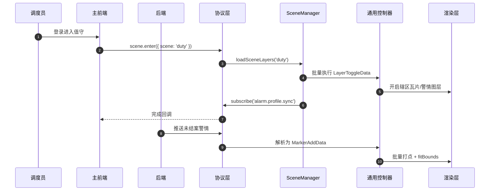

**OpenLayers 渲染映射**：
- 辖区瓦片 → `new TileLayer({ source: new XYZ({...}) })`
- 警情点 → `VectorLayer` + `Point Feature` + `Style(Image)`
- 视口自适应 → `view.fit(extent, { padding: [50,50,50,50], duration: 800 })`

### 2.3 阶段二：来电弹屏

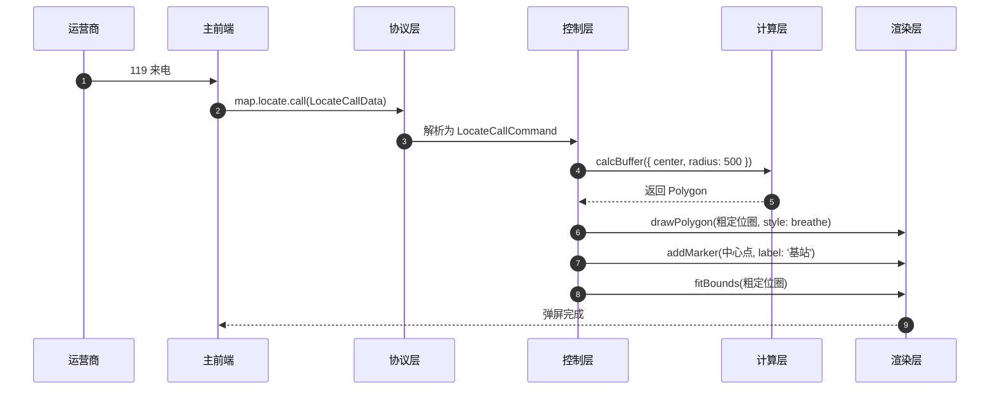

**OpenLayers 渲染映射**：
- 粗定位圈 → `Polygon Feature` + `Stroke({ color: 'red', lineDash: [10,5] })`
- 中心点 → `Point` + 自定义 `Icon`
- 呼吸动画 → `setStyle` 定时器 + `Fill({ color: 'rgba(255,0,0,0.2)' })`

### 2.4 阶段三：问询研判与立案

**动频**：偶尔动（警情地址精确定位/修正，微围栏切换，维度控制）。

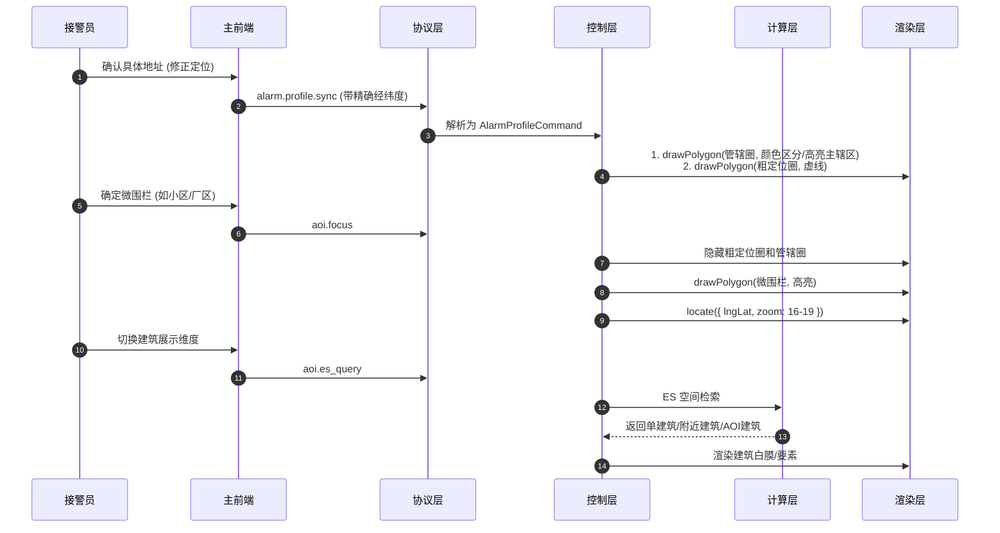

**OpenLayers 渲染映射**：
- 移除要素 → `source.removeFeature(feature)`
- 添加新要素 → `source.addFeature(new Feature({ geometry, style }))`
- 视口定位 → `view.animate({ center, zoom, duration: 800 })`

### 2.5 阶段四：图上调派

**动频**：偶尔动（围栏高亮，车辆待命/预案推荐高亮，微观要素展示）。

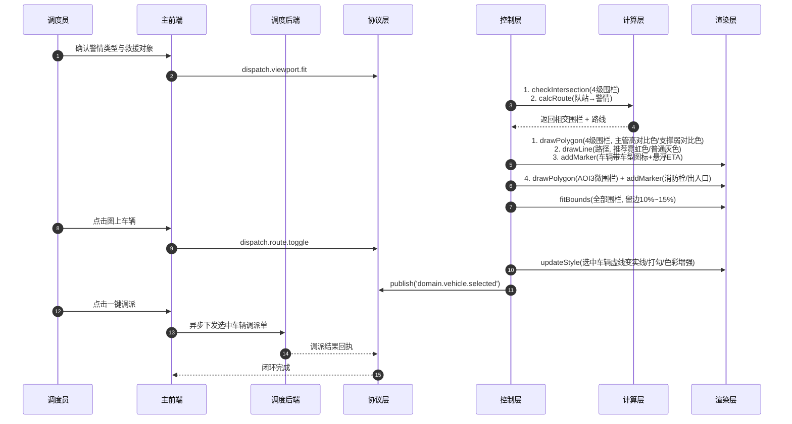

**OpenLayers 渲染映射**：
- 主管围栏 → `Stroke({ color: 'red', width: 3 })`
- 支撑围栏 → `Stroke({ color: 'orange', lineDash: [5,5] })`
- 推荐路径 → `Stroke({ color: 'green', width: 4 })`
- 普通路径 → `Stroke({ color: 'gray', width: 2 })`
- 选中车辆 → `Icon` + `Stroke({ color: 'gold', width: 3 })` 外发光

### 2.6 阶段五：途中跟踪与到场作战阶段转换

**动频**：经常动（轨迹平滑移动、动态ETA刷新、首车到场视图切换）。

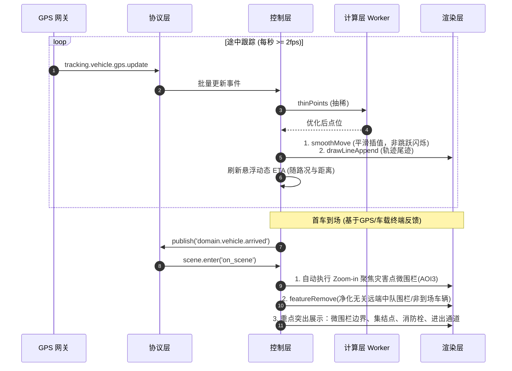

**OpenLayers 渲染映射**：
- 平滑移动 → `view.animate({ center: fromLonLat(coords), duration })` + `setGeometry`
- 轨迹尾迹 → `LineString Feature` + `Stroke({ color: 'blue' })`，持续 `appendCoordinate`
- 微围栏 → `Polygon` + `Fill({ color: 'rgba(0,255,0,0.2)' })`


### 2.7 性能优化关键点

| 场景 | 性能瓶颈 | 优化措施 |
|------|----------|----------|
| 阶段三 ES 检索 | 大量周边要素 | 渲染层聚合（cluster）+ LOD |
| 阶段四 多车渲染 | 50+ 车辆 | 视口裁剪 + Canvas 渲染降级 |
| 阶段五 高频 GPS | 10+ 车每秒 | Worker 抽稀 + 节流到 2fps |
| 阶段五 轨迹尾迹 | 长时间累积 | 保留最近 1000 个点 + 抽稀 |

### 2.8 错误降级矩阵

| 错误 | 表现 | 自动降级 |
|------|------|----------|
| 路径规划失败 | 无路线渲染 | 不显示路径，提示手动选车 |
| GPS 失联 | 车辆图标停止 | 灰显 + 沿最后方向线性外推 |
| 围栏加载失败 | 无围栏渲染 | 降级为圆心半径显示 |
| WMS 瓦片失败 | 黑屏/灰块 | 显示占位符 + 1/3/5s 重试 |
| Web Worker 崩溃 | 计算阻塞 | 重建 Worker + 主线程同步接管 |

---

## 3. 业务协议到通用控制指令的拼装映射与数据流转

**职责**：深度剖析**业务控制层**（解析协议）如何拼装、转化并调用**通用控制层**（基础组件），以及在转化过程中 JSON 数据集合（DTO）的映射与流转。

### 3.1 业务协议到通用指令的“降维”拼装模型

系统中的数据流转本质上是一个**降维解码**的过程：
- **输入（Input）**：携带浓厚业务语义的宏观 JSON 对象（如 `AlarmProfileSyncData`，包含火灾类型、建筑ID等）。
- **处理（Process）**：业务控制器提取关键坐标、状态，结合业务规则（如“火灾”对应特定 Icon），拼装为纯图形指令。
- **输出（Output）**：高度扁平化的通用几何/视口 JSON 集合（如 `MarkerAddData`，仅包含 `id`, `lngLat`, `iconType`）。

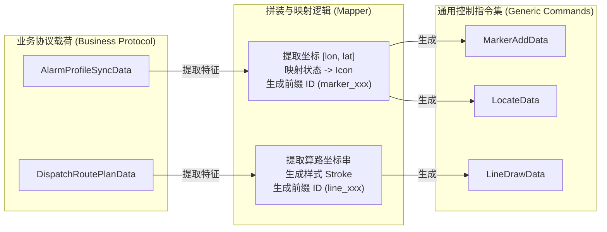

### 3.2 核心场景的数据拼装与流转字典

以下列出各核心场景下，业务控制器如何接收协议对象，并拼装出多个通用控制指令对象的映射细节。

#### 3.2.1 警情精确上图场景 (Alarm Profile Sync)

**触发事件**：`alarm.profile.sync`
**业务控制器**：`AlarmController`

| 输入业务对象【协议层】 | 提取与映射逻辑【计算层/业务控制层】 | 输出通用控制指令集 (拼装结果)【通用控制层】 |
|-------------|----------------|-------------------------------|
| **`AlarmProfileSyncData`**<br>- `incidentId: string`<br>- `longitude: number`<br>- `latitude: number`<br>- `disaster_type: string`<br>- `incidentState: string` | 1. 组合 `[longitude, latitude]` 为 `lngLat` 数组。<br>2. 根据 `disaster_type` 映射对应的 `StyleKey` (如 'FIRE' -> `FIRE_ICON`)。<br>3. 提取 `incidentId` 作为通用要素的主键 ID。 | **指令 1：打点标绘 (`G-G01`)**<br>`MarkerAddData`: <br>`{ id: incidentId, lngLat: [lon, lat], iconType: 'FIRE_ICON' }`<br><br>**指令 2：视口平移 (`G-V01`)**<br>`LocateData`: <br>`{ lngLat: [lon, lat], zoom: 16, duration: 800 }` |

#### 3.2.2 来电粗定位场景 (Incoming Call)

**触发事件**：`map.locate.call`
**业务控制器**：`CallController`

| 输入业务对象【协议层】 | 提取与映射逻辑【计算层/业务控制层】 | 输出通用控制指令集 (拼装结果)【通用控制层】 |
|-------------|----------------|-------------------------------|
| **`LocateCallData`**<br>- `id: string`<br>- `longitude: number`<br>- `latitude: number`<br>- `radius: number`<br>- `Carrier_Loc: string` | 1. 将 `[lon, lat]` 与 `radius` 送入计算层生成 Buffer 面。<br>2. 接收返回的 `Polygon Geometry`。<br>3. 组装红色的透明填充色与虚线边框。<br>4. 提取 `Carrier_Loc` 组装为中心点的文字标签。 | **指令 1：画粗定位圈 (`G-G02`)**<br>`PolygonDrawData`: <br>`{ id: 'circle_'+id, geometry: Polygon, fillColor: 'rgba(255,0,0,0.2)' }`<br><br>**指令 2：打中心点 (`G-G01`)**<br>`MarkerAddData`: <br>`{ id: 'center_'+id, lngLat: [lon, lat], iconParams: { text: Carrier_Loc } }`<br><br>**指令 3：视口自适应 (`G-V05`)**<br>`FitBoundsData`: <br>`{ geometry: Polygon, padding: [50,50,50,50] }` |

#### 3.2.3 调派算路与路线展示场景 (Dispatch Route Plan)

**触发事件**：`dispatch.route.plan`
**业务控制器**：`DispatchController`

| 输入业务对象【协议层】 | 提取与映射逻辑【计算层/业务控制层】 | 输出通用控制指令集 (拼装结果)【通用控制层】 |
|-------------|----------------|-------------------------------|
| **`DispatchRoutePlanData`**<br>- `incidentId: string`<br>- `routeId: string`<br>- `start: { station_id, lon, lat }`<br>- `end: { lon, lat }`<br>- `recommended: boolean` | 1. 将 `start` 和 `end` 坐标送入路网计算层。<br>2. 获得算路结果的坐标串 `coordinates`。<br>3. 根据 `recommended` 状态决定路线颜色（推荐=绿色，普通=灰色）。<br>4. 提取起终点坐标拼装队站和警情点。 | **指令 1：画路径线 (`G-G04`)**<br>`LineDrawData`: <br>`{ id: routeId, coordinates: [[lon,lat]...], strokeColor: '#00FF00' }`<br><br>**指令 2：打队站点 (`G-G01`)**<br>`MarkerAddData`: <br>`{ id: start.station_id, lngLat: [start.lon, start.lat], iconType: 'STATION_ICON' }`<br><br>**指令 3：抛出算路结果事件**<br>`RoutePlanResultData`: <br>`{ routeId, eta, distance, recommended }` |

#### 3.2.4 车辆实时跟踪场景 (Vehicle Tracking)

**触发事件**：`tracking.vehicle.gps.update`
**业务控制器**：`TrackingController`

| 输入业务对象【协议层】 | 提取与映射逻辑【计算层/业务控制层】 | 输出通用控制指令集 (拼装结果)【通用控制层】 |
|-------------|----------------|-------------------------------|
| **`TrackingVehicleGpsUpdateData`**<br>- `carId: string`<br>- `longitude: number`<br>- `latitude: number` | 1. 组装目标坐标 `[lon, lat]`。<br>2. 从业务缓存中获取车辆当前在地图上的实际坐标。<br>3. 计算两点之间的差值并设定动画持续时间 `duration`。<br>4. 缓存历史坐标用于追加尾迹。 | **指令 1：平滑移动引擎 (`G-K01`)**<br>`SmoothMoveData`: <br>`{ featureId: 'marker_'+carId, targetLngLat: [lon, lat], duration: 1000 }`<br><br>**指令 2：追加尾迹 (`G-K02`)**<br>`TrackAppendData`: <br>`{ lineId: 'trail_'+carId, newLngLat: [lon, lat] }` |

### 3.3 通用控制层输入集合全量字典 (Generic Control Input DTOs)

为了补全 `04-三层综合交互与可视化` 中遗漏的通用层（渲染前最后一步）输入集合对象，特列出如下字典。这些对象是**业务控制层输出的结果**，同时也是**通用控制层（地图引擎执行绘制）接收的唯一标准输入契约**。

#### 3.3.1 视图控制类输入集合 (`ViewController`)

| 对象名 | 字段结构 | 说明 |
|--------|----------|------|
| **`LocateData`** | `lngLat`: `[number, number]`<br>`zoom`: `number`<br>`duration?`: `number` | 单点中心定位与缩放。 |
| **`FitBoundsData`** | `geometry`: `GeoJSON.Polygon` / `LineString`<br>`padding?`: `number[]`<br>`duration?`: `number` | 根据传入的几何图形，自动计算 BBox 并留出边距进行缩放适配。 |
| **`LayerToggleData`** | `layerId`: `string`<br>`visible`: `boolean` | 切换指定底图或 WMS 图层的显示状态。 |

#### 3.3.2 几何标绘类输入集合 (`GeometryController`)

| 对象名 | 字段结构 | 说明 |
|--------|----------|------|
| **`MarkerAddData`** | `id`: `string`<br>`lngLat`: `[number, number]`<br>`iconType?`: `StyleKey`<br>`iconUrl?`: `string`<br>`iconParams?`: `Record<string, any>` | 添加一个点状要素。支持传入业务映射的枚举 `iconType` 或是绝对路径 `iconUrl`。 |
| **`PolygonDrawData`** | `id`: `string`<br>`geometry`: `GeoJSON.Polygon`<br>`fillColor?`: `string`<br>`strokeColor?`: `string` | 绘制面状要素（如辖区围栏、粗定位圈）。 |
| **`LineDrawData`** | `id`: `string`<br>`coordinates`: `[number, number][]`<br>`strokeColor?`: `string`<br>`width?`: `number` | 绘制线状要素（如车辆路线、历史轨迹）。 |
| **`FeatureRemoveData`** | `featureIds`: `string[]` | 批量移除指定的要素，支持按前缀匹配清除。 |
| **`FeatureVisibleData`**| `featureId`: `string`<br>`visible`: `boolean` | 单一要素的显隐切换，隐藏时会在内部缓存其原始样式。 |

#### 3.3.3 动画与运动类输入集合 (`KinematicController`)

| 对象名 | 字段结构 | 说明 |
|--------|----------|------|
| **`SmoothMoveData`** | `featureId`: `string`<br>`targetLngLat`: `[number, number]`<br>`duration`: `number` | 触发指定点要素的 requestAnimationFrame 平滑插值移动。 |
| **`TrackAppendData`** | `lineId`: `string`<br>`newLngLat`: `[number, number]` | 往现有的线状要素末尾追加一个坐标点，用于画尾迹。 |

### 3.4 业务 ID 到通用 ID 的隔离机制

在拼装映射过程中，**必须**解决的一个核心问题是：同一警情（或车辆）在地图上可能对应多个不同类型的图形（例如一个警情同时有图标、有红圈、有文字）。

**解决方案：前缀分组隔离**
业务控制器在生成通用指令时，强制在原始业务 ID 前附加几何类型前缀。
- 警情点 (`INC001`) -> `MarkerAddData.id = 'marker_INC001'`
- 定位圈 (`INC001`) -> `PolygonDrawData.id = 'polygon_INC001'`
- 连线 (`INC001`) -> `LineDrawData.id = 'line_INC001'`

这使得底层的 `FeatureRemoveData` 在接收到业务要求“清空该警情所有图元”时，可以通过前缀匹配实现精准批量回收。

---

# 第二部分：业务实体与数据契约

## 4. 各阶段业务 ER 关系与字段字典

**职责**：梳理 GIS 侧业务实体（Entity）的关系与字段，作为 TypeScript 类型字典与数据库 DTO 设计的参考。

### 4.1 业务实体 ER 关系图

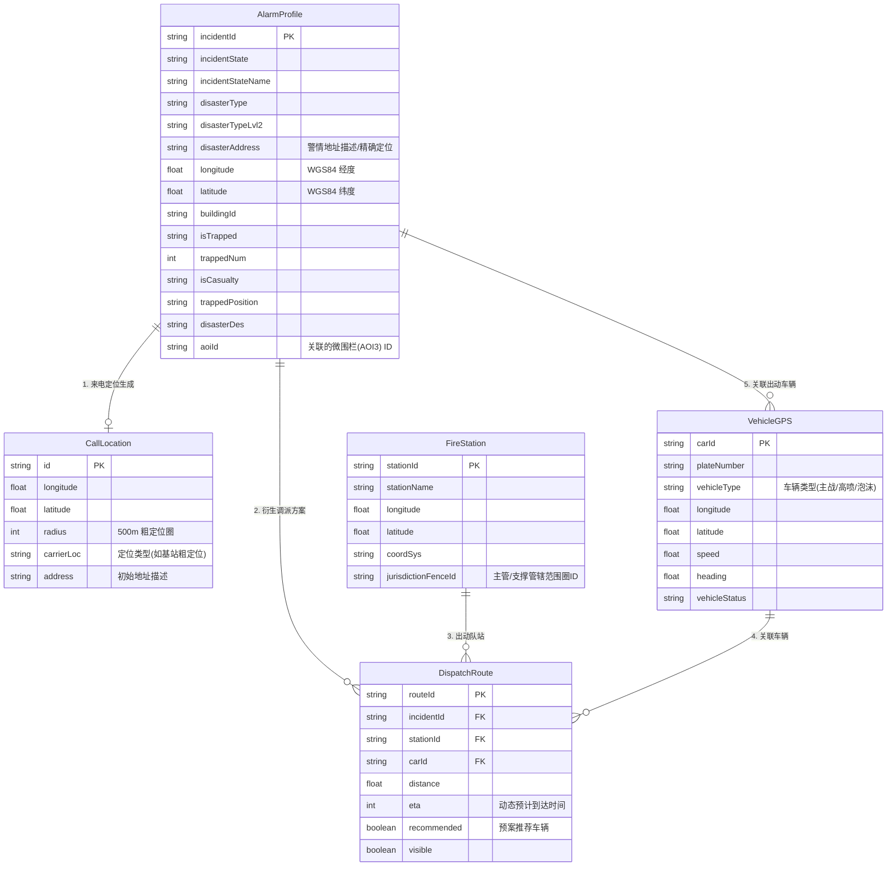

### 4.2 实体关系说明

| 关系 | 描述 | 业务场景 |
|------|------|----------|
| AlarmProfile → CallLocation (1:0..1) | 警情可能由来电定位发起 | 来电弹屏 → 立案 |
| AlarmProfile → DispatchRoute (1:N) | 一个警情可有多套调派方案 | 主管站 + 3 支撑站 |
| FireStation → DispatchRoute (1:N) | 队站可被分配多个调派任务 | 多警情并发 |
| VehicleGPS → DispatchRoute (1:N) | 一辆车可有多段历史路线 | 复盘 |
| AlarmProfile → VehicleGPS (1:N) | 一警情对应多台出动车 | 跟踪阶段 |

### 4.3 字段字典（TypeScript 风格）

#### 4.3.1 AlarmProfile

| 字段 | 类型 | 必填 | 说明 |
|------|------|------|------|
| `incidentId` | `string` | ✅ | 警情事件唯一 ID |
| `incidentState` | `IncidentState` | ✅ | 见状态机 |
| `incidentStateName` | `string` | - | 状态中文名 |
| `disasterType` | `DisasterType` | ✅ | 灾害类型枚举 |
| `disasterTypeLvl2` | `string` | - | 细类 |
| `disasterAddress` | `string` | - | 灾害地址 |
| `longitude` | `number` | - | WGS84 经度 |
| `latitude` | `number` | - | WGS84 纬度 |
| `buildingId` | `string` | - | 关联建筑 ID |
| `isTrapped` | `'TRUE' \| 'FALSE'` | - | 是否有被困人员 |
| `trappedNum` | `number` | - | 被困人数 |
| `isCasualty` | `'TRUE' \| 'FALSE'` | - | 是否有伤亡 |
| `trappedPosition` | `string` | - | 被困位置描述 |
| `disasterDes` | `string` | - | 灾害描述 |

#### 4.3.2 CallLocation

| 字段 | 类型 | 必填 | 说明 |
|------|------|------|------|
| `id` | `string` | ✅ | 定位 ID |
| `longitude` | `number` | ✅ | 基站经度 |
| `latitude` | `number` | ✅ | 基站纬度 |
| `radius` | `number` | ✅ | 定位精度（米） |
| `carrierLoc` | `string` | - | 运营商信息 |
| `address` | `string` | - | 反查地址 |

#### 4.3.3 DispatchRoute

| 字段 | 类型 | 必填 | 说明 |
|------|------|------|------|
| `routeId` | `string` | ✅ | 路线 ID |
| `incidentId` | `string` | ✅ | 警情 ID |
| `stationId` | `string` | ✅ | 出发队站 |
| `carId` | `string` | - | 关联车辆 |
| `distance` | `number` | - | 距离（米） |
| `eta` | `number` | - | 预计时长（秒） |
| `recommended` | `boolean` | - | 是否推荐 |
| `visible` | `boolean` | - | 是否显示 |

#### 4.3.4 VehicleGPS

| 字段 | 类型 | 必填 | 说明 |
|------|------|------|------|
| `carId` | `string` | ✅ | 车辆 ID |
| `plateNumber` | `string` | - | 车牌 |
| `longitude` | `number` | ✅ | WGS84 |
| `latitude` | `number` | ✅ | WGS84 |
| `speed` | `number` | - | km/h |
| `heading` | `number` | - | 0~360 方位角 |
| `vehicleStatus` | `VehicleStatus` | - | 见状态机 |

### 4.4 状态机

#### 4.4.1 IncidentState（警情状态）

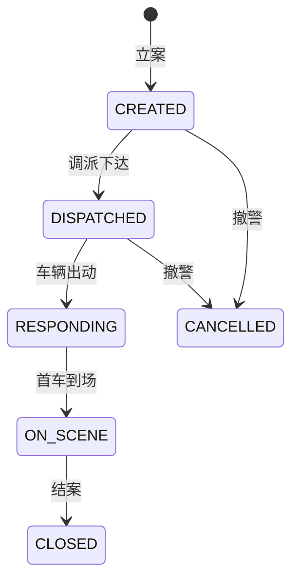

#### 4.4.2 VehicleStatus（车辆状态）

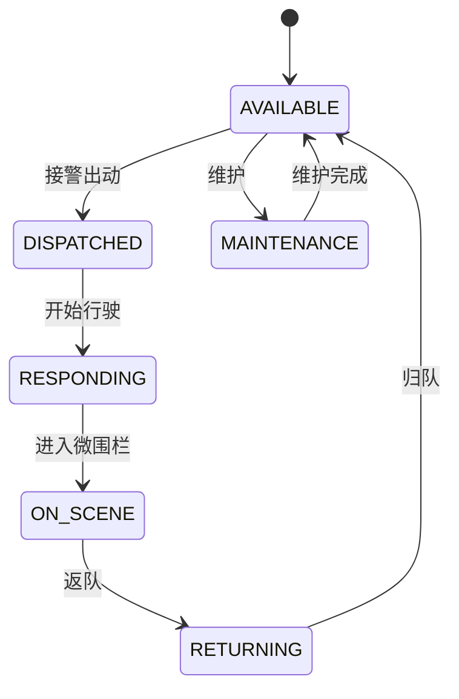

### 4.5 坐标字段统一规范

- 所有 `longitude`/`latitude` 默认 **WGS84 / EPSG:4326**。
- 涉及高德底图时，在渲染层做 WGS84 → GCJ02 转换（详见 06 节）。
- 数据库存储推荐 `DECIMAL(10,7)` 精度（保留到毫米级，避免浮点漂移）。

### 4.6 ID 命名规范

| 实体 | ID 前缀 | 示例 |
|------|---------|------|
| 警情 | `INC` | `INC20260714001` |
| 来电 | `CALL` | `CALL_98765` |
| 队站 | `ST` | `ST_001` |
| 车辆 | `CAR` | `CAR_粤B12345` |
| 路线 | `ROUTE` | `ROUTE_ST001_TO_INC001` |
| 图元 marker | `marker_<businessId>` | `marker_INC20260714001` |
| 图元 polygon | `polygon_<businessId>` | `polygon_zone_xxx` |
| 图元 line | `line_<businessId>` | `line_route_xxx` |

### 4.7 资源类实体图层字典 (Layer Identifiers)

系统涉及的静态资源、救援对象及地理环境图层标识（主要对应 GeoServer/WMS/WFS 或 ES 检索标识），其标准名称与映射关系如下：

| 图层中文名称 | 图层标识 (Layer ID) | 图层类型与业务用途 |
|--------------|---------------------|--------------------|
| **aoi兴趣面** | `gis:env_build_aoi` | 面状 (Polygon)。即业务中的“微围栏”，如小区、厂区、重点单位的物理边界。 |
| **小区出入口** | `gis:env_entrance_exit` | 点状 (Point)。微观作战时展示，供调派与到场寻路参考。 |
| **消防栓** | `gis:env_fire_water` | 点状 (Point)。现场水源分布，到场作战图层核心要素。 |
| **道路** | `gis:env_greatchina_road` | 线状 (LineString)。城市路网骨架，用于战术路网高亮与路况着色。 |
| **poi兴趣点** | `gis:env_place_poi` | 点状 (Point)。通用的地理位置兴趣点。 |
| **消防车辆** | `gis:fire_vehicle` | 点状 (Point)。动态图层，展示可用车辆及出动车辆。 |
| **ES doc** | `gis:mapresource` | 综合索引。空间计算层 (ES 检索) 进行周边资源/建筑检索的基础文档池。 |
| **建筑** | `gis:view_env_building` | 面状 (Polygon) / 3D白膜。问询研判时切换维度展示周边建筑。 |
| **重点单位** | `gis:view_env_enterprises` | 点状/面状。核心救援对象。 |
| **队站辖区** | `gis:view_juris_zone` | 面状 (Polygon)。调派时联动的“四级管辖围栏” (主管+支撑站)。 |
| **消防队站** | `gis:view_res_org_dept` | 点状 (Point)。消防站/中队点位位置。 |
| **组织机构** | `gis:view_sys_org_vehicle` | 关系型数据。车辆与队站、大队的行政归属关系。 |
| **街道乡镇区划** | `gis:env_area_fence` | 面状 (Polygon)。行政区划级别的宏观围栏。 |

---

## 5. 协议层与后端 I/O 契约

**职责**：定义服务层与 GIS 协议层之间的交互契约，统一跨系统通信信封与错误码标准。

### 5.1 基础通信契约 (MessageEnvelope)

所有跨系统通信（WebSocket / postMessage / HTTP SSE）统一采用以下信封：

```typescript
type MessageEnvelope<T = any> = {
  // 必传
  id: string                 // 事件唯一 ID（UUID），用于追踪/应答/排错
  ts: number                 // 发送时间戳（ms）
  system: MessageSystem      // 消息来源系统
  eventKey: MessageEventKey  // 事件路由键
  data: T                    // 业务载荷

  // 可选
  targetSystem?: MessageSystem   // 目标系统
  meta?: Record<string, any>     // 链路追踪、用户标识等
  v?: '1.0.0'                    // 协议版本
  isRemoveSameElement?: boolean  // 收到相同 ID 时是否移除旧元素
  ackId?: string                 // 应答时回填的请求 ID
  errorCode?: string             // 错误码（仅错误事件）
  errorMessage?: string          // 人类可读错误描述
}
```

### 5.2 错误码字典（ErrorCode）

| 错误码 | 含义 | 触发条件 | GIS 侧降级策略 |
|--------|------|----------|---------------|
| `E_PROTOCOL_TIMEOUT` | 协议请求超时 | 主前端未在 3s 内响应协议指令 | 沿用上一帧状态，UI 提示"指令超时" |
| `E_PROTOCOL_VERSION_MISMATCH` | 协议版本不匹配 | `v` 字段与预期不一致 | 拒绝处理并上报告警 |
| `E_BACKEND_DISPATCH_404` | 调派方案不存在 | 调派方案 ID 在后端查询为空 | 不渲染对应路线，标记为待定 |
| `E_BACKEND_GPS_LOST` | 车辆 GPS 失联 | 连续 10s 未收到车辆心跳 | 车辆图标灰显，沿用最后一次方向/速度做线性外推 |
| `E_BACKEND_ROUTE_FAIL` | 路径规划失败 | 算路服务无返回/超时 | 不显示路线，提示"算路失败，请手动选车" |
| `E_GIS_RENDER_OVERLOAD` | 渲染层过载 | 帧率低于 15fps 持续 2s | 暂停非核心要素（轨迹尾迹、周边资源高亮） |
| `E_GIS_LAYER_LOAD_FAIL` | WMS 图层加载失败 | GeoServer 返回 5xx | 显示图层错误占位符，重试 3 次后隐藏 |
| `E_WORKER_TIMEOUT` | Web Worker 计算超时 | 算路/缓冲计算超过 1s | 主线程接管计算并降级为简化算法 |

### 5.3 系统与事件路由（节选）

#### 5.3.1 system 枚举
| system | 含义 |
|--------|------|
| `host` | 宿主主前端 |
| `map` | 地图主应用 |
| `dispatch` | 调度/告警业务系统（走 WS） |
| `panel_25d` | 2.5D iframe 面板 |
| `panel_3d` | 3D iframe 面板 |

#### 5.3.2 eventKey 关键事件
- **握手/心跳**：`hello`, `heartbeat`
- **地图状态**：`map.ready`, `map.view.changed`, `map.click`, `map.feature.pick`
- **业务画像**：`alarm.profile.sync`, `map.locate.call`, `aoi.es_gisZone`
- **调派/跟踪**：`dispatch.route.plan`, `dispatch.route.toggle`, `tracking.vehicle.gps.update`
- **图层控制**：`layer.set.visible`, `layer.set.opacity`, `layer.set.zIndex`, `layer.refresh`
- **场景切换**：`scene.enter`, `scene.leave`, `map.view.stageconfig`

### 5.4 握手与心跳规范

#### 5.4.1 建连流程
1. **GIS → Host**：发送 `hello { from: 'map', version: '1.0.0' }`
2. **Host → GIS**：回复 `hello { from: 'host', version: '1.0.0' }`
3. **双向**：`heartbeat` 间隔 30s，3 次未响应视为断线。

#### 5.4.2 断线降级
- **WS 断线**：自动重连 3 次，间隔 1s/2s/4s；失败后降级为 REST 轮询 5s。
- **postMessage 断连**：监听 `message.error`，触发 `map.view.changed` 强制刷新。

### 5.5 关键业务载荷契约（Input/Output）

#### 5.5.1 下行：后端 → GIS

| eventKey | data 类型 | 必传字段 | 用途 |
|----------|-----------|----------|------|
| `alarm.profile.sync` | `AlarmProfileSyncData` | `incidentId` | 同步警情画像（SSOT） |
| `map.locate.call` | `LocateCallData` | `id, longitude, latitude, radius` | 来电粗定位 |
| `aoi.es_gisZone` | `AoiEsGisZoneData` | `zoneId` | 围栏反查辖区 |
| `dispatch.viewport.fit` | `DispatchViewportFitData` | `incidentId, center` | 调派视口自适应 |
| `dispatch.route.plan` | `DispatchRoutePlanData` | `incidentId, start, end, routeId` | 路径规划 |
| `dispatch.route.toggle` | `DispatchRouteToggleData` | `routeList` | 路径显隐批量控制 |
| `tracking.vehicle.gps.update` | `TrackingVehicleGpsUpdateData` | `incidentId, layerId` | 车辆实时 GPS |
| `layer.set.visible` | `LayerToggleData` | `layerId, visible` | 图层显隐 |
| `layer.refresh` | `LayerRefreshData` | `layerNames` | WMS 图层刷新 |
| `map.view.load` | `MapViewLoadData` | `points` 或 `longitude+latitude` | 初始化视口 |
| `map.view.stageconfig` | `MapViewStageConfigData` | `stage` | 场景阶段切换 |

#### 5.5.2 上行：GIS → 后端

| eventKey | data 类型 | 触发时机 |
|----------|-----------|----------|
| `map.ready` | `{ ok: true }` | 地图引擎初始化完成 |
| `map.view.changed` | `MapViewChangedData` | 视口变化（throttle 200ms） |
| `map.feature.pick` | `MapFeaturePickData` | 拾取要素 |
| `route.plan.result` | `RoutePlanResultData` | 算路完成 |
| `map.layer.visible.change` | `MapLayerVisibleChangeData` | 图层状态变更 |
| `vehicle.display.state.change` | `{ carId, selected, visible }` | 车辆状态变更 |
| `error` | `ErrorEnvelope` | GIS 内部异常上报 |

### 5.6 重连与状态对齐

#### 5.6.1 重连后的状态对齐
WS 重连成功后，GIS 主动发送 `scene.enter` + `alarm.profile.sync` 触发主前端重新推送当前上下文。

#### 5.6.2 幂等性保障
- 所有带 `id` 的业务指令在 5s 内重复到达，GIS 必须使用最新一份数据（避免重复绘制）。
- `isRemoveSameElement: true` 时，相同 `id` 的要素会被移除并重新添加。

### 5.7 与计算层/控制层的协议边界

**GIS 协议层职责到此为止**：
- 协议层只负责信封解析、路由分发、错误码包装。
- **不**做任何空间计算或渲染优化。
- **不**直接调用底层地图引擎 API（必须经过控制层）。


## 6. 计算层与控制层 I/O 契约

**职责**：定义 GIS 计算层（SpatialController / Worker）的纯函数接口，以及与控制层（GenericController / BusinessController）之间的跨线程/同步调用契约。

### 6.1 计算层三大子模块

| 子模块 | 职责 | 典型算法 |
|--------|------|----------|
| **空间计算引擎** | 几何/拓扑纯计算 | 缓冲区、相交检测、重叠面积、空间聚类 |
| **业务推算引擎** | 结合业务的推演 | 路径规划、ETA 重算、首车到场判定 |
| **数据采集与清洗** | 高频数据预处理 | GPS 抽稀、坐标系转换、轨迹平滑插值 |

### 6.2 计算层主线程 API（同步）

所有主线程 API 均为**纯函数**，严禁在内部访问任何 DOM/Canvas/Map 实例。

```typescript
// 空间计算
calcBuffer(input: BufferCalcData): Geometry
calcIntersection(geomA: Geometry, geomB: Geometry): Geometry | null
calcOverlapArea(query: Geometry, targets: Geometry[]): Array<{ id: string; area: number }>

// 业务推算
calcRoute(data: RouteCalcData): Promise<RouteCalcResult>
calcEta(distance: number, trafficLevel: TrafficLevel): number

// 数据清洗
smoothPoints(points: Point[], method: 'linear' | 'catmull'): Point[]
thinPoints(points: Point[], interval: number): Point[]
convertCoord(point: Point, from: CoordSys, to: CoordSys): Point
```

### 6.3 Web Worker 跨线程通信契约

#### 6.3.1 消息信封（WorkerMessage）

```typescript
type WorkerMessage<T = any> = {
  type: WorkerMessageType
  requestId: string         // 用于匹配请求与响应
  payload: T
  timestamp: number
}

type WorkerResponse<T = any> = {
  type: WorkerMessageType
  requestId: string
  success: boolean
  payload?: T
  errorCode?: string
  errorMessage?: string
  durationMs: number
}
```

#### 6.3.2 WorkerMessageType 枚举

| type | 方向 | payload (Input) | payload (Output) | 超时 |
|------|------|-----------------|------------------|------|
| `CALC_BUFFER` | Main → Worker | `BufferCalcData` | `Geometry` | 500ms |
| `CALC_ROUTE` | Main → Worker | `RouteCalcData` | `RouteCalcResult` | 2000ms |
| `THIN_POINTS` | Main → Worker | `{ points, interval }` | `Point[]` | 1000ms |
| `SMOOTH_POINTS` | Main → Worker | `{ points, method }` | `Point[]` | 1000ms |
| `CONVERT_COORD` | Main → Worker | `{ point, from, to }` | `Point` | 50ms |

#### 6.3.3 超时与降级
- 任一 Worker 调用超过设定超时，主线程 fallback 到同步简化算法并发出 `E_WORKER_TIMEOUT` 错误。
- Worker 内部使用 `Transferable Objects`（`ArrayBuffer`）传输大数据量坐标数组。

### 6.4 计算层 → 控制层 的 I/O

#### 6.4.1 输出结构

```typescript
// 缓冲区输出
type BufferResult = {
  geometry: Geometry          // GeoJSON 多边形
  vertexCount: number         // 顶点数
  area: number                // 面积（平方米）
  durationMs: number
}

// 算路输出
type RouteCalcResult = {
  coordinates: [number, number][]   // WGS84 坐标串
  distanceMeters: number
  durationSeconds: number
  trafficLevel: TrafficLevel
  bbox: BBox
  durationMs: number
}

// 抽稀输出
type ThinPointsResult = {
  points: [number, number][]
  reductionRatio: number       // 压缩比
  durationMs: number
}
```

#### 6.4.2 控制层消费示例（伪代码）

```typescript
// 控制层（DispatchController）调用计算层
const routeResult = await spatial.calcRoute({
  start: [114.0601, 22.5451],
  end: [114.0578, 22.5430],
  strategy: 'fastest'
})

// 转换为渲染层指令
geometry.drawLine({
  id: `route_${routeId}`,
  coordinates: routeResult.coordinates,  // 直接复用
  strokeColor: ROUTE_LINE_STROKE
})
```

### 6.5 控制层 → 计算层 的 I/O

#### 6.5.1 输入数据约束

| 字段 | 类型 | 约束 |
|------|------|------|
| `center` / `start` / `end` | `[lon, lat]` | 必须在 WGS84 范围内（-180~180, -90~90） |
| `radius` | `number` | 单位米，> 0 且 < 50000 |
| `points` | `Array<[lon, lat]>` | 单次不超过 10000 个点 |
| `strategy` | `'fastest' \| 'shortest' \| 'avoid_traffic'` | 默认 `'fastest'` |

#### 6.5.2 输入校验
控制层在调用计算层前必须进行：
1. **坐标系校验**：确保 WGS84。
2. **数量上限校验**：超过阈值时拆分为多次调用。
3. **NaN/Infinity 校验**。

### 6.6 计算层性能 SLA

| 计算类型 | 数据量级 | 同步上限 | Worker 上限 |
|----------|----------|----------|-------------|
| 缓冲区（半径 < 5km） | 1 个点 | 100ms | 500ms |
| 路径规划 | 2 个点 | 2000ms | 2000ms |
| 轨迹抽稀 | 10000 点 | 1500ms | 1000ms |
| 坐标转换 | 1 个点 | 5ms | 50ms |
| 相交检测 | 100 个面 | 500ms | 300ms |

### 6.7 与渲染层的协议边界

**计算层职责到此为止**：
- 计算层只产出**纯数据**（GeoJSON、数值结果）。
- **不**直接调用渲染层 API。
- **不**持有任何地图实例引用。

控制层负责将计算结果**转换为**渲染层可识别的图形指令（`MarkerAddData` / `LineDrawData` / `PolygonDrawData`）。

---

---

# 第三部分：规范与指标 (非核心描述)

## 7. 坐标系统与转换规范

**职责**：定义 GIS 系统中 WGS84、GCJ02、BD09 等坐标系的使用边界、转换责任划分与服务接口。

### 7.1 坐标系定义

| 名称 | 标准 | 偏差 | 使用范围 |
|------|------|------|----------|
| **WGS84** | EPSG:4326 | 无 | 国际标准，GPS 原始输出 |
| **GCJ02** | 火星坐标 | 中国大陆 +50~700m | 高德、腾讯地图底图 |
| **BD09** | 百度坐标 | 中国大陆 | 百度地图底图 |
| **CGCS2000** | EPSG:4490 | 与 WGS84 差异极小 | 国家测绘局标准（信创） |

### 7.2 职责划分

#### 7.2.1 协议层 / 计算层
- **强约束 WGS84**。
- 所有协议载荷（`longitude`/`latitude`）均为 WGS84。
- 计算层输入/输出统一 WGS84。

#### 7.2.2 控制层
- **保持 WGS84**，不参与坐标转换。
- 负责将 WGS84 传入 `SpatialController` 进行空间运算。

#### 7.2.3 渲染层（按底座类型适配）
- **OpenLayers + 高德底图**：渲染前 WGS84 → GCJ02。
- **OpenLayers + GeoServer/WMS**：保持 WGS84（EPSG:4326）。
- **ThreeJS / BIM**：保持 WGS84。
- **百度底图**：WGS84 → BD09。

### 7.3 转换服务接口

#### 7.3.1 转换函数（纯函数）

```typescript
type CoordSys = 'WGS84' | 'GCJ02' | 'BD09' | 'CGCS2000'

interface Point {
  longitude: number  // 经度
  latitude: number   // 纬度
}

interface ConvertCoordData {
  point: Point
  from: CoordSys
  to: CoordSys
}

// 同步转换（主线程）
function convertCoord(data: ConvertCoordData): Point

// Worker 转换（高频）
function convertCoordInWorker(data: ConvertCoordData): Promise<Point>
```

#### 7.3.2 批量转换

```typescript
interface BatchConvertData {
  points: Point[]
  from: CoordSys
  to: CoordSys
}

interface BatchConvertResult {
  points: Point[]
  durationMs: number
}
```

### 7.4 转换精度与边界

#### 7.4.1 国内坐标偏移处理
- **国境外坐标**：WGS84 ↔ GCJ02 转换无意义（GCJ02 只对国内加密）。
- **境内坐标**：必须通过加密算法转换，常见算法有 `eviltransform` 等。

#### 7.4.2 浮点精度
- 协议层 `number` 类型保留 7 位小数（约 1cm 精度）。
- 数据库存储推荐 `DECIMAL(10,7)`。
- 避免 `parseFloat` 多轮转换导致精度损失。

#### 7.4.3 转换不可逆性
- WGS84 → GCJ02 是**单向有损**转换（GCJ02 已是加密结果）。
- GCJ02 → WGS84 只能近似还原，误差约 1~10m。
- 业务数据存储**必须保留原始 WGS84**，GCJ02 仅在渲染时实时计算。

### 7.5 OpenLayers 中的坐标系处理

```typescript
// OpenLayers 默认使用 EPSG:3857（Web 墨卡托）
// 但数据源推荐使用 WGS84

// 1. 数据源使用 WGS84
const vectorSource = new VectorSource({
  features: new GeoJSON().readFeatures(geojson, {
    dataProjection: 'EPSG:4326',   // 数据是 WGS84
    featureProjection: 'EPSG:3857' // 底座是 3857
  })
})

// 2. 实时转换（用于高德底图）
import { fromLonLat, toLonLat } from 'ol/proj'

// 渲染前
const webMercator = fromLonLat([lon, lat])  // WGS84 → 3857

// 拾取后
const lonLat = toLonLat(webMercator)        // 3857 → WGS84
```

### 7.6 高德底图适配示例

```typescript
// WGS84 → GCJ02 转换封装
function wgs84ToGcj02(lon: number, lat: number): [number, number] {
  // 调用 eviltransform 或 gcoord
  const result = transform(lon, lat, 'wgs84', 'gcj02')
  return [result[0], result[1]]
}

// 在高德底图模式下使用
if (baseMapType === 'AMAP') {
  const [gcjLon, gcjLat] = wgs84ToGcj02(data.longitude, data.latitude)
  geometry.addMarker({
    id: data.id,
    lngLat: [gcjLon, gcjLat]  // 传入 GCJ02 给高德底图
  })
}
```

### 7.7 信创（CGCS2000）兼容

在信创环境下，推荐统一使用 CGCS2000 坐标系（与 WGS84 差异 < 1cm）：
- 协议层字段 `coordSys: 'CGCS2000'`
- 渲染层在 `convertCoord` 中识别后跳过转换
- 底座数据源标注为 `EPSG:4490`

### 7.8 坐标系审计日志

所有进入控制层和计算层的数据必须携带 `coordSys` 字段（默认 `WGS84`），便于审计与回溯。

```typescript
interface AlarmProfileSyncData {
  incidentId: string
  longitude: number
  latitude: number
  coordSys?: CoordSys  // 默认 WGS84
  // ...
}
```

### 7.9 转换责任矩阵

| 环节 | 输入坐标系 | 输出坐标系 | 责任方 |
|------|-----------|-----------|--------|
| 后端 → 协议层 | WGS84 | WGS84 | 不转换 |
| 协议层 → 计算层 | WGS84 | WGS84 | 不转换 |
| 计算层输出 → 控制层 | WGS84 | WGS84 | 不转换 |
| 控制层 → 渲染层（高德） | WGS84 | GCJ02 | 渲染层适配器 |
| 控制层 → 渲染层（GeoServer） | WGS84 | WGS84 | 不转换 |
| 渲染层 → 协议层（回传） | 底座系 | WGS84 | 渲染层适配器 |

---

## 8. SLA 性能指标与验收标准矩阵

**职责**：量化 GIS 前端系统在各业务场景下的性能指标（帧率、延迟、可用性），作为验收基准与持续度量依据。

### 8.1 核心 SLA 指标矩阵

| 指标 | 目标值 | 测量方法 | 不达标后果 |
|------|--------|----------|------------|
| **首屏加载时间** (FCP) | ≤ 2.0s | Lighthouse / PerformanceObserver | 启用骨架屏降级 |
| **地图引擎初始化** | ≤ 1.5s | 引擎 ready 回调 | 启用 loading 占位 |
| **平均渲染帧率** | ≥ 50fps (值守)<br>≥ 30fps (跟踪) | requestAnimationFrame 监控 | 暂停非核心要素 |
| **指令端到端延迟** | ≤ 300ms | 协议时间戳差值 | 启用本地乐观更新 |
| **车辆 GPS 端到端延迟** | ≤ 500ms | WS 推送时间戳 | 标记数据陈旧 |
| **WebSocket 可用性** | ≥ 99.9% | 月度统计 | 自动重连 + REST 降级 |
| **API 可用性** | ≥ 99.5% | 主动探活 | 缓存兜底数据 |
| **Web Worker 响应** | ≤ 200ms (常规)<br>≤ 1s (算路) | Worker 消息时间戳 | 切换主线程同步 |
| **要素渲染 P99** | ≤ 2000 个/帧 | 渲染计时 | 启用聚类降级 |
| **内存占用** | ≤ 800MB (Chrome) | performance.memory | 主动清理过期要素 |

### 8.2 业务场景 SLA

#### 8.2.1 值守态势

| 指标 | 目标 | 备注 |
|------|------|------|
| 警情列表加载 | ≤ 1.0s | 1000 条以内 |
| 警情批量上图 | ≤ 1.5s | 500 个 marker |
| 视口拖拽响应 | ≤ 16ms (60fps) | throttle 200ms 发布 |
| 图层切换 | ≤ 300ms | 立即可见 |

#### 8.2.2 来电弹屏

| 指标 | 目标 | 备注 |
|------|------|------|
| 来电 → 粗定位圈出现 | ≤ 500ms | 包含后端推送 + 计算 + 渲染 |
| 粗定位圈 → 视口适配 | ≤ 300ms | fitBounds 动画 800ms |
| 来电挂断 → 清理 | ≤ 100ms | featureRemove |

#### 8.2.3 问询研判

| 指标 | 目标 | 备注 |
|------|------|------|
| 围栏数据加载 | ≤ 1.0s | 单个 AOI |
| ES 空间检索 | ≤ 1.5s | 周边 1km |
| 周边建筑渲染 | ≤ 800ms | 200 个建筑以内 |
| 3D 白膜加载 | ≤ 2.0s | 建筑 ID 关联 |

#### 8.2.4 图上调派

| 指标 | 目标 | 备注 |
|------|------|------|
| 四级围栏加载 | ≤ 1.5s | 4 个围栏 |
| 路径规划（队站→警情） | ≤ 2.0s | 算路服务响应 |
| 批量车辆上图 | ≤ 1.0s | 50 辆以内 |
| 视口 fitBounds | ≤ 800ms | 动画时长 |
| 选车响应 | ≤ 100ms | 视觉反馈 |

#### 8.2.5 途中跟踪

| 指标 | 目标 | 备注 |
|------|------|------|
| GPS 数据端到端延迟 | ≤ 500ms | 2~5fps 推送 |
| 车辆平滑移动 | ≥ 30fps | RAF 插值 |
| 轨迹尾迹渲染 | ≤ 200ms/次 | 增量追加 |
| 动态 ETA 重算 | ≥ 1次/30s | 节流 |
| 多车同时跟踪 | ≤ 20 台 | 超过降级 |
| 首车到场判定 | ≤ 1s | 进入 AOI 后 |

### 8.3 验收标准（AC）矩阵

#### 8.3.1 协议层 AC

| AC 编号 | 描述 | 验收方式 |
|---------|------|----------|
| AC-PT-01 | 同一 envelope.id 在 5s 内重复到达不重复渲染 | 单元测试 |
| AC-PT-02 | WS 断线 3 次后自动降级为 REST 轮询 | 故障注入 |
| AC-PT-03 | 错误码 E_PROTOCOL_TIMEOUT 触发 UI 提示 | 模拟超时 |
| AC-PT-04 | 协议版本不匹配时拒绝处理 | 单元测试 |
| AC-PT-05 | 后端推送频率 > 50fps 时协议层做合包 | 压测 |

#### 8.3.2 计算层 AC

| AC 编号 | 描述 | 验收方式 |
|---------|------|----------|
| AC-CP-01 | 缓冲区计算结果与 turf.js 一致 | 单元测试 |
| AC-CP-02 | 路径规划失败时不抛错，返回 null | 单元测试 |
| AC-CP-03 | Worker 超时后主线程接管 | 故障注入 |
| AC-CP-04 | 10000 个点抽稀到 100 个耗时 < 1s | 性能测试 |
| AC-CP-05 | 坐标转换误差 < 1m | 对比测试 |

#### 8.3.3 控制层 AC

| AC 编号 | 描述 | 验收方式 |
|---------|------|----------|
| AC-CT-01 | 同一 incidentId 的旧数据被新数据覆盖 | 单元测试 |
| AC-CT-02 | scene.enter 后旧场景图层被清理 | E2E |
| AC-CT-03 | 业务 ID 前缀清除机制（marker_/polygon_/line_） | 单元测试 |
| AC-CT-04 | 调派取消后路线/车辆被隐藏但不清除 | E2E |

#### 8.3.4 渲染层 AC

| AC 编号 | 描述 | 验收方式 |
|---------|------|----------|
| AC-RN-01 | 地图引擎初始化失败时显示降级占位 | 故障注入 |
| AC-RN-02 | 帧率 < 30fps 时自动降级轨迹尾迹 | 性能测试 |
| AC-RN-03 | WMS 图层加载失败时 1/3/5s 重试 | 故障注入 |
| AC-RN-04 | Marker zIndex 始终在 Polygon/Line 之上 | 视觉测试 |
| AC-RN-05 | 视口拖拽期间不做重计算 | 性能测试 |

### 8.4 监控埋点

#### 8.4.1 关键埋点

| 事件 | 触发时机 | 上报字段 |
|------|----------|----------|
| `map.fcp` | 地图首次渲染 | `durationMs` |
| `map.frame.tick` | 每秒采样 | `fps, droppedCount` |
| `protocol.message` | 每条入站消息 | `eventKey, size, durationMs` |
| `worker.compute` | 每次 Worker 调用 | `type, durationMs, timeout` |
| `render.feature.count` | 场景切换后 | `markers, polygons, lines` |
| `error.captured` | 全局异常 | `errorCode, stack` |

#### 8.4.2 监控看板
- 实时：帧率、延迟、内存、活跃要素数。
- 日报：SLA 达成率、错误码 Top10、性能 P99 趋势。
- 周报：性能劣化分析、容量预警。

### 8.5 压测场景

| 场景 | 压测内容 | 通过标准 |
|------|----------|----------|
| 大屏值守 | 5000 个警情 + 50 个图层 | 帧率 ≥ 30fps |
| 调派多车 | 50 辆车 + 50 条路线 | 帧率 ≥ 30fps |
| 跟踪高频 | 20 辆车 × 5fps GPS | 端到端延迟 ≤ 500ms |
| 围栏压力 | 200 个围栏 + 5000 周边要素 | 渲染 ≤ 2s |
| 长时运行 | 持续运行 24h | 内存无明显泄漏（< 100MB 增长） |

### 8.6 灰度发布策略

| 阶段 | 范围 | 通过条件 |
|------|------|----------|
| 1 | 5% 座席 | 错误率 < 0.1%，帧率达标 |
| 2 | 25% 座席 | 24h 无 P0/P1 |
| 3 | 50% 座席 | 48h SLA 全绿 |
| 4 | 100% 座席 | 无回滚 |

### 8.7 回滚策略

- **协议层**：保留旧版本 MessageEnvelope 解析器 2 个版本周期。
- **计算层**：Worker 可独立重启，不影响主线程。
- **控制层**：业务控制器支持热替换，异常时降级到只读模式。
- **渲染层**：底座引擎可回滚到上一个稳定版本。

---

