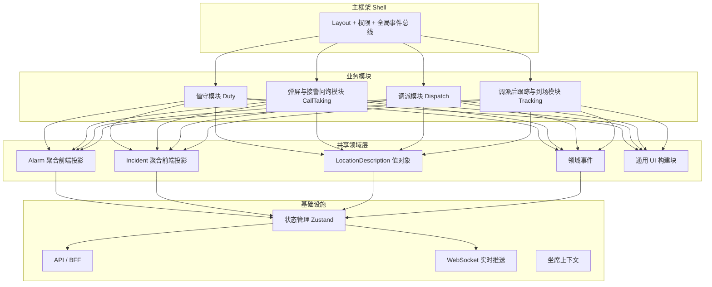

# 119 接处警系统前端架构方案
## 基于「DDD + 轻量模型」的完整设计文档

> **设计原则回顾**  
> - 用**领域构建块**（Alarm 聚合、LocationDescription 值对象、领域事件等）来思考  
> - **组件是后续实现决策**（按限界上下文和业务阶段拆分）  
> - **轻量模型**（聚合草图、状态机、界面流程草图）只用于确认构建块与边界，不追求形式化生成  
> - 代码是真理，模型服务于理解与对齐  
> - 浅层核心抽象 + 组合优先（呼应 Booch 原则）

---

## 1. 总体前端架构

### 1.1 架构图（修复版，高兼容）



### 1.2 架构说明

| 层次 | 职责 | 技术建议 |
|------|------|----------|
| **Shell（主框架）** | 布局、路由、权限、全局事件总线、坐席状态 | React/Vue + 路由 + 权限中心 |
| **业务模块** | 按业务阶段 + 限界上下文拆分 | 路由懒加载 或 微前端（Module Federation） |
| **共享领域层** | 前端领域构建块投影、通用领域组件 | TypeScript 类型 + 领域 hooks |
| **基础设施** | 状态、API、实时、认证 | Zustand + Axios/Fetch + WebSocket |

**推荐技术栈（2026 务实选择）**：
- 框架：React 19 + TypeScript 或 Vue 3 + TypeScript
- 构建：Vite + monorepo（pnpm workspace）
- 状态：Zustand（轻量，完美契合对象模型思维）
- 样式：Tailwind + shadcn/ui 或 Ant Design
- 实时：WebSocket / SSE
- 地图：高德 / 天地图封装组件

---

## 2. 前端领域构建块定义

这些是前端思考的**核心构建块**，直接对应后端 DDD 模型（投影，而非重新建模）。

| 构建块名称 | 对应后端 | 类型 | 前端职责 | 可变性 |
|------------|----------|------|----------|--------|
| `AlarmAggregate` | Alarm 聚合根 | 领域对象投影 | 接警问询核心状态容器 | 高 |
| `IncidentAggregate` | Incident 聚合根 | 领域对象投影 | 调派与跟踪核心 | 中 |
| `LocationDescription` | 值对象 | 值对象 | 地址展示、编辑、置信度、地图联动 | 中 |
| `CognitiveSource` | 值对象 | 值对象 | 认知来源标签与可信度可视化 | 低 |
| `InquiryContext` | 实体 | 实体 | 问询进度、已问问题、偏差标记 | 高 |
| `DispatchPlan` | 实体/值对象 | - | 调派方案与力量列表 | 中 |
| `DomainEvent` | 领域事件 | 事件 | 弹屏触发、状态变更、升级通知 | - |
| `SeatContext` | - | 上下文 | 当前坐席信息、权限、值守状态 | 中 |

**原则**：
- 前端不创造新的领域概念
- 写操作全部通过「命令」发往后端
- 前端以「投影 + 乐观更新」为主

---

## 3. 前端组件分层

```
基础 UI 组件（Base）
    ↑
领域组件（Domain Components）  ← 绑定构建块，包含业务感知
    ↑
业务组件（Business Components） ← 完成完整业务片段
    ↑
页面（Pages / Screens）
```

### 3.1 核心领域组件清单

| 组件名 | 绑定构建块 | 主要职责 |
|--------|------------|----------|
| `AlarmHeader` | AlarmAggregate | 报警编号、类型、优先级、状态、时间 |
| `LocationPanel` | LocationDescription | 地址文本、地图、置信度、编辑入口 |
| `CognitiveSourceTag` | CognitiveSource | 来源标签 + 可信度颜色标识 |
| `InquiryWizard` | InquiryContext | 动态问询步骤、问题列表、偏差提示 |
| `PriorityBadge` | SeverityStrategy | 优先级展示与快速调整 |
| `DispatchBoard` | DispatchPlan | 力量调派主面板 |
| `TrackingTimeline` | Incident + Events | 调派后全流程时间轴 |
| `OnScenePanel` | Incident | 到场确认与现场回传 |
| `AlarmQueueList` | Alarm 列表投影 | 值守队列 |
| `AlarmPopupCard` | AlarmAggregate | 弹屏卡片 |

---

## 4. 六大核心界面组件树

### 4.1 值守界面（Duty）

```
DutyPage
├── DutyStatusBar          （坐席状态、就绪/忙碌、今日统计）
├── AlarmQueueList         （待处理/处理中队列）
│   └── AlarmQueueItem     （单条报警摘要）
├── MultiScreenMonitor     （可选多路监控）
└── QuickActionBar         （快速接听、转接、休息）
```

### 4.2 弹屏界面（Popup）

```
AlarmPopup
├── AlarmPopupCard
│   ├── AlarmHeader（精简）
│   ├── LocationPanel（缩略）
│   ├── CognitiveSourceTag
│   └── QuickActions（接听 / 转接 / 忽略）
└── Sound & Flash 控制
```

### 4.3 接警问询界面（CallTaking / Inquiry）—— 最核心

```
CallTakingPage
├── LeftPanel
│   ├── AlarmHeader
│   ├── LocationPanel（完整 + 地图）
│   └── RelatedHistory
├── CenterPanel
│   ├── InquiryWizard
│   │   ├── QuestionList
│   │   ├── AnswerInput
│   │   └── BiasAlert（认知偏差提示）
│   └── CognitiveAssistant（AI 建议）
├── RightPanel
│   ├── KnowledgeBase
│   ├── PriorityBadge
│   └── ActionBar（确认、升级、转警、挂起）
└── BottomBar（录音控制、计时、坐席信息）
```

### 4.4 调派界面（Dispatch）

```
DispatchPage
├── IncidentHeader
├── DispatchBoard
│   ├── AvailableForces
│   ├── RecommendedPlan
│   ├── MapWithUnits
│   └── ForceSelector
├── PlanSummary
└── DispatchActions（下发、调整、取消）
```

### 4.5 调派后跟踪界面（Tracking）

```
TrackingPage
├── IncidentSummary
├── TrackingTimeline      （领域事件驱动）
├── UnitStatusCards
├── LiveMap
└── InterventionActions（追加力量、升级、结束）
```

### 4.6 到场界面（OnScene）

```
OnScenePage
├── ArrivalConfirm
├── OnScenePanel
│   ├── FieldInfoForm
│   ├── PhotoUpload
│   └── ResourceCheck
├── LiveUpdateFeed
└── CloseActions
```

---

## 5. Zustand 状态管理示例（核心）

### 5.1 Alarm 聚合 Store（接警问询核心）

```typescript
// stores/useAlarmStore.ts
import { create } from 'zustand'
import { devtools, subscribeWithSelector } from 'zustand/middleware'
import type { AlarmAggregate, LocationDescription, InquiryContext } from '@/domain'

interface AlarmState {
  // 领域构建块投影
  currentAlarm: AlarmAggregate | null
  inquiryContext: InquiryContext | null
  isLoading: boolean
  error: string | null

  // 动作（对应后端命令）
  loadAlarm: (alarmId: string) => Promise<void>
  updateLocation: (location: LocationDescription) => void
  updateInquiry: (context: Partial<InquiryContext>) => void
  submitInquiry: () => Promise<void>
  escalateToIncident: () => Promise<void>
  reset: () => void

  // 派生计算
  canEscalate: () => boolean
  isHighPriority: () => boolean
}

export const useAlarmStore = create<AlarmState>()(
  devtools(
    subscribeWithSelector((set, get) => ({
      currentAlarm: null,
      inquiryContext: null,
      isLoading: false,
      error: null,

      loadAlarm: async (alarmId) => {
        set({ isLoading: true, error: null })
        try {
          const alarm = await api.getAlarm(alarmId) // 调用 BFF
          set({ 
            currentAlarm: alarm, 
            inquiryContext: alarm.inquiryContext,
            isLoading: false 
          })
        } catch (e) {
          set({ error: (e as Error).message, isLoading: false })
        }
      },

      updateLocation: (location) => {
        const { currentAlarm } = get()
        if (!currentAlarm) return
        set({
          currentAlarm: {
            ...currentAlarm,
            location
          }
        })
        // 可在此处做乐观更新 + 防抖提交命令
      },

      updateInquiry: (partial) => {
        const { inquiryContext } = get()
        if (!inquiryContext) return
        set({
          inquiryContext: { ...inquiryContext, ...partial }
        })
      },

      submitInquiry: async () => {
        const { currentAlarm, inquiryContext } = get()
        if (!currentAlarm || !inquiryContext) return
        await api.submitInquiry(currentAlarm.id, inquiryContext)
        // 成功后可刷新或跳转
      },

      escalateToIncident: async () => {
        const { currentAlarm } = get()
        if (!currentAlarm) return
        await api.escalate(currentAlarm.id)
        // 触发全局事件，跳转调派模块
      },

      reset: () => set({ currentAlarm: null, inquiryContext: null, error: null }),

      canEscalate: () => {
        const { currentAlarm, inquiryContext } = get()
        return !!(currentAlarm && inquiryContext?.isComplete && currentAlarm.location?.confidence > 0.6)
      },

      isHighPriority: () => {
        const { currentAlarm } = get()
        return currentAlarm?.priorityLevel === 'HIGH' || currentAlarm?.priorityLevel === 'CRITICAL'
      }
    })),
    { name: 'AlarmStore' }
  )
)
```

### 5.2 使用示例（在接警问询页面）

```tsx
// pages/CallTakingPage.tsx
import { useAlarmStore } from '@/stores/useAlarmStore'
import { AlarmHeader } from '@/components/domain/AlarmHeader'
import { LocationPanel } from '@/components/domain/LocationPanel'
import { InquiryWizard } from '@/components/domain/InquiryWizard'

export function CallTakingPage({ alarmId }: { alarmId: string }) {
  const { 
    currentAlarm, 
    inquiryContext, 
    loadAlarm, 
    updateLocation, 
    canEscalate,
    escalateToIncident 
  } = useAlarmStore()

  useEffect(() => {
    loadAlarm(alarmId)
  }, [alarmId])

  if (!currentAlarm) return <Loading />

  return (
    <div className="grid grid-cols-12 gap-4 h-full">
      <div className="col-span-3">
        <AlarmHeader alarm={currentAlarm} />
        <LocationPanel 
          location={currentAlarm.location} 
          onChange={updateLocation} 
        />
      </div>
      
      <div className="col-span-6">
        <InquiryWizard context={inquiryContext} />
      </div>
      
      <div className="col-span-3">
        {/* 知识库 + AI 辅助 */}
        <button 
          disabled={!canEscalate()} 
          onClick={escalateToIncident}
        >
          升级并调派
        </button>
      </div>
    </div>
  )
}
```

---

## 6. 目录结构推荐（Monorepo）

```
apps/
  main/                     # Shell 主应用
packages/
  domain/                   # 前端领域构建块（类型 + 纯函数）
    alarm.ts
    incident.ts
    location.ts
    events.ts
  components/
    domain/                 # 领域组件
    business/               # 业务组件
    ui/                     # 基础 UI
  stores/                   # Zustand stores
  api/                      # BFF / API 封装
  shared/                   # 工具、hooks、常量
```

---

## 7. 与后端协作规范

1. **读模型**：通过 BFF 获取聚合投影（CQRS 查询侧）
2. **写模型**：全部发送命令（Command），由后端聚合根处理
3. **实时**：后端发布领域事件 → WebSocket → 前端更新对应 Store
4. **乐观更新**：允许前端先更新 UI，失败后回滚并提示
5. **权限**：坐席上下文 + 后端鉴权双重控制

---

## 8. 轻量模型使用建议（前端阶段）

| 阶段 | 推荐轻量模型 | 目的 |
|------|--------------|------|
| 需求对齐 | 事件风暴 + 用户旅程图 | 对齐六大界面流程 |
| 领域确认 | 聚合草图 | 确认每个界面主要操作哪个聚合 |
| 交互设计 | 状态机 + 简单线框 | 定义 Alarm/Incident 可视状态与跳转 |
| 开发中 | Mermaid 组件树 | 团队对齐组件边界 |
| 完成后 | 只保留状态机与核心聚合关系图 | 作为文档与 AI 上下文 |

---

## 9. 实施优先级建议

1. **P0**：共享领域层（类型定义） + AlarmStore + 接警问询界面
2. **P1**：弹屏 + 值守界面
3. **P2**：调派界面
4. **P3**：跟踪 + 到场界面
5. **P4**：微前端拆分（如需要）与性能优化

---

## 10. 总结

本方案严格遵循「DDD + 轻量模型」路线：

- 前端以**领域构建块**为思考起点
- 以**限界上下文 + 业务阶段**划分模块
- 用 **Zustand** 实现浅层、组合式状态管理
- 组件分层清晰（领域组件 → 业务组件 → 页面）
- 轻量模型只用于对齐与确认，不维护重型前端模型

**代码是真理，领域是灵魂，组件是表达。**

---

*文档版本：2026-07-10*  
*适用于：7th gen 消防接处警与指挥系统前端*
