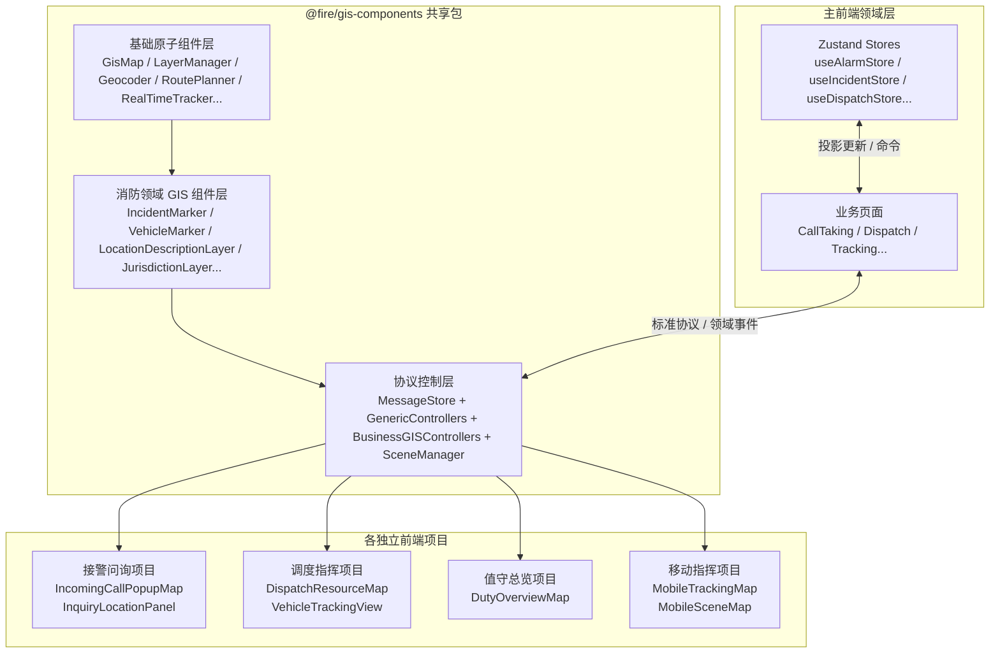

# GIS 前端最终架构文档（v3.0）
## 补齐 P0 遗漏 · 多项目共享包 + 协议驱动 + DDD 领域构建块对齐

**版本**：3.0 Final  
**日期**：2026-07-10  
**状态**：可落地  
**整合来源**：
- 原协议驱动版（Controller + 图层 + 验收标准）
- 原共享包版（多独立前端项目 + `@fire/gis-components`）
- 主前端 DDD + 轻量模型架构
- 《主前端 ↔ GIS 标准协议与领域事件清单》v1.0
- 《GIS 两份架构文档详细分析报告》P0 遗漏项

---

## 一、架构目标与原则

### 1.1 目标
- 支持**多独立前端项目**（接警问询、调度指挥、值守总览、移动指挥）高隔离运行
- 与主前端 **DDD 领域构建块**（AlarmAggregate、LocationDescription、IncidentAggregate 等）严格对齐
- 业务真相始终在主前端 Zustand Store，GIS 只做**投影可视化 + 空间交互**
- 协议下行 + 领域事件上行，形成清晰闭环
- 信创友好、引擎可替换、性能优化统一

### 1.2 核心原则
1. **领域构建块投影优先**：所有可视化与交互围绕 Alarm / LocationDescription / Incident 等投影展开
2. **共享能力 + 项目私有应用**：通用能力进 npm 包，业务流程耦合进各项目私有组件
3. **协议驱动 + 事件回传**：主前端通过标准协议命令 GIS，GIS 通过领域事件通知主前端
4. **地图实例完全独立**：每个前端项目自行初始化地图，无全局单例冲突
5. **浅层 + 组合**：不在 GIS 侧创造深业务模型或深继承
6. **轻量配置**：场景与图层策略用轻量描述，支持运行时调整

---

## 二、整体架构



**数据流**：
- 下行：主前端 Store / 页面 → 标准协议 → GIS Core → 地图渲染
- 上行：地图交互 / 实时数据 → 领域事件 → 主前端 Store 更新 → 最终命令后端聚合

---

## 三、共享包 `@fire/gis-components` 结构

```
@fire/gis-components/
├── base/                          # 基础原子组件（无业务语义）
│   ├── GisMap
│   ├── MapMarker
│   ├── LayerManager
│   ├── Geocoder
│   ├── RoutePlanner
│   ├── SpatialQuery
│   ├── GeofenceDetector
│   ├── RealTimeTracker
│   ├── InfoPopup
│   └── MapToolbar
├── domain/                        # 消防领域 GIS 组件（跨项目复用）
│   ├── IncidentMarker             # 对应 Alarm/Incident 投影
│   ├── VehicleMarker
│   ├── ResourceMarker
│   ├── LocationDescriptionLayer   # 粗定位圈 / 微围栏 / 置信度（P0 补齐）
│   ├── JurisdictionLayer
│   ├── CognitiveSourceOverlay     # 可选
│   └── ResourceListMapPanel
├── core/                          # 协议控制层（P0 核心）
│   ├── MessageStore               # 消息中枢
│   ├── bridge.ts                  # gisBridge 统一入口
│   ├── controllers/
│   │   ├── generic/
│   │   │   ├── ViewController
│   │   │   ├── GeometryController
│   │   │   ├── SpatialController
│   │   │   └── KinematicController
│   │   └── business/
│   │       ├── AlarmGISController
│   │       ├── InquiryGISController
│   │       ├── DispatchGISController
│   │       ├── TrackingGISController
│   │       └── DutyGISController
│   ├── scene/
│   │   └── SceneManager           # 场景 + 图层生命周期
│   └── protocols/                 # 协议与事件类型定义
├── scenes/                        # 轻量场景配置
│   └── layerConfig.ts
└── index.ts
```

### 3.1 基础原子组件层
保持原共享包版设计，职责纯净，不包含消防业务语义。引擎差异、性能优化、后端 GIS 服务调用全部收敛于此。

### 3.2 消防领域 GIS 组件层（补齐领域映射）

| 组件 | 对应领域构建块 | 核心能力 |
|------|----------------|----------|
| IncidentMarker | AlarmAggregate / IncidentAggregate | 等级闪烁、类型图标、编号、状态 |
| VehicleMarker | - | 方向、速度、状态色、尾迹 |
| LocationDescriptionLayer | **LocationDescription** | 粗定位圈、管辖圈、微围栏（AOI3）、置信度可视化、点击修正 |
| JurisdictionLayer | - | 主管/支撑辖区样式与高亮 |
| ResourceMarker | - | 消火栓、重点单位、水源等 |
| ResourceListMapPanel | - | 列表-地图双向联动 |

### 3.3 协议控制层（P0 补齐）

- **MessageStore**：统一发布-订阅，支持命令与领域事件
- **gisBridge**：主前端唯一推荐入口（command / on / off）
- **GenericControllers**：纯地图原子能力
- **BusinessGISControllers**：操作领域投影，组合通用能力
- **SceneManager**：管理场景进入/离开与图层启用/禁用

**依赖方向**（严格单向）：  
`base` ← `domain` ← `core`  
项目私有组件只依赖共享包，不反向依赖。

---

## 四、标准协议与领域事件（P0 契约）

完整清单见独立文档《主前端_GIS_标准协议与领域事件清单.md》。此处仅列核心。

### 4.1 下行核心协议（主前端 → GIS）

| 协议 | 用途 | 关键构建块 |
|------|------|------------|
| `scene.enter` / `scene.leave` | 场景切换 | - |
| `alarm.profile.sync` | 同步当前警情投影 | AlarmAggregate |
| `alarm.location.update` | 更新定位 | LocationDescription |
| `map.locate.call` | 来电粗定位 | LocationDescription |
| `aoi.create` / `aoi.clear` | 微围栏 | LocationDescription |
| `dispatch.viewport.fit` | 四级围栏定位 | - |
| `dispatch.route.plan` / `dispatch.route.show` | 路径 | DispatchPlan |
| `dispatch.vehicle.select` | 图上选车 | - |
| `tracking.vehicle.subscribe` | 订阅实时位置 | - |
| `map.base.fit_bounds` / `layer_toggle` 等 | 基础控制 | - |

### 4.2 上行核心领域事件（GIS → 主前端）

| 事件 | 触发 | 主前端处理 |
|------|------|------------|
| `domain.alarm.location.updated` | 地图选点/候选/修正 | 更新 useAlarmStore.location |
| `domain.aoi.created` | 微围栏生成 | 更新 LocationDescription |
| `domain.vehicle.selected` | 图上点选车辆 | 更新调派选中列表 |
| `domain.route.plan.result` | 路径返回 | 更新 DispatchPlan |
| `domain.vehicle.position.updated` | 实时位置（节流） | 更新跟踪 Store |
| `domain.vehicle.arrived` | 到场检测 | 更新 Incident 状态 |
| `domain.scene.changed` | 场景切换完成 | 模块联动（可选） |
| `domain.map.feature.picked` | 要素点击 | 通用处理 |

**坐标统一**：WGS84  
**高频事件**：position.updated 建议 GIS 侧 ≤ 2Hz 节流

---

## 五、场景与图层管理（保留并下沉）

### 5.1 场景枚举
```ts
type SceneType = 'duty' | 'incoming_call' | 'inquiry' | 'dispatch' | 'tracking' | 'on_scene'
```

### 5.2 场景图层配置（轻量，可运行时调整）

| 场景 | 启用图层（核心） | 对应主前端模块 |
|------|------------------|----------------|
| duty | incident_layer, road_network, jurisdiction_fence, key_units, buildings... | 值守 |
| incoming_call | call_position, road_network, incident_layer | 弹屏 |
| inquiry | current_alarm, similar_alarm, call_position, jurisdiction_range, aoi_circle, single_building... | 接警问询 |
| dispatch | current_alarm, stations, support_fences, aoi_circle, hydrants, entrances, route_line | 调派 |
| tracking | current_alarm, stations, route_line, vehicle_track, aoi_circle... | 跟踪 |
| on_scene | aoi_circle, assembly_point, hydrants, entrances | 到场 |

图层生命周期由 **SceneManager** 统一控制（进入场景启用、离开场景清理临时要素）。

---

## 六、各前端项目私有 GIS 应用组件

| 项目 | 私有组件 | 主要依赖共享能力 | 主要领域构建块 |
|------|----------|------------------|----------------|
| 接警问询 | IncomingCallPopupMap | GisMap + IncidentMarker + LocationDescriptionLayer + InquiryGISController | AlarmAggregate, LocationDescription |
| 接警问询 | InquiryLocationPanel | 同上 + Geocoder + SpatialQuery | LocationDescription, CognitiveSource |
| 调度指挥 | DispatchResourceMap | GisMap + VehicleMarker + RoutePlanner + DispatchGISController | IncidentAggregate, DispatchPlan |
| 调度指挥 | VehicleTrackingView | RealTimeTracker + TrackingGISController | IncidentAggregate |
| 值守总览 | DutyOverviewMap | LayerManager + IncidentMarker + DutyGISController | Alarm/Incident 列表 |
| 移动指挥 | MobileTrackingMap / MobileSceneMap | 轻量化组件 + TrackingGISController | 简化 Incident |

**私有组件职责**：组合共享组件 + 调用协议 + 对接本项目页面与 Store，不实现通用能力。

---

## 七、与主前端的集成规范

1. **唯一推荐入口**：`import { gisBridge } from '@fire/gis-components'`
2. **下行**：`gisBridge.command(protocol, payload)`
3. **上行**：`gisBridge.on(event, handler)` / `gisBridge.off(...)`
4. **投影同步**：进入业务页时必须先 `alarm.profile.sync` 或等价命令
5. **写闭环**：地图产生的 `domain.alarm.location.updated` 等事件 → 更新 Zustand → 防抖后发后端命令
6. **场景切换**：由主前端业务模块显式调用 `scene.enter`，GIS 不擅自做主业务跳转
7. **类型共享**：领域类型（AlarmAggregateProjection、LocationDescription 等）放在共享 types 包，主前端与 GIS 包共同依赖

---

## 八、技术决策（ADR）

| 编号 | 决策 |
|------|------|
| ADR-001 | 采用「共享 npm 包 + 各项目私有应用组件」多项目模式 |
| ADR-002 | 共享包内实现协议控制层（MessageStore + Controllers + SceneManager） |
| ADR-003 | 业务真相在主前端领域 Store，GIS 只持有投影 |
| ADR-004 | 下行协议 + 上行领域事件作为唯一集成契约 |
| ADR-005 | 地图实例由各项目自行创建，共享包不持有全局单例 |
| ADR-006 | 引擎差异、GIS 后端服务、性能优化全部收敛在共享包 base 层 |
| ADR-007 | 场景与图层配置采用轻量描述，由 SceneManager 管理生命周期 |
| ADR-008 | 坐标统一 WGS84；高频位置事件必须节流 |
| ADR-009 | 协议与事件一旦发布禁止 breaking change，只允许新增 |

---

## 九、验收标准（完整继承）

保留原协议版所有 AC / FP 标准（值守、来电、问询、FP-4.1 ~ FP-4.16 等），作为场景与功能的验收依据。新增：

- 主前端可通过标准协议完成「同步警情 → 展示定位 → 用户修正 → 收到 location.updated → Store 更新」完整闭环
- 多项目同时运行时地图实例无冲突、样式无污染
- 信创引擎替换仅需升级共享包，业务项目代码零修改

---

## 十、实施路线（推荐）

**Phase 1（P0 闭环）**
1. 落地 `@fire/gis-components` 基础结构 + 类型定义
2. 实现 MessageStore + gisBridge + 核心协议/事件
3. 实现 LocationDescriptionLayer + AlarmGISController / InquiryGISController
4. 在接警问询项目打通第一条完整闭环

**Phase 2**
- 补齐调派、跟踪相关 Controller 与组件
- SceneManager + 全场景图层配置
- 值守与移动项目接入

**Phase 3**
- 性能优化、降级、错误处理、契约测试
- 文档与 Storybook 完善

---

## 十一、版本记录

- 协议驱动版 1.x：场景与验收细
- 共享包版：多项目工程化
- 分析报告：指出 P0 遗漏
- 协议与事件清单 v1.0：定义集成契约
- **本 v3.0 Final**：补齐所有 P0 遗漏，形成可落地的最终 GIS 前端架构

---

**总结**  
本架构以多项目共享包为工程基础，以协议控制层 + 领域构建块投影为对齐手段，以标准下行协议与上行领域事件为集成契约，完整继承了两份原始文档的优点，并系统性补齐了领域脱节、主前端缝合、写路径闭环、场景管理等关键遗漏。  

可直接作为 7th gen 消防接处警系统 GIS 前端的实施基线。
