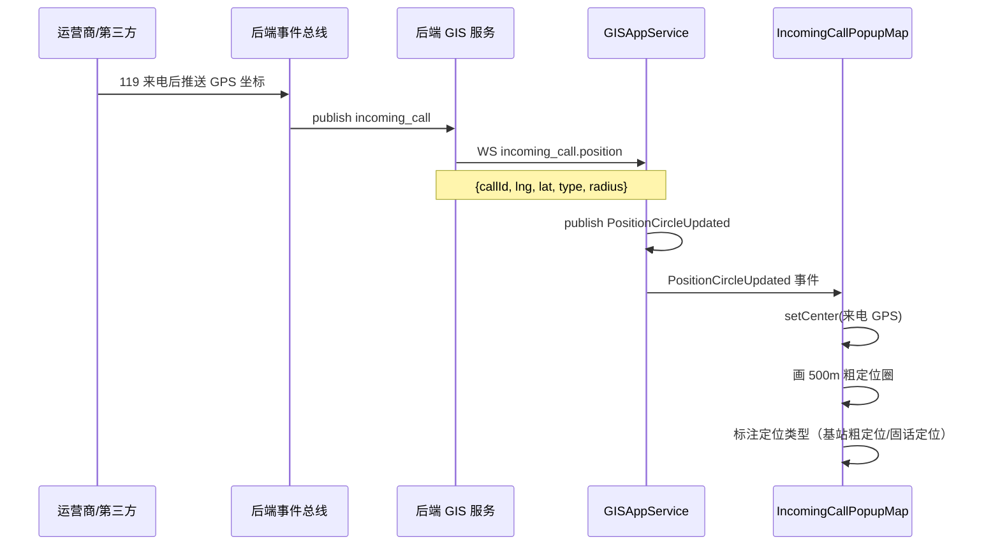
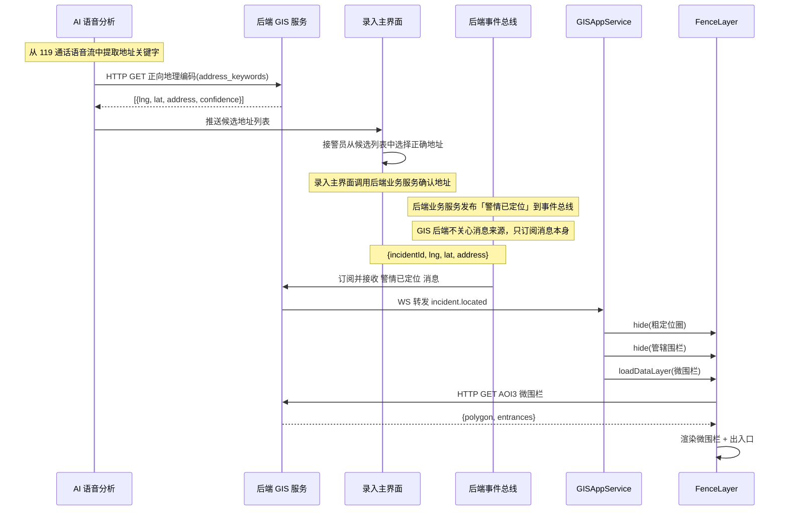
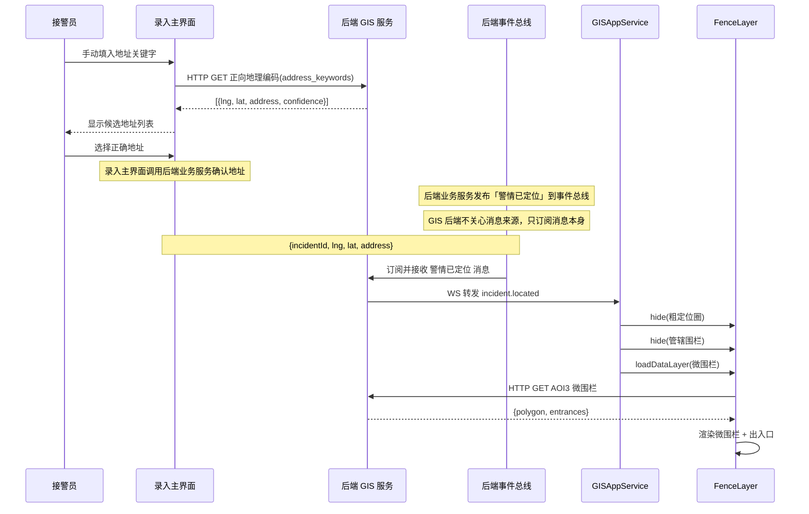
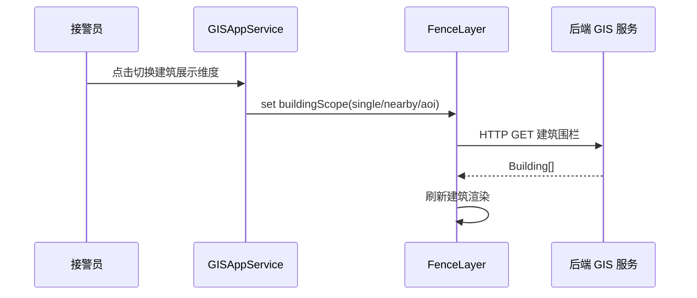
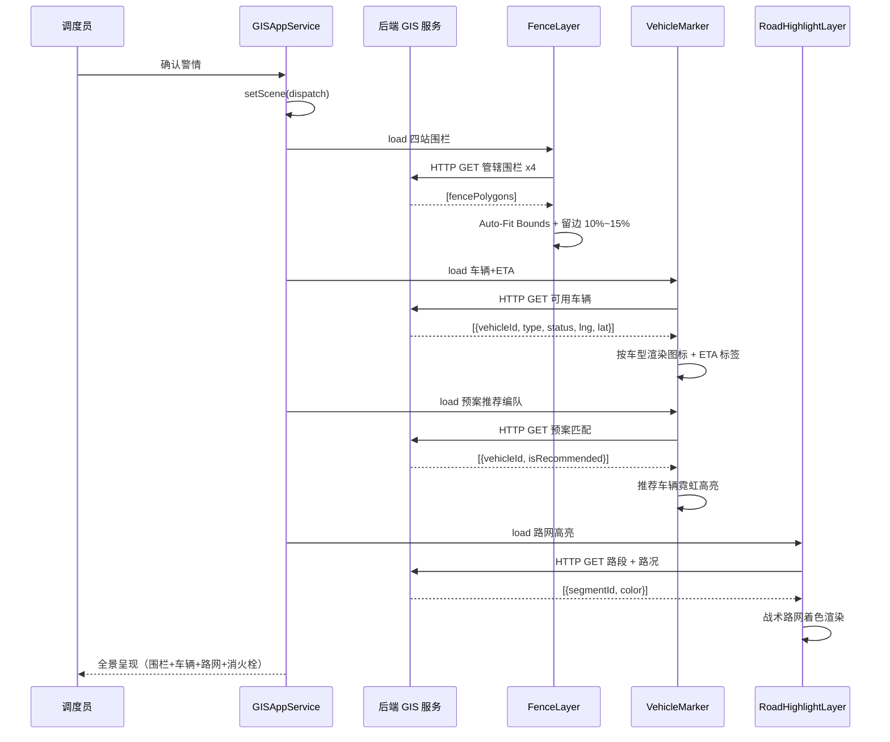
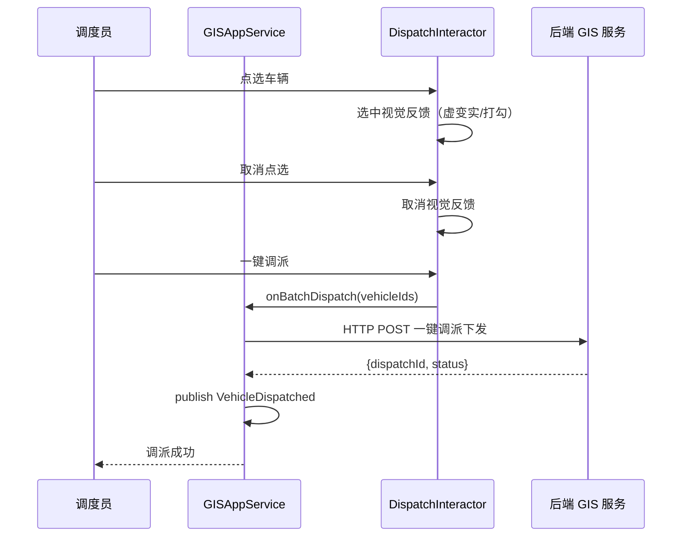
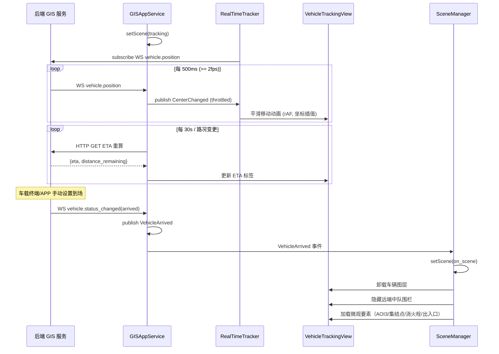
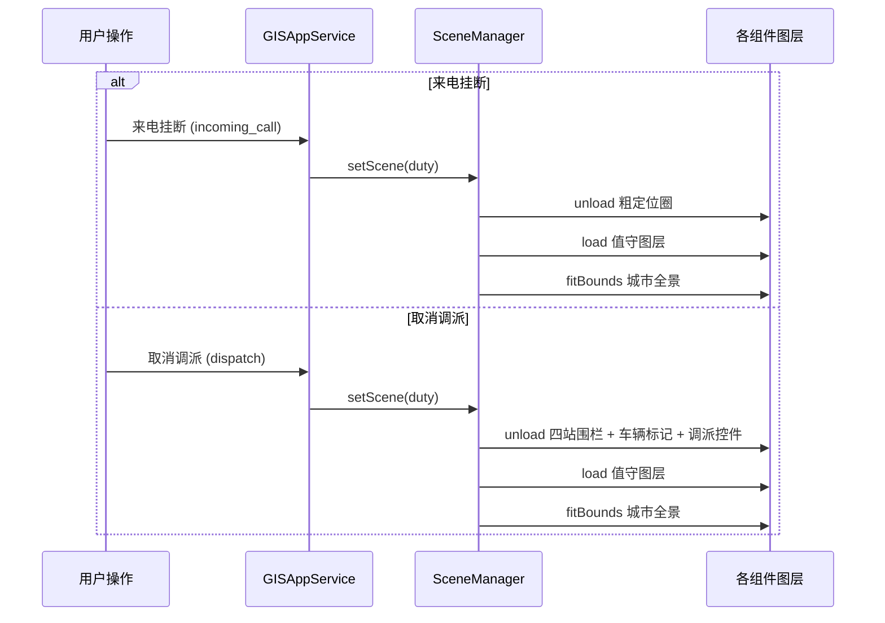
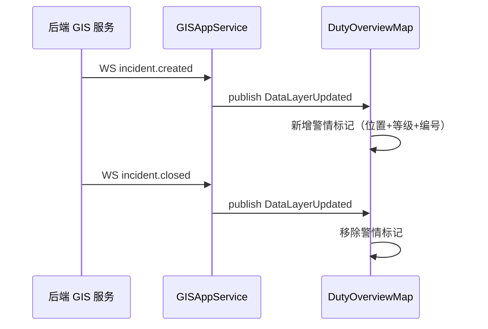

# GIS 交互时序图

> 本文档为《GIS 端整体架构_v2》子文档，覆盖接处警全场景中 GIS 相关的关键时刻序。

## 参与角色

| 角色 | 运行环境 | 说明 |
|------|---------|------|
| 运营商/第三方 | 外部 | 119 接警后主动推送来电 GPS |
| 后端事件总线 | 后端 | 解耦外部推送与 GIS 后端的消息中间件 |
| 后端 GIS 服务 | 后端 | 提供 HTTP API + WebSocket |
| GISAppService | 浏览器 | GIS 前端唯一门面，发布所有前端事件 |
| Event Bus | 浏览器 | 前端组件间通信的事件总线 |
| SceneManager | 浏览器 | 场景生命周期管理器 |
| 各 UI 组件 | 浏览器 | IncomingCallPopupMap、InquiryLocationPanel、DispatchResourceMap、VehicleTrackingView、DutyOverviewMap |

---

## 一、来电弹屏：粗定位圈呈现（3.2）

---

## 二、问询研判：从粗定位圈到微围栏（3.3）

> **前提**：地址录入不在 GIS 屏。系统有三屏——**GIS 屏**、**资源调派屏**、**录入主界面**。地址输入和候选选择全部发生在录入主界面，GIS 屏作为监听方被动响应。

### 2.1 自动触发：AI 语音提取 → GIS 后端定位 → 录入主界面选中 → 后端服务发布「警情已定位」→ GIS 响应

### 2.2 手动触发：录入主界面手动填地址 → 后端服务发布「警情已定位」→ GIS 响应

### 2.3 建筑展示维度切换（GIS 屏本地交互）

---

## 三、图上调派（3.4.1~3.4.4）

### 3.1 图层加载 + 全景呈现

### 3.2 图上点选 + 一键调派

---

## 四、途中跟踪与到场作战（3.4.5）

---

## 五、场景回退

---

## 六、值守总览：警情实时刷新（3.1）

---

## 附录：Mermaid 渲染说明

本文档中的 Mermaid 时序图在以下环境中可直接渲染：
- GitHub / GitLab Markdown 预览
- VS Code（安装 Markdown Preview Mermaid Support 插件）
- Typora / Obsidian
- 任意支持 Mermaid 的 Markdown 渲染器