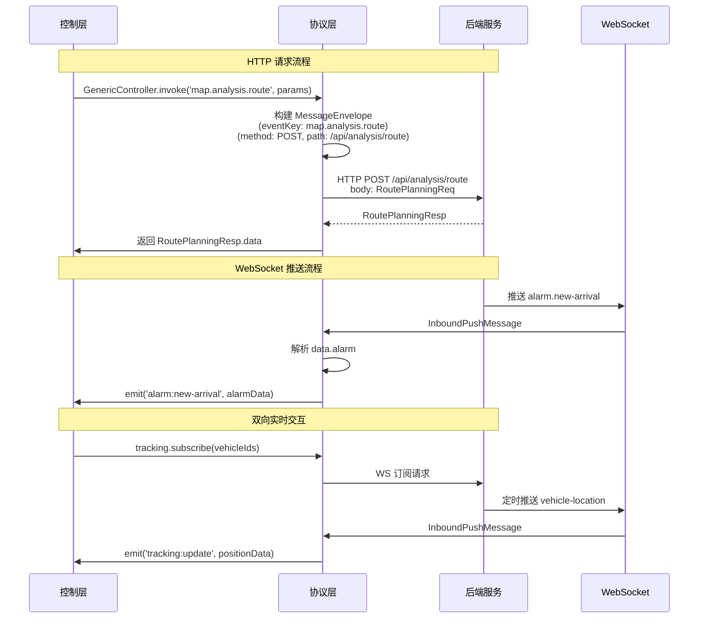

# 02-协议层与后端交互结构

## 一、交互概述

协议层作为GIS系统的**通信中枢**，承担着前端各层（控制层、计算层、渲染层）与后端服务之间的数据转换、路由和适配职责。

```
┌─────────────────────────────────────────────────────────────────────┐
│                         GIS 前端系统                                 │
│                                                                     │
│  ┌──────────┐    HTTP/WS     ┌──────────────┐    WS Push      ┌──────────┐  │
│  │  控制层   │◄──────────────►│   协议层      │◄──────────────►│  后端    │  │
│  │(Controller)│              │(Protocol)     │                │(Backend)  │  │
│  └──────────┘    HTTP/WS     └──────────────┘    WS Push      └──────────┘  │
│       ▲                        ▲                                          │
│       │ 事件驱动               │ MessageEnvelope                          │
│  ┌──────────┐    本地调用    ┌──────────────┐                             │
│  │ 计算层    │◄────────────►│ 数据适配器    │                             │
│  │(Compute) │              │(Adapter)      │                             │
│  └──────────┘              └──────────────┘                             │
└─────────────────────────────────────────────────────────────────────┘
```

---

## 二、协议层 → 后端：HTTP 请求结构

### 2.1 请求信封格式

所有发给后端的请求都封装在标准信封中：

```typescript
interface OutboundRequest {
  /** 请求唯一标识 */
  id: string;
  /** 时间戳 (ms) */
  ts: number;
  /** 来源系统 */
  system: 'gis-frontend';
  /** 目标系统 */
  target: 'backend-api';
  /** 操作类型 */
  eventKey: string;
  /** 请求方法 */
  method: 'GET' | 'POST' | 'PUT' | 'DELETE';
  /** 请求路径 */
  path: string;
  /** 请求头 */
  headers: Record<string, string>;
  /** 请求体 */
  body?: Record<string, unknown>;
  /** 查询参数 */
  query?: Record<string, string>;
  /** 超时时间 (ms) */
  timeout?: number;
}
```

### 2.2 各模块 HTTP 请求明细

#### 2.2.1 地图基础服务请求

| 操作 | EventKey | Method | Path | 请求体/参数 | 响应结构 |
|------|----------|--------|------|-------------|----------|
| 获取底图配置 | `map.base.getConfig` | GET | `/api/map/config` | — | `MapConfigResponse` |
| 获取图层列表 | `map.base.getLayers` | GET | `/api/map/layers` | — | `LayerListResponse` |
| 切换图层可见性 | `map.base.toggleLayer` | POST | `/api/map/layer/toggle` | `ToggleLayerReq` | `ToggleLayerResp` |
| 设置视图范围 | `map.base.setViewExtent` | POST | `/api/map/view/set-extent` | `ViewExtentReq` | `ViewExtentResp` |
| 获取地图快照 | `map.base.capture` | GET | `/api/map/capture` | `CaptureReq` | `CaptureResp` |

**请求体结构：**

```typescript
// 切换图层可见性
interface ToggleLayerReq {
  layerId: string;       // 图层ID
  visible: boolean;      // 是否可见
  opacity?: number;      // 透明度 0-1
}

// 设置视图范围
interface ViewExtentReq {
  minX: number;          // 最小经度
  minY: number;          // 最小纬度
  maxX: number;          // 最大经度
  maxY: number;          // 最大纬度
  zoom?: number;         // 缩放级别
}

// 地图快照
interface CaptureReq {
  format?: 'png' | 'jpeg'; // 输出格式
  quality?: number;        // 质量 1-100
  includeAnnotations?: boolean; // 是否包含标注
}
```

**响应结构：**

```typescript
// 底图配置
interface MapConfigResponse {
  basemaps: BasemapInfo[];
  defaultBasemap: string;
  tileSize: number;
  maxZoom: number;
  minZoom: number;
}

// 图层列表
interface LayerListResponse {
  layers: LayerInfo[];
  groups: LayerGroup[];
}

interface LayerInfo {
  id: string;
  name: string;
  type: 'raster' | 'vector' | 'wms' | 'wfs';
  visible: boolean;
  opacity: number;
  zIndex: number;
  source: SourceConfig;
}

interface SourceConfig {
  url: string;
  format?: string;
  attribution?: string;
  params?: Record<string, string>;
}
```

#### 2.2.2 标绘服务请求

| 操作 | EventKey | Method | Path | 请求体/参数 | 说明 |
|------|----------|--------|------|-------------|------|
| 保存标绘图元 | `map.draw.save` | POST | `/api/draw/save` | `DrawSaveReq` | 持久化矢量图形 |
| 获取标绘图元 | `map.draw.query` | GET | `/api/draw/query` | `DrawQueryReq` | 按区域/类型查询 |
| 删除标绘图元 | `map.draw.delete` | DELETE | `/api/draw/{id}` | — | 删除指定图元 |
| 更新标绘样式 | `map.draw.updateStyle` | PUT | `/api/draw/style` | `DrawStyleReq` | 修改颜色/线宽等 |

**请求体结构：**

```typescript
// 保存标绘图元
interface DrawSaveReq {
  features: DrawFeature[];
  layerId: string;           // 所属图层
  userId?: string;           // 操作用户
}

interface DrawFeature {
  id: string;                // 图元ID
  type: 'point' | 'line' | 'polygon' | 'circle' | 'rectangle' | 'arrow' | 'label';
  geometry: GeoJSONGeometry; // GeoJSON 几何对象
  properties: DrawProperties; // 属性
  style?: DrawStyle;         // 样式覆盖
}

interface DrawProperties {
  label?: string;            // 标注文字
  color?: string;            // 填充颜色 #RRGGBB
  lineWidth?: number;        // 线宽 px
  fillColor?: string;        // 填充色
  opacity?: number;          // 透明度
  dashArray?: number[];      // 虚线模式 [长度, 间隔]
}

interface DrawStyle {
  strokeColor?: string;
  strokeWidth?: number;
  fillColor?: string;
  fillOpacity?: number;
  iconUrl?: string;
  iconSize?: [number, number];
}

// 查询标绘图元
interface DrawQueryReq {
  layerId?: string;          // 图层过滤
  types?: DrawType[];        // 类型过滤
  extent?: Extent;           // 范围过滤
  startTime?: number;        // 创建时间起
  endTime?: number;          // 创建时间止
  page?: number;             // 页码
  pageSize?: number;         // 每页条数
}
```

#### 2.2.3 空间分析请求

| 操作 | EventKey | Method | Path | 说明 |
|------|----------|--------|------|------|
| 缓冲区分析 | `map.analysis.buffer` | POST | `/api/analysis/buffer` | 创建地理缓冲区 |
| 路径规划 | `map.analysis.route` | POST | `/api/analysis/route` | 最短/最快路径 |
| 叠加分析 | `map.analysis.overlay` | POST | `/api/analysis/overlay` | 交集/并集/差集 |
| 可视域分析 | `map.analysis.visibility` | POST | `/api/analysis/visibility` | 视点可见范围 |
| 面积/周长计算 | `map.analysis.measure` | POST | `/api/analysis/measure` | 几何量算 |

**缓冲区分析请求：**

```typescript
interface BufferAnalysisReq {
  targetFeatures: string[];    // 目标图元ID列表
  distance: number;            // 缓冲距离 (米)
  unit: 'meter' | 'kilometer' | 'degree';
  dissolve?: boolean;          // 是否合并重叠缓冲区
  sides?: 'full' | 'left' | 'right';
}

interface BufferAnalysisResp {
  resultFeatures: DrawFeature[]; // 生成的缓冲区域
  stats: {
    totalArea: number;           // 总面积 (m²)
    perimeter: number;           // 总周长 (m)
    count: number;               // 图元数量
  };
}
```

**路径规划请求：**

```typescript
interface RoutePlanningReq {
  origin: [number, number];      // 起点 [lng, lat]
  destination: [number, number]; // 终点 [lng, lat]
  waypoints?: [number, number][]; // 途经点
  mode?: 'driving' | 'walking' | 'fire-truck'; // 通行模式
  avoidHighways?: boolean;       // 避开高速
  vehicleProfile?: VehicleProfile; // 车辆参数（消防车）
}

interface VehicleProfile {
  maxSpeed: number;              // 最高时速 km/h
  maxWeight: number;             // 最大载重 吨
  heightLimit: number;           // 高度限制 m
  widthLimit: number;            // 宽度限制 m
}

interface RoutePlanningResp {
  route: GeoJSONLineString;      // 路径几何
  segments: RouteSegment[];      // 路段分解
  summary: RouteSummary;         // 汇总信息
 ETA: number;                    // 预计到达时间 (秒)
}

interface RouteSegment {
  id: string;
  name: string;                  // 道路名称
  distance: number;              // 距离 (m)
  duration: number;              // 耗时 (s)
  speedLimit: number;            // 限速 km/h
  turnInstruction?: string;      // 转向指令
}

interface RouteSummary {
  totalDistance: number;         // 总距离 (m)
  totalDuration: number;         // 总时长 (s)
  startPoint: [number, number];
  endPoint: [number, number];
}
```

#### 2.2.4 轨迹服务请求

| 操作 | EventKey | Method | Path | 说明 |
|------|----------|--------|------|------|
| 获取车辆轨迹 | `tracking.getVehicleTrack` | GET | `/api/tracking/vehicle/{id}/track` | 历史轨迹回放 |
| 订阅实时位置 | `tracking.subscribe` | WS | `/ws/tracking` | 实时位置推送 |
| 设置追踪区域 | `tracking.setRegion` | POST | `/api/tracking/region` | 电子围栏 |
| 获取告警记录 | `tracking.getAlerts` | GET | `/api/tracking/alerts` | 越界/超速告警 |

**轨迹请求：**

```typescript
interface VehicleTrackReq {
  vehicleId: string;             // 车辆ID
  startTime: number;             // 开始时间 (ms)
  endTime: number;               // 结束时间 (ms)
  interval?: number;             // 采样间隔 (s)，默认5
}

interface VehicleTrackPoint {
  timestamp: number;             // 时间戳
  lng: number;                   // 经度
  lat: number;                   // 纬度
  altitude?: number;             // 海拔
  speed?: number;                // 速度 km/h
  heading?: number;              // 航向角 0-360
  status?: VehicleStatus;        // 车辆状态
}

interface VehicleStatus {
  engineOn: boolean;             // 引擎状态
  doorOpen: boolean;             // 车门状态
  fuelLevel: number;             // 油量 %
  tirePressure?: number[];       // 胎压数组
  alarmStatus: AlarmFlag[];      // 告警标志
}

interface AlarmFlag {
  type: 'overspeed' | 'geofence' | 'panic' | 'maintenance';
  level: 'info' | 'warning' | 'critical';
  message: string;
}
```

#### 2.2.5 警情调度请求

| 操作 | EventKey | Method | Path | 说明 |
|------|----------|--------|------|------|
| 创建警情 | `dispatch.createAlarm` | POST | `/api/dispatch/alarm` | 新建火警事件 |
| 获取警情详情 | `dispatch.getAlarmDetail` | GET | `/api/dispatch/alarm/{id}` | 警情完整信息 |
| 更新警情状态 | `dispatch.updateAlarmStatus` | PUT | `/api/dispatch/alarm/{id}/status` | 状态流转 |
| 调派力量 | `dispatch.dispatchForces` | POST | `/api/dispatch/forces` | 派出消防力量 |
| 获取力量列表 | `dispatch.getForces` | GET | `/api/dispatch/forces` | 可用资源 |
| 确认接警 | `dispatch.confirmAlarm` | POST | `/api/dispatch/alarm/{id}/confirm` | 值班确认 |

**创建警情请求：**

```typescript
interface CreateAlarmReq {
  alarmNo: string;               // 警情编号 (自动生成)
  alarmTime: number;             // 报警时间
  location: AlarmLocation;       // 报警位置
  alarmType: AlarmType;          // 报警类型
  severity: SeverityLevel;       // 严重程度
  reporter?: ReporterInfo;       // 报警人信息
  description?: string;          // 详细描述
  attachments?: Attachment[];    // 附件
  sourceChannel: ChannelType;    // 来源渠道
}

interface AlarmLocation {
  address: string;               // 详细地址
  lng: number;                   // 经度
  lat: number;                   // 纬度
  building?: string;             // 建筑物名称
  floor?: number;                // 楼层
  room?: string;                 // 房间号
  polygon?: GeoJSONPolygon;      // 建筑轮廓
}

interface AlarmLocation {
  address: string;               // 详细地址
  lng: number;                   // 经度
  lat: number;                   // 纬度
  building?: string;             // 建筑物名称
  floor?: number;                // 楼层
  room?: string;                 // 房间号
  polygon?: GeoJSONPolygon;      // 建筑轮廓
}

interface ReporterInfo {
  name?: string;
  phone?: string;
  identity?: string;             // 身份
}

interface Attachment {
  type: 'image' | 'video' | 'audio' | 'document';
  url: string;
  size?: number;
  caption?: string;
}

type AlarmType = 'fire' | 'hazmat' | 'rescue' | 'false-alarm' | 'other';
type SeverityLevel = 'level-1' | 'level-2' | 'level-3' | 'level-4';
type ChannelType = '119-hotline' | 'monitoring-center' | 'mobile-app' | 'iot-sensor' | 'manual-entry';
```

**调派力量请求：**

```typescript
interface DispatchForcesReq {
  alarmId: string;               // 关联警情ID
  dispatches: ForceDispatchItem[]; // 调派项列表
  priority: 'normal' | 'urgent' | 'extreme';
  commander?: string;            // 指挥员ID
  notes?: string;                // 备注
}

interface ForceDispatchItem {
  forceId: string;               // 力量ID
  forceType: 'station' | 'vehicle' | 'personnel' | 'equipment';
  quantity: number;              // 数量
  reason?: string;               // 调派原因
}

interface ForceDispatchResp {
  dispatchId: string;
  dispatchedForces: DispatchedForce[];
  estimatedArrival: Record<string, number>; // forceId -> ETA(秒)
  notificationSent: boolean;     // 通知是否发送
}

interface DispatchedForce {
  id: string;
  name: string;                  // 名称（中队名/车号）
  type: ForceType;
  location: [number, number];    // 当前位置
  personnel: number;             // 人数
  vehicles: number;              // 车辆数
  equipment?: EquipmentBrief[];  // 装备简述
}
```

#### 2.2.6 BIM 模型服务请求

| 操作 | EventKey | Method | Path | 说明 |
|------|----------|--------|------|------|
| 加载BIM模型 | `bim.loadModel` | POST | `/api/bim/model/load` | 加载建筑模型 |
| 获取模型信息 | `bim.getModelInfo` | GET | `/api/bim/model/{id}` | 模型元数据 |
| 查询构件信息 | `bim.getComponent` | GET | `/api/bim/component/{id}` | 构件属性 |
| 构件高亮/隐藏 | `bim.highlightComponent` | POST | `/api/bim/highlight` | 视觉反馈 |
| 剖切模型 | `bim.cutModel` | POST | `/api/bim/cut` | 创建剖面 |

**加载BIM模型请求：**

```typescript
interface LoadBIMModelReq {
  modelId: string;               // 模型ID
  lod?: number;                  // 细节等级 1-4
  includeMaterials?: boolean;    // 是否加载材质
  coordinateSystem?: string;     // 坐标系
  boundingBox?: Extent;          // 裁剪范围
  callbacks?: {
    onProgress?: (loaded: number, total: number) => void;
    onComplete?: () => void;
    onError?: (error: string) => void;
  };
}

interface BIMModelInfo {
  id: string;
  name: string;
  version: string;
  buildingType: string;          // 建筑类型
  floors: number;                // 楼层数
  area: number;                  // 建筑面积 m²
  components: ComponentCount;    // 构件统计
  lastModified: number;
  thumbnail?: string;
}

interface ComponentCount {
  total: number;
  walls: number;
  doors: number;
  windows: number;
  fireEquipment: number;
  electrical: number;
  plumbing: number;
}
```

---

## 三、后端 → 协议层：WebSocket 推送结构

### 3.1 推送信封格式

后端通过 WebSocket 向前端推送数据，协议层接收后解析为标准消息格式：

```typescript
interface InboundPushMessage {
  /** 消息ID (用于去重/确认) */
  id: string;
  /** 服务端时间戳 */
  ts: number;
  /** 消息来源 */
  source: 'backend-ws';
  /** 事件键 */
  eventKey: string;
  /** 消息类型 */
  msgType: 'push' | 'ack' | 'error' | 'heartbeat';
  /** 数据载荷 */
  data: Record<string, unknown>;
  /** 错误信息 (仅 error 类型) */
  error?: {
    code: string;
    message: string;
  };
}
```

### 3.2 推送消息分类

#### 3.2.1 警情推送

```typescript
// 新警情到达
{
  id: "ws-push-001",
  ts: 1720944000000,
  source: "backend-ws",
  eventKey: "alarm.new-arrival",
  msgType: "push",
  data: {
    alarm: {
      alarmNo: "20260714-0001",
      alarmTime: 1720943900000,
      location: {
        address: "XX市XX区XX路XX号",
        lng: 116.397428,
        lat: 39.90923,
        building: "XX大厦",
        floor: 12
      },
      alarmType: "fire",
      severity: "level-2",
      sourceChannel: "119-hotline",
      reporter: { name: "张三", phone: "138****5678" }
    }
  }
}
```

#### 3.2.2 力量状态推送

```typescript
// 车辆位置实时更新
{
  id: "ws-push-002",
  ts: 1720944005000,
  source: "backend-ws",
  eventKey: "tracking.vehicle-location",
  msgType: "push",
  data: {
    vehicleId: "VH-2026-001",
    vehicleName: "消防一号车",
    stationId: "ST-001",
    position: {
      lng: 116.398000,
      lat: 39.910000,
      altitude: 45.2,
      speed: 60,
      heading: 180
    },
    status: {
      engineOn: true,
      doorOpen: false,
      fuelLevel: 85,
      alarmStatus: []
    },
    etaToScene: 420,
    missionId: "M-20260714-001"
  }
}
```

#### 3.2.3 调度指令推送

```typescript
// 新增调派指令
{
  id: "ws-push-003",
  ts: 1720944010000,
  source: "backend-ws",
  eventKey: "dispatch.force-assigned",
  msgType: "push",
  data: {
    dispatchId: "D-20260714-001",
    alarmId: "AL-20260714-001",
    force: {
      id: "ST-001",
      name: "朝阳消防中队",
      type: "station",
      personnel: 12,
      vehicles: 3
    },
    assignedAt: 1720944010000,
    priority: "urgent",
    commander: "CMD-001"
  }
}
```

#### 3.2.4 场景状态变更推送

```typescript
// 场景状态流转
{
  id: "ws-push-004",
  ts: 1720944015000,
  source: "backend-ws",
  eventKey: "scene.state-changed",
  msgType: "push",
  data: {
    sceneId: "SC-20260714-001",
    prevState: "dispatch",
    nextState: "tracking",
    changedBy: "SYS-AUTO",
    changedAt: 1720944015000,
    reason: "力量全部出动"
  }
}
```

#### 3.2.5 告警推送

```typescript
// 车辆告警
{
  id: "ws-push-005",
  ts: 1720944020000,
  source: "backend-ws",
  eventKey: "tracking.alarm-triggered",
  msgType: "push",
  data: {
    vehicleId: "VH-2026-001",
    alarmType: "overspeed",
    level: "warning",
    message: "车速超过限速 80km/h",
    position: { lng: 116.3985, lat: 39.9105 },
    triggeredAt: 1720944020000
  }
}
```

#### 3.2.6 心跳与连接管理

```typescript
// 心跳
{
  id: "ws-heartbeat-001",
  ts: 1720944000000,
  source: "backend-ws",
  eventKey: "system.heartbeat",
  msgType: "heartbeat",
  data: { pong: true }
}

// 错误
{
  id: "ws-error-001",
  ts: 1720944025000,
  source: "backend-ws",
  eventKey: "system.error",
  msgType: "error",
  data: {},
  error: {
    code: "AUTH_EXPIRED",
    message: "认证令牌已过期，请重新登录"
  }
}
```

---

## 四、协议层 ↔ 后端 输入输出关系图



---

## 五、数据流全景表

| 方向 | 通道 | 事件Key前缀 | 数据量级 | 频率 | 优先级 |
|------|------|-------------|----------|------|--------|
| 前端→后端 | HTTP | `map.*`, `dispatch.*`, `tracking.*` | KB~MB | 按需触发 | 高 |
| 后端→前端 | WS Push | `alarm.*`, `tracking.*`, `dispatch.*`, `scene.*` | KB | 实时/准实时 | 紧急 |
| 前端→后端 | WS | `tracking.subscribe`, `tracking.unsubscribe` | B | 会话级 | 中 |
| 后端→前端 | WS Heartbeat | `system.heartbeat` | B | 30s | 低 |

---

## 六、关键字段映射关系

### 6.1 警情数据字段映射

```
前端 (协议层 In)          ←→      后端 (API Response)
─────────────────────────────────────────────────────
alarmNo              ←→       alarmNo
alarmTime            ←→       alarmTime
location.address     ←→       location.address
location.lng         ←→       location.lng
location.lat         ←→       location.lat
alarmType            ←→       alarmType
severity             ←→       severity
reporter.name        ←→       reporter.name
reporter.phone       ←→       reporter.phone
sourceChannel        ←→       sourceChannel
attachments[].url    ←→       attachments[].url
```

### 6.2 车辆位置数据字段映射

```
前端 (协议层 In)          ←→      后端 (WS Push)
─────────────────────────────────────────────────────
vehicleId            ←→       vehicleId
vehicleName          ←→       vehicleName
position.lng         ←→       position.lng
position.lat         ←→       position.lat
position.altitude    ←→       position.altitude
position.speed       ←→       position.speed
position.heading     ←→       position.heading
status.engineOn      ←→       status.engineOn
status.fuelLevel     ←→       status.fuelLevel
status.alarmStatus   ←→       status.alarmStatus
etaToScene           ←→       etaToScene
```

### 6.3 调派数据字段映射

```
前端 (协议层 In)          ←→      后端 (API Response)
─────────────────────────────────────────────────────
alarmId              ←→       alarmId
dispatches[].forceId ←→       dispatches[].forceId
dispatches[].type    ←→       dispatches[].type
dispatches[].quantity←→       dispatches[].quantity
priority             ←→       priority
commander            ←→       commander
```

---

## 七、错误处理机制

### 7.1 错误码体系

| 错误码 | 含义 | 处理方式 |
|--------|------|----------|
| `AUTH_EXPIRED` | 认证过期 | 跳转登录页 |
| `PERMISSION_DENIED` | 权限不足 | 提示用户 |
| `INVALID_PARAMS` | 参数错误 | 校验表单 |
| `SERVICE_UNAVAILABLE` | 服务不可用 | 重试/降级 |
| `TIMEOUT` | 请求超时 | 重试一次 |
| `DATA_NOT_FOUND` | 数据不存在 | 提示无数据 |
| `BIM_LOAD_FAILED` | BIM加载失败 | 回退到2D图层 |

### 7.2 错误消息结构

```typescript
interface ErrorResponse {
  code: string;
  message: string;
  details?: Record<string, unknown>;
  retryable: boolean;
  suggestedAction?: string;
}
```

---

## 八、总结

本节详细描述了协议层与后端之间的完整交互结构：

1. **HTTP 请求**：控制层通过协议层发起 RESTful API 请求，涵盖地图、标绘、分析、轨迹、警情、BIM 八大模块。
2. **WebSocket 推送**：后端通过 WS 实时推送警情、车辆位置、调度指令、告警等信息。
3. **信封标准化**：所有交互都遵循统一的 `MessageEnvelope` / `InboundPushMessage` 格式。
4. **字段映射**：前后端数据结构保持对齐，协议层负责必要的类型转换。
