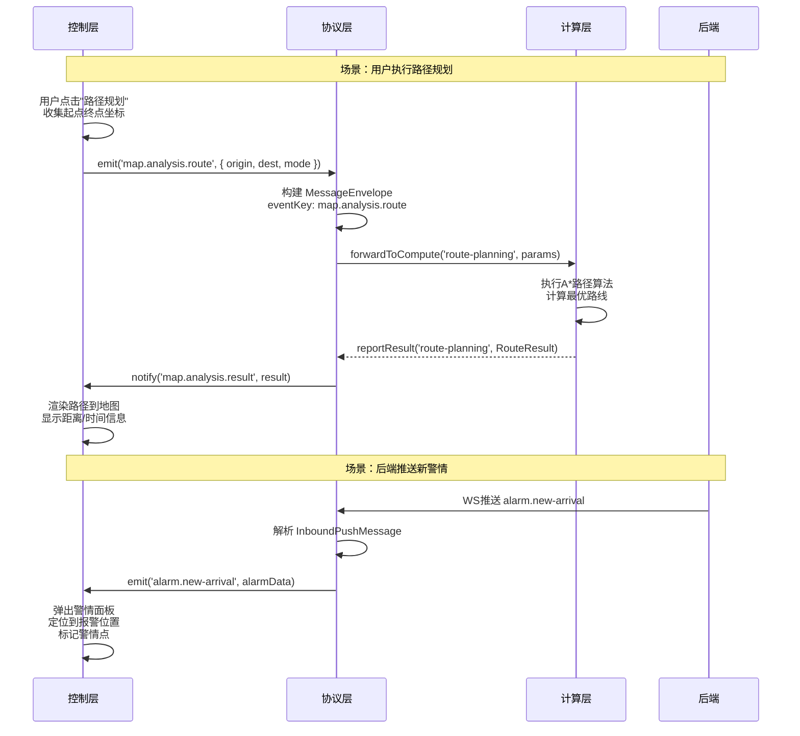
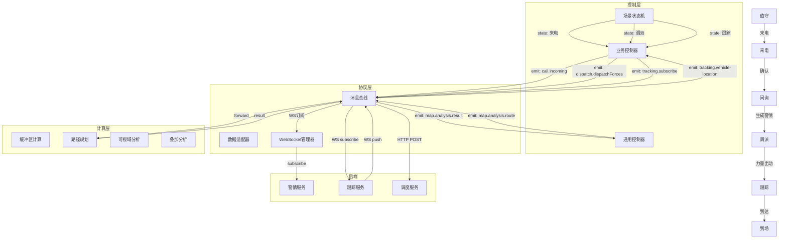
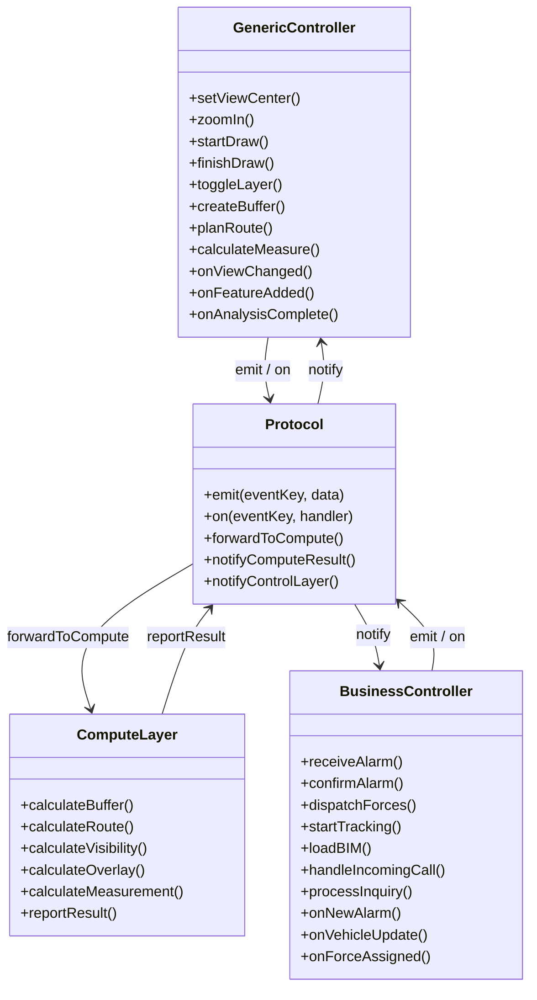
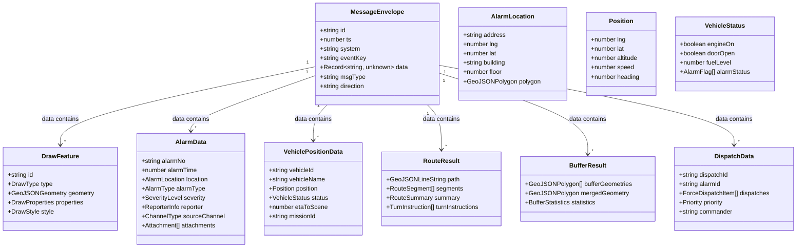

# 03-计算层与控制层和协议层交互结构

## 一、三层架构定位

```
┌─────────────────────────────────────────────────────────────────┐
│                        GIS 前端系统                               │
│                                                                 │
│  ┌──────────────┐    事件/命令     ┌──────────────┐              │
│  │   控制层      │◄──────────────►│   协议层      │              │
│  │ (Controller) │    事件/命令     │ (Protocol)   │              │
│  │              │                │              │              │
│  │ · 业务编排    │                │ · 消息路由    │              │
│  │ · 状态管理    │                │ · 数据适配    │              │
│  │ · 场景协调    │                │ · 通信管理    │              │
│  └──────┬───────┘                └──────┬───────┘              │
│         │ 同步调用                       │                      │
│         ▼                               │                      │
│  ┌──────────────┐                       │                      │
│  │   计算层      │                       │                      │
│  │ (Compute)    │                       │                      │
│  │              │                       │                      │
│  │ · 空间分析    │                       │                      │
│  │ · 路径规划    │                       │                      │
│  │ · 视域分析    │                       │                      │
│  │ · 缓冲区计算  │                       │                      │
│  │ · 网络分析    │                       │                      │
│  └──────────────┘                       │                      │
│                                         │                      │
│  ┌──────────────────────────────────────┴───────┐              │
│  │              后端服务 (Backend)               │              │
│  │  · HTTP API · WS Push · 数据存储 · 计算服务   │              │
│  └──────────────────────────────────────────────┘              │
└─────────────────────────────────────────────────────────────────┘
```

---

## 二、控制层 ↔ 协议层 交互

### 2.1 控制层 → 协议层：事件发布与命令下发

控制层通过协议层发布事件、发送命令、订阅消息。

#### 2.1.1 通用地图控制层 (GenericController)

```typescript
// 视图控制
GenericController.setViewCenter(lng: number, lat: number, zoom: number)
  → Protocol.emit('map.base.setView', { center: [lng, lat], zoom })

GenericController.zoomIn()
  → Protocol.emit('map.base.zoom', { delta: 1 })

GenericController.zoomOut()
  → Protocol.emit('map.base.zoom', { delta: -1 })

GenericController.fitExtent(minX: number, minY: number, maxX: number, maxY: number)
  → Protocol.emit('map.base.setViewExtent', { minX, minY, maxX, maxY })

// 标绘控制
GenericController.startDraw(type: DrawType)
  → Protocol.emit('map.draw.start', { type })

GenericController.finishDraw(feature: DrawFeature)
  → Protocol.emit('map.draw.finish', { feature })

GenericController.cancelDraw()
  → Protocol.emit('map.draw.cancel', {})

GenericController.selectFeature(id: string)
  → Protocol.emit('map.draw.select', { id })

GenericController.batchDelete(ids: string[])
  → Protocol.emit('map.draw.batchDelete', { ids })

// 图层控制
GenericController.toggleLayer(layerId: string, visible: boolean)
  → Protocol.emit('map.base.toggleLayer', { layerId, visible })

GenericController.setLayerOpacity(layerId: string, opacity: number)
  → Protocol.emit('map.base.setOpacity', { layerId, opacity })

GenericController.reorderLayers(fromIndex: number, toIndex: number)
  → Protocol.emit('map.base.reorderLayers', { fromIndex, toIndex })

// 空间分析控制
GenericController.createBuffer(features: string[], distance: number)
  → Protocol.emit('map.analysis.buffer', { targetFeatures: features, distance })

GenericController.planRoute(origin: [number, number], dest: [number, number])
  → Protocol.emit('map.analysis.route', { origin, destination: dest })

GenericController.calculateMeasure(type: 'area' | 'distance', geometry: GeoJSONGeometry)
  → Protocol.emit('map.analysis.measure', { type, geometry })
```

#### 2.1.2 业务控制层 (BusinessController)

```typescript
// 警情处理
BusinessController.receiveAlarm(alarmData: AlarmData)
  → Protocol.emit('alarm.new-arrival', { alarm: alarmData })

BusinessController.confirmAlarm(alarmId: string)
  → Protocol.emit('dispatch.confirmAlarm', { alarmId })

BusinessController.updateAlarmStatus(alarmId: string, status: AlarmStatus)
  → Protocol.emit('dispatch.updateAlarmStatus', { alarmId, status })

// 力量调派
BusinessController.dispatchForces(dispatchReq: DispatchForcesReq)
  → Protocol.emit('dispatch.dispatchForces', dispatchReq)

BusinessController.cancelDispatch(dispatchId: string)
  → Protocol.emit('dispatch.cancelDispatch', { dispatchId })

// 车辆跟踪
BusinessController.startTracking(vehicleIds: string[])
  → Protocol.emit('tracking.subscribe', { vehicleIds })

BusinessController.stopTracking(vehicleIds: string[])
  → Protocol.emit('tracking.unsubscribe', { vehicleIds })

BusinessController.focusOnVehicle(vehicleId: string)
  → Protocol.emit('tracking.focus', { vehicleId })

// BIM 操作
BusinessController.loadBIM(modelId: string)
  → Protocol.emit('bim.loadModel', { modelId })

BusinessController.highlightComponent(componentId: string, color?: string)
  → Protocol.emit('bim.highlightComponent', { componentId, color })

BusinessController.hideComponent(componentId: string)
  → Protocol.emit('bim.hideComponent', { componentId })

BusinessController.cutModel(plane: CutPlane)
  → Protocol.emit('bim.cutModel', { plane })

// 来电处理
BusinessController.handleIncomingCall(callData: CallData)
  → Protocol.emit('call.incoming', { call: callData })

BusinessController.answerCall(callId: string)
  → Protocol.emit('call.answer', { callId })

BusinessController.endCall(callId: string)
  → Protocol.emit('call.end', { callId })

// 问询处理
BusinessController.processInquiry(inquiryData: InquiryData)
  → Protocol.emit('inquiry.process', { inquiry: inquiryData })
```

### 2.2 协议层 → 控制层：事件回调与数据返回

```typescript
// 视图变更回调
Protocol.on('map.base.viewChanged', (data: ViewChangeData) => {
  // 通知控制层视图已更新
  GenericController.onViewChanged(data)
})

// 标绘完成回调
Protocol.on('map.draw.featureAdded', (data: FeatureAddedData) => {
  GenericController.onFeatureAdded(data.feature)
})

// 图层状态变更
Protocol.on('map.base.layerToggled', (data: LayerToggleData) => {
  GenericController.onLayerToggled(data)
})

// 警情到达通知
Protocol.on('alarm.new-arrival', (data: AlarmData) => {
  BusinessController.onNewAlarm(data.alarm)
})

// 车辆位置更新
Protocol.on('tracking.vehicle-location', (data: VehiclePositionData) => {
  BusinessController.onVehicleUpdate(data)
})

// 调度指令通知
Protocol.on('dispatch.force-assigned', (data: ForceAssignedData) => {
  BusinessController.onForceAssigned(data)
})

// 告警通知
Protocol.on('tracking.alarm-triggered', (data: AlarmTriggeredData) => {
  BusinessController.onVehicleAlarm(data)
})

// 场景状态变更
Protocol.on('scene.state-changed', (data: SceneStateChangedData) => {
  SceneStateMachine.onStateChange(data)
})

// 分析结果返回
Protocol.on('map.analysis.result', (data: AnalysisResultData) => {
  GenericController.onAnalysisComplete(data)
})
```

---

## 三、控制层 ↔ 计算层 交互

### 3.1 控制层 → 计算层：同步计算请求

控制层将复杂的空间计算委托给计算层，计算完成后返回结果。

#### 3.1.1 空间分析计算

```typescript
// 缓冲区计算
GenericController.requestBufferAnalysis(targetFeatures: DrawFeature[], distance: number)
  → ComputeLayer.calculateBuffer(targetFeatures, distance)
  → BufferResult[]

// 路径规划
GenericController.requestRoutePlanning(origin: [number, number], destination: [number, number])
  → ComputeLayer.calculateRoute(origin, destination)
  → RouteResult

// 可视域分析
GenericController.requestVisibilityAnalysis(observerPos: [number, number], height: number)
  → ComputeLayer.calculateVisibility(observerPos, height)
  → VisibilityResult

// 叠加分析
GenericController.requestOverlayAnalysis(geometries: GeoJSONGeometry[], operation: OverlayOp)
  → ComputeLayer.calculateOverlay(geometries, operation)
  → GeometryResult

// 量算
GenericController.requestMeasurement(geometry: GeoJSONGeometry, type: 'area' | 'perimeter')
  → ComputeLayer.calculateMeasurement(geometry, type)
  → MeasurementResult
```

#### 3.1.2 计算层返回数据结构

```typescript
// 缓冲区结果
interface BufferResult {
  bufferGeometries: GeoJSONPolygon[];  // 缓冲多边形
  mergedGeometry?: GeoJSONPolygon;     // 合并后的几何
  statistics: {
    totalArea: number;                 // 总面积 m²
    perimeter: number;                 // 周长 m
    overlapAreas: number[];            // 重叠区域面积
  };
}

// 路径规划结果
interface RouteResult {
  path: GeoJSONLineString;             // 路径几何
  segments: RouteSegment[];            // 路段详情
  summary: {
    totalDistance: number;             // 总距离 m
    totalDuration: number;             // 总时长 s
    avgSpeed: number;                  // 平均速度 km/h
  };
  waypoints: [number, number][];       // 途经点
  turnInstructions: TurnInstruction[]; // 转向指引
}

interface TurnInstruction {
  segmentIndex: number;
  direction: 'left' | 'right' | 'straight' | 'u-turn';
  roadName: string;
  distance: number;
}

// 可视域结果
interface VisibilityResult {
  visibleArea: GeoJSONPolygon;         // 可见区域
  invisibleAreas: GeoJSONPolygon[];    // 盲区
  statistics: {
    visibleArea: number;               // 可见面积 m²
    blindSpotCount: number;            // 盲区数量
    coverage: number;                  // 覆盖率 %
  };
  sightLines: GeoJSONLineString[];     // 视射线
}

// 叠加分析结果
interface GeometryResult {
  resultGeometry: GeoJSONGeometry;     // 运算结果
  operation: OverlayOp;                // 操作类型
  statistics: {
    intersectionCount: number;         // 交集数量
    unionArea: number;                 // 并集面积
    differenceCount: number;           // 差集数量
  };
}

type OverlayOp = 'intersection' | 'union' | 'difference' | 'symmetric-difference';

// 量算结果
interface MeasurementResult {
  value: number;                       // 测量值
  unit: 'meter' | 'square-meter' | 'kilometer';
  geometry: GeoJSONGeometry;           // 原始几何
  precision: number;                   // 精度位数
}
```

### 3.2 计算层 → 控制层：计算结果回调

```typescript
// 计算完成通知
ComputeLayer.onBufferComplete(result: BufferResult)
  → GenericController.onBufferAnalysisComplete(result)

ComputeLayer.onRouteComplete(result: RouteResult)
  → GenericController.onRoutePlanningComplete(result)

ComputeLayer.onVisibilityComplete(result: VisibilityResult)
  → GenericController.onVisibilityAnalysisComplete(result)

ComputeLayer.onOverlayComplete(result: GeometryResult)
  → GenericController.onOverlayAnalysisComplete(result)

ComputeLayer.onMeasurementComplete(result: MeasurementResult)
  → GenericController.onMeasurementComplete(result)
```

---

## 四、协议层 ↔ 计算层 交互

### 4.1 协议层 → 计算层：转发计算请求

协议层作为通信枢纽，将来自控制层的计算请求转发给计算层，或将后端返回的计算结果传递给控制层。

```typescript
// 协议层接收控制层请求并转发至计算层
Protocol.forwardToCompute(eventKey: string, payload: Record<string, unknown>)
  → ComputeLayer.processComputeRequest(eventKey, payload)

// 示例：路径规划
Protocol.emit('map.analysis.route', { origin, destination, mode })
  → Protocol.forwardToCompute('route-planning', { origin, destination, mode })
  → ComputeLayer.calculateRoute(origin, destination)
  → RouteResult

// 协议层接收计算结果并通知控制层
Protocol.notifyComputeResult(eventKey: string, result: Record<string, unknown>)
  → ControlLayer.onComputeResult(eventKey, result)
```

### 4.2 计算层 → 协议层：结果上报

```typescript
// 计算层完成计算后上报结果
ComputeLayer.reportResult(eventKey: string, result: ComputeResult)
  → Protocol.emit('map.analysis.result', {
      requestId: result.requestId,
      type: result.type,
      data: result.data,
      timestamp: Date.now()
    })
  → Protocol.notifyControlLayer('map.analysis.result', result)
```

---

## 五、三层综合交互流程

### 5.1 完整数据流：从用户操作到结果展示



### 5.2 场景流转中的三层协作



---

## 六、输入输出关系可视化

### 6.1 控制层 ↔ 协议层 输入输出矩阵



### 6.2 核心数据结构类图



### 6.3 数据流向图

```mermaid
flowchart LR
    subgraph 控制层
        GC[GenericController]
        BC[BusinessController]
        SM[SceneStateMachine]
    end

    subgraph 协议层
        ME[MessageEnvelope<br/>消息信封]
        MS[MessageStore<br/>消息存储]
        AD[DataAdapter<br/>数据适配]
        WSM[WSManager<br/>WS管理]
    end

    subgraph 计算层
        COMP[ComputeLayer<br/>计算引擎]
    end

    subgraph 后端
        HTTP[HTTP API]
        WSP[WS Push]
    end

    %% 控制层 → 协议层
    GC -->|emit()| ME
    BC -->|emit()| ME
    SM -->|emit()| ME
    ME -->|写入| MS

    %% 协议层内部
    MS -->|路由| AD
    AD -->|转换| ME
    MS -->|WebSocket| WSM
    WSM -->|发送| HTTP
    WSM <--|接收--> WSP

    %% 协议层 → 计算层
    AD -->|forwardToCompute| COMP

    %% 计算层 → 协议层
    COMP -->|reportResult| ME
    ME -->|写入| MS
    MS -->|notify| GC
    MS -->|notify| BC
    MS -->|notify| SM

    %% 后端 → 协议层
    WSP -->|WS Push| WSM
    WSM -->|解析| ME
    ME -->|写入| MS
    MS -->|回调| BC
    MS -->|回调| GC
```

---

## 七、输入输出字段对照表

### 7.1 控制层 → 协议层 输入字段

| 来源 | 事件Key | 输入字段 | 字段类型 | 必填 | 说明 |
|------|---------|----------|----------|------|------|
| GenericController | map.base.setView | center: [lng, lat] | number[] | ✓ | 中心坐标 |
| GenericController | map.base.setView | zoom | number | ✗ | 缩放级别 |
| GenericController | map.draw.start | type | DrawType | ✓ | 图元类型 |
| GenericController | map.draw.finish | feature | DrawFeature | ✓ | 完成的图元 |
| GenericController | map.base.toggleLayer | layerId | string | ✓ | 图层ID |
| GenericController | map.base.toggleLayer | visible | boolean | ✓ | 可见性 |
| GenericController | map.analysis.buffer | targetFeatures | string[] | ✓ | 目标图元ID |
| GenericController | map.analysis.buffer | distance | number | ✓ | 缓冲距离(m) |
| GenericController | map.analysis.route | origin | [number, number] | ✓ | 起点 |
| GenericController | map.analysis.route | destination | [number, number] | ✓ | 终点 |
| GenericController | map.analysis.measure | type | 'area'\|'distance' | ✓ | 量算类型 |
| GenericController | map.analysis.measure | geometry | GeoJSONGeometry | ✓ | 几何对象 |
| BusinessController | alarm.new-arrival | alarm | AlarmData | ✓ | 警情数据 |
| BusinessController | dispatch.dispatchForces | dispatches | ForceDispatchItem[] | ✓ | 调派项 |
| BusinessController | dispatch.dispatchForces | priority | Priority | ✓ | 优先级 |
| BusinessController | tracking.subscribe | vehicleIds | string[] | ✓ | 车辆ID列表 |
| BusinessController | bim.loadModel | modelId | string | ✓ | 模型ID |
| BusinessController | bim.highlightComponent | componentId | string | ✓ | 构件ID |
| BusinessController | call.incoming | call | CallData | ✓ | 来电数据 |
| BusinessController | inquiry.process | inquiry | InquiryData | ✓ | 问询数据 |

### 7.2 协议层 → 控制层 输出字段

| 来源 | 事件Key | 输出字段 | 字段类型 | 说明 |
|------|---------|----------|----------|------|
| Protocol | map.base.viewChanged | center | [number, number] | 新中心坐标 |
| Protocol | map.base.viewChanged | zoom | number | 新缩放级别 |
| Protocol | map.base.viewChanged | extent | Extent | 可视范围 |
| Protocol | map.draw.featureAdded | feature | DrawFeature | 新增图元 |
| Protocol | map.draw.selected | id | string | 选中图元ID |
| Protocol | map.base.layerToggled | layerId | string | 图层ID |
| Protocol | map.base.layerToggled | visible | boolean | 可见状态 |
| Protocol | map.analysis.result | requestId | string | 请求ID |
| Protocol | map.analysis.result | type | string | 分析类型 |
| Protocol | map.analysis.result | data | BufferResult\|RouteResult\|... | 结果数据 |
| Protocol | alarm.new-arrival | alarm | AlarmData | 警情数据 |
| Protocol | tracking.vehicle-location | vehicleId | string | 车辆ID |
| Protocol | tracking.vehicle-location | position | Position | 位置信息 |
| Protocol | tracking.vehicle-location | status | VehicleStatus | 车辆状态 |
| Protocol | dispatch.force-assigned | dispatchId | string | 调派ID |
| Protocol | dispatch.force-assigned | force | DispatchedForce | 力量信息 |
| Protocol | tracking.alarm-triggered | vehicleId | string | 车辆ID |
| Protocol | tracking.alarm-triggered | alarmType | string | 告警类型 |
| Protocol | scene.state-changed | prevState | string | 前一状态 |
| Protocol | scene.state-changed | nextState | string | 新状态 |

### 7.3 控制层 → 计算层 输入字段

| 来源 | 方法 | 输入字段 | 字段类型 | 说明 |
|------|------|----------|----------|------|
| GenericController | requestBufferAnalysis | features | DrawFeature[] | 目标图元 |
| GenericController | requestBufferAnalysis | distance | number | 缓冲距离(m) |
| GenericController | requestRoutePlanning | origin | [number, number] | 起点坐标 |
| GenericController | requestRoutePlanning | destination | [number, number] | 终点坐标 |
| GenericController | requestRoutePlanning | mode | RouteMode | 通行模式 |
| GenericController | requestVisibilityAnalysis | observerPos | [number, number] | 观察点 |
| GenericController | requestVisibilityAnalysis | height | number | 观察高度(m) |
| GenericController | requestOverlayAnalysis | geometries | GeoJSONGeometry[] | 参与几何 |
| GenericController | requestOverlayAnalysis | operation | OverlayOp | 操作类型 |
| GenericController | requestMeasurement | geometry | GeoJSONGeometry | 几何对象 |
| GenericController | requestMeasurement | type | MeasureType | 量算类型 |

### 7.4 计算层 → 控制层 输出字段

| 来源 | 回调方法 | 输出字段 | 字段类型 | 说明 |
|------|----------|----------|----------|------|
| ComputeLayer | onBufferComplete | bufferGeometries | GeoJSONPolygon[] | 缓冲多边形 |
| ComputeLayer | onBufferComplete | totalArea | number | 总面积(m²) |
| ComputeLayer | onBufferComplete | perimeter | number | 周长(m) |
| ComputeLayer | onRouteComplete | path | GeoJSONLineString | 路径几何 |
| ComputeLayer | onRouteComplete | totalDistance | number | 总距离(m) |
| ComputeLayer | onRouteComplete | totalDuration | number | 总时长(s) |
| ComputeLayer | onRouteComplete | segments | RouteSegment[] | 路段详情 |
| ComputeLayer | onVisibilityComplete | visibleArea | GeoJSONPolygon | 可见区域 |
| ComputeLayer | onVisibilityComplete | blindSpotCount | number | 盲区数量 |
| ComputeLayer | onVisibilityComplete | coverage | number | 覆盖率(%) |
| ComputeLayer | onOverlayComplete | resultGeometry | GeoJSONGeometry | 结果几何 |
| ComputeLayer | onOverlayComplete | operation | OverlayOp | 操作类型 |
| ComputeLayer | onMeasurementComplete | value | number | 测量值 |
| ComputeLayer | onMeasurementComplete | unit | string | 单位 |

---

## 八、总结

本节详细描述了控制层、计算层和协议层之间的三层交互结构：

1. **控制层 ↔ 协议层**：控制层通过 `emit()` 发布事件/命令，协议层通过 `on()` 回调通知结果。
2. **控制层 ↔ 计算层**：控制层同步调用计算层执行空间分析，计算完成后回调结果。
3. **协议层 ↔ 计算层**：协议层作为中转站，将计算请求转发给计算层，并将结果上报给控制层。
4. **数据流闭环**：用户操作 → 控制层 → 协议层 → (计算层/后端) → 协议层 → 控制层 → 渲染更新。
