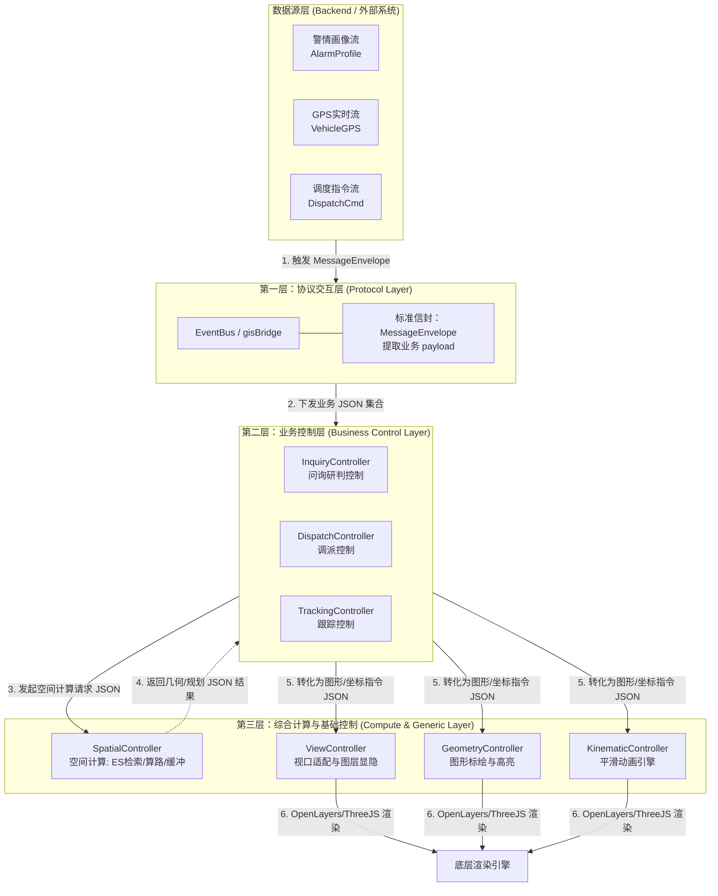

# 04-三层综合交互与可视化：业务数据流向与集合字典

**版本**：1.0
**日期**：2026-07-14
**核心目标**：梳理 GIS 系统的三层（协议层、控制层、计算层）综合交互链路，提取各业务生命周期的核心 JSON 数据集合，明确不同组件与层级间的数据依赖关系。

---

## 1. 三层业务数据流向全景图

业务数据的流转遵循严格的 **降维原则**：即由外部系统的“重业务语义模型”逐步向下解析为 GIS 的“纯空间图形指令”，期间计算层提供辅助的空间推演。



---

## 2. 核心业务数据 JSON 字段集合 (按阶段)

以下列出各业务阶段核心交互流的 JSON 字段实例，这些集合主要在 **协议层** 与 **业务控制层** 之间流转。

### 2.1 警情画像基础集合 (全生命周期复用)
作为单点事实真相 (SSOT)，贯穿接警、调派、跟踪全阶段。
*   **消费组件**：`AlarmController`, `DispatchController`, `IncidentMarker`
*   **JSON 实例 (`AlarmProfileSyncData`)**：
```json
{
  "incidentId": "INC20260714001",
  "disaster_address": "深圳市南山区某街道大楼",
  "longitude": 114.057868,
  "latitude": 22.543099,
  "disaster_type": "FIRE",
  "disaster_type_lv2": "高层建筑火灾",
  "incidentState": "CREATED",
  "incidentStateName": "立案",
  "disaster_des": "10楼起火，有浓烟",
  "is_trapped": "TRUE",
  "trapped_num": 2,
  "buildingId": "BLD_0891edb6e8660"
}
```

### 2.2 来电与问询定位集合
*   **消费组件**：`InquiryController`, `PositionCircle`, `GeofenceDetector`
*   **JSON 实例 (`LocateCallData`)**：
```json
{
  "id": "CALL_98765",
  "longitude": 114.052111,
  "latitude": 22.541233,
  "radius": 500,
  "address": "基站位置: 南山区科技园",
  "Carrier_Loc": "中国移动"
}
```

### 2.3 资源调派与算路集合
*   **消费组件**：`DispatchController`, `SpatialController`, `RoutePlanner`
*   **JSON 实例 (`DispatchRoutePlanData`)**：
```json
{
  "incidentId": "INC20260714001",
  "dispatchPlanId": "PLAN_001",
  "routeSource": "AMAP",
  "start": {
    "station_id": "ST_001",
    "stationName": "南山特勤站",
    "longitude": 114.060100,
    "latitude": 22.545100,
    "coord_sys": "GD"
  },
  "end": {
    "disaster_address": "深圳市南山区某街道大楼",
    "longitude": 114.057868,
    "latitude": 22.543099,
    "coord_sys": "GD"
  },
  "routeId": "ROUTE_ST001_TO_INC001",
  "recommended": true,
  "routeVisible": true
}
```

### 2.4 跟踪与平滑移动集合 (高频数据)
*   **消费组件**：`TrackingController`, `KinematicController`, `VehicleMarker`
*   **JSON 实例 (`TrackingVehicleRouteRealtimeData`)**：
```json
{
  "incidentId": "INC20260714001",
  "start": {
    "carId": "CAR_粤B12345",
    "plate_number": "粤B12345",
    "longitude": 114.059200,
    "latitude": 22.544500
  },
  "end": {
    "longitude": 114.057868,
    "latitude": 22.543099
  },
  "routeId": "ROUTE_CAR_12345",
  "eta": 120,
  "distance": 850
}
```

---

## 3. 不同层与组件使用的数据集合字典

下表梳理了系统内 **不同层级** 和 **不同组件** 实际消费和产出的 JSON 数据集合契约。

### 3.1 协议层 (Protocol Layer) 统一包装集
负责跨 iframe、WebSocket 与主应用的通信格式标准化。

| 组件 / 模块 | 核心 JSON 集合类型 | 结构概述 | 作用 |
| --- | --- | --- | --- |
| **EventBus** | `MessageEnvelope<T>` | `{ id, ts, system, eventKey, data }` | 统一包装所有的业务载荷 `data`，记录时间戳和来源，用于审计和事件分发。 |

### 3.2 业务控制层 (Business Control Layer)
接收带有浓厚“消防语义”的 JSON 集合，并转化为基础地图指令。

| 控制器组件 | 输入集合 (Input JSON) | 输出集合 (Output JSON) | 逻辑职责 |
| --- | --- | --- | --- |
| **`DispatchController`** | `DispatchViewportFitData`<br>`DispatchRoutePlanData`<br>`DispatchStationEtaFilterData` | `RoutePlanResultData`<br>`MapViewChangedData` | 处理一键调派、围栏自适应缩放、站/车/警路线计算，并抛出最终算路结果。 |
| **`InquiryController`** | `LocateCallData`<br>`AoiEsQueryData` | `MapFeaturePickData` | 处理来电 500m 粗定位圈生成、管辖围栏转微围栏 (AOI3)。 |
| **`TrackingController`** | `TrackingVehicleGpsUpdateData`<br>`TrackingVehicleRouteRealtimeData` | `MapLayerVisibleChangeData` | 处理高频 GPS 数据订阅、动态 ETA 更新，并驱动底层进行平滑动画。 |

### 3.3 计算层 (Compute Layer)
不包含业务语义（不认识消防站、警情），只认识纯几何（点、线、面）。

| 计算组件 | 输入集合 (Input JSON) | 输出集合 (Output JSON) | 逻辑职责 |
| --- | --- | --- | --- |
| **`SpatialController`** | `EsQueryData`: `{ geometry: {type, coordinates}, types, limit }` | 要素 GeoJSON 集合 | 基于传入的多边形范围，执行 ES 空间查询并返回结果。 |
| **`SpatialController`** | `RouteCalcData`: `{ start: [lon, lat], end: [lon, lat], strategy }` | `RouteCalcResult`: `{ coordinates, distanceMeters, durationSeconds }` | 对接高德或路网，将两点坐标转化为具体的路线点集和耗时估算。 |
| **`SpatialController`** | `BufferCalcData`: `{ input: { center, radius } }` | 缓冲后的 Polygon JSON | 基于点和半径，实时计算出平滑圆形的 GeoJSON 面。 |

### 3.4 通用控制层 (Generic Control Layer)
地图引擎的最终操作代理，接收极其扁平化的几何与样式 JSON 集合。

| 基础组件 | 消费集合 (JSON Fields) | 逻辑职责 |
| --- | --- | --- |
| **`GeometryController`** | `MarkerAddData`: `{ id, lngLat, iconUrl, iconType }`<br>`PolygonDrawData`: `{ id, geometry, fillColor }` | 通过 OL 或 ThreeJS 的 API 进行打点、画线、画多边形，支持基于前缀（如 `marker_`）的复用清除。 |
| **`ViewController`** | `LocateData`: `{ lngLat, zoom, duration }`<br>`FitBoundsData`: `{ geometry, padding }` | 执行视角平移、镜头飞行动画及层级自适应。 |
| **`KinematicController`** | `SmoothMoveData`: `{ featureId, targetLngLat, duration }` | 获取要素，按设定的 duration 利用 `requestAnimationFrame` 执行帧级别插值平移。 |

---

## 4. 数据转化实例：从业务到图形

以**“调派阶段算路并显示路线”**为例，展示 JSON 数据如何在三层中被拆解与消费：

1. **协议层接收 (Protocol)**：
   收到 `MessageEnvelope`，解析出 `eventKey: 'dispatch.route.plan'`，剥离出 `data` 即 `DispatchRoutePlanData`。
2. **业务控制层解析 (DispatchController)**：
   拿到包含 `station_id`, `incidentId` 等业务属性的 JSON。将其中的 `start[lon, lat]` 和 `end[lon, lat]` 提取出来。
3. **计算层加工 (SpatialController)**：
   将起终点组装为 `RouteCalcData` 送入计算，获得 `RouteCalcResult` (包含大量的经纬度串 `coordinates`)。
4. **基础控制层渲染 (GeometryController)**：
   业务层将 `coordinates` 组装为 `LineDrawData`: `{ id: 'route_xxx', coordinates: [...], strokeColor: '#00FF00' }`，交由通用层直接调用底座 API 画在屏幕上。
