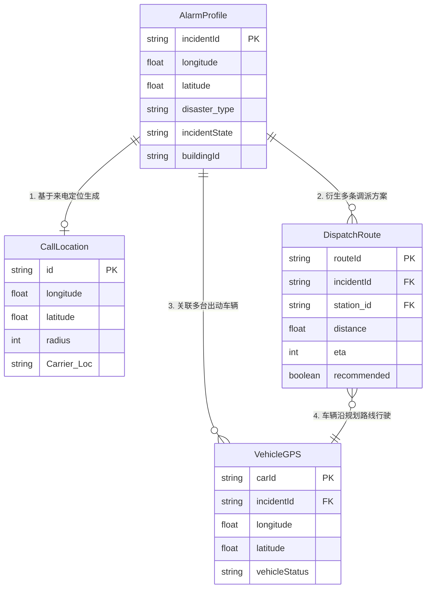
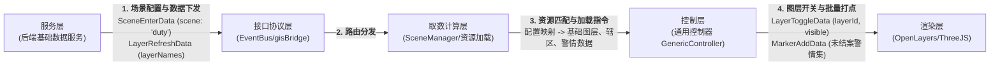
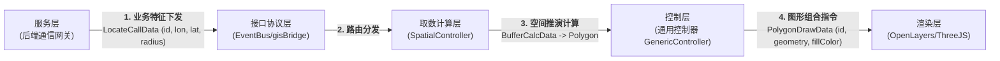
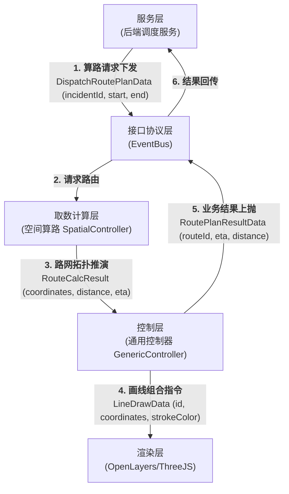
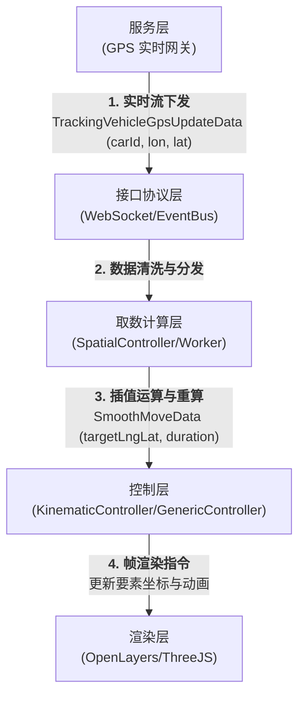

# 05-各阶段业务数据 ER 流转与字段全景图

**版本**：1.0
**日期**：2026-07-14
**核心目标**：基于消防接处警的用户故事（值守、来电、问询、调派、跟踪），梳理 GIS 系统中核心业务实体（Entity）的关联关系（ER 图），并可视化各阶段数据在架构各层之间的具体流转过程与核心字段。

---

## 1. 全局核心业务实体 ER 关系图

在 GIS 侧，我们不维护复杂的业务数据库，而是维护一组用于地图表达的**业务投影实体（Profile/Projection）**。以下是这些核心实体之间的 ER 关系及必要字段：

---

## 2. 各阶段用户故事数据流转图 (含业务字段)

以下流程图展示了在不同业务阶段，数据载荷（JSON 字段）是如何从后端推送到 GIS，经过控制层计算，最终变成渲染指令的。

### 2.1 阶段一：值守态势初始化 (Duty Overview)
**场景**：接警员登录进入值守模式，加载城市基础图层、辖区围栏、路况以及未结案警情。

### 2.2 阶段二：来电弹屏 (Incoming Call)
**场景**：接警员接起电话，系统获取到基站定位，需要在地图上画出 500m 粗定位圈。

### 2.3 阶段三：问询研判与立案 (Inquiry & Alarm)
**场景**：接警员确认了具体的灾害位置并立案，警情精确上图，视口自动平移过去。

### 2.4 阶段四：图上调派 (Dispatch)
**场景**：系统推荐了南山特勤站，GIS 需要计算消防站到警情点的路线，并在图上画出路线和展示 ETA。

### 2.5 阶段五：途中跟踪 (Tracking)
**场景**：消防车出动，高频 GPS 信号推送到 GIS，地图上的消防车图标需要平滑移动，同时动态刷新剩余 ETA。

---

## 3. 核心字段说明与设计边界

1. **唯一标识贯穿 (`incidentId`)**：
   从立案到跟踪的所有阶段，数据包中必须包含 `incidentId`（如果是车辆数据，还需包含 `carId` / `station_id`）。这是通用控制层执行**“分组清除”**和**“状态覆盖”**的基准键。

2. **坐标解耦 (`[lon, lat]`)**：
   外部系统只提供 WGS84 格式的 `longitude` 和 `latitude` 标量字段。进入控制层后，统一转为数组格式 `[lon, lat]`，供底层 OpenLayers 进行投影转换（如转为 EPSG:3857）。

3. **空间重计算由 GIS 负责 (`Geometry`)**：
   后端不传递复杂的几何图形（GeoJSON），只传递**“规则特征”**（如点坐标+半径）。GIS 计算层 (`SpatialController`) 根据规则实时生成图形多边形，既节省网络带宽，又保证了视口交互的流畅度。
