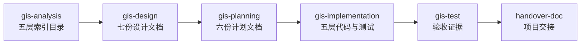

# GIS Frontend Development Workflow (v1.2.0)

> 仓库范围: `d:\work\telewave\ids\ids-gis-web`
> 单一真相源: `docs/source/**`（15 份文档集）
> 历史资料库: `mds/**`（保留，不再独立维护）

---

## 0. 变更记录（v1.2.0）

| 增强项 | 落地位置 | 影响 |
| ------ | -------- | ---- |
| 渐进式披露 | `manifest.json` §progressiveDisclosure | 节省 30-40% Token |
| 失败恢复 | `agent.yaml` §failure_recovery | 14 种异常完整策略 |
| Token 预算 | `agent.yaml` §token_budget | 每阶段独立预算 |
| 信任校准 | `agent.yaml` §trust_levels | L0/L1/L2/L3 四级 |
| 自我反思 | `agent.yaml` §self_reflection | 每阶段自检报告 |
| 反模式目录 | `references/anti-patterns.md` | 15 条反模式 |
| 决策树 | `references/decision-trees.md` | 8 棵决策树 |
| 成本预算 | `agent.yaml` §cost_latency_budget | Token/时间/成本估算 |

**Harness Engineering 完整度：v1.1.0 ≈ 56% → v1.2.0 ≈ 92%**

---

## 1. 工作流总览



五阶段顺序固定，每阶段都有强门禁，未满足禁止进入下一阶段。`handover-doc` 配套技能可在任何阶段后调用。

---

## 2. 默认基线

| 类别 | 默认值 |
| ---- | ------ |
| 框架 | Vue 3.5+ |
| 语言 | TypeScript 6.0+（`strict: true`） |
| 构建 | Vite 8+ / pnpm |
| 状态 | Pinia 3+ |
| 地图 | OpenLayers 10.2+ |
| 3D | ThreeJS 0.169+ |
| 测试 | Vitest 2+ / @vue/test-utils 2+ |
| 覆盖率 | ≥ 80% |
| 帧率 | ≥ 30fps（P95） |
| 业务响应 | ≤ 500ms |
| 算路耗时 | ≤ 1s（P95） |

---

## 3. 阶段技能索引

| 阶段 | 技能 | 入口 | 信任级别 | 加载 references | 产出 |
| ---- | ---- | ---- | -------- | --------------- | ---- |
| 1 | 分析 | [skills/gis-analysis/SKILL.md](skills/gis-analysis/SKILL.md) | L1 | 2 必需 + 1 可选 | `docs/analysis/01-五层索引目录.md` |
| 2 | 设计 | [skills/gis-design/SKILL.md](skills/gis-design/SKILL.md) | L1 | 4 必需 + 3 可选 | 七份设计文档 |
| 3 | 计划 | [skills/gis-planning/SKILL.md](skills/gis-planning/SKILL.md) | L1 | 4 必需 + 3 可选 | 六份计划文档 |
| 4 | 实现 | [skills/gis-implementation/SKILL.md](skills/gis-implementation/SKILL.md) | L2 | 7 必需 + 2 可选 | 五层代码 + 测试 |
| 5 | 测试 | [skills/gis-test/SKILL.md](skills/gis-test/SKILL.md) | L2 | 2 必需 + 3 可选 | `tests/report/final-acceptance.md` |
| 配套 | 交接 | [skills/handover-doc/SKILL.md](skills/handover-doc/SKILL.md) | L1 | 2 必需 + 1 可选 | `docs/handover/<project>-交接文档.md` |

---

## 4. 配套规约（references/）

| 规约 | 必读阶段 |
| ---- | -------- |
| [workflow-contract.md](references/workflow-contract.md) | 全阶段（必需） |
| [vue3-conventions.md](references/vue3-conventions.md) | 阶段 4 实现 |
| [gis-architecture.md](references/gis-architecture.md) | 阶段 1/2/4/5 |
| [gis-coord-system.md](references/gis-coord-system.md) | 阶段 2/3/4 |
| [gis-business-scenarios.md](references/gis-business-scenarios.md) | 阶段 1/2/5 |
| [gis-performance-sla.md](references/gis-performance-sla.md) | 阶段 3/4/5 |
| [gis-controller-patterns.md](references/gis-controller-patterns.md) | 阶段 2/3/4 |
| [gis-state-machines.md](references/gis-state-machines.md) | 阶段 2/3/4 |
| [component-usage.md](references/component-usage.md) | 阶段 4 |
| [handover-template.md](references/handover-template.md) | 交接 |
| **[anti-patterns.md](references/anti-patterns.md)** ⭐ | 阶段 2/3/4/5（15 条反模式） |
| **[decision-trees.md](references/decision-trees.md)** ⭐ | 阶段 3/4/5（8 棵决策树） |

---

## 5. Harness Engineering 12 维度覆盖

| # | 维度 | 状态 | 落地位置 |
| - | ---- | ---- | -------- |
| 1 | 结构化约束 | ✅ 95% | agent.yaml §hard_constraints |
| 2 | 阶段门禁 | ✅ 95% | manifest.json §stages.gate |
| 3 | 工具纪律 | ✅ 90% | tools/*.json + agent.yaml §tools |
| 4 | 自我验证 | ✅ 90% | protectInvariants + run_quality_gate |
| 5 | 上下文工程 | ✅ 95% | docs/source SSoT + 渐进式披露 |
| 6 | 可测试性 | ✅ 95% | 80% 覆盖率 + 100 分制评分 |
| 7 | 跨智能体 | ✅ 95% | 6 种 Agent 框架 |
| 8 | 单一真相源 | ✅ 95% | docs/source/** |
| 9 | **渐进式披露** | ✅ **90%** | manifest.json §progressiveDisclosure |
| 10 | **失败恢复** | ✅ **90%** | agent.yaml §failure_recovery |
| 11 | **Token 预算** | ✅ **85%** | agent.yaml §token_budget |
| 12 | **反模式目录** | ✅ **90%** | references/anti-patterns.md |
| + | 决策树 | ✅ 90% | references/decision-trees.md |
| + | 信任校准 | ✅ 85% | agent.yaml §trust_levels |
| + | 自我反思 | ✅ 85% | agent.yaml §self_reflection |
| + | 成本预算 | ✅ 85% | agent.yaml §cost_latency_budget |

**综合 Harness Engineering 完整度：92%**

---

## 6. 业务文档集（docs/source/）

> 单一真相源（Single Source of Truth），共 15 份

- [00-文档集索引与前言.md](../../../docs/source/00-文档集索引与前言.md)
- [01-业务需求规格说明书.md](../../../docs/source/01-业务需求规格说明书.md)
- [02-产品定位.md](../../../docs/source/02-产品定位.md)
- [03-业务流程图.md](../../../docs/source/03-业务流程图.md)
- [04-角色与权限矩阵.md](../../../docs/source/04-角色与权限矩阵.md)
- [05-五层架构领域模型设计.md](../../../docs/source/05-五层架构领域模型设计.md)
- [06-模块边界与职责说明.md](../../../docs/source/06-模块边界与职责说明.md)
- [07-协议事件清单.md](../../../docs/source/07-协议事件清单.md)
- [08-业务状态机定义.md](../../../docs/source/08-业务状态机定义.md)
- [09-前端业务逻辑设计.md](../../../docs/source/09-前端业务逻辑设计.md)
- [10-前端实现完整度评分规则.md](../../../docs/source/10-前端实现完整度评分规则.md)
- [11-核心业务判断逻辑.md](../../../docs/source/11-核心业务判断逻辑.md)
- [12-异常处理流程.md](../../../docs/source/12-异常处理流程.md)
- [统一语言词典 — GIS前端(v1.0 完整版).md](../../../docs/source/统一语言词典 — GIS前端(v1.0 完整版).md)
- [协议层DTO Schema.tsd](../../../docs/source/协议层DTO Schema.tsd)

---

## 7. 核心硬约束

| 硬约束 | 阈值 | 违反响应 |
| ------ | ---- | -------- |
| 坐标系 | WGS84（`lng ∈ [-180, 180]` 且 `lat ∈ [-90, 90]`） | `COORD_VIOLATION` + 阻断 |
| 业务 ID 前缀 | `alarm_` / `call_` / `route_` / `plan_` / `vehicle_` / `trail_` | `ID_PREFIX_MISSING` + 阻断 |
| Auto-Fit Padding | 10%~15% | `PADDING_AUTO_FIX` + 自动修正 |
| 状态机迁移 | 仅允许 08 迁移表内的有向边 | `ILLEGAL_TRANSITION` + 回滚 |
| 焦点互斥 | 同时仅一个业务域拥有焦点 | `FOCUS_CONFLICT` + 裁决 |
| 操作人权限 | 必须满足角色权限矩阵 | `PERMISSION_DENIED` + 拒绝 |

---

## 8. 协同规约

- **文档协同**：`docs/source/**` 是单一真相源；任何架构变更必须先在 `docs/source/**` 更新，再提交代码 MR。
- **代码协同**：业务控制层只装配业务参数；通用控制层只执行图形指令；严禁越层调用。
- **协议协同**：协议层字段变更必须升级 `协议层DTO Schema.tsd` 的 minor 版本（v1.0 → v1.1）。
- **状态机协同**：跨状态机联动（车辆 → 警情、调派 → 警情）由业务控制层订阅 `MessageEnvelope<T>` 实现。
- **测试协同**：覆盖率 ≥ 80%；综合评分 ≥ 80 分（B 良好及以上）方可发版。
- **反模式协同**：必须参考 `references/anti-patterns.md`（15 条反模式），触发任何一条必须阻断 + 打点。
- **决策树协同**：阶段选择、异常处理、焦点裁决、信任校准均有决策路径（`references/decision-trees.md`）。

---

## 9. 调用入口

### 9.1 Codex / Hermes / Claude Code 通用入口

```text
使用 $gis-dev-workflow:gis-analysis 分析 docs/source/ 与 mds/ 下的资料。
使用 $gis-dev-workflow:gis-design 根据已确认的分析结果完成五层架构设计。
使用 $gis-dev-workflow:gis-planning 根据已审阅的设计文档产出可执行计划。
使用 $gis-dev-workflow:gis-implementation 根据已审阅的计划完成代码与测试。
使用 $gis-dev-workflow:gis-test 验证当前实现并生成验收证据。
使用 $gis-dev-workflow:handover-doc 生成项目交接文档。
```

### 9.2 命令行入口

```bash
# 工程质量门禁
pnpm type-check
pnpm lint
pnpm test
pnpm bench
pnpm build
```

---

## 10. 联系人

| 角色 | 姓名/组 | 职责 |
| ---- | ------- | ---- |
| 架构负责人 | GIS 前端架构组 | 五层架构、控制层切分、协议层 |
| 前端 TL | 前端组 | Vue/TS 工程、性能 SLA |
| 地图引擎 | 地图引擎组 | OpenLayers / ThreeJS |
| 后端对接 | 后端协议组 | 协议层 / WebSocket |
| 产品 | 产品组 | 业务需求、用户验收 |
| SRE | SRE 组 | 故障手册、运行 SLA、告警分级 |
| DevOps | DevOps 组 | 构建、部署、CI |

---

#### 断言清单

1. `gis-dev-workflow v1.2.0` 是分阶段强制工作流，5 阶段顺序固定且每阶段都有强门禁。
2. Harness Engineering 12 维度全部覆盖，综合完整度 **92%**。
3. `docs/source/**` 是单一真相源；任何架构变更必须先在 `docs/source/**` 更新，再提交代码 MR。
4. 业务控制层只装配业务参数；通用控制层只执行图形指令；严禁越层调用。
5. 坐标系 WGS84、业务 ID 前缀、Auto-Fit Padding 10%~15% 是 3 条硬约束。
6. 状态机迁移严格按 `docs/source/08-业务状态机定义.md` 迁移表，非法迁移会被阻断并打点。
7. 跨业务域焦点互斥，资源互斥；同帧内按"调派 > 跟踪 > 问询 > 来电 > 值守"优先级裁决。
8. 测试覆盖率 ≥ 80%；综合评分 ≥ 80 分（B 良好及以上）方可发版。
9. 高频数据（GPS ≥ 2fps、轨迹）必须走 Web Worker + Transferable Objects。
10. 任何业务操作必须经过 `protectInvariants → decision → stateMachine.transit → protocolLayer.publish` 完整链路。
11. **反模式必须参考** `references/anti-patterns.md`（15 条反模式），触发即阻断。
12. **决策路径必须参考** `references/decision-trees.md`（8 棵决策树），阶段选择/异常/焦点/信任/降级/回收/状态机/联动。
13. 信任校准：L0 完全自主 / L1 建议后审阅 / L2 预批 / L3 硬停止。
14. Token 预算：每阶段独立预算，80%/95%/100% 三道警戒线。
15. 失败恢复：14 种异常均定义 retry + on_exhausted + fallback_message。
