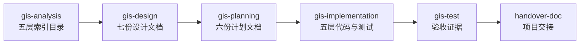
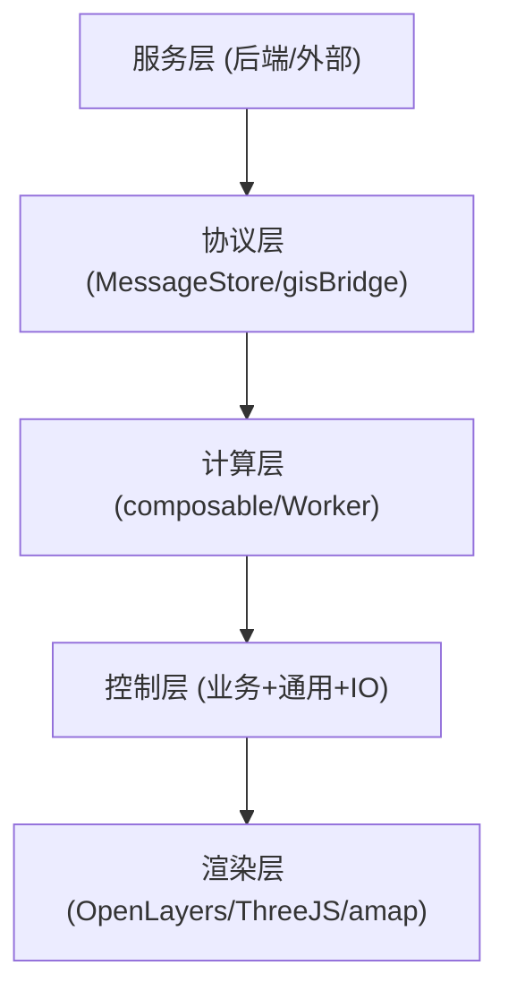

# GIS 前端开发工作流技能使用培训

> 适用对象：加入 `ids-gis-web` 项目的开发、SRE/DevOps、架构评审、新人
> 版本：v1.1（v1.0 → v1.1：与 `docs/source/` 文档集对齐；补充阶段门禁细节与命令样例）
> 日期：2026-07-24
> 维护：Telewave IDS 团队 / GIS 前端架构组

---

## 0. 变更记录

| 版本 | 日期 | 变更说明 |
| ---- | ---- | -------- |
| v1.0 | 2026-07-17 | 初版发布，与 `plugin.json` 同步 |
| v1.1 | 2026-07-24 | ① 与 `docs/source/` 15 份文档集对齐 ② 补充阶段门禁与命令样例 ③ 新增"协同规约"与"快速索引"两节 |

---

## 1. 文档说明

`gis-dev-workflow` 是面向 `d:\work\telewave\ids\ids-gis-web` 仓库的前端分阶段开发工作流技能集，按 `分析 → 设计 → 计划 → 实现 → 测试` 五阶段推进，配套 `handover-doc` 用于项目交接。

培训材料基于团队已落地的两份核心资料：

1. **架构基线** — `mds/minmax_output/GIS前端数据交互与架构全景设计(整合版).md`（v2.0，2026-07-14）
2. **业务基线** — `docs/source/` 文档集（15 份，2026-07-24），含 12 份核心文档 + 1 份统一语言词典 + 1 份协议层 DTO Schema + 1 份入口索引

`docs/source/` 是 GIS 前端工程的**单一真相源**（Single Source of Truth）；`mds/**` 作为历史资料库保留。

阅读完本培训材料后，团队成员应能：

- 理解五层架构（Service / Protocol / Calc / Ctrl / Render）的职责边界。
- 独立选择正确的阶段技能并按门禁推进。
- 编写符合强制开发规约的代码、协议、计算、控制器、组件、测试。
- 复用现有 composable、Worker、组件，避免重复造轮子。
- 在性能 SLA 与坐标系责任方面无盲点。
- 熟练引用 `docs/source/` 文档集与 `references/*` 10 份规约。

---

## 2. 技能定位

### 2.1 适用场景

- 新增业务场景（接处警 / 来电 / 问询 / 调派 / 跟踪）。
- 重构现有 controller / store / composable。
- 修复与性能 SLA 相关的缺陷。
- 把已有 `mds/**` 设计落到代码与测试。
- 生成项目交接文档（`handover-doc`）。
- 跨业务域联动设计（焦点互斥、资源互斥、状态机联动）。

### 2.2 不适用场景

- 后端 Spring Boot 工程（请用 `ddd-dev-workflow`）。
- 一次性脚本或纯 UI 调整（不强制走工作流）。
- 与 GIS 无关的工具开发（推荐直接对话完成）。

### 2.3 默认基线

| 类别 | 默认值 |
| ---- | ------ |
| 框架 | Vue 3.5+ |
| 语言 | TypeScript 6.0+（`strict: true`） |
| 构建 | Vite 8+ / pnpm |
| 状态 | Pinia 3+ |
| 地图 | OpenLayers 10.2+ |
| 3D | ThreeJS 0.169+ |
| 测试 | Vitest 2+ / @vue/test-utils 2+ |

完整基线与覆盖范围详见 [workflow-contract.md](file:///d:/work/telewave/ids/ids-gis-web/skills/20260717-培训材料-肖志威/gis-dev-workflow/references/workflow-contract.md)。

---

## 3. 必备知识与工具

### 3.1 必读文档（按顺序）

| 顺序 | 文档 | 必读理由 |
| ---- | ---- | -------- |
| 1 | [docs/source/00-文档集索引与前言.md](file:///d:/work/telewave/ids/ids-gis-web/docs/source/00-文档集索引与前言.md) | 入口与阅读路线 |
| 2 | [docs/source/02-产品定位.md](file:///d:/work/telewave/ids/ids-gis-web/docs/source/02-产品定位.md) | 业务边界 |
| 3 | [docs/source/01-业务需求规格说明书.md](file:///d:/work/telewave/ids/ids-gis-web/docs/source/01-业务需求规格说明书.md) | 需求基线 |
| 4 | [docs/source/03-业务流程图.md](file:///d:/work/telewave/ids/ids-gis-web/docs/source/03-业务流程图.md) | 端到端流程 |
| 5 | [docs/source/04-角色与权限矩阵.md](file:///d:/work/telewave/ids/ids-gis-web/docs/source/04-角色与权限矩阵.md) | 权限基线 |
| 6 | [docs/source/05-五层架构领域模型设计.md](file:///d:/work/telewave/ids/ids-gis-web/docs/source/05-五层架构领域模型设计.md) | 架构基线 |
| 7 | [docs/source/06-模块边界与职责说明.md](file:///d:/work/telewave/ids/ids-gis-web/docs/source/06-模块边界与职责说明.md) | 边界契约 |
| 8 | [docs/source/07-协议事件清单.md](file:///d:/work/telewave/ids/ids-gis-web/docs/source/07-协议事件清单.md) | 协议契约 |
| 9 | [docs/source/08-业务状态机定义.md](file:///d:/work/telewave/ids/ids-gis-web/docs/source/08-业务状态机定义.md) | 状态机 |
| 10 | [docs/source/09-前端业务逻辑设计.md](file:///d:/work/telewave/ids/ids-gis-web/docs/source/09-前端业务逻辑设计.md) | 业务逻辑 |
| 11 | [docs/source/11-核心业务判断逻辑.md](file:///d:/work/telewave/ids/ids-gis-web/docs/source/11-核心业务判断逻辑.md) | 业务判断 |
| 12 | [docs/source/12-异常处理流程.md](file:///d:/work/telewave/ids/ids-gis-web/docs/source/12-异常处理流程.md) | 异常处理 |
| 13 | [统一语言词典 — GIS前端(v1.0 完整版).md](file:///d:/work/telewave/ids/ids-gis-web/docs/source/统一语言词典 — GIS前端(v1.0 完整版).md) | 术语对齐 |
| 14 | [协议层DTO Schema.tsd](file:///d:/work/telewave/ids/ids-gis-web/docs/source/协议层DTO Schema.tsd) | 协议 Schema |

### 3.2 必读 references 规约

| 顺序 | references | 必读理由 |
| ---- | ---------- | -------- |
| 1 | [workflow-contract.md](file:///d:/work/telewave/ids/ids-gis-web/skills/20260717-培训材料-肖志威/gis-dev-workflow/references/workflow-contract.md) | 共享工作流契约 |
| 2 | [vue3-conventions.md](file:///d:/work/telewave/ids/ids-gis-web/skills/20260717-培训材料-肖志威/gis-dev-workflow/references/vue3-conventions.md) | 强制开发规约 |
| 3 | [gis-architecture.md](file:///d:/work/telewave/ids/ids-gis-web/skills/20260717-培训材料-肖志威/gis-dev-workflow/references/gis-architecture.md) | 五层架构基线 |
| 4 | [gis-coord-system.md](file:///d:/work/telewave/ids/ids-gis-web/skills/20260717-培训材料-肖志威/gis-dev-workflow/references/gis-coord-system.md) | 坐标系与转换规范 |
| 5 | [gis-business-scenarios.md](file:///d:/work/telewave/ids/ids-gis-web/skills/20260717-培训材料-肖志威/gis-dev-workflow/references/gis-business-scenarios.md) | 5 核心场景 AC |
| 6 | [gis-performance-sla.md](file:///d:/work/telewave/ids/ids-gis-web/skills/20260717-培训材料-肖志威/gis-dev-workflow/references/gis-performance-sla.md) | 性能 SLA |
| 7 | [gis-controller-patterns.md](file:///d:/work/telewave/ids/ids-gis-web/skills/20260717-培训材料-肖志威/gis-dev-workflow/references/gis-controller-patterns.md) | DTO 拼装模式 |
| 8 | [gis-state-machines.md](file:///d:/work/telewave/ids/ids-gis-web/skills/20260717-培训材料-肖志威/gis-dev-workflow/references/gis-state-machines.md) | 状态机定义 |
| 9 | [component-usage.md](file:///d:/work/telewave/ids/ids-gis-web/skills/20260717-培训材料-肖志威/gis-dev-workflow/references/component-usage.md) | 通用组件复用 |
| 10 | [handover-template.md](file:///d:/work/telewave/ids/ids-gis-web/skills/20260717-培训材料-肖志威/gis-dev-workflow/references/handover-template.md) | 交接模板（仅 `handover-doc` 阶段） |

### 3.3 必读 superpowers 技能

- `superpowers:brainstorming`（设计阶段业务问题确认）
- `superpowers:writing-plans`（计划阶段产出可执行计划）
- `superpowers:test-driven-development`（实现阶段 TDD 循环）
- `superpowers:subagent-driven-development`（多文件、跨层实现并行推进）
- `superpowers:verification-before-completion`（测试阶段完成前必须验证）
- `superpowers:requesting-code-review` / `receiving-code-review`（实现完成后内部审阅）

### 3.4 必备工具

- Node.js ≥ 22
- pnpm ≥ 9
- GitLab MR 工作流熟悉
- DevTools Performance 工具
- Vitest + @vue/test-utils + Playwright 经验
- Mermaid 流程图绘制（用于设计阶段）

### 3.5 调用入口

通过 `superpowers` 提示词调用：

```text
使用 $gis-dev-workflow:gis-analysis 分析 docs/source/ 与 mds/minmax_output 下的资料。
使用 $gis-dev-workflow:gis-design 根据已确认的分析结果完成五层架构设计。
使用 $gis-dev-workflow:gis-planning 根据已审阅的设计文档产出可执行计划。
使用 $gis-dev-workflow:gis-implementation 根据已审阅的计划完成代码与测试。
使用 $gis-dev-workflow:gis-test 验证当前实现并生成验收证据。
使用 $gis-dev-workflow:handover-doc 生成项目交接文档。
```

---

## 4. 工作流总览



五阶段顺序固定，不允许跳跃。每阶段都有强门禁，未满足门禁禁止进入下一阶段。配套的 `handover-doc` 可以在任何阶段后使用。

---

## 5. 标准操作演示

### 5.1 阶段 1：分析（gis-analysis）

**目标**：把 `docs/source/**` 与 `mds/**` 资料按五层分层，输出 `docs/analysis/01-五层索引目录.md`。

**操作步骤**：

1. 确认 `docs/source/00-文档集索引与前言.md` 已审阅。
2. 确认 `mds/minmax_output/**` 文档存在。
3. 调用 `$gis-dev-workflow:gis-analysis`。
4. 按 Service / Protocol / Calc / Ctrl / Render 五层对每份文档做相关性分析（强/中/弱）。
5. 输出 `docs/analysis/01-五层索引目录.md`。
6. 由用户完成审阅。

**门禁**：

- `docs/analysis/01-五层索引目录.md` 落盘并经用户审阅。
- 禁止空章节。
- 每份资料必须明确标注"强相关 / 中相关 / 弱相关 / 不相关"。

**命令样例**：

```bash
# 读取文档集索引
cat docs/source/00-文档集索引与前言.md
# 列出所有 mds 资料
ls -R mds/
```

---

### 5.2 阶段 2：设计（gis-design）

**目标**：基于分析产物产出七份设计文档。

**操作步骤**：

1. 确认 `docs/analysis/01-五层索引目录.md` 已审阅。
2. 业务问题先调用 `superpowers:brainstorming` 完成业务问题确认。
3. 调用 `$gis-dev-workflow:gis-design`，按 00~06 顺序产出七份设计文档。
4. 设计必须字段级 + 方法级（参考 `docs/source/05` 的字段表）。
5. 引用 `references/*` 全部相关章节。
6. 引用 `docs/source/08-业务状态机定义.md` 的状态机迁移表。
7. 由用户完成最终审阅。

**门禁**：

- 五层设计无职责冲突、无循环依赖（参考 `docs/source/06-模块边界与职责说明.md`）。
- 业务/通用/IO 协议字段可逐字段追踪（参考 `docs/source/07-协议事件清单.md` 与 `协议层DTO Schema.tsd`）。
- 5 个核心场景 AC 全部映射到具体设计产物。
- 性能 SLA 全部映射到具体设计产物。
- 状态机定义与业务控制层方法一一对应（参考 `docs/source/08-业务状态机定义.md`）。
- 业务不变量校验在设计阶段定义（参考 `docs/source/11-核心业务判断逻辑.md`）。
- 异常处理在设计阶段定义（参考 `docs/source/12-异常处理流程.md`）。
- 用户完成最终审阅确认。

**设计阶段产物清单（按 00~06 顺序）**：

| 编号 | 文档 | 对应 docs/source/ |
| ---- | ---- | ----------------- |
| 00 | 设计总览 | — |
| 01 | 业务域设计 | 01 / 02 / 03 |
| 02 | 协议层设计 | 07 + 协议 Schema |
| 03 | 控制层设计 | 05 + 09 |
| 04 | 渲染层设计 | 05 + 06 |
| 05 | 状态机设计 | 08 |
| 06 | 异常与降级设计 | 12 |

---

### 5.3 阶段 3：计划（gis-planning）

**目标**：基于已审阅设计产出可执行计划。

**操作步骤**：

1. 确认全部设计文档已落盘并经用户最终审阅。
2. 调用 `superpowers:writing-plans` 配合 `$gis-dev-workflow:gis-planning`。
3. 按 00~06 顺序产出六份计划文档。
4. 不允许 `TODO`、`TBD`、`待补充` 出现。
5. 引用 `references/*` 全部相关章节。
6. 每个计划必须能追溯到 `docs/source/` 文档。

**门禁**：

- 全部未跳过计划文档完成。
- 每个计划能追溯到对应设计文档。
- 每个计划有可执行步骤、文件范围、测试要求和验收标准。
- `references/*` 适用于当前层级的规则已转换为实现步骤与验收标准。
- 性能 SLA 验收点已转换为基准测试要求。
- 状态机合法/非法迁移测试已列出。
- 业务不变量校验测试已列出。
- 异常降级测试已列出。

**计划阶段产物清单（按 00~06 顺序）**：

| 编号 | 文档 |
| ---- | ---- |
| 00 | 计划总览 |
| 01 | Service / Protocol 层计划 |
| 02 | Calc 层计划 |
| 03 | Ctrl 业务控制层计划 |
| 04 | Ctrl 通用控制层计划 |
| 05 | Ctrl IO 控制层 + Render 层计划 |
| 06 | 测试与验收计划 |

---

### 5.4 阶段 4：实现（gis-implementation）

**目标**：按计划实现五层代码与测试。

**操作步骤**：

1. 确认全部未跳过计划文档完成。
2. 调用 `superpowers:test-driven-development` 与 `$gis-dev-workflow:gis-implementation`。
3. 按五层 + 集成顺序实现（Service → Protocol → Calc → Ctrl → Render）。
4. 任何实现步骤都先有失败测试，再写生产代码。
5. 任何高频数据（GPS ≥ 2fps、轨迹）必须走 Worker + Transferable Objects。
6. 任何业务控制层方法必须可注入 `genericController` mock 测试。
7. 任何通用控制层方法必须可注入 store mock 测试。
8. 业务控制层方法以"业务动词 + 业务名词"命名（参考 `docs/source/09-前端业务逻辑设计.md`）。
9. 业务 ID 必须加业务前缀；Auto-Fit 必须带 10-15% Padding。
10. 通过 `pnpm lint`、`pnpm type-check`、`pnpm test` 三道门禁。

**强制规约**：

- **坐标系责任**：协议层 / 服务层强约束 WGS84，进入渲染层前由底座插件负责转换（参考 `docs/source/06-模块边界与职责说明.md` §2.2）。
- **业务 ID 前缀**：`alarm_` / `call_` / `route_` / `plan_` / `vehicle_` / `trail_`（参考 `docs/source/09-前端业务逻辑设计.md` §1.3）。
- **Auto-Fit Padding**：10%~15% 留边（参考 `docs/source/11-核心业务判断逻辑.md` §1.1）。
- **状态机迁移**：严格按 `docs/source/08-业务状态机定义.md` 迁移表（参考 `gis-state-machines.md`）。
- **业务焦点互斥**：同帧仅一个业务域拥有焦点（参考 `docs/source/11-核心业务判断逻辑.md` §4.1）。
- **异常处理**：14 种异常类型 + 降级策略（参考 `docs/source/12-异常处理流程.md`）。

**门禁**：

- 每个实现步骤测试通过才能进入下一步。
- `references/*` 适用于当前层级的规则已在代码与测试中验证。
- 5 个核心场景 AC 全部有端到端测试覆盖。
- 性能 SLA 全部有基准测试覆盖。
- 状态机合法/非法转移全部有测试。
- 业务不变量校验全部有测试。
- 异常降级全部有测试。
- 覆盖率 ≥ 80%。

**命令样例**：

```bash
# 类型检查
pnpm type-check
# 代码风格
pnpm lint
# 单元测试 + 集成测试
pnpm test
# 性能基准测试
pnpm bench
# 构建
pnpm build
```

---

### 5.5 阶段 5：测试（gis-test）

**目标**：生成最终验收证据。

**操作步骤**：

1. 确认全部未跳过计划已实现。
2. 调用 `superpowers:verification-before-completion` 与 `$gis-dev-workflow:gis-test`。
3. 运行 `pnpm test`、`pnpm bench`、`pnpm lint`、`pnpm type-check`、`pnpm build`。
4. 用 Playwright + Headless Chrome 跑 5 个核心场景的端到端测试。
5. 收集性能数据到 `tests/perf/report.json`。
6. 对照 `docs/source/10-前端实现完整度评分规则.md` 计算综合得分。
7. 生成 `tests/report/final-acceptance.md`。

**门禁**：

- 覆盖率 ≥ 80%。
- 5 个核心场景 AC 全部通过。
- 性能 SLA 全部达标（帧率 ≥ 30fps / 来电弹屏 ≤ 500ms / 调派算路 ≤ 1s）。
- 综合评分 ≥ 80 分（B 良好及以上），见 `docs/source/10-前端实现完整度评分规则.md`。
- 缺陷修复都有回归测试。
- 静态检查全部通过。
- 状态机合法/非法转移全部测试通过。
- 严禁事项清单无违反（参考 `gis-architecture.md` §6）。
- WGS84 责任分工无违反。
- 业务/通用 DTO 严格分离。
- `superpowers:verification-before-completion` 报告完成。

**综合评分维度**（参考 `docs/source/10`）：

| 维度 | 权重 |
| ---- | ---- |
| 渲染性能 | 25% |
| 业务响应 | 25% |
| 算路效率 | 15% |
| 资源回收 | 15% |
| 架构合规 | 20% |

---

### 5.6 配套技能：handover-doc

**目标**：基于仓库事实生成项目交接文档。

**操作步骤**：

1. 调用 `$gis-dev-workflow:handover-doc`。
2. 读取仓库事实（`README.md`、`package.json`、`mds/**`、`docs/source/**`、`src/controller/**`、`tests/**`、`references/*`）。
3. 按 `references/handover-template.md` 模板生成 `docs/handover/<project-name>-交接文档.md`。
4. 敏感信息脱敏或标 `待确认`。
5. 用户完成审阅。

---

## 6. 五层架构速查



### 6.1 控制层切分（与 `docs/source/05` 对齐）

| 控制层 | 控制器 | 数量 | 职责 |
| ------ | ------ | ---- | ---- |
| 业务控制层 | `AlarmCtrl` / `CallCtrl` / `ConfigCtrl` / `DispatchCtrl` / `DutyCtrl` / `TrackingCtrl` | 6 | 装配"业务参数" + 状态机迁移 |
| 通用控制层 | `GeometryCtrl` / `KinematicCtrl` / `SpatialCtrl` / `ViewCtrl` | 4 | 接收 `GenericControlInput` 执行图形指令 |
| IO 控制层 | `InputCtrl` / `OutputCtrl` | 2 | UI 输入与协议输出 |

### 6.2 严禁事项

- 业务控制层**禁止**直接调用 OL/ThreeJS。
- 通用控制层**禁止**读业务 store。
- 业务控制层**禁止**绕过通用控制层直接调渲染层。
- 任何业务操作必须经过 `protectInvariants → decision → stateMachine.transit → protocolLayer.publish` 完整链路（参考 `docs/source/11-核心业务判断逻辑.md` §3）。

---

## 7. 协议契约速查

参考 `docs/source/07-协议事件清单.md` 与 `协议层DTO Schema.tsd`。

### 7.1 消息信封

```typescript
interface MessageEnvelope<T> {
  messageId: string;          // UUID v4
  messageType: MessageType;   // AlarmChanged / VehicleChanged / ...
  payload: T;                 // 业务数据
  timestamp: string;          // ISO 8601
  source: ControlLayerSource; // 来源控制器
  version: '1.0';             // 协议版本
  traceId?: string;           // 链路追踪
}
```

### 7.2 通用控制层输入 DTOs

| DTO | 控制器 | 用途 |
| --- | ------ | ---- |
| `LocateInput` | `ViewCtrl` | 视野定位 |
| `FitInput` | `ViewCtrl` | 视野自适应 |
| `FollowInput` | `ViewCtrl` | 镜头跟随 |
| `DrawGeometryInput` | `GeometryCtrl` | 几何绘制 |
| `UpdateKinematicsInput` | `KinematicCtrl` | 运动学更新 |
| `SpatialQueryInput` | `SpatialCtrl` | 空间查询 |

---

## 8. 状态机速查

参考 `docs/source/08-业务状态机定义.md`。

| 状态机 | 实体 | 关键状态 |
| ------ | ---- | -------- |
| 警情状态机 | `AlarmProfile` | CREATED → INQUIRING → DISPATCHED → ON_SCENE_HANDLING → CLOSED |
| 车辆状态机 | `VehicleGPS` | IN_GARAGE → EN_ROUTE → ON_SCENE → HANDLING → RETURNING |
| 调派计划状态机 | `DispatchPlan` | DRAFT → READY → DISPATCHED → EXECUTING → COMPLETED |

**联动规则**：车辆 `ON_SCENE` → 警情 `ON_SCENE_HANDLING`（自动迁移）；调派 `REVOKED` → 警情 `INQUIRING`。

---

## 9. 业务不变量校验（protectInvariants）

参考 `docs/source/11-核心业务判断逻辑.md` §1.6。

强制校验顺序：

1. 坐标系是否 WGS84（`lng ∈ [-180, 180]` 且 `lat ∈ [-90, 90]`） → 否则拒绝（`COORD_VIOLATION`）。
2. 图元 ID 是否加业务前缀 → 否则拒绝（`ID_PREFIX_MISSING`）。
3. 状态机迁移是否在 08 迁移表内 → 否则拒绝（`ILLEGAL_TRANSITION`）。
4. 业务焦点是否互斥 → 否则丢弃后到指令（`FOCUS_CONFLICT`）。
5. 操作人权限是否满足角色权限矩阵 → 否则拒绝（`PERMISSION_DENIED`）。

**违反率必须为 0%**。

---

## 10. 异常处理速查

参考 `docs/source/12-异常处理流程.md`。

14 种异常类型均定义了降级策略：

| 异常 | 降级 |
| ---- | ---- |
| 坐标系污染 | 阻断渲染 |
| 非法状态迁移 | 阻断并打点 |
| 算路失败 | 降级为直线段（`ROUTE_FALLBACK`） |
| GPS 丢失 | 保留最后位置（> 30s 标记） |
| 焦点冲突 | 按优先级裁决 |
| ID 缺失前缀 | 阻断发布 |
| Auto-Fit Padding 缺失 | 自动修正 |
| 视野越界 | 阻断（`VIEW_OUT_OF_BOUNDS`） |
| 围栏越界 | 阻断（`FENCE_OUT_OF_RANGE`） |
| Web Worker 异常 | 降级为同步计算（`WORKER_DEGRADED`） |
| 跟踪车辆超限（> 50） | 聚合渲染（热力图） |
| 同时来电超限（> 3） | 进入排队 |
| 协议反序列化失败 | 丢弃消息（`PROTO_DESERIALIZE_FAIL`） |
| 资源回收失败 | 强制清理（`RESOURCE_LEAK`） |

告警分级：P0 / P1 / P2 / P3，分别推送值班长 + 短信 / 邮件 / 写入日志。

---

## 11. 开发规约重点

- [vue3-conventions.md](file:///d:/work/telewave/ids/ids-gis-web/skills/20260717-培训材料-肖志威/gis-dev-workflow/references/vue3-conventions.md) 是强制基线。
- [gis-architecture.md](file:///d:/work/telewave/ids/ids-gis-web/skills/20260717-培训材料-肖志威/gis-dev-workflow/references/gis-architecture.md) §6 是严禁事项清单。
- 业务 ID 必须加业务前缀（`marker_` / `polygon_` / `alarm_` / `call_` / `route_` / `plan_` / `vehicle_` / `trail_`）。
- Auto-Fit 必须保留 10%~15% Padding。
- 业务控制层方法以"业务动词 + 业务名词"命名（如 `locateToCall` / `fitToDispatch` / `followVehicle`）。
- 注释必须使用中文。
- 缺陷修复必须先添加失败测试再修复。
- 任何业务方法必须经过 `protectInvariants()` 校验。
- 任何高频计算（GPS、轨迹）必须走 Web Worker + Transferable Objects。

---

## 12. 协同规约

### 12.1 文档协同

- `docs/source/**` 是 GIS 前端工程的**单一真相源**。
- `mds/**` 是历史资料库，不再独立维护（保留作为参考）。
- `references/**` 是开发规约，强制基线。
- 任何架构变更必须同步更新 `docs/source/05-五层架构领域模型设计.md` 与 `协议层DTO Schema.tsd`。
- 协议层字段变更必须升级 `协议层DTO Schema.tsd` 的 minor 版本（v1.0 → v1.1）。

### 12.2 代码协同

- 业务控制层方法**禁止**直接调 OpenLayers / ThreeJS。
- 通用控制层方法**禁止**读取业务 store。
- IO 控制层只做事件转发，**禁止**实现业务规则。
- 渲染层只做绘制，**禁止**实现业务判断。

### 12.3 团队协同

- 跨业务域联动必须经"业务控制层订阅 + 协议层发布"。
- 焦点冲突必须按"调派 > 跟踪 > 问询 > 来电 > 值守"优先级裁决。
- 任何破坏性变更必须先在 `docs/source/**` 中更新，再提交代码 MR。

---

## 13. 项目验收清单

在团队成员完成一个完整业务流时，应自检：

- [ ] `docs/analysis/01-五层索引目录.md` 已审阅。
- [ ] `docs/design/**` 全部产出且经用户最终审阅。
- [ ] `docs/plan/**` 全部产出且无 `TODO`、`TBD`、`待补充`。
- [ ] `docs/source/05` 字段表与 `src/controller/**` 实际方法一致。
- [ ] `协议层DTO Schema.tsd` 与 `src/controller/core/protocol/*.ts` 100% 一致。
- [ ] 五层代码与测试通过 `pnpm lint`、`pnpm type-check`、`pnpm test`。
- [ ] 5 个核心场景 AC 全部有端到端测试覆盖。
- [ ] 性能 SLA 全部有基准测试覆盖。
- [ ] 状态机合法/非法转移全部有测试。
- [ ] 业务不变量校验全部有测试。
- [ ] 异常降级全部有测试。
- [ ] 严禁事项清单无违反。
- [ ] WGS84 责任分工无违反。
- [ ] 业务/通用 DTO 严格分离。
- [ ] 综合评分 ≥ 80 分（B 良好及以上）。
- [ ] `tests/report/final-acceptance.md` 报告完成。

---

## 14. 快速索引

### 14.1 文档索引

| 类别 | 路径 |
| ---- | ---- |
| 业务文档集 | `docs/source/00~12` + 词典 + Schema |
| 历史资料 | `mds/**` |
| 工作流技能 | `skills/20260717-培训材料-肖志威/gis-dev-workflow/**` |
| 后端工作流 | `skills/20260717-培训材料-肖志威/ddd-dev-workflow/**`（参考） |
| 通用技能 | `.hermes/skills/**` |

### 14.2 命令速查

```bash
# 工作流各阶段入口
$gis-dev-workflow:gis-analysis      # 分析
$gis-dev-workflow:gis-design        # 设计
$gis-dev-workflow:gis-planning      # 计划
$gis-dev-workflow:gis-implementation# 实现
$gis-dev-workflow:gis-test          # 测试
$gis-dev-workflow:handover-doc      # 交接

# 工程质量门禁
pnpm type-check     # TypeScript 类型检查
pnpm lint           # ESLint 风格检查
pnpm test           # Vitest 单元 + 集成测试
pnpm bench          # 性能基准测试
pnpm build          # 生产构建
```

### 14.3 关键数字速查

| 指标 | 阈值 |
| ---- | ---- |
| 帧率 | ≥ 30fps（P95） |
| 来电弹屏 | ≤ 500ms |
| 调派算路 | ≤ 1s（P95） |
| Auto-Fit Padding | 10%~15% |
| 同时跟踪车辆 | ≤ 50 辆 |
| 同时弹屏来电 | ≤ 3 路 |
| 测试覆盖率 | ≥ 80% |
| 综合评分 | ≥ 80 分（B 良好） |

---

## 15. 参考资料索引

### 15.1 docs/source/ 业务文档集

- [00-文档集索引与前言.md](file:///d:/work/telewave/ids/ids-gis-web/docs/source/00-文档集索引与前言.md)
- [01-业务需求规格说明书.md](file:///d:/work/telewave/ids/ids-gis-web/docs/source/01-业务需求规格说明书.md)
- [02-产品定位.md](file:///d:/work/telewave/ids/ids-gis-web/docs/source/02-产品定位.md)
- [03-业务流程图.md](file:///d:/work/telewave/ids/ids-gis-web/docs/source/03-业务流程图.md)
- [04-角色与权限矩阵.md](file:///d:/work/telewave/ids/ids-gis-web/docs/source/04-角色与权限矩阵.md)
- [05-五层架构领域模型设计.md](file:///d:/work/telewave/ids/ids-gis-web/docs/source/05-五层架构领域模型设计.md)
- [06-模块边界与职责说明.md](file:///d:/work/telewave/ids/ids-gis-web/docs/source/06-模块边界与职责说明.md)
- [07-协议事件清单.md](file:///d:/work/telewave/ids/ids-gis-web/docs/source/07-协议事件清单.md)
- [08-业务状态机定义.md](file:///d:/work/telewave/ids/ids-gis-web/docs/source/08-业务状态机定义.md)
- [09-前端业务逻辑设计.md](file:///d:/work/telewave/ids/ids-gis-web/docs/source/09-前端业务逻辑设计.md)
- [10-前端实现完整度评分规则.md](file:///d:/work/telewave/ids/ids-gis-web/docs/source/10-前端实现完整度评分规则.md)
- [11-核心业务判断逻辑.md](file:///d:/work/telewave/ids/ids-gis-web/docs/source/11-核心业务判断逻辑.md)
- [12-异常处理流程.md](file:///d:/work/telewave/ids/ids-gis-web/docs/source/12-异常处理流程.md)
- [统一语言词典 — GIS前端(v1.0 完整版).md](file:///d:/work/telewave/ids/ids-gis-web/docs/source/统一语言词典 — GIS前端(v1.0 完整版).md)
- [协议层DTO Schema.tsd](file:///d:/work/telewave/ids/ids-gis-web/docs/source/协议层DTO Schema.tsd)

### 15.2 references/ 规约文档

- [workflow-contract.md](file:///d:/work/telewave/ids/ids-gis-web/skills/20260717-培训材料-肖志威/gis-dev-workflow/references/workflow-contract.md)
- [vue3-conventions.md](file:///d:/work/telewave/ids/ids-gis-web/skills/20260717-培训材料-肖志威/gis-dev-workflow/references/vue3-conventions.md)
- [gis-architecture.md](file:///d:/work/telewave/ids/ids-gis-web/skills/20260717-培训材料-肖志威/gis-dev-workflow/references/gis-architecture.md)
- [gis-coord-system.md](file:///d:/work/telewave/ids/ids-gis-web/skills/20260717-培训材料-肖志威/gis-dev-workflow/references/gis-coord-system.md)
- [gis-business-scenarios.md](file:///d:/work/telewave/ids/ids-gis-web/skills/20260717-培训材料-肖志威/gis-dev-workflow/references/gis-business-scenarios.md)
- [gis-performance-sla.md](file:///d:/work/telewave/ids/ids-gis-web/skills/20260717-培训材料-肖志威/gis-dev-workflow/references/gis-performance-sla.md)
- [gis-controller-patterns.md](file:///d:/work/telewave/ids/ids-gis-web/skills/20260717-培训材料-肖志威/gis-dev-workflow/references/gis-controller-patterns.md)
- [gis-state-machines.md](file:///d:/work/telewave/ids/ids-gis-web/skills/20260717-培训材料-肖志威/gis-dev-workflow/references/gis-state-machines.md)
- [component-usage.md](file:///d:/work/telewave/ids/ids-gis-web/skills/20260717-培训材料-肖志威/gis-dev-workflow/references/component-usage.md)
- [handover-template.md](file:///d:/work/telewave/ids/ids-gis-web/skills/20260717-培训材料-肖志威/gis-dev-workflow/references/handover-template.md)

### 15.3 其他

- `mds/minmax_output/**`：五层架构整合文档（历史）。
- `skills/20260717-培训材料-肖志威/ddd-dev-workflow/**`：后端工作流（参考）。
- `.hermes/skills/**`：通用 superpowers 框架。

---

## 16. 联系人

| 角色 | 姓名/组 | 职责 |
| ---- | ------- | ---- |
| 架构负责人 | GIS 前端架构组 | 五层架构、控制层切分、协议层 |
| 前端 TL | 前端组 | Vue/TS 工程、性能 SLA |
| 地图引擎 | 地图引擎组 | OpenLayers / ThreeJS |
| 后端对接 | 后端协议组 | 协议层 / WebSocket |
| 产品 | 产品组 | 业务需求、用户验收 |
| SRE | SRE 组 | 故障手册、运行 SLA、告警分级 |
| DevOps | DevOps 组 | 构建、部署、CI |

---

#### 断言清单

1. `gis-dev-workflow` 是分阶段强制工作流，5 阶段顺序固定且每阶段都有强门禁。
2. `docs/source/**` 是单一真相源；任何架构变更必须先在 `docs/source/**` 更新，再提交代码 MR。
3. 业务控制层只装配业务参数；通用控制层只执行图形指令；严禁越层调用。
4. 坐标系 WGS84 是硬约束；业务 ID 前缀是硬约束；Auto-Fit Padding 10%~15% 是硬约束。
5. 状态机迁移严格按 `docs/source/08-业务状态机定义.md` 迁移表，非法迁移会被阻断并打点。
6. 异常处理不中断主流程，14 种异常均有降级策略。
7. 跨业务域焦点互斥，资源互斥；同帧内按"调派 > 跟踪 > 问询 > 来电 > 值守"优先级裁决。
8. 测试覆盖率 ≥ 80%；综合评分 ≥ 80 分（B 良好及以上）方可发版。
9. 高频数据（GPS ≥ 2fps、轨迹）必须走 Web Worker + Transferable Objects。
10. 任何业务操作必须经过 `protectInvariants → decision → stateMachine.transit → protocolLayer.publish` 完整链路，违反率必须为 0%。
