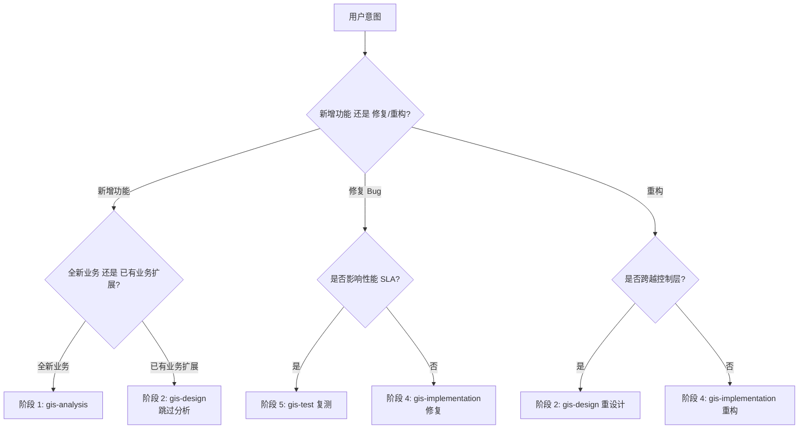
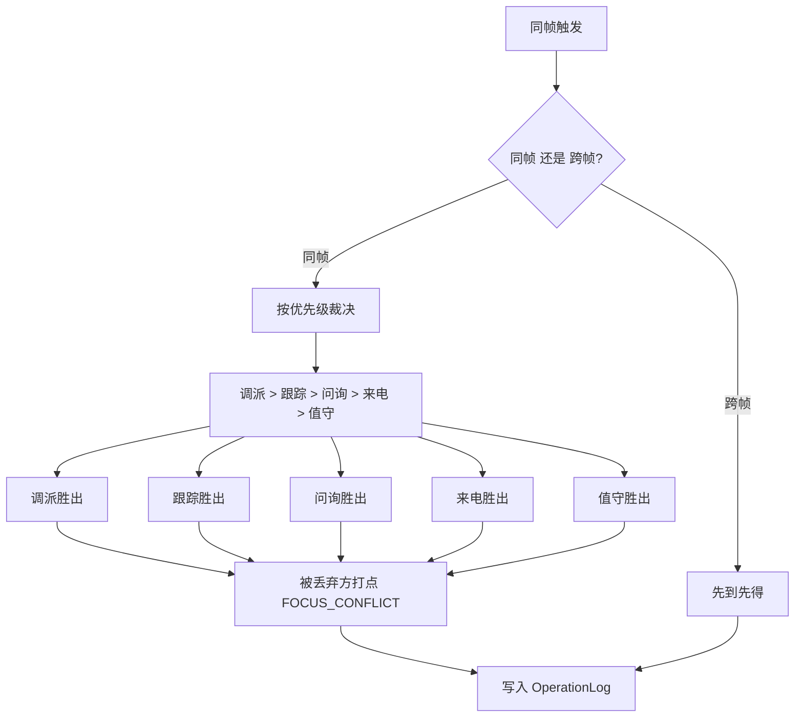
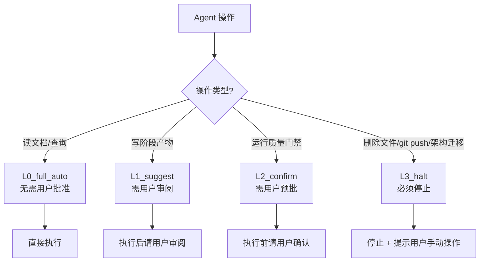
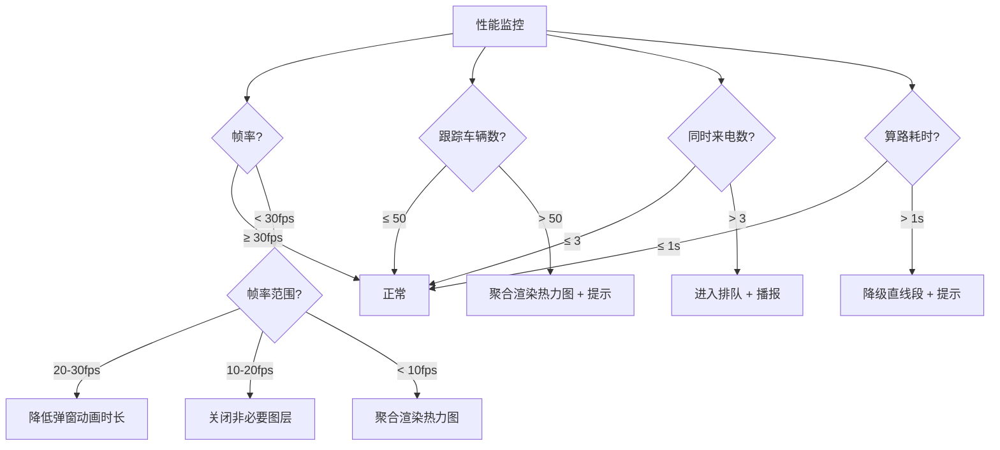
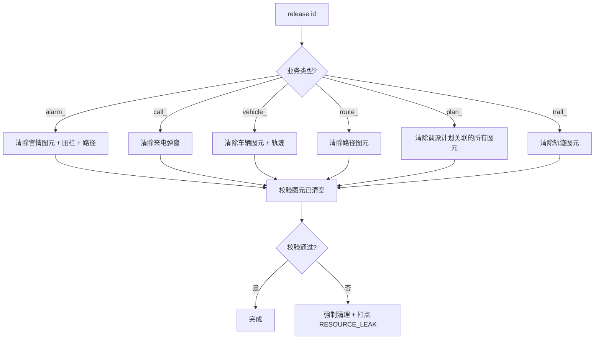
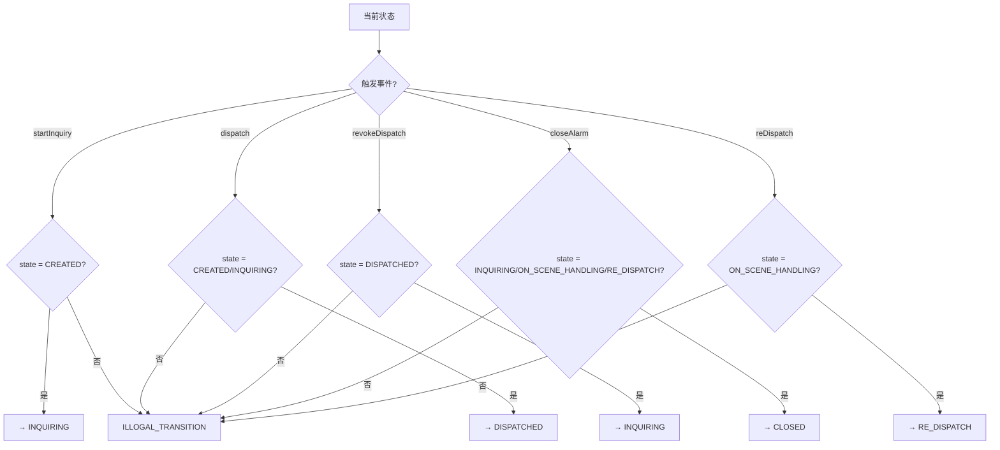
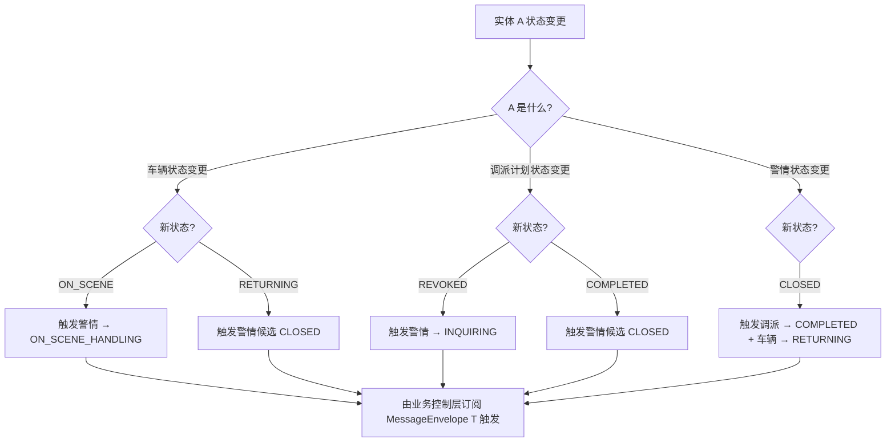

# GIS 前端决策树（Decision Trees）

> 版本: v1.0 | 日期: 2026-07-24
> 范围: GIS 前端工程
> 配合: gis-dev-workflow 技能集
> 设计原则: 阶段选择 / 异常处理 / 信任决策 / 焦点裁决的明确决策路径

---

## 0. 目录说明

本目录提供 GIS 前端开发中**关键决策点**的决策树，覆盖：

1. **阶段选择**：从入口判断进入哪一阶段
2. **异常处理路径**：不同异常类型对应的恢复策略
3. **焦点裁决**：跨业务域视野冲突的优先级
4. **信任校准**：Agent 自主决策 vs 用户决策
5. **降级策略**：性能/资源不足时的回退路径
6. **资源回收**：业务 ID 关闭/离场后的清理路径

每棵决策树均提供：

- **Mermaid 可视化**（代码块）
- **节点说明**（每个分支的含义）
- **默认走向**（如用户未指定）
- **硬约束**（不可妥协的判定）

---

## 1. 决策树总览

| 决策树 ID | 决策主题 | 入口问题 |
| --------- | -------- | -------- |
| DT-001 | 阶段选择 | 你是新增功能、修复 Bug、还是重构？ |
| DT-002 | 异常处理 | 出现什么类型的异常？ |
| DT-003 | 焦点裁决 | 多个业务域同时触发视野变化？ |
| DT-004 | 信任校准 | 这条操作 Agent 是否可以自主完成？ |
| DT-005 | 降级策略 | 资源/性能不足时如何降级？ |
| DT-006 | 资源回收 | 业务 ID 关闭后如何清理？ |
| DT-007 | 状态机迁移 | 当前状态 + 触发事件 → 下一状态？ |
| DT-008 | 跨状态机联动 | 实体 A 状态变更如何影响实体 B？ |

---

## 2. 决策树详情

### DT-001 阶段选择决策树

> 入口问题：你是新增功能、修复 Bug、还是重构？



**节点说明**：

- **S1 全新增**：必须从阶段 1 开始，产 `docs/analysis/01-五层索引目录.md`
- **S2 扩展**：阶段 1 已存在，跳过
- **S3 复测**：Bug 影响 SLA，必须先复测再修复
- **S4 修复**：直接在阶段 4 修，无需其他阶段
- **S5 重设计**：跨控制层重构必须重新设计
- **S6 重构**：层内重构直接在阶段 4 改

**默认走向**：用户未明确 → 进入 S1（最严格路径）

---

### DT-002 异常处理决策树

> 入口问题：出现什么类型的异常？

```mermaid
flowchart TD
    E[异常触发] --> Q1{异常类型?}
    Q1 -->|COORD_VIOLATION| P1[阻断渲染 + 打点 P0 + 通知后端]
    Q1 -->|ILLEGAL_TRANSITION| P2[回滚到上一状态 + 打点 P1 + 通知值班长]
    Q1 -->|ROUTE_FALLBACK| P3[降级为直线段 + 打点 P2 + 提示接警员]
    Q1 -->|GPS_LOST| P4[保留最后位置 + 灰色虚线 + 打点 P1]
    Q1 -->|FOCUS_CONFLICT| P5[按优先级裁决 + 打点 P2 + 丢弃后到]
    Q1 -->|ID_PREFIX_MISSING| P6[阻断发布 + 打点 P3 + 开发修复]
    Q1 -->|PADDING_AUTO_FIX| P7[自动修正 + 打点 P3]
    Q1 -->|VIEW_OUT_OF_BOUNDS| P8[阻断 + 打点 P2 + 重新 fitToCenter]
    Q1 -->|FENCE_OUT_OF_RANGE| P9[阻断 + 打点 P2 + 重新 fitToValidRange]
    Q1 -->|WORKER_DEGRADED| P10[降级同步计算 + 打点 P1 + 提示]
    Q1 -->|TRACKING_OVER_LIMIT| P11[聚合渲染热力图 + 打点 P2 + 提示]
    Q1 -->|CALL_QUEUE_OVERFLOW| P12[进入排队 + 打点 P2 + 播报提示音]
    Q1 -->|PROTO_DESERIALIZE_FAIL| P13[丢弃消息 + 打点 P0 + 推送告警]
    Q1 -->|RESOURCE_LEAK| P14[强制清理 + 打点 P1 + 写入 OperationLog]
    Q1 -->|PERMISSION_DENIED| P15[拒绝操作 + 打点 P1 + 提示]
```



**节点说明**：

| 异常 | 重试 | 降级 | 阻断 |
| ---- | ---- | ---- | ---- |
| COORD_VIOLATION | 0 | ❌ | ✅ |
| ILLEGAL_TRANSITION | 0 | 回滚 | ✅ |
| ROUTE_FALLBACK | 2 | 直线段 | ❌ |
| GPS_LOST | 1 | 保留位置 | ❌ |
| FOCUS_CONFLICT | 0 | 优先级裁决 | ❌ |
| WORKER_DEGRADED | 1 | 同步计算 | ❌ |
| TRACKING_OVER_LIMIT | 0 | 聚合渲染 | ❌ |
| PROTO_DESERIALIZE_FAIL | 0 | ❌ | ✅ |
| PERMISSION_DENIED | 0 | ❌ | ✅ |

**默认走向**：不在目录中的异常 → 阻断 + 打点 P0 + 通知值班长

---

### DT-003 焦点裁决决策树

> 入口问题：多个业务域同时触发视野变化？



**优先级硬约束**：

```
调派 (Dispatch)   > 跟踪 (Tracking)   > 问询 (Inquiry)   > 来电 (Call)   > 值守 (Duty)
```

**默认走向**：同帧 → 调派胜出；跨帧 → 先到先得

**反模式**：

- ❌ 多个业务域同时不通过 `acquireFocus()` 直接触发视野变化
- ❌ 同帧 3 个以上业务域同时触发（必须串行化）

---

### DT-004 信任校准决策树

> 入口问题：这条操作 Agent 是否可以自主完成？



**信任级别定义**：

| 级别 | 操作类型 | 用户交互 |
| ---- | -------- | -------- |
| L0 | `read_documentation` / 查询类 | 无 |
| L1 | `write_stage_artifact` | 执行后审阅 |
| L2 | `run_quality_gate` / `invoke_superpowers` | 执行前确认 |
| L3 | `delete_file` / `git_push` / `schema_migration` | 硬停止 |

**默认走向**：未明确 → L1

---

### DT-005 降级策略决策树

> 入口问题：资源/性能不足时如何降级？



**降级优先级**：UI 简化 > 图层裁剪 > 聚合渲染 > 降级数据

**默认走向**：性能降级时按"UI → 图层 → 渲染 → 数据"四级降级

---

### DT-006 资源回收决策树

> 入口问题：业务 ID 关闭后如何清理？



**回收顺序**：

1. 关闭业务域焦点（release focus）
2. 移除渲染图元（按业务前缀）
3. 清理关联资源（围栏、路径、轨迹）
4. 校验残留（`LayerInspector`）
5. 失败时强制清理 + 打点

**默认走向**：按业务前缀 `release(id)` → 自动选择清理路径

---

### DT-007 状态机迁移决策树

> 入口问题：当前状态 + 触发事件 → 下一状态？



**对应文档**：[docs/source/08-业务状态机定义.md](../../../docs/source/08-业务状态机定义.md) §1.2 警情迁移表

**默认走向**：未在迁移表内 → 阻断 + `ILLEGAL_TRANSITION`

---

### DT-008 跨状态机联动决策树

> 入口问题：实体 A 状态变更如何影响实体 B？



**联动硬约束**：

- 联动必须经业务控制层订阅 `MessageEnvelope<T>`，禁止渲染层直接联动
- 联动触发同样要走 `protectInvariants()` 校验
- 联动产生的新迁移也必须符合 08 迁移表

**对应文档**：[docs/source/08-业务状态机定义.md](../../../docs/source/08-业务状态机定义.md) §4 跨状态机联动规则

---

## 3. 决策树使用规范

### 3.1 调用方式

```text
# 在 Trae 对话框中：
请根据 references/decision-trees.md 的 DT-001 决策树判断当前应进入哪一阶段。

# 或更直接：
请读 references/decision-trees.md §2 DT-002，
按异常类型选择处理路径。
```

### 3.2 与 superpowers 配合

```text
# 设计阶段
使用 superpowers:brainstorming + references/decision-trees.md DT-001

# 异常处理
使用 references/decision-trees.md DT-002 + DT-003
```

---

## 4. 决策树与文档集的对应

| 决策树 | 对应文档 |
| ------ | -------- |
| DT-001 阶段选择 | [docs/source/00-文档集索引与前言.md](../../../docs/source/00-文档集索引与前言.md) |
| DT-002 异常处理 | [docs/source/12-异常处理流程.md](../../../docs/source/12-异常处理流程.md) |
| DT-003 焦点裁决 | [docs/source/11-核心业务判断逻辑.md](../../../docs/source/11-核心业务判断逻辑.md) §4.1 |
| DT-004 信任校准 | agent.yaml §trust_levels |
| DT-005 降级策略 | [docs/source/12-异常处理流程.md](../../../docs/source/12-异常处理流程.md) §5 |
| DT-006 资源回收 | [docs/source/09-前端业务逻辑设计.md](../../../docs/source/09-前端业务逻辑设计.md) §1.3 |
| DT-007 状态机迁移 | [docs/source/08-业务状态机定义.md](../../../docs/source/08-业务状态机定义.md) §1.2 |
| DT-008 跨状态机联动 | [docs/source/08-业务状态机定义.md](../../../docs/source/08-业务状态机定义.md) §4 |

---

#### 断言清单

1. 决策树共 **8 棵**（DT-001 ~ DT-008），覆盖阶段选择、异常、焦点、信任、降级、回收、状态机、联动。
2. 每棵决策树均提供 Mermaid 可视化 + 节点说明 + 默认走向 + 硬约束。
3. 决策树与 `docs/source/` 文档集一一对应，可交叉引用。
4. 默认走向明确：未指定 → 最严格路径（阻断 + 用户审阅）。
5. 决策树与反模式目录（anti-patterns.md）配合使用：决策树是"怎么做"，反模式是"不要怎么做"。
