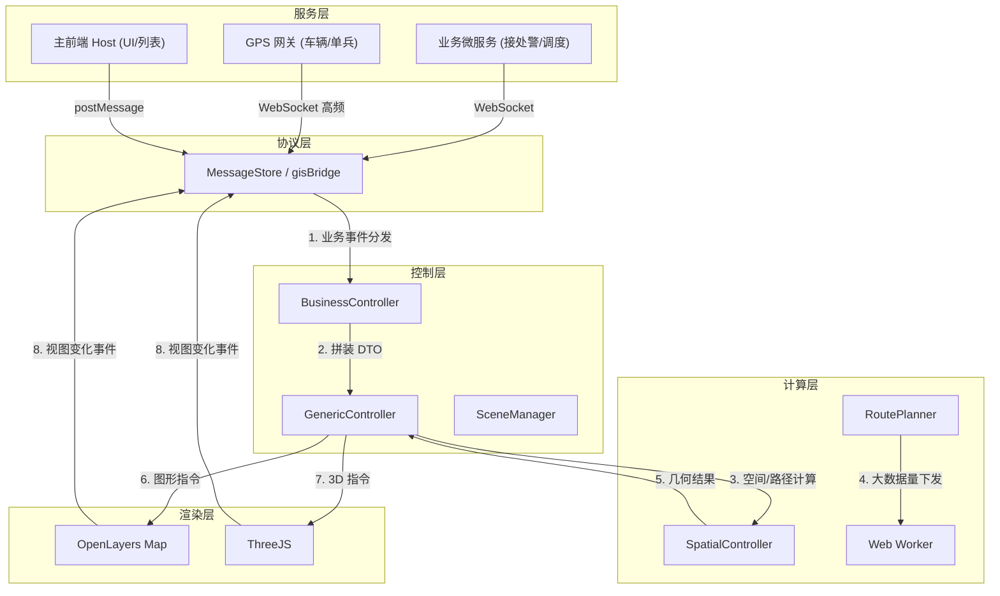

# GIS 前端五层架构基线

## 1. 五层架构全局数据流



## 2. 分层职责契约表

| 层级 | 目录 | 输入 | 输出 | 不允许做 |
| --- | --- | --- | --- | --- |
| 服务层 | 后端 / 外部 | 真实业务事件 | 业务数据 | 直接调用地图引擎 |
| 协议层 | `src/controller/core/protocol/` | 业务数据 | 标准化信封 | 业务解析/计算/渲染 |
| 计算层 | `src/composables/`、`src/hooks/` | 空间参数 | 几何/数值结果 | 持有 DOM/Map 引用 |
| 控制层-业务 | `src/controller/core/business/` | 协议事件 | 通用控制层 DTO | 直接调用 OL/ThreeJS |
| 控制层-通用 | `src/controller/core/generic/` | 通用控制层 DTO | 图形指令 | 业务规则、读业务 store |
| 控制层-IO | `src/controller/core/io/` | 视图事件 / 结果 | IO 协议 / 视图回写 | 业务流转 |
| 渲染层 | `src/components/`、`src/baseComponent/`、`src/views/` | 图形指令 | 视觉呈现 + 事件 | 业务逻辑、空间计算 |

## 3. 业务控制层与通用控制层 DTO 拼装

业务控制层接收业务协议事件，结合业务状态机，输出通用控制层 DTO：

```typescript
// 业务控制层：AlarmController.syncAlarmProfile
import type { GenericController } from "../generic";
import type { AlarmProfileSyncData } from "../protocol";

export class AlarmController {
  constructor(private genericController: GenericController) {}

  /**
   * 警情精确上图控制 / 警情画像状态更新
   * 业务规则：警情同步必须先定位再上图；定位 zoom 强制 18 级；
   * 上图 marker 必须使用业务前缀 incidentId，并启用 breathe 动画。
   */
  public syncAlarmProfile(data: AlarmProfileSyncData) {
    const { view, geometry } = this.genericController;

    if (data.longitude && data.latitude) {
      view.locate({ lngLat: [data.longitude, data.latitude], zoom: 18, duration: 800 });
      geometry.addMarker({
        id: data.incidentId,
        lngLat: [data.longitude, data.latitude],
        iconType: "endpoint",
        iconParams: { type: "alarm" },
        animate: "breathe"
      });
    }
  }
}
```

通用控制层 DTO 设计要点：
- 只承载几何、动画、样式参数，不携带业务状态。
- 命名以图形指令为单位：`LocateDTO`、`AddMarkerDTO`、`FitBoundsDTO`、`HighlightRouteDTO`。
- 坐标统一 WGS84 `[lng, lat]`。
- 复用现有 `protocol/GenericProtocol.ts` 类型，不在 DTO 中新增业务字段。

## 4. 资源图层 ID 清单

| 业务类别 | 图层 ID | 类型 | 数据源 |
| --- | --- | --- | --- |
| 兴趣面 | `gis:env_build_aoi` | Polygon | GeoServer WFS |
| 出入口 | `gis:env_entrance_exit` | Point | GeoServer WFS |
| 消防栓 | `gis:env_fire_water` | Point | GeoServer WFS |
| 道路 | `gis:env_greatchina_road` | LineString | GeoServer WFS |
| 车辆 | `gis:fire_vehicle` | Point（动态） | GPS 网关 WebSocket |
| 警情 | `gis:incident_alarm` | Point + 圆 | 警情总线 |
| 来电 | `gis:incoming_call` | Point + 弹屏 | 来电总线 |
| 调派路径 | `gis:dispatch_route` | LineString | 路径算路 |
| 跟踪轨迹 | `gis:tracking_track` | LineString | GPS 抽稀 |
| 围栏 | `gis:fence_*` | Polygon | 配置中心 |

新增图层必须先在本表增补，再进入实现。

## 5. 模块依赖矩阵

| 模块 | 可依赖 | 不可依赖 |
| --- | --- | --- |
| 协议层 | 类型基础库 | 控制层、计算层、渲染层、Pinia |
| 计算层 | 类型基础库、纯函数工具 | 协议层、控制层、渲染层、Pinia |
| 业务控制层 | 协议层、通用控制层、Pinia 业务 store | 渲染层、OL/ThreeJS 直接 API |
| 通用控制层 | 协议层、Pinia 视图 store | 业务控制层、Pinia 业务 store |
| IO 控制层 | 协议层、Pinia 视图 store | 业务控制层 |
| 渲染层 | Pinia store、composables、协议层（只读） | 控制层直接调用、计算层绕开 composable |

禁止循环依赖；依赖方向只能从上到下。

## 6. 严禁事项清单

- 业务控制层直接调用 `ol/Map`、`ol/Feature`、`three/Scene` 等渲染层 API。
- 通用控制层读取 `useDispatchStore`、`useAlarmStore` 等业务 store。
- 渲染层组件直接修改 `useLayersStore` 的图元集合（必须通过 controller）。
- 计算层持有 `Map` 或 `Scene` 引用。
- 协议层在解析时直接调用控制层方法。
- 任何图元 ID 缺失业务前缀。
- Auto-Fit 不带 Padding。
- 跨层调用（如通用控制层调业务控制层）。
- 业务控制层和通用控制层共用同一个 DTO 类型。
- 渲染层进行 ≥10ms 的同步计算。

## 7. 状态机集成位置

业务状态机由业务控制层持有，渲染层只通过 `useDispatchStore` 等业务 store 读取。状态机定义详见 `references/gis-state-machines.md`。

## 8. 性能预算与场景 AC

- 性能预算：详见 `references/gis-performance-sla.md`。
- 业务场景 AC：详见 `references/gis-business-scenarios.md`。
