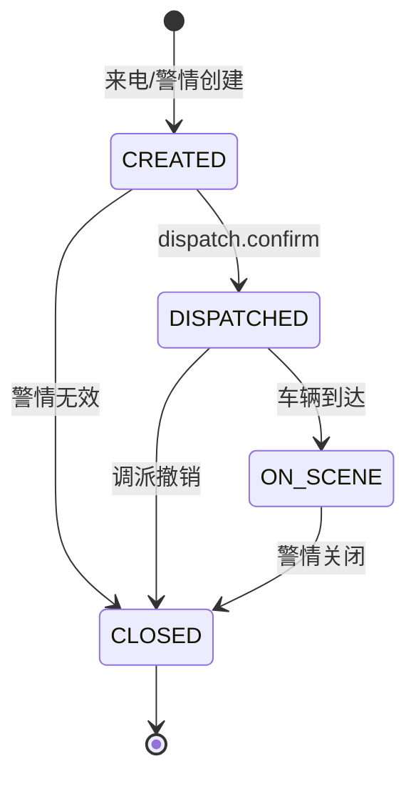
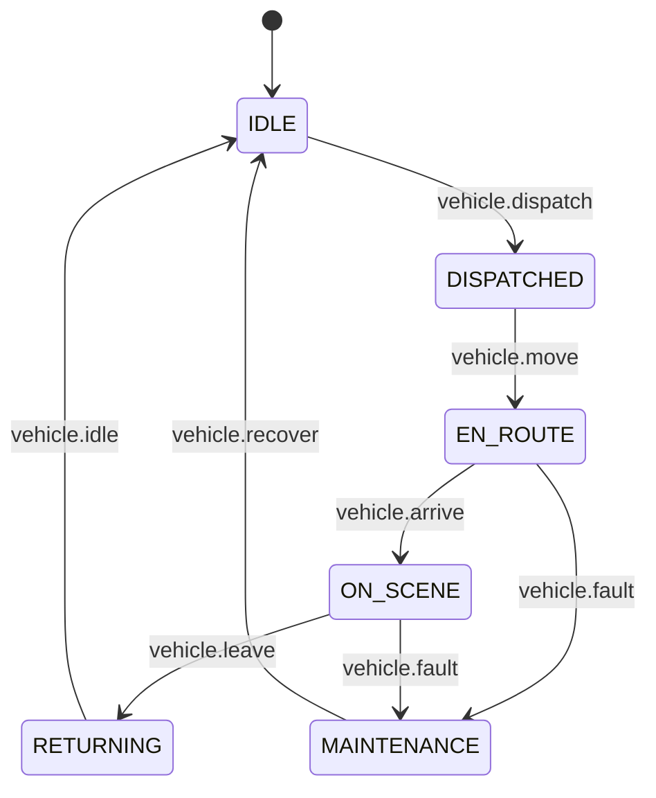
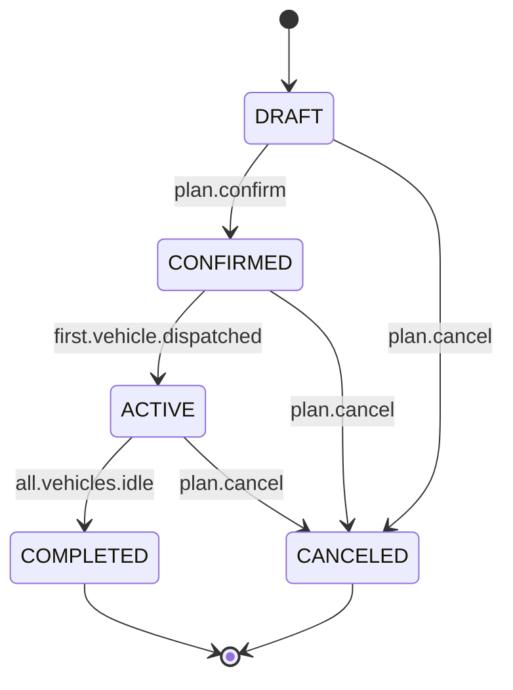

# GIS 状态机定义

业务状态机由业务控制层持有，渲染层只通过 Pinia 业务 store 读取状态，不参与流转决策。本文档定义当前已有的 3 个状态机：警情、车辆、调派方案。

## 1. 警情状态机（AlarmStateMachine）

### 状态枚举

```typescript
export const ALARM_STATES = {
  CREATED: "CREATED",         // 来电/警情创建
  DISPATCHED: "DISPATCHED",   // 已下达调派
  ON_SCENE: "ON_SCENE",       // 车辆到场
  CLOSED: "CLOSED"            // 警情关闭
} as const;

export type AlarmState = typeof ALARM_STATES[keyof typeof ALARM_STATES];
```

### 状态转移图



### 转移事件

| 事件 | from | to | 业务规则 |
| --- | --- | --- | --- |
| `dispatch.confirm` | CREATED | DISPATCHED | 必须至少派出一辆车 |
| `dispatch.cancel` | DISPATCHED | CLOSED | 必须有调派撤销原因 |
| `vehicle.arrive` | DISPATCHED | ON_SCENE | 至少一辆车 GPS 距离 ≤ 50m |
| `incident.close` | ON_SCENE | CLOSED | 必须有处置结果 |
| `incident.invalid` | CREATED | CLOSED | 警情无效（误报） |

### 持有位置
- `AlarmController` 内置状态机（class 字段）。
- 状态变化时调用 `this.emitAlarmStateChange(incidentId, from, to)`，由协议层 `MessageStore` 派发。
- Pinia store `useDispatchStore` 维护 `alarms: Map<incidentId, AlarmState>`。

## 2. 车辆状态机（VehicleStateMachine）

### 状态枚举

```typescript
export const VEHICLE_STATES = {
  IDLE: "IDLE",                 // 待命
  DISPATCHED: "DISPATCHED",     // 已派出
  EN_ROUTE: "EN_ROUTE",         // 行驶中
  ON_SCENE: "ON_SCENE",         // 到场
  RETURNING: "RETURNING",       // 返回
  MAINTENANCE: "MAINTENANCE"    // 维护
} as const;

export type VehicleState = typeof VEHICLE_STATES[keyof typeof VEHICLE_STATES];
```

### 状态转移图



### 转移事件

| 事件 | from | to | 业务规则 |
| --- | --- | --- | --- |
| `vehicle.dispatch` | IDLE | DISPATCHED | 必须有 incidentId |
| `vehicle.move` | DISPATCHED | EN_ROUTE | 首次 GPS 更新 |
| `vehicle.arrive` | EN_ROUTE | ON_SCENE | GPS 距离灾情点 ≤ 50m |
| `vehicle.leave` | ON_SCENE | RETURNING | 处置完成 |
| `vehicle.idle` | RETURNING | IDLE | GPS 距离站点 ≤ 100m |
| `vehicle.fault` | EN_ROUTE / ON_SCENE | MAINTENANCE | 故障上报 |
| `vehicle.recover` | MAINTENANCE | IDLE | 维护完成 |

### 持有位置
- `TrackingController` 内置状态机。
- 状态变化同步到 `useDispatchStore.vehicles: Map<carId, VehicleState>`。
- 渲染层只读取并展示状态颜色（绿/黄/红）。

## 3. 调派方案状态机（DispatchPlanStateMachine）

### 状态枚举

```typescript
export const DISPATCH_PLAN_STATES = {
  DRAFT: "DRAFT",           // 草稿（未确认）
  CONFIRMED: "CONFIRMED",   // 已确认
  ACTIVE: "ACTIVE",         // 执行中
  COMPLETED: "COMPLETED",   // 完成
  CANCELED: "CANCELED"      // 取消
} as const;

export type DispatchPlanState = typeof DISPATCH_PLAN_STATES[keyof typeof DISPATCH_PLAN_STATES];
```

### 状态转移图



### 转移事件

| 事件 | from | to | 业务规则 |
| --- | --- | --- | --- |
| `plan.confirm` | DRAFT | CONFIRMED | 必须有 ≥1 辆车 |
| `plan.cancel` | DRAFT / CONFIRMED / ACTIVE | CANCELED | 必须有取消原因 |
| `first.vehicle.dispatched` | CONFIRMED | ACTIVE | 至少有 1 辆车进入 DISPATCHED |
| `all.vehicles.idle` | ACTIVE | COMPLETED | 所有车辆状态回到 IDLE |

### 持有位置
- `DispatchController` 内置状态机。
- 状态变化同步到 `useDispatchStore.plans: Map<dispatchPlanId, DispatchPlanState>`。

## 4. 状态机实现要点

### 4.1 状态机实现位置
- 每个状态机作为业务控制层 class 的私有字段（推荐）。
- 转移事件通过业务控制层方法显式调用（如 `transitionTo(from, to, event, payload)`）。
- 状态变化必须通过 `mitt` 事件总线广播（`alarm.state.changed` 等）。

### 4.2 不允许的转移
- 跨级转移（如 `CREATED → ON_SCENE`）必须禁止。
- 重复状态（`CLOSED → CLOSED`）必须 noop。
- 非法转移必须抛出 `IllegalStateTransitionError` 并记录到日志。

### 4.3 状态机单元测试
- 每个状态机的每个合法转移必须有正向测试。
- 每个非法转移必须有负向测试。
- 状态机本身必须与业务逻辑解耦（构造函数注入，不依赖 OL/ThreeJS）。

### 4.4 渲染层约束
- 渲染层组件只读取 `useDispatchStore` 中的状态字段。
- 渲染层禁止直接修改状态字段。
- 状态变化通过 `watch` 监听 store 变化驱动视图更新（颜色、图标、动画）。

## 5. 新增状态机流程

新增业务流需要新状态机时：

1. 在本文档增补状态机定义（状态、转移、事件、业务规则）。
2. 在 `protocol/BusinessProtocol.ts` 增补事件 DTO。
3. 在对应业务控制层 class 中实现状态机（class 字段 + 转移方法）。
4. 在 Pinia store 增补状态字段与 `reset()` 逻辑。
5. 补充状态机单元测试（合法/非法/事件广播）。
6. 通知渲染层组件适配新状态字段。
