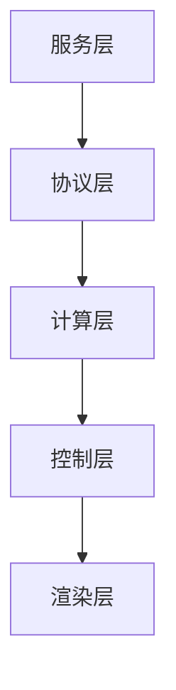

# GIS 前端项目交接文档模板

`handover-doc` 技能使用本文档作为输出结构。最终文档写到 `docs/handover/<project-name>-交接文档.md`，如果用户指定路径，以用户指定路径为准。

## 模板正文

```markdown
# <project-name> GIS 前端项目交接文档

> 生成时间：YYYY-MM-DD
> 生成方式：$gis-dev-workflow:handover-doc
> 适用对象：新加入的 GIS 前端开发、SRE/DevOps、架构评审

## 1. 项目一句话介绍

<用 1~2 句话讲清楚：做什么、解决什么业务问题、用户角色>

## 2. 技术栈与版本基线

| 类别 | 版本/库 | 备注 |
| --- | --- | --- |
| 框架 | Vue 3.5+ | SFC + Composition API |
| 语言 | TypeScript 6.0+ | strict: true |
| 构建 | Vite 8+ / pnpm |  |
| 状态 | Pinia 3+ |  |
| 地图 | OpenLayers 10.2+ / ThreeJS 0.169+ |  |
| 测试 | Vitest 2+ / @vue/test-utils 2+ |  |

## 3. 五层架构概览



详细分层职责：参考 `references/gis-architecture.md`。
坐标系责任：参考 `references/gis-coord-system.md`。
强制开发规约：参考 `references/vue3-conventions.md`。

## 4. 推荐阅读路线

| 顺序 | 路径 | 作用 |
| --- | --- | --- |
| 1 | `src/controller/core/protocol/` | 协议契约（业务/通用/IO） |
| 2 | `src/controller/core/generic/` | 通用控制层（4 个 Controller） |
| 3 | `src/controller/core/business/` | 业务控制层（6 个 Controller） |
| 4 | `src/store/` | Pinia store（视图 store + 业务 store） |
| 5 | `src/composables/` | 通用 composable |
| 6 | `src/baseComponent/`、`src/components/`、`src/views/` | 渲染层 |
| 7 | `src/plugins/mapPlugins/` | 底座插件（坐标系转换、底图注册） |
| 8 | `src/router/` | 路由（值守/来电/问询/调派/跟踪） |
| 9 | `tests/` | 单元测试 |
| 10 | `mds/minmax_output/` | 架构整合文档 |

## 5. 5 个核心场景演示

### 5.1 值守
- 入口：路由 `/` 或 `/duty`
- 关键控制器：`DutyController`
- 关键文件：`src/views/home.vue`、`src/components/map/index.vue`
- 演示命令：`pnpm dev`，登录后默认进入值守

### 5.2 来电弹屏
- 入口：后端推送 `call.incoming`
- 关键控制器：`CallController`
- 关键文件：`src/baseComponent/OpenlayersMap/IncomingCallOverlay.vue`
- 演示步骤：触发 mock 服务，发送来电事件

### 5.3 问询研判
- 入口：路由 `/inquiry/{incidentId}`
- 关键控制器：`DispatchController.startInquiry`
- 关键文件：`src/views/dispatch/index.vue`

### 5.4 图上调派
- 入口：路由 `/dispatch/{incidentId}`
- 关键控制器：`DispatchController`
- 关键文件：`src/views/dispatch/index.vue`、`src/baseComponent/amap/routeMetrics.worker.ts`

### 5.5 跟踪到场
- 入口：调派方案生效后自动进入
- 关键控制器：`TrackingController`
- 关键文件：`src/composables/useCarFeatures.ts`

## 6. 关键命令

| 命令 | 用途 |
| --- | --- |
| `pnpm install` | 安装依赖 |
| `pnpm dev` | 启动开发服务（含 mock） |
| `pnpm mock:server` | 单独启动 mock 服务 |
| `pnpm build` | 生产构建 |
| `pnpm build:lib` | 构建独立 npm 包 |
| `pnpm lint` | ESLint 检查 |
| `pnpm type-check` | TypeScript 类型检查 |
| `pnpm test` | 运行 Vitest 单元测试 |
| `pnpm bench` | 运行基准测试 |
| `pnpm preview` | 预览构建产物 |

## 7. 性能 SLA 速查

- 核心场景稳态帧率 ≥ 30fps
- 弹屏端到端延迟 ≤ 500ms
- GPS 端到端延迟 ≤ 500ms
- 单车路径算路 ≤ 1s（Worker）
- 协议解析 ≤ 50ms
- 视野切换 ≤ 200ms
- 首次进入场景首帧 ≤ 800ms
- vendor chunk（gzipped）≤ 2MB

详细指标：参考 `references/gis-performance-sla.md`。

## 8. 资源图层 ID 速查

| 业务 | 图层 ID |
| --- | --- |
| 兴趣面 | `gis:env_build_aoi` |
| 出入口 | `gis:env_entrance_exit` |
| 消防栓 | `gis:env_fire_water` |
| 道路 | `gis:env_greatchina_road` |
| 车辆 | `gis:fire_vehicle` |
| 警情 | `gis:incident_alarm` |
| 来电 | `gis:incoming_call` |
| 调派路径 | `gis:dispatch_route` |
| 跟踪轨迹 | `gis:tracking_track` |
| 围栏 | `gis:fence_*` |

## 9. 状态机速查

- 警情：`CREATED → DISPATCHED → ON_SCENE → CLOSED`
- 车辆：`IDLE → DISPATCHED → EN_ROUTE → ON_SCENE → RETURNING → IDLE`
- 调派方案：`DRAFT → CONFIRMED → ACTIVE → COMPLETED` / `CANCELED`

详细定义：参考 `references/gis-state-machines.md`。

## 10. 风险与待确认

| 风险 | 等级 | 说明 |
| --- | --- | --- |
| <风险 1> | 高/中/低 | <具体说明> |
| <风险 2> | 高/中/低 | <具体说明> |
| <待确认 1> |  | <需要进一步确认的内容> |
| <待确认 2> |  | <需要进一步确认的内容> |

## 11. 联系人

| 角色 | 姓名/组 | 职责 |
| --- | --- | --- |
| 架构负责人 | <待确认> | 五层架构、控制层切分 |
| 前端 TL | <待确认> | Vue/TS 工程 |
| 地图引擎 | <待确认> | OpenLayers / ThreeJS |
| 后端对接 | <待确认> | 协议层 / WebSocket |
| DevOps | <待确认> | 构建、部署、CI |

## 12. 附录

- 五层架构整合文档：`mds/minmax_output/GIS前端数据交互与架构全景设计(整合版).md`
- 开发规约：`skills/20260717-培训材料-肖志威/gis-dev-workflow/references/vue3-conventions.md`
- 工作流培训：`skills/20260717-培训材料-肖志威/gis-dev-workflow/gis-dev-workflow-技能使用培训.md`
- 业务协议事件清单：`mds/external/map-message-events.md`
- 控制接口映射表：`mds/external/控制接口映射表-01.md`
```

## 模板使用说明

- 第 1~9 节必须填写完整；无法从仓库确认的信息标 `待确认`。
- 第 10 节（风险与待确认）必须保留。
- 第 11 节（联系人）不知道时全部 `待确认`。
- 终端输出含乱码时不要复制到文档；改用 UTF-8 读取或基于源码整理。
- 敏感信息（密码、令牌、地址、账号）必须脱敏或标 `待确认`。
- 推荐使用中文写项目介绍和风险说明。
